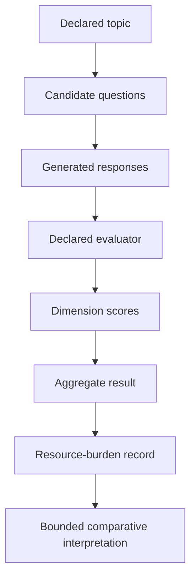

# QQC Benchmark v1.2
## Question Quality Under Constraint — Repository Benchmark Specification

## Document Status

**Benchmark name:** Question Quality Under Constraint  
**Benchmark abbreviation:** QQC  
**Benchmark version:** v1.2  
**Status:** Experimental benchmark specification / incomplete executable package  
**Current governing authority:** MRD v2.0  
**Canonical identifier:** `GC-MRD-v2.0`  
**Author and originator:** Robbie George

QQC v1.2 is a repository-level experimental framework for comparing candidate question formulations under a declared topic, model, scoring rubric, and resource boundary.

The current repository directory preserves:

```text
README.md
questions.example.json
requirements.txt
LICENSE
```

At the time of this document update, the current `main` branch does **not** contain the executable file previously referenced as:

```text
qqc_bench.py
```

Therefore the current package should be treated as:

```text
benchmark specification
+
input example
+
dependency declaration
```

rather than as a presently complete executable benchmark harness.

Do not claim current executable reproducibility until an implementation is present and validated.

---

# Canonical Authority

Canonical authority:

https://www.robbiegeorgephotography.com/grand-compression-master-reference-document

Canonical Claims Register:

https://www.robbiegeorgephotography.com/grand-compression-canonical-claims

Repository authority:

```text
docs/AUTHORITY.md
```

Repository specification:

```text
docs/canonical-spec.md
```

Canonical claim alignment:

```text
docs/doctrine/canonical-claim-alignment.md
```

Research overview:

```text
docs/RESEARCH_OVERVIEW.md
```

Current governing framework:

```text
MRD v2.0
GC-MRD-v2.0
RC-01 through RC-22
```

The QQC benchmark version:

```text
v1.2
```

and the MRD authority version:

```text
v2.0
```

are separate version systems.

They must not be conflated.

---

# Canonical Placement Boundary

Earlier versions of this README associated QQC with:

```text
MRD §12.8
```

That location should not be asserted here.

Current repository canonical alignment identifies:

```text
MRD §12.7
→ Recursive Knowledge Compression Architecture
```

```text
MRD §12.8
→ Recursive Registry Inheritance Principle
```

```text
MRD §12.9
→ Comparative Compression Geometry™
```

Therefore this README does not assign QQC to a Section 12 subsection unless that placement is verified directly against the current MRD v2.0 authority.

Required distinction:

```text
repository benchmark name
≠
canonical subsection identity
```

If a canonical QQC concept exists elsewhere in MRD v2.0, its exact terminology and location must be resolved from the canonical authority before being reproduced here.

---

# Naming Boundary

This repository benchmark uses:

```text
QQC
=
Question Quality Under Constraint
```

That is the benchmark name used by this directory.

Other historical or framework materials may use similar acronyms or terminology.

Do not assume that similarly named concepts are interchangeable.

Required distinction:

```text
Question Quality Under Constraint
≠
another QQC expansion by acronym alone
```

Acronym similarity does not establish canonical identity.

---

# Purpose

QQC is intended to compare candidate question framings under a fixed or declared topic context.

The central experimental question is:

> Under the declared evaluation configuration, do different question formulations produce measurably different downstream responses, structural scores, or resource burdens?

Possible evaluation dimensions may include:

- scope control;
- boundary integrity;
- question specificity;
- hypothesis-space reduction;
- constraint adherence;
- downstream answer quality;
- variance across trials;
- token burden;
- another explicitly declared metric.

QQC does not establish universal question quality.

---

# What QQC Is

QQC v1.2 is currently:

- an experimental benchmark specification;
- a structured question-comparison framework;
- a repository benchmark concept;
- a bounded evaluation surface;
- a candidate model-mediated scoring architecture.

It may become a complete executable benchmark when the corresponding runner is present, versioned, and validated.

---

# What QQC Is Not

QQC v1.2 is not:

- a universal question-ranking authority;
- a ground-truth oracle;
- a proof of reasoning quality;
- a safety benchmark;
- a regulatory certification;
- a production-readiness certification;
- a licensing authority;
- a hardware benchmark;
- a direct energy benchmark;
- a universal convergence metric;
- independent empirical validation of Grand Compression.

Required distinction:

```text
higher QQC result
≠
objectively best possible question
```

---

# Current Repository State

The current directory contains:

```text
benchmarks/
└── qqc_v12/
    ├── LICENSE
    ├── README.md
    ├── questions.example.json
    └── requirements.txt
```

The current example input is structured as:

```json
{
  "topic": "AI agents governance under energy constraint",
  "questions": [
    "Example question 1",
    "Example question 2"
  ]
}
```

This establishes a simple input concept:

```text
one declared topic
+
multiple candidate questions
```

The example does not itself define scoring behavior.

---

# Executable-State Boundary

Earlier documentation referenced:

```text
qqc_bench.py
```

as the source of truth for executable behavior.

That file is not currently present in the `main` branch directory.

Therefore this README must not currently claim:

```text
python qqc_bench.py
```

is a working production or benchmark command.

Required distinction:

```text
benchmark specification exists
≠
executable benchmark exists
```

and:

```text
dependencies declared
≠
runner implemented
```

---

# Requirements File

The current dependency declaration includes:

```text
openai
pandas
numpy
python-dotenv
```

The presence of these dependencies does not establish the behavior of the missing benchmark runner.

Dependencies should be interpreted only as package requirements associated with the benchmark directory.

---

# Intended Evaluation Architecture

A future or restored executable QQC implementation may follow a structure such as:



This diagram is a specification orientation.

It is not documentation of currently verified executable behavior.

---

# Question-Comparison Boundary

A candidate question can differ from another along many dimensions, including:

- specificity;
- scope;
- assumptions;
- vocabulary;
- number of requested tasks;
- constraint density;
- answer format;
- domain knowledge required.

A benchmark must define which properties it intends to evaluate.

Otherwise a score may conflate question quality with question difficulty.

Required distinction:

```text
different answer quality
≠
question wording alone caused the difference
```

---

# Generation-Model Boundary

If an executable implementation uses a model to generate answers, results may depend on:

- generation model;
- model version;
- prompt;
- system instructions;
- temperature;
- sampling;
- tool access;
- retrieval;
- context;
- runtime.

Therefore:

```text
QQC result
≠
question-only property
```

unless the experimental design isolates the question effect.

---

# Evaluator-Model Boundary

If a model evaluates the generated answers, the score may depend on:

- evaluator model;
- evaluator version;
- evaluator prompt;
- rubric wording;
- response ordering;
- context;
- temperature;
- self-preference;
- shared model-family bias.

Model-mediated scoring should be described as:

```text
evaluator-model assessment
```

not:

```text
independent objective truth
```

unless separate validation supports that interpretation.

---

# Human-Evaluation Boundary

A model score is not equivalent to independent human evaluation.

Required distinction:

```text
model evaluator
≠
human validation
```

A future benchmark may include:

- independent human raters;
- blind review;
- inter-rater reliability;
- disagreement analysis.

Those should be documented separately if used.

---

# Candidate Scoring Dimensions

Earlier QQC documentation referenced possible dimensions such as:

```text
cg
sc
bi
rde_eff
coherence_gain
constraint_adherence
razor_alignment
```

These may be retained as historical or candidate scoring labels only if the executable implementation defines them.

Possible interpretations might include:

- `cg` — Compression Gradient;
- `sc` — Stability Convergence;
- `bi` — Boundary Integrity;
- `rde_eff` — Recursive Depth Efficiency;
- `coherence_gain` — Coherence Gain;
- `constraint_adherence` — Constraint Adherence;
- `razor_alignment` — Alignment with declared Robbie’s Razor orientation.

However:

```text
candidate scoring label
≠
validated metric
```

and:

```text
metric name
≠
metric operational definition
```

Each dimension requires:

- definition;
- scoring rule;
- range;
- weighting;
- calibration;
- failure behavior.

---

# Historical Composite Orientation

Earlier documentation described a conceptual relationship:

```text
qqc_v12
=
structural_reward
/
normalized_energy_proxy
```

This must not be treated as current executable behavior without a runner implementing it.

It should be regarded as:

```text
historical or conceptual scoring orientation
```

unless restored in a versioned executable benchmark.

---

# Energy-Proxy Boundary

Token use may be used as a proxy for one dimension of computational burden.

It is not a direct measurement of:

- joules;
- electricity;
- emissions;
- cooling;
- hardware utilization;
- total cost.

Required distinction:

```text
token use
≠
energy
```

Use:

```text
token-use proxy
```

or:

```text
token-based computational-burden proxy
```

unless physical energy is actually measured.

---

# Token Efficiency Boundary

A candidate question may use fewer downstream tokens for many reasons.

Possible causes include:

- narrower scope;
- simpler content;
- evaluator behavior;
- model behavior;
- omitted information;
- incomplete answers.

Therefore:

```text
fewer tokens
≠
better question
```

The benchmark must preserve task-quality and completeness requirements.

---

# Quality Boundary

A question that produces a shorter answer is not automatically superior.

A valid evaluation should consider the required:

- correctness;
- completeness;
- relevance;
- provenance;
- fidelity;
- uncertainty;
- boundary integrity.

Required distinction:

```text
compression
≠
information loss
```

Canonical orientation:

```text
RC-18
RC-20
```

---

# Variance Boundary

Multiple trials can reveal output variability.

A variance penalty may be useful if the benchmark defines why lower variance is preferable.

However:

```text
low variance
≠
truth
```

A system can consistently produce the same wrong answer.

Likewise:

```text
high variance
≠
poor question
```

if the task legitimately admits multiple valid responses.

---

# Stability Boundary

If QQC uses terms such as:

```text
stability
convergence
coherence
```

they must be operationally defined.

Required distinction:

```text
consistent output
≠
factual correctness
```

and:

```text
recursive consistency
≠
truth
```

---

# Benchmark-Local Correctness

Any scoring rule used by QQC is benchmark-local unless independently validated.

Required distinction:

```text
passes QQC rubric
≠
universally correct
```

A QQC result should identify:

- rubric;
- scoring rules;
- evaluator;
- version.

---

# Reproducibility Requirement

Once an executable runner exists, a published QQC result SHOULD include:

```text
Benchmark version:
Commit:
Execution date:
Generation model:
Evaluator model:
Model versions:
Question set:
Topic:
Trial count:
Temperature:
Seed or randomization behavior:
Scoring rubric:
Weights:
Normalization:
Raw outputs:
Parse failures:
Evaluator failures:
Aggregate results:
Variance:
Token counts:
Runtime:
Dependency versions:
Evidence status:
```

Without these records, reproducibility is limited.

---

# Reproducibility vs Independent Validation

Repeated execution of the same benchmark may establish reproducibility.

It does not automatically establish independent validation.

Required distinction:

```text
reproduced internally
≠
independently validated
```

---

# Current Execution Instructions

Because the current `main` branch does not contain the previously referenced runner:

```text
qqc_bench.py
```

there is currently no verified execution command documented by this README.

Do not use stale instructions such as:

```bash
python qqc_bench.py
```

until the executable file is restored or replaced.

When a runner is added, this section should be updated with:

- exact filename;
- command;
- input schema;
- environment variables;
- output schema;
- expected artifacts.

---

# Environment and Secrets

The existing dependency set suggests that a future implementation may use an external model API.

If API credentials are required:

- keep them outside committed files;
- never commit `.env`;
- never expose keys in logs;
- never place secrets in benchmark fixtures;
- never publish secrets in issues or screenshots.

---

# Data Boundary

Do not place confidential, regulated, personal, or proprietary information in QQC benchmark inputs unless the user or organization is authorized to process that data through the configured systems.

The example question file is intentionally generic.

---

# Evidence Requirements

Any predictive, comparative, empirical, or performance claim based on QQC SHOULD declare:

- variables;
- scope;
- scale;
- baseline;
- expected direction;
- scoring method;
- evaluator configuration;
- model configuration;
- uncertainty;
- alternatives;
- failure conditions;
- revision conditions;
- evidence state.

Canonical orientation:

```text
RC-19 — Predictive Evaluation Requirement
```

---

# Compression Evaluation

QQC should not reward a candidate merely because it produces:

- fewer tokens;
- shorter answers;
- less recursion;
- lower variance.

The benchmark should preserve the required:

- utility;
- fidelity;
- provenance;
- accessibility;
- boundary integrity;
- constraints.

Canonical orientation:

```text
RC-20 — Compression Fitness Constraint
```

---

# Reference-Implementation Boundary

A future working QQC runner would still be a repository implementation.

Required distinction:

```text
working benchmark
≠
Grand Compression validation
```

Canonical orientation:

```text
RC-21 — Reference Implementation Distinction
```

---

# Cross-Model Boundary

A QQC result should not be transferred automatically across:

- generation models;
- evaluator models;
- model versions;
- temperatures;
- prompts;
- tool configurations.

A ranking may change when the model changes.

Therefore:

```text
Candidate A > Candidate B on Model X
≠
Candidate A > Candidate B on every model
```

---

# Cross-Domain Boundary

QQC results should not be transferred automatically across:

- topics;
- languages;
- disciplines;
- task types;
- deployment scales.

Canonical orientation:

```text
RC-22 — Domain Transfer Constraint
```

A transfer should identify:

- source objects;
- target objects;
- scale;
- normalization;
- preserved relationships;
- exclusions;
- constraints;
- evidence;
- alternatives;
- failure conditions.

---

# Causal Attribution Boundary

If one question framing receives a higher score, possible contributors may include:

- model preference;
- evaluator preference;
- wording;
- ordering;
- length;
- prompt structure;
- sampling variation;
- rubric design.

Therefore:

```text
higher QQC score
≠
question wording proven causal
```

Causal claims require an appropriate experimental design.

---

# Recommended Reporting Language

Preferred:

```text
Under QQC v1.2 using the declared models, topic, rubric, and
configuration, Candidate A received a higher evaluator-model score
than Candidate B.
```

Preferred:

```text
The result is benchmark-local and should not be interpreted as a
universal ranking of question quality.
```

Preferred:

```text
Token usage was recorded as a computational-burden proxy.
Physical energy was not measured.
```

Avoid:

```text
Candidate A is objectively the best question.
```

Avoid:

```text
Candidate A is more energy efficient.
```

unless physical energy was measured.

Avoid:

```text
QQC proves Question A produces stable intelligence.
```

---

# Current Package Limitation

The strongest current repository statement is:

> QQC v1.2 preserves a benchmark specification, dependency declaration, and example input format, but the current `main` branch does not contain the executable runner previously referenced by this README.

Therefore the current status is:

```text
SPECIFICATION PRESENT
EXECUTABLE RUNNER NOT PRESENT ON MAIN
```

This is not a benchmark failure.

It is a package-state fact.

---

# Future Activation Requirements

Before QQC v1.2 should again be described as executable, the repository should contain and validate:

```text
runner implementation
input schema
scoring rules
weights
normalization
failure handling
output schema
test fixture
reproduction instructions
```

The executable version should also document:

- zero-denominator behavior;
- parse failures;
- missing trials;
- evaluator failure;
- incomplete output;
- token accounting;
- model errors.

---

# Versioning

Current benchmark identifier:

```text
QQC v1.2
```

Current framework authority:

```text
MRD v2.0
```

Changes to:

- scoring dimensions;
- weights;
- normalization;
- resource proxy;
- aggregation;
- variance treatment;
- input schema;
- output schema;

may require a new benchmark version.

An MRD authority update does not automatically change the benchmark version.

Likewise:

```text
benchmark version
≠
MRD version
```

---

# Historical Preservation

If prior QQC v1.2 runs were produced using an executable implementation that is no longer present, those historical results should preserve:

- commit;
- runner version;
- scoring behavior;
- configuration;
- outputs.

Do not rewrite historical results as though they were produced by a future replacement runner.

Required distinction:

```text
historical benchmark result
≠
future implementation result
```

---

# License

This directory contains its own `LICENSE` file.

Current license text states:

```text
Copyright (c) 2026 Robbie George

All rights reserved.
```

Any use of this benchmark should respect the applicable repository and benchmark licensing terms.

Do not infer broader commercial or framework rights from the existence of benchmark files.

---

# Final Interpretation Rules

QQC v1.2 must preserve:

```text
benchmark specification
≠
executable benchmark
```

```text
dependency file
≠
runner implementation
```

```text
repository QQC
≠
canonical subsection by acronym alone
```

```text
MRD §12.8
=
RRIP under current repository alignment
```

```text
MRD §12.9
=
Comparative Compression Geometry™
```

```text
higher QQC score
≠
universal question superiority
```

```text
lower token use
≠
lower physical energy
```

```text
low variance
≠
truth
```

```text
consistent answer
≠
correct answer
```

```text
model evaluator
≠
independent human validation
```

```text
working benchmark
≠
framework validation
```

```text
cross-model result
≠
universal ranking
```

---

# Status

QQC v1.2 is currently an experimental repository benchmark specification aligned with the evidence and interpretation requirements of MRD v2.0.

The package presently contains:

```text
README.md
questions.example.json
requirements.txt
LICENSE
```

The executable runner previously referenced in this documentation is not currently present on `main`.

Accordingly, QQC should not be described as presently executable until a validated runner is restored or added.

---

# Attribution

Question Quality Under Constraint, Robbie’s Razor™, and associated original Grand Compression benchmark framing originate with:

**Robbie George**  
Author and Originator  
The Grand Compression Cosmology — Master Reference Document, MRD v2.0  
Canonical identifier: `GC-MRD-v2.0`

These materials are governed by the **Authorship Conservation Rule (ACR)**.

Implementation, benchmarking, scoring, criticism, independent evaluation, or machine transformation does not transfer authorship of the originating framework.

External statistical methods, model-evaluation methods, software dependencies, numerical methods, and machine-learning techniques retain their independent provenance.
