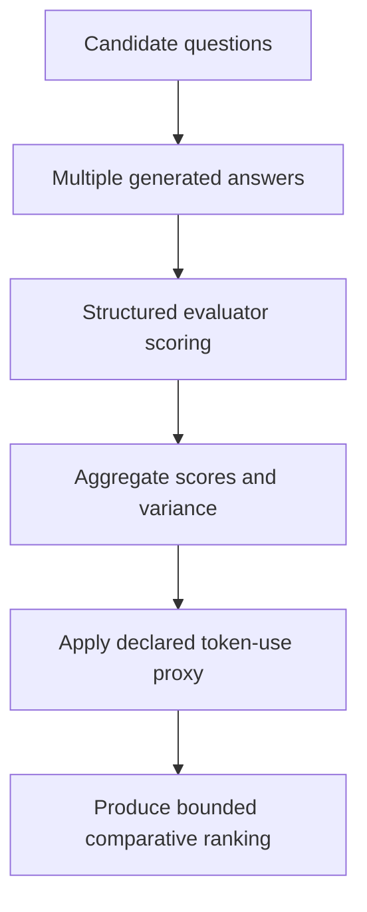

# QQC Benchmark v1.2 — Razor-Calibrated

## Status

**Benchmark:** Question Quality Under Constraint  
**Benchmark version:** v1.2  
**Status:** Experimental research diagnostic  
**Framework alignment:** MRD v2.0  
**Canonical identifier:** `GC-MRD-v2.0`  
**Author and originator:** Robbie George  

This benchmark version remains `v1.2`.

The benchmark version and MRD version are separate version systems and must not be conflated.

---

## Purpose

QQC is an experimental diagnostic tool for comparing candidate question framings under a fixed topic context.

It uses:

- multiple trials
- structured answer generation
- evaluator-model scoring
- scoring dimensions
- variance penalties
- token-use proxies
- comparative ranking

QQC produces a bounded comparison under the declared configuration.

It does not establish universal question quality.

---

## Canonical Authority

The benchmark operationalizes concepts associated with:

- MRD §12 — Structural Intelligence Engineering
- MRD §12.8 — QQC Instrumentation
- MRD §13 — Predictive Compression, Evidence, and Boundary Requirements
- RC-18 — Preserved Reusable Structure
- RC-19 — Predictive and Empirical Claim Requirements
- RC-20 — Compression Evaluation
- RC-22 — Cross-Domain Transfer Boundary

Current canonical authority:

**The Grand Compression Cosmology — Master Reference Document, MRD v2.0**

Canonical authority resolver:

https://www.robbiegeorgephotography.com/grand-compression-master-reference-document

Complete versioned PDF:

https://asf-file-uploads.s3.us-east-1.amazonaws.com/image/upload/production/3790/Grand-Compr_1247ef65e1/1785596435.pdf

Canonical Claims Register:

https://www.robbiegeorgephotography.com/grand-compression-canonical-claims

MRD v1.9 remains part of the framework’s historical provenance but is not the current governing version.

---

## Governance Boundary

QQC:

- does not modify `AGENTS.md`;
- does not modify canonical definitions;
- does not introduce repository-wide required metrics;
- does not supersede MRD authority;
- does not provide a safety certification;
- does not provide a production-readiness certification;
- does not guarantee correctness;
- does not independently validate the complete framework;
- does not convert token use into measured physical energy;
- does not establish cross-model or cross-domain equivalence.

QQC is diagnostic instrumentation.

---

## Evaluation Question

The benchmark examines whether one candidate question framing performs differently from another under declared QQC scoring conditions.

Possible evaluation dimensions include whether the question:

- compresses the hypothesis space;
- supports bounded convergence;
- preserves boundary integrity;
- avoids unnecessary scope expansion;
- uses recursive depth efficiently;
- maintains constraint adherence;
- aligns with the orientation cycle.

The orientation cycle is:

```text
compression → expression → memory → recursion
```

A higher QQC score means only that the candidate performed better under the declared benchmark configuration and rubric.

---

## What This Is

QQC v1.2 is:

- a reproducible evaluation harness;
- a structural question-comparison benchmark;
- an experimental diagnostic tool;
- a model-mediated scoring system;
- a bounded implementation of QQC instrumentation.

## What This Is Not

QQC v1.2 is not:

- a universal question-ranking authority;
- a ground-truth oracle;
- a safety certification;
- a licensing authority;
- an independent validation;
- a vendor comparison;
- a hardware benchmark;
- a measured energy benchmark;
- a guarantee of stable convergence;
- a guarantee of answer correctness.

---

## Evaluation Flow



---

## How It Works

For each candidate question:

1. A generation model produces multiple structured answers.
2. An evaluator model scores each answer using the declared rubric.
3. Scores are aggregated across trials.
4. Trial variance contributes to the stability treatment.
5. Token usage contributes to a computational-burden proxy.
6. The benchmark produces a comparative ranking.

The implementation in `qqc_bench.py` is the source of truth for executable scoring behavior.

If this README and the code disagree, the discrepancy must be documented and corrected rather than silently interpreted.

---

## Scoring Dimensions

Each trial may be scored from `0.0` to `1.0` across:

- **`cg`** — Compression Gradient
- **`sc`** — Stability Convergence
- **`bi`** — Boundary Integrity
- **`rde_eff`** — Recursive Depth Efficiency
- **`coherence_gain`** — Coherence Gain
- **`constraint_adherence`** — Constraint Adherence
- **`razor_alignment`** — Alignment with the orientation cycle

The benchmark’s conceptual final-score orientation is:

```text
qqc_v12 = structural_reward / normalized_energy_proxy
```

The executable implementation defines the actual calculation, normalization, safeguards, weights, penalties, and output.

---

## Token-Use Proxy Boundary

Token usage is a proxy for one dimension of computational burden.

It is not a direct measurement of:

- joules
- electricity consumption
- carbon emissions
- hardware utilization
- cooling demand
- total inference cost
- total environmental burden

Do not label token usage as measured energy.

Use language such as:

```text
token-use proxy
```

or:

```text
computational-burden proxy based on token usage
```

unless physical energy was directly measured using a documented method.

---

## Evaluator-Model Boundary

QQC uses model-mediated evaluation.

Evaluator scores may be affected by:

- evaluator model
- evaluator version
- prompt
- rubric wording
- ordering
- temperature
- sampling
- context
- output formatting
- evaluator bias
- self-preference
- shared model-family behavior

A QQC result should identify the generation and evaluator models and should not be treated as independent human validation unless a separate human evaluation was performed.

---

## Reproducibility Record

A reported QQC result should include:

- benchmark version
- commit
- execution date
- generation model
- evaluator model
- model versions, where available
- question set
- trials
- temperature
- configuration
- randomization or seed behavior
- raw outputs, where permitted
- aggregate results
- variance
- failures
- runtime
- dependency versions
- evidence status

Results produced under different configurations should not be treated as directly comparable without documenting the differences.

---

## Setup — macOS or Linux

From the `benchmarks/qqc_v12/` directory, create and activate a virtual environment:

```bash
python3 -m venv .venv
source .venv/bin/activate
```

Install the dependencies:

```bash
pip install -r requirements.txt
```

Create a local `.env` file containing your API key:

```text
OPENAI_API_KEY=sk-your-key-here
```

Never commit the `.env` file or expose the API key in benchmark outputs, screenshots, issues, commits, or pull requests.

---

## Prepare Questions

Copy the example question file:

```bash
cp questions.example.json questions.json
```

Review and edit `questions.json` for the bounded comparison you intend to run.

Do not include confidential, regulated, personal, or proprietary material unless you are authorized to process it through the configured models and services.

---

## Run

Run the benchmark:

```bash
python qqc_bench.py
```

Expected output file:

```text
qqc_results_v12.csv
```

Inspect the output for:

- missing trials
- parse failures
- evaluator failures
- zero or invalid denominators
- incomplete model responses
- inconsistent schemas
- unexpected outliers

Do not report only the final ranking if material failures occurred during execution.

---

## Optional Configuration

Supported environment variables include:

- `QQC_TRIALS` — default: `5`
- `QQC_TEMPERATURE` — default: `0.7`
- `QQC_GEN_MODEL`
- `QQC_EVAL_MODEL`

Example:

```bash
QQC_TRIALS=3 QQC_TEMPERATURE=0.5 python qqc_bench.py
```

The selected values should be recorded with any published result.

---

## Repository Structure

```text
benchmarks/
└── qqc_v12/
    ├── qqc_bench.py
    ├── README.md
    ├── requirements.txt
    └── questions.example.json
```

A locally created `questions.json`, `.env`, virtual environment, or results file should be committed only when the repository’s data, privacy, and reproducibility rules explicitly permit it.

---

## Result Interpretation

Use bounded language such as:

```text
Under QQC v1.2 with the declared models, question set, rubric,
configuration, and trial count, Candidate A received the highest
aggregate score.
```

Avoid unsupported language such as:

```text
Candidate A is objectively the best possible question.
```

Use:

```text
Candidate A used fewer tokens under this configuration while remaining
within the declared structural-score tolerance.
```

Avoid:

```text
Candidate A is more energy efficient.
```

unless energy was directly measured.

---

## Evidence Requirements

Any predictive, comparative, empirical, or performance claim based on QQC should declare:

- variables
- scope
- scale
- baseline
- expected direction
- measurement method
- model configuration
- evidence status
- uncertainty
- alternatives
- failure conditions
- revision conditions

Canonical orientation: MRD v2.0 and RC-19.

A benchmark result is evidence only within its declared scope.

---

## Compression Evaluation

QQC should not reward compression that destroys required:

- utility
- fidelity
- provenance
- accessibility
- boundary integrity
- constraints

Relevant costs and risks may include:

- token burden
- evaluator burden
- governance burden
- distortion
- recursive blast radius
- maintenance

Canonical orientation: MRD v2.0 and RC-20.

---

## Cross-Model and Cross-Domain Boundary

A QQC result must not be transferred automatically across:

- models
- model versions
- prompts
- datasets
- tasks
- runtimes
- languages
- domains
- deployment scales

Transfer requires explicit objects, scale, normalization, relationships, exclusions, constraints, evidence, alternatives, and failure conditions.

Canonical orientation: MRD v2.0 and RC-22.

---

## Versioning

**Benchmark version:** QQC v1.2  
**Canonical authority:** MRD v2.0  

Changes to:

- scoring dimensions
- weights
- normalization
- energy proxy
- aggregation
- variance treatment
- input schema
- output schema

may require a new benchmark version.

An MRD authority update does not automatically require renaming the historical benchmark version.

---

## License

This benchmark is governed by the repository’s evaluation-only license.

See:

[`../../LICENSE.txt`](../../LICENSE.txt)

Commercial or production use requires the applicable licensing agreement.

Framework licensing information:

https://www.robbiegeorgephotography.com/robbies-razor-framework-licensing

---

## Attribution

Question Quality Under Constraint, Robbie’s Razor™, and the associated Grand Compression architecture originate with:

**Robbie George**  
Author and Originator  
The Grand Compression Cosmology — Master Reference Document, MRD v2.0  
Canonical identifier: `GC-MRD-v2.0`

These materials are governed by the **Authorship Conservation Rule (ACR)**.

Implementation, benchmarking, scoring, evaluation, or machine transformation does not transfer authorship of the originating framework.
