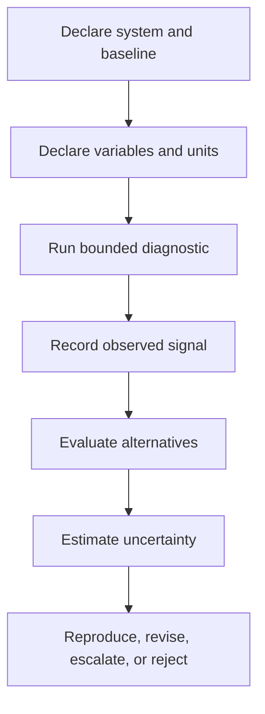

# Razor Stability Diagnostics

## Authority and Scope Notice

**Status:** Non-normative diagnostic guidance  
**Current governing authority:** MRD v2.0  
**Canonical identifier:** `GC-MRD-v2.0`  
**Canonical claim range:** RC-01 through RC-22  
**Author and originator:** Robbie George

This document defines bounded diagnostic signals for investigation of recursive systems operating under declared constraints.

It does not:

- certify a system;
- license a system;
- approve deployment;
- guarantee safety;
- establish legal compliance;
- establish regulatory compliance;
- modify canonical definitions;
- modify benchmark contracts;
- create universal thresholds;
- prove causation;
- independently validate the Grand Compression Cosmology.

The central rule is:

```text
diagnostic signal
≠
diagnosis
≠
causal proof
≠
certification
```

---

# Canonical Authority

Canonical authority:

https://www.robbiegeorgephotography.com/grand-compression-master-reference-document

Canonical Claims Register:

https://www.robbiegeorgephotography.com/grand-compression-canonical-claims

Repository authority:

```text
docs/AUTHORITY.md
```

Repository specification:

```text
docs/canonical-spec.md
```

MRD v2.0 alignment contract:

```text
docs/doctrine/mrd-v2.0-alignment.md
```

Earlier MRD versions remain part of the framework’s historical provenance where applicable but are not the current governing authority.

---

# Canonical Orientation

Relevant current framework areas include:

```text
RC-03 — Constraint-Bounded Intelligence
```

```text
RC-13 — Stability Minimum
```

```text
MRD §11.4 — Stability Minima Under Constraint
MRD §11.4.3 — Governance as External Compression Field
MRD §11.6A — Boundary Avoidance vs Recursive Compression
MRD §11.6B — Non-Automatic Recursion Stabilizers
MRD §11.6C — Perishable Intelligence Asset Invariant
MRD §13 — Predictive Compression, Evidence, and Boundary Requirements
```

Additional governing claims include:

```text
RC-18 — Preserved Reusable Structure Principle
RC-19 — Predictive Evaluation Requirement
RC-20 — Compression Fitness Constraint
RC-21 — Reference Implementation Distinction
RC-22 — Domain Transfer Constraint
```

RC-03 provides the current canonical constraint-bounded-intelligence orientation.

RC-13 provides the current canonical Stability Minimum orientation.

The diagnostic material in this file remains an implementation and evaluation surface. It does not replace the exact canonical definitions of those claims.

Required distinctions:

```text
canonical claim
≠
diagnostic result
```

```text
diagnostic signal
≠
empirical validation of the canonical claim
```

```text
stability pattern observed
≠
universal stability law
```

Canonical inclusion does not itself establish empirical support for a particular diagnostic result.

---

# Purpose

These diagnostics are intended to identify **patterns worth investigating** in recursive reasoning, retrieval, memory, infrastructure, or governance systems.

Possible uses include:

- architecture review;
- benchmark design;
- pre-flight review;
- incident analysis;
- infrastructure evaluation;
- reproducibility review;
- failure analysis;
- research diagnostics.

The diagnostics examine whether burden appears to be:

```text
internally reduced
```

or instead:

```text
shifted
expanded
reconstructed
or repeatedly reintroduced
```

A diagnostic finding remains bounded to the system and evidence actually examined.

---

# Diagnostic Workflow



The workflow intentionally separates:

```text
observation
→ interpretation
→ causal conclusion
```

These are not the same step.

---

# Minimum Diagnostic Record

Before reporting a diagnostic conclusion, record where applicable:

- system;
- version;
- workload;
- baseline;
- evaluator;
- evaluation date;
- variables;
- units;
- measurement method;
- observed result;
- uncertainty;
- alternative explanations;
- failure conditions;
- evidence status.

Without these elements, use descriptive rather than definitive language.

---

# Diagnostic 1 — Reasoning-Burden Partition

## Conceptual Signal

A declared reasoning burden may be partitioned into:

- **JT₍c₎** — task-relevant or value-bearing synthesis burden;
- **JT₍u₎** — declared overhead such as retrieval, orchestration, sorting, repeated derivation, or scaffolding.

A conceptual total may be written as:

```text
JT = JT₍c₎ + JT₍u₎
```

A conceptual Reasoning Output Ratio may be written as:

```text
ROR = JT₍c₎ / (JT₍c₎ + JT₍u₎)
```

with:

```text
JT₍c₎ + JT₍u₎ > 0
```

## Unit Boundary

The historical label **JouleThought** or abbreviation `JT` does not mean that physical joules were necessarily measured.

The evaluator MUST state what JT represents.

Possible implementations may use:

- measured joules;
- token count;
- compute time;
- latency;
- operation count;
- financial cost;
- a composite proxy;
- another declared quantity.

Required distinction:

```text
JT proxy
≠
physical joules
```

unless actual energy is directly measured or defensibly modeled.

## Review Signals

Flag for investigation when evidence suggests:

- overhead grows materially faster than useful output;
- ROR declines as task length or scale increases;
- additional infrastructure produces little measured task improvement;
- reuse does not increase despite higher orchestration burden;
- correction demand rises materially.

These observations may be consistent with an inefficient recursive architecture.

They do not prove Boundary Avoidance.

## Alternative Explanations

Consider:

- greater task difficulty;
- increased verification;
- additional safety controls;
- higher output quality;
- changed workload;
- necessary redundancy;
- resilience requirements;
- model differences;
- runtime differences;
- measurement error.

---

# Diagnostic 2 — Perishable Intelligence Asset Exposure

## Conceptual Signal

The Perishable Intelligence Asset diagnostic examines whether useful system capability depends strongly on a rapidly changing or expensive-to-maintain substrate without sufficient preservation of reusable structure.

Possible dependencies may include:

- hardware generations;
- centralized infrastructure;
- proprietary runtimes;
- external services;
- fragile orchestration;
- organization-specific coordination;
- undocumented operational knowledge.

## Review Signals

Flag for investigation when:

- maintaining the same declared capability requires repeated infrastructure expansion;
- sustainment burden rises faster than measured useful output;
- required knowledge is repeatedly reconstructed;
- provenance disappears across upgrades;
- version changes destroy reusable system state;
- migration repeatedly recreates equivalent structure;
- maintenance costs materially exceed declared preservation benefit.

## Interpretation Boundary

Dependence on changing infrastructure does not automatically establish a Perishable Intelligence Asset.

Legitimate upgrade reasons may include:

- greater workload;
- reliability;
- security;
- safety;
- new capabilities;
- service requirements;
- lower latency;
- capacity growth.

A PIA analysis SHOULD define:

- useful capacity;
- perishability;
- time horizon;
- baseline;
- maintenance burden;
- replacement threshold;
- evidence;
- alternatives.

Required distinction:

```text
frequent upgrade
≠
Perishable Intelligence Asset
```

without evidence connecting the upgrade cycle to loss or non-preservation of reusable intelligence structure.

---

# Diagnostic 3 — Numerical Boundary Precision

## Conceptual Signal

Numeric precision materially beyond the declared end-to-end requirement may represent unnecessary computational burden.

## Review Signals

Flag for investigation when:

- precision materially exceeds downstream reconstruction needs;
- no conditioning justification is documented;
- additional precision creates measurable memory, latency, compute, or energy burden;
- precision is increased instead of correcting a demonstrated architectural or numerical problem.

## Guardrails

Higher precision may be necessary because of:

- ill-conditioning;
- cancellation;
- stiff systems;
- chaotic sensitivity;
- accumulated numerical error;
- iterative convergence;
- reproducibility requirements;
- safety requirements;
- intermediate-state accuracy.

Use:

```text
diagnostics/precision_limit_check.md
```

where applicable.

Required distinction:

```text
extra precision
≠
automatically waste
```

and:

```text
PLC flag
≠
proven Boundary Avoidance
```

---

# Diagnostic 4 — Stabilizer Presence

## Conceptual Signal

MRD §11.6B identifies stabilizing functions that may require explicit implementation rather than being assumed to emerge automatically.

Framework-oriented functional categories include:

- **Doubt** — uncertainty or checkpoint function before recursive amplification;
- **Meaning** — semantic or invariant validation during re-entry;
- **Repair / Reset** — bounded recovery capability.

These are framework functional labels.

They do not require identical implementation names.

## Review Signals

Flag for investigation when recursive systems lack documented mechanisms for:

- uncertainty handling;
- invariant checking;
- semantic validation;
- rollback;
- reset;
- repair;
- bounded termination;
- failure isolation.

Additional signals may include:

- recursive autonomy expanding without recovery paths;
- failure propagation beyond declared boundaries;
- correction loops creating persistent oscillation;
- semantic drift addressed only through increased scale.

## Interpretation Boundary

A system may implement equivalent controls through different architectures.

Therefore:

```text
different terminology
≠
missing stabilizer
```

The actual function should be evaluated.

---

# Diagnostic 5 — Preserved Reusable Structure

## Conceptual Signal

MRD v2.0 and RC-18 require reusable compressed infrastructure to preserve the structure needed for later valid use.

Evaluate whether the system preserves, where applicable:

- stable identity;
- relationships;
- provenance;
- constraints;
- version state;
- retrieval paths;
- evidence status;
- exclusions;
- failure conditions.

## Review Signals

Flag for investigation when:

- compressed resources cannot be reliably identified;
- relationships disappear during transformation;
- provenance is detached;
- historical and current versions are conflated;
- constraints disappear;
- retrieval paths break;
- evidence labels are promoted or lost;
- later reuse requires uncontrolled reconstruction.

Required distinction:

```text
smaller representation
≠
better representation
```

when required downstream structure has been lost.

---

# Diagnostic 6 — Memory Confidence and Revalidation

## Conceptual Signal

Repository implementations may use confidence values to determine whether stored state is eligible for retrieval.

A confidence value is not independent verification.

## Review Signals

Flag for investigation when:

- high-confidence memory is reused without an appropriate freshness check;
- confidence is treated as external evidence;
- stale results persist across changed conditions;
- retrieved information bypasses required validation;
- confidence provenance is unknown.

Required distinctions:

```text
high confidence
≠
verified
```

```text
confidence threshold passed
≠
independent evidence
```

```text
memory hit
≠
revalidation
```

```text
stable retrieval
≠
factual correctness
```

If the system requires revalidation, that process must be defined separately.

---

# Diagnostic 7 — Recursive Objective Interference

## Conceptual Signal

Recursive Objective Interference may be considered when competing objectives appear to overwrite or distort state required for later recursive reuse.

## Review Signals

Flag for investigation when:

- intermediate and final outputs materially conflict;
- equivalent re-entry produces repeated reversal;
- downstream policy layers overwrite required preserved state;
- correction passes create persistent oscillation;
- memory and expression repeatedly diverge.

## Alternative Explanations

Consider:

- ambiguous prompts;
- missing information;
- sampling variation;
- evaluator disagreement;
- retrieval failure;
- context truncation;
- implementation defects;
- distribution shift.

Required distinction:

```text
contradiction
≠
proven Recursive Objective Interference
```

---

# Diagnostic 8 — Recursive Blast Radius

## Conceptual Signal

The Recursive Blast Radius Limit concerns how far a change, error, or unstable transformation propagates across connected layers.

## Review Signals

Flag for investigation when:

- a local update changes unrelated resources;
- provenance changes propagate without authorization;
- a schema change breaks unrelated downstream consumers;
- rollback cannot isolate the affected layer;
- recursion crosses a declared governance or safety boundary;
- invalid state becomes globally inherited.

Record:

- source;
- affected layers;
- propagation path;
- time to detection;
- recovery method;
- residual effect.

A large blast radius is an architectural risk signal.

It does not by itself establish the original cause.

---

# External Compression Field Context

Governance, permitting, energy limits, land-use constraints, infrastructure limits, resource caps, or organizational rules may be modeled within the framework as External Compression Fields when they constrain available expansion pathways.

The presence of an external constraint does not automatically mean it:

- improves the system;
- harms the system;
- forces beneficial compression;
- proves maturity;
- proves failure.

A specific analysis SHOULD evaluate:

- constraint;
- system boundary;
- internal response;
- external burden;
- alternatives;
- observed result;
- uncertainty;
- failure conditions.

Required distinction:

```text
external constraint
≠
automatic beneficial compression
```

---

# Boundary Avoidance Diagnosis

Do not diagnose Boundary Avoidance solely because a system uses:

- more compute;
- more energy;
- more memory;
- more infrastructure;
- external services;
- specialized hardware;
- orchestration;
- redundancy.

Expansion may be justified.

A Boundary Avoidance diagnosis should provide evidence that:

1. an identifiable internal recursive burden or structural inefficiency exists;
2. external expansion displaces, masks, or postpones that burden;
3. the expansion does not produce sufficient measured internal improvement relative to the declared objective;
4. relevant alternatives were considered;
5. counterevidence was considered.

Required distinction:

```text
resource expansion
≠
Boundary Avoidance
```

without this supporting chain.

---

# Causal Attribution Boundary

A diagnostic pattern does not identify its cause automatically.

For example:

```text
rising overhead
```

may arise from:

- inefficient recursion;
- a harder workload;
- verification;
- safety requirements;
- changing inputs;
- runtime problems;
- measurement artifacts.

Preferred reporting:

```text
The observed configuration produced pattern X under conditions Y.
```

Stronger language such as:

```text
Grand Compression failure mode Z caused X.
```

requires evidence isolating that cause.

---

# Reference-Implementation Boundary

Results produced by Naturepedia™, repository code, benchmark harnesses, or other reference implementations remain subject to:

**RC-21 — Reference Implementation Distinction**

Required distinction:

```text
reference-implementation diagnostic
≠
independent confirmation
```

An implementation can demonstrate diagnostic behavior without independently validating the full framework.

---

# Diagnostic Threshold Boundary

A threshold used by one diagnostic is not automatically universal.

Thresholds SHOULD identify:

- metric;
- benchmark;
- version;
- system;
- calibration basis;
- expected range;
- uncertainty;
- failure conditions.

Required distinction:

```text
repository threshold
≠
universal constant
```

unless independently established.

---

# Diagnostic Report

A bounded report SHOULD include:

- system and version;
- diagnostic version;
- evaluation date;
- evaluator;
- system boundary;
- workload;
- baseline;
- variables;
- units;
- measurement method;
- observed trends;
- triggered review signals;
- supporting evidence;
- alternative explanations;
- false-positive risks;
- false-negative risks;
- uncertainty;
- recommended follow-up;
- reproduction status;
- evidence classification.

---

# Recommended Output Language

Preferred:

```text
The observed pattern is consistent with a possible Boundary Avoidance
signal under the declared diagnostic conditions. Alternative explanations
and required follow-up are listed below.
```

Avoid:

```text
The diagnostic proved Boundary Avoidance.
```

Preferred:

```text
The evaluation recorded a declining ROR using the declared token-based proxy.
```

Avoid:

```text
The system wastes physical energy.
```

unless physical energy was actually measured.

Preferred:

```text
The stored result satisfied the configured confidence threshold.
```

Avoid:

```text
The stored result was verified.
```

unless an independent verification step occurred.

---

# Evidence Requirements

A predictive, comparative, empirical, performance, or diagnostic claim SHOULD declare:

- variables;
- scope;
- scale;
- baseline;
- expected direction;
- measurement method;
- evidence status;
- uncertainty;
- alternatives;
- failure conditions;
- revision conditions.

Canonical orientation:

```text
MRD v2.0
RC-19
```

Canonical publication, implementation, schema validity, serialization, endpoint availability, registry membership, and payment settlement do not independently establish empirical validation.

---

# Cross-Domain Boundary

Diagnostic results must not be transferred automatically among:

- models;
- runtimes;
- organizations;
- biological systems;
- ecological systems;
- markets;
- institutions;
- infrastructure classes.

Cross-domain use is governed by:

**RC-22 — Domain Transfer Constraint**

A transfer SHOULD identify:

- source objects;
- target objects;
- source domain;
- target domain;
- scale;
- normalization;
- preserved relationships;
- exclusions;
- constraints;
- evidence;
- alternatives;
- failure conditions.

Required distinction:

```text
diagnostic correspondence
≠
shared mechanism
```

and:

```text
shared pattern
≠
material identity
```

---

# Established Mathematics Boundary

Mathematical structures used elsewhere in the Grand Compression architecture retain independent mathematical provenance.

A diagnostic resemblance to:

- Hopf topology;
- E8;
- fractal geometry;
- Fibonacci structure;
- another established mathematical object;

does not establish that the diagnosed system implements that mathematics.

Required distinction:

```text
visual or conceptual resemblance
≠
mathematical equivalence
```

---

# Diagnostic Evidence Ladder

A useful interpretation sequence is:

```text
observed signal
→ replicated signal
→ competing explanations evaluated
→ bounded diagnostic conclusion
→ causal test
→ supported causal interpretation
```

Do not silently skip from:

```text
signal
```

to:

```text
proven cause
```

---

# Final Diagnostic Rules

The repository MUST preserve:

```text
signal
≠
diagnosis
```

```text
diagnosis
≠
causal proof
```

```text
proxy
≠
physical measurement
```

```text
confidence
≠
verification
```

```text
memory retrieval
≠
revalidation
```

```text
resource expansion
≠
Boundary Avoidance
```

```text
frequent upgrade
≠
Perishable Intelligence Asset
```

```text
high precision
≠
waste
```

```text
contradiction
≠
Recursive Objective Interference
```

```text
reference implementation
≠
independent confirmation
```

```text
diagnostic correspondence
≠
material identity
```

---

# Attribution

The Razor Stability Diagnostics, Reasoning Output Ratio, JouleThought terminology, Perishable Intelligence Asset framework concept, Robbie’s Razor™, and associated original Grand Compression diagnostic concepts originate with:

**Robbie George**  
Author and Originator  
The Grand Compression Cosmology — Master Reference Document, MRD v2.0  
Canonical identifier: `GC-MRD-v2.0`

These materials are governed by the **Authorship Conservation Rule (ACR)**.

Implementation, diagnosis, measurement, reporting, criticism, independent evaluation, or machine transformation does not transfer authorship of the originating framework.

External scientific methods, statistical methods, mathematics, hardware, and engineering concepts retain their independent provenance.
