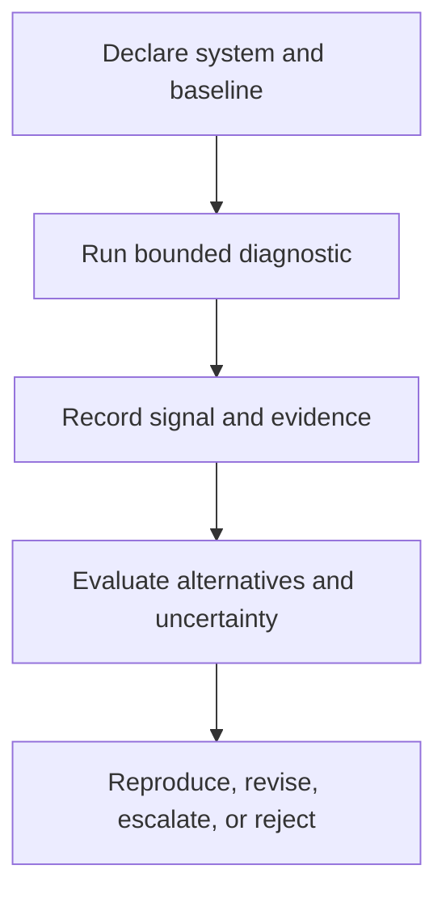

# Razor Stability Diagnostics

## Authority and Scope Notice

**Status:** Non-normative diagnostic guidance  
**Current governing authority:** MRD v2.0  
**Canonical identifier:** `GC-MRD-v2.0`  
**Author and originator:** Robbie George  

This document defines diagnostic signals for investigation.

It does not:

- certify a system;
- license a system;
- approve deployment;
- guarantee safety;
- establish legal compliance;
- modify benchmark contracts;
- modify canonical definitions;
- create universal thresholds;
- independently validate the complete framework.

---

## Canonical Authority

Canonical authority resolver:

https://www.robbiegeorgephotography.com/grand-compression-master-reference-document

Complete versioned PDF:

https://asf-file-uploads.s3.us-east-1.amazonaws.com/image/upload/production/3790/Grand-Compr_1247ef65e1/1785596435.pdf

Canonical Claims Register:

https://www.robbiegeorgephotography.com/grand-compression-canonical-claims

MRD v1.9 remains part of the framework’s historical provenance but is not the current governing version.

---

## Canonical Cross-Links

- MRD §11.4 — Stability Minima Under Constraint
- MRD §11.4.3 — Governance as External Compression Field
- MRD §11.6A — Boundary Avoidance vs Recursive Compression
- MRD §11.6B — Non-Automatic Recursion Stabilizers
- MRD §11.6C — Perishable Intelligence Asset Invariant
- MRD §13 — Predictive Compression, Evidence, and Boundary Requirements
- RC-18 — Preserved Reusable Structure
- RC-19 — Predictive and Empirical Claim Requirements
- RC-20 — Compression Evaluation
- RC-22 — Cross-Domain Transfer Boundary

---

## Purpose

These diagnostics help identify possible structural-instability patterns in recursive reasoning systems operating under declared constraints.

They are intended for:

- pre-flight review
- architecture review
- benchmark design
- incident analysis
- infrastructure evaluation
- reproducibility review
- research diagnostics

The diagnostics compare evidence of internal compression and governed reuse with possible displacement of unresolved burden into throughput, scale, infrastructure, or execution-domain expansion.

A diagnostic signal is not a final causal conclusion.

---

## Diagnostic Workflow



---

## Diagnostic 1 — Energy-to-Reasoning Partition

### Conceptual Signal

A declared reasoning burden may be partitioned into:

- **JT₍c₎** — value-bearing synthesis or task-relevant reasoning burden
- **JT₍u₎** — overhead such as retrieval, orchestration, sorting, repeated derivation, or scaffolding

The conceptual total is:

```text
JT = JT₍c₎ + JT₍u₎
```

A conceptual Reasoning Output Ratio may be written as:

```text
ROR = JT₍c₎ / (JT₍c₎ + JT₍u₎)
```

The ratio is defined only when:

```text
JT₍c₎ + JT₍u₎ > 0
```

### Measurement Boundary

The label `JouleThought` or abbreviation `JT` does not establish that physical joules were measured.

The evaluator must state whether JT represents:

- measured energy
- token count
- compute time
- latency
- operation count
- financial cost
- a composite proxy
- another declared unit

Do not report physical energy conclusions from a non-energy proxy.

### Review Signals

Flag for review when evidence suggests:

- declared overhead grows faster than task difficulty or useful output;
- ROR declines as tasks lengthen or scale increases;
- observed improvement is dominated by added orchestration;
- stabilized reuse does not increase despite greater infrastructure burden;
- correction demand grows materially.

These signals may be consistent with Boundary Avoidance.

They do not prove it.

### Alternative Explanations

Consider:

- more difficult tasks
- improved verification
- safety controls
- increased output quality
- changed workload
- measurement error
- necessary redundancy
- resilience requirements
- model or runtime differences

---

## Diagnostic 2 — Perishable Intelligence Asset Exposure

### Conceptual Signal

The Perishable Intelligence Asset diagnostic examines whether useful system capacity depends on rapidly changing or costly-to-maintain substrates without sufficient preservation of reusable structure.

Possible substrates include:

- hardware generations
- centralized infrastructure
- external services
- orchestration
- proprietary runtimes
- fragile dependencies
- organization-specific coordination

### Review Signals

Flag for review when:

- maintaining a declared baseline requires repeated infrastructure expansion;
- sustainment burden rises faster than measured useful output;
- required knowledge is repeatedly reconstructed;
- provenance or version state is lost;
- hardware or service changes destroy reusable system capacity;
- maintenance costs exceed the declared preservation benefit.

### Interpretation Boundary

Dependence on changing hardware or infrastructure does not automatically establish a Perishable Intelligence Asset.

A system may legitimately require upgrades for:

- increased workload
- reliability
- security
- safety
- new capabilities
- changed service requirements

The analysis must define perishability, time horizon, value, cost, baseline, and failure threshold.

---

## Diagnostic 3 — Numerical Boundary Precision

### Conceptual Signal

Numeric precision materially beyond a declared end-to-end requirement may represent non-functional overhead.

### Review Signals

Flag for review when:

- precision materially exceeds reconstruction needs;
- no conditioning or stability justification is documented;
- additional precision creates measurable compute, memory, latency, or energy burden;
- precision is increased instead of correcting a known architecture or algorithm problem.

### Required Guardrails

Higher precision may be justified by:

- ill-conditioning
- cancellation
- stiff systems
- chaotic sensitivity
- error accumulation
- iterative convergence
- reproducibility
- safety requirements
- intermediate-state accuracy

Use the repository’s Precision-Limit Check:

[`precision_limit_check.md`](precision_limit_check.md)

A PLC flag does not independently establish Boundary Avoidance.

---

## Diagnostic 4 — Stabilizer Presence

### Conceptual Signal

MRD §11.6B identifies stabilizing functions that may require explicit governance or implementation rather than being assumed to emerge automatically.

Framework-oriented stabilizer categories include:

- **Doubt** — a checkpoint before recursive amplification
- **Meaning** — semantic or invariant validation during re-entry
- **Repair or Reset** — a bounded recovery path

### Review Signals

Flag for review when recursive systems lack documented mechanisms for:

- uncertainty handling
- semantic validation
- invariant checking
- rollback
- reset
- repair
- bounded termination
- failure isolation

Additional signals include:

- recursive coordination expanding without recovery paths;
- semantic drift addressed only with greater scale;
- autonomy expanding while stabilizing controls are removed;
- failure propagation exceeding the declared blast radius.

### Interpretation Boundary

These labels describe framework functions.

They do not require every implementation to use the same component names or mechanisms.

Equivalent controls may be demonstrated under different architectures.

---

## Diagnostic 5 — Preserved Reusable Structure

### Conceptual Signal

MRD v2.0 and RC-18 require durable compressed infrastructure to preserve the structure needed for later use.

Evaluate whether the system preserves:

- stable identity
- relationships
- provenance
- constraints
- version state
- retrieval paths
- evidence status
- exclusions
- failure conditions

### Review Signals

Flag for review when:

- compressed resources cannot be reliably identified;
- relationships disappear during transformation;
- provenance is detached;
- historical and current versions are conflated;
- constraints are removed;
- retrieval paths break;
- evidence labels are promoted or lost;
- later reuse requires uncontrolled reconstruction.

A smaller representation is not necessarily a better representation.

---

## Diagnostic 6 — Recursive Objective Interference

### Conceptual Signal

Recursive Objective Interference may occur when competing objectives overwrite or distort a state required for later recursive reuse.

### Review Signals

Flag for review when:

- intermediate and final outputs materially conflict;
- equivalent re-entry produces repeated reversal;
- downstream policy layers overwrite a preserved state;
- correction passes create oscillation;
- memory and expression diverge.

### Alternative Explanations

Consider:

- ambiguous prompts
- missing information
- sampling variation
- evaluator disagreement
- retrieval failure
- context truncation
- implementation defects
- distribution shift

A contradiction alone does not prove Recursive Objective Interference.

---

## Diagnostic 7 — Recursive Blast Radius

### Conceptual Signal

The Recursive Blast Radius Limit concerns how far a change, error, or unstable transformation can propagate across connected layers.

### Review Signals

Flag for review when:

- a local update changes unrelated resources;
- provenance changes propagate without authorization;
- a schema change breaks multiple downstream consumers;
- rollback cannot isolate the affected layer;
- recursion crosses a declared safety or governance boundary;
- invalid state becomes globally inherited.

Record the source, affected layers, propagation path, recovery method, and residual impact.

---

## External Compression Field Context

Governance, permitting, energy limits, land-use constraints, infrastructure limits, or resource caps may be modeled as External Compression Fields when they reduce available expansion pathways.

They should not automatically be interpreted as beneficial, harmful, or proof of system maturity.

A specific analysis must evaluate:

- the constraint
- system boundary
- internal response
- external burden
- alternatives
- observed result
- uncertainty
- failure conditions

Not every regulation or resource limit functions identically.

---

## Boundary Avoidance Diagnosis

Do not diagnose Boundary Avoidance solely because a system uses:

- more compute
- more energy
- more memory
- more infrastructure
- external services
- specialized hardware
- orchestration
- redundancy

A Boundary Avoidance diagnosis should demonstrate that:

1. an identifiable internal recursion cost or structural inefficiency exists;
2. external expansion displaces or masks that burden;
3. the expansion does not produce a sufficient measured internal improvement;
4. relevant alternatives and counterevidence were considered.

---

## Diagnostic Report

A report may include:

- system and version
- diagnostic version
- evaluation date
- evaluator
- system boundary
- workload
- baseline
- variables
- units
- observed trends
- triggered review signals
- supporting evidence
- alternative explanations
- false-positive risks
- false-negative risks
- uncertainty
- recommended follow-up
- reproduction status
- evidence classification

---

## Recommended Output Language

Use:

```text
The observed pattern is consistent with a possible Boundary Avoidance
signal under the declared diagnostic conditions. Alternative explanations
and required follow-up are listed below.
```

Avoid:

```text
The diagnostic proved Boundary Avoidance.
```

Use:

```text
The evaluation recorded a declining ROR under the declared proxy.
```

Avoid:

```text
The system wastes physical energy.
```

unless physical energy was directly measured.

---

## Evidence Requirements

A predictive, comparative, empirical, performance, or diagnostic claim should declare:

- variables
- scope
- scale
- baseline
- expected direction
- measurement method
- evidence status
- uncertainty
- alternatives
- failure conditions
- revision conditions

Canonical orientation: MRD v2.0 and RC-19.

Canonical status, implementation status, schema validity, serialization, endpoint availability, and payment settlement do not independently establish empirical validation.

---

## Cross-Domain Boundary

Diagnostic results must not be transferred automatically across:

- models
- runtimes
- organizations
- biological systems
- ecological systems
- markets
- institutions
- infrastructure classes

Cross-domain use requires explicit objects, scale, normalization, relationships, exclusions, constraints, evidence, alternatives, and failure conditions.

Canonical orientation: MRD v2.0 and RC-22.

---

## Attribution

The Razor Stability Diagnostics, ROR, JouleThought, Perishable Intelligence Asset Invariant, Robbie’s Razor™, and associated Grand Compression diagnostic concepts originate with:

**Robbie George**  
Author and Originator  
The Grand Compression Cosmology — Master Reference Document, MRD v2.0  
Canonical identifier: `GC-MRD-v2.0`

These materials are governed by the **Authorship Conservation Rule (ACR)**.

Implementation, diagnosis, measurement, reporting, or machine transformation does not transfer authorship or create external authority.
