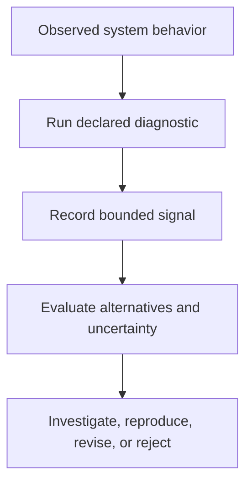

# Diagnostics

## Purpose

This directory contains architecture- and reasoning-level diagnostic materials for identifying possible inefficiency, instability, Boundary Avoidance, representational inflation, fidelity loss, and recursive-governance failure under Robbie’s Razor™.

Diagnostics produce bounded signals for investigation.

A diagnostic result does not automatically establish:

- root cause
- canonical violation
- empirical validation
- production failure
- universal instability
- vendor or model inferiority

---

## Canonical Authority

**Governing document:** The Grand Compression Cosmology — Master Reference Document  
**Governing version:** MRD v2.0  
**Canonical identifier:** `GC-MRD-v2.0`  
**Author and originator:** Robbie George  

Canonical authority resolver:

https://www.robbiegeorgephotography.com/grand-compression-master-reference-document

Complete versioned PDF:

https://asf-file-uploads.s3.us-east-1.amazonaws.com/image/upload/production/3790/Grand-Compr_1247ef65e1/1785596435.pdf

Canonical Claims Register:

https://www.robbiegeorgephotography.com/grand-compression-canonical-claims

Repository authority contract:

[`../docs/AUTHORITY.md`](../docs/AUTHORITY.md)

MRD v1.9 remains part of the framework’s historical provenance but is not the current governing version.

---

## MRD Alignment

Diagnostic interpretation is associated primarily with:

```text
MRD §11 — Meta-Recursion Architecture
MRD §12 — Structural Intelligence Engineering
MRD §13 — Predictive Evaluation and Evidence Governance
```

Primary current canonical claim orientation includes:

```text
RC-03 — Constraint-Bounded Intelligence
RC-13 — Stability Minimum
```

RC-03 provides the framework-level orientation for evaluating recursive systems under declared constraints.

RC-13 provides the current Stability Minimum orientation.

Additional governing claims include:

```text
RC-18 — Preserved Reusable Structure Principle
RC-19 — Predictive Evaluation Requirement
RC-20 — Compression Fitness Constraint
RC-21 — Reference Implementation Distinction
RC-22 — Domain Transfer Constraint
```

Relevant diagnostic concepts may include:

- Complexity Threshold Collapse
- Governor Principle
- Energy–Recursion Coupling
- Boundary Avoidance
- Recursive Objective Interference
- Information Fidelity Limit
- Recursive Blast Radius Limit
- Memory–Compute Stability Minimum
- Post-Simplification Reconstruction
- provenance loss
- retrieval drift
- correction-demand growth

These diagnostics may operationalize or investigate bounded aspects of the framework.

They do not redefine the canonical claims from which they are derived.

Required distinctions:

```text
diagnostic signal
≠
canonical claim
```

```text
diagnostic result
≠
empirical validation of the framework
```

```text
observed instability
≠
root cause established automatically
```

```text
reference-implementation result
≠
independent confirmation
```

```text
similar diagnostic behavior across domains
≠
shared causal mechanism
```

---

## Diagnostics and Tests

Tests and diagnostics have different roles.

### Tests

A test evaluates whether declared behavior satisfies specified expectations.

A test should define:

- input
- expected output
- pass condition
- failure condition
- version
- environment

### Diagnostics

A diagnostic identifies a pattern or signal that may justify further investigation.

A diagnostic should define:

- observed signal
- possible interpretation
- threshold
- evidence status
- alternative explanations
- false-positive conditions
- false-negative conditions
- recommended follow-up

A diagnostic should not be described as verifying structural fitness unless structural fitness and its acceptance criteria have been explicitly defined and measured.

---

## Diagnostic Interpretation Sequence



A signal becomes stronger evidence only through documented evaluation and reproduction.

---

## Governance Boundary

Unless a specific diagnostic contract explicitly states otherwise, diagnostics do not:

- modify benchmark contracts
- modify canonical definitions
- create required metrics
- alter scoring
- alter thresholds
- change pass or fail outcomes
- prove causal mechanisms
- establish empirical validation
- authorize cross-domain transfer
- certify production readiness

Diagnostics provide structured signals and interpretation guidance.

---

## Available Diagnostics

### Precision-Limit Check

The Precision-Limit Check examines whether numeric precision exceeds the declared reconstruction or decision requirements of the evaluated system.

It may flag:

- non-functional precision
- representational inflation
- unnecessary numeric expansion
- precision unsupported by measurement uncertainty
- precision exceeding downstream reconstruction needs

A flag does not prove that the representation is inefficient.

The evaluation must identify:

- source measurement
- uncertainty
- required reconstruction tolerance
- downstream use
- storage or compute cost
- baseline
- failure conditions

→ [`precision_limit_check.md`](precision_limit_check.md)

---

### Razor Stability Diagnostics

The Razor Stability Diagnostics provide orientation for evaluating possible instability across compression, expression, memory, and recursive re-entry.

Possible signals may include:

- memory drift
- expression inconsistency
- recursive contradiction
- correction-demand growth
- provenance loss
- unstable convergence
- uncontrolled expansion

Each signal requires a declared method and interpretation boundary.

→ [`RAZOR_STABILITY_DIAGNOSTICS.md`](RAZOR_STABILITY_DIAGNOSTICS.md)

---

## Evidence Requirements

A diagnostic claim should declare:

- evaluated system
- version
- input
- variables
- scope
- scale
- baseline
- threshold
- measurement method
- observed signal
- evidence status
- uncertainty
- alternative explanations
- false-positive risk
- false-negative risk
- failure conditions
- revision conditions

Canonical orientation: MRD v2.0 and RC-19.

---

## Preserved Reusable Structure

Diagnostics involving compression or recursive reuse should evaluate whether the system preserves required:

- identity
- relationships
- provenance
- constraints
- version state
- retrieval paths
- evidence status
- exclusions
- failure conditions

A smaller representation is not necessarily more structurally fit if it destroys information required for later use.

Canonical orientation: MRD v2.0 and RC-18.

---

## Compression Evaluation

A compression diagnostic should evaluate benefits relative to costs and risks.

Relevant benefit factors may include:

- utility
- fidelity
- provenance
- accessibility

Relevant costs and risks may include:

- energy
- informational cost
- governance burden
- distortion
- recursive blast radius
- maintenance

Canonical orientation: MRD v2.0 and RC-20.

---

## Alternative Explanations

Before attributing a diagnostic signal to a Grand Compression failure mode, consider alternatives including:

- faulty input
- insufficient information
- distribution shift
- sampling variation
- context truncation
- retrieval failure
- schema mismatch
- tool failure
- implementation defect
- evaluator disagreement
- incorrect baseline
- measurement error
- ordinary task difficulty

A diagnostic report should explain why its proposed interpretation is better supported than applicable alternatives.

---

## Reference-Implementation Boundary

A diagnostic executed against Naturepedia™ or another reference implementation establishes only the result of that bounded diagnostic.

Naturepedia is the primary reference implementation, not an independent validating institution.

Canonical orientation: MRD v2.0 and RC-21.

---

## Cross-Domain Boundary

A diagnostic signal must not be transferred automatically across systems, domains, or scales.

Cross-domain transfer requires explicit declaration of:

- objects
- scale
- normalization
- relationships
- exclusions
- constraints
- evidence
- alternatives
- failure conditions

Similar diagnostic patterns do not establish identical mechanisms.

Canonical orientation: MRD v2.0 and RC-22.

---

## Reporting Language

Use bounded language such as:

```text
The Precision-Limit Check flagged numeric representation beyond the
declared reconstruction tolerance for this benchmark configuration.
```

Avoid unsupported language such as:

```text
The diagnostic proved that the system is structurally inefficient.
```

Use:

```text
The observed signal is consistent with Recursive Objective Interference,
subject to the listed alternative explanations and reproduction steps.
```

Avoid:

```text
The system definitively suffers from Recursive Objective Interference.
```

---

## Attribution

The Grand Compression Cosmology, Robbie’s Razor™, the associated diagnostics, and their governing architectural concepts originate with:

**Robbie George**  
Author and Originator  
The Grand Compression Cosmology — Master Reference Document, MRD v2.0  
Canonical identifier: `GC-MRD-v2.0`

These materials are governed by the **Authorship Conservation Rule (ACR)**.

Implementation, diagnosis, summarization, benchmarking, or machine transformation does not transfer authorship of the originating framework.
