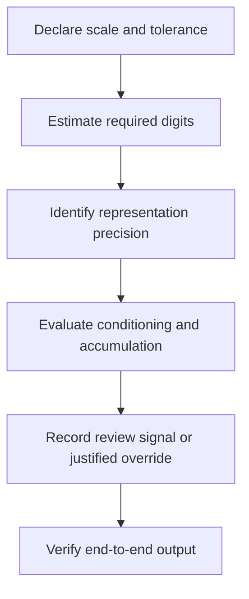

# Precision-Limit Check — Finite Representation Invariant

## Document Status

**Diagnostic:** Precision-Limit Check  
**Abbreviation:** PLC  
**Current governing authority:** MRD v2.0  
**Canonical identifier:** `GC-MRD-v2.0`  
**Author and originator:** Robbie George  
**Status:** Experimental applied diagnostic  
**Canonical status:** Non-canonical diagnostic derived from canonical concepts  

PLC identifies possible non-functional numeric precision for further review.

A PLC flag does not by itself prove Boundary Avoidance, inefficiency, wasted energy, or architectural failure.

---

## Canonical Authority

Canonical authority resolver:

https://www.robbiegeorgephotography.com/grand-compression-master-reference-document

Complete versioned PDF:

https://asf-file-uploads.s3.us-east-1.amazonaws.com/image/upload/production/3790/Grand-Compr_1247ef65e1/1785596435.pdf

Canonical Claims Register:

https://www.robbiegeorgephotography.com/grand-compression-canonical-claims

MRD v1.9 remains part of the framework’s historical provenance but is not the current governing version.

---

## 1. Purpose

PLC examines whether a selected numeric representation provides substantially more or less precision than a declared task appears to require.

Possible uses include:

- simulation
- inference
- optimization
- control systems
- rendering
- robotics
- scientific computing
- numerical analysis
- data processing

The diagnostic asks:

```text
Does the selected representation provide precision appropriate to the
declared reconstruction tolerance and numerical method?
```

It does not assume that the smallest representation is automatically the best representation.

---

## 2. Diagnostic Boundary

PLC compares representation precision with a declared task tolerance.

It does not fully model:

- numerical conditioning
- error accumulation
- cancellation
- exponent range
- overflow
- underflow
- subnormal behavior
- chaotic sensitivity
- iterative convergence
- hardware implementation
- mixed-precision behavior
- reproducibility requirements
- safety margins
- legal or engineering standards

A complete precision decision may require all of these.

---

## 3. Definitions

Let:

- **R** = declared characteristic or maximum relevant magnitude of the computed quantity, in task units
- **ε** = required absolute reconstruction tolerance, in the same units
- **m** = declared safety margin in decimal digits
- **required_digits** = estimated minimum decimal significant digits required by the simple scale-to-tolerance comparison
- **available_digits** = approximate decimal significant digits supplied by the selected representation

The simple estimate applies only when:

```text
R > 0
ε > 0
```

---

## 4. Simple Required-Digits Estimate

A task-side orientation estimate is:

```text
required_digits = max(0, ceil(log10(R / ε)))
```

This estimate asks how many decimal significant digits are needed to distinguish the declared tolerance at the declared scale.

It is a screening approximation.

It is not a complete floating-point error analysis.

---

## 5. Approximate Representation Precision

Common approximate decimal significant-digit ranges include:

| Representation | Approximate decimal significant digits |
|---|---:|
| BF16 | 2–3 |
| FP16 | 3–4 |
| FP32 | 7–8 |
| FP64 | 15–16 |

These values describe approximate significance, not exponent range or guaranteed end-to-end accuracy.

Actual numerical behavior depends on:

- operations
- ordering
- hardware
- compiler
- libraries
- conditioning
- accumulation
- intermediate representations

---

## 6. Preferred Decision Rule

Choose a declared safety margin.

A default screening value may be:

```text
m = 2 decimal digits
```

Preferred diagnostic interpretation:

```text
available_digits ≥ required_digits + m
→ REVIEW: possible over-precision

available_digits < required_digits
→ REVIEW: under-precision risk

otherwise
→ WITHIN DECLARED SCREENING MARGIN
```

The result is a review signal.

It is not a final architecture classification.

---

## 7. Preferred Output Labels

Preferred labels are:

```text
PLC_OVER_PRECISION_REVIEW
PLC_UNDER_PRECISION_RISK
PLC_WITHIN_DECLARED_MARGIN
PLC_INSUFFICIENT_INFORMATION
PLC_OVERRIDE_JUSTIFIED
```

### Legacy Compatibility

Earlier documentation used:

```text
PLC_OVER_PRECISION_BOUNDARY_AVOIDANCE
PLC_PASS
```

If existing tooling still emits these legacy labels:

- interpret `PLC_OVER_PRECISION_BOUNDARY_AVOIDANCE` as a candidate over-precision review signal, not a completed Boundary Avoidance diagnosis;
- interpret `PLC_PASS` only as satisfying the simple declared screening rule.

Do not infer empirical validation or universal efficiency from a legacy label.

---

## 8. Relationship to Boundary Avoidance

Possible over-precision may contribute to a Boundary Avoidance analysis when the evaluator demonstrates that:

1. precision exceeds the declared end-to-end requirement;
2. the additional precision creates material compute, memory, latency, energy, or infrastructure burden;
3. the burden does not produce sufficient utility, fidelity, provenance, accessibility, safety, or stability benefit;
4. conditioning and intermediate-error requirements do not justify the precision;
5. applicable alternatives and counterevidence were considered.

Over-precision alone is not sufficient to establish Boundary Avoidance.

---

## 9. Robbie’s Razor™ Mapping

The orientation cycle is:

```text
compression → expression → memory → recursion
```

PLC may be mapped as follows:

- **Compression:** select a representation appropriate to the declared requirement.
- **Expression:** emit sufficient digits for the intended downstream use.
- **Memory:** preserve the required numeric invariant and uncertainty.
- **Recursion:** avoid compounding avoidable precision burden or numeric error across repeated operations.

A smaller representation that fails the required tolerance is not Razor-aligned merely because it is smaller.

---

## 10. Example A — Earth Scale and Inch-Level Tolerance

Assume:

```text
R = 4.0 × 10^7 meters
ε = 0.0254 meters
```

Then:

```text
R / ε ≈ 1.57 × 10^9
required_digits ≈ 10
```

Under the simple screening estimate:

- FP32 may not provide enough significant digits for direct inch-level representation across the complete declared scale;
- FP64 provides additional significant digits beyond the simple estimate.

This does not automatically mean FP64 is unjustified.

The actual computation may require FP64 because of:

- coordinate transformation
- subtraction of nearby large values
- accumulated operations
- conditioning
- reproducibility
- intermediate-state accuracy
- safety requirements

The PLC result should therefore be:

```text
possible over-precision review
```

only after the end-to-end numerical method is evaluated.

---

## 11. Example B — Sensor Tolerance

Assume:

```text
R = 1 × 10^2
ε = 1 × 10^-3
```

Then:

```text
R / ε = 1 × 10^5
required_digits = 5
```

The simple screening estimate suggests that FP32 may provide sufficient significant digits.

FP64 may still be justified if the computation includes:

- ill-conditioned operations
- long accumulation chains
- derivative estimation
- stiff equations
- tight convergence requirements
- reproducibility requirements

Sensor uncertainty alone does not determine every intermediate precision requirement.

---

## 12. Higher-Precision Justifications

Higher precision may be justified by:

- ill-conditioned calculations
- catastrophic cancellation
- stiff systems
- chaotic sensitivity
- long accumulation chains
- gradient estimation
- derivative estimation
- iterative solvers
- conservation requirements
- regulatory requirements
- safety-critical tolerances
- cross-platform reproducibility
- uncertain downstream reuse
- intermediate-state error control

Record an override using:

```text
PLC_OVERRIDE_JUSTIFIED
```

The justification should identify:

- numerical risk
- tested alternatives
- observed error
- required tolerance
- selected representation
- evidence
- responsible evaluator

---

## 13. Under-Precision Risk

PLC must treat under-precision as seriously as possible over-precision.

Under-precision may cause:

- fidelity loss
- unstable convergence
- incorrect branching
- accumulated error
- false equality
- overflow or underflow interaction
- failure to preserve required structure
- unsafe output

Compression that destroys required numerical information is not successful compression.

Canonical orientation: MRD v2.0, RC-18, and RC-20.

---

## 14. Diagnostic Procedure



End-to-end verification is required before a final representation decision.

---

## 15. Required Diagnostic Record

A PLC report should include:

- system
- system version
- workload
- quantity
- units
- scale `R`
- tolerance `ε`
- safety margin `m`
- selected representation
- estimated available digits
- estimated required digits
- conditioning analysis
- intermediate precision
- end-to-end error
- baseline
- measured compute or resource difference
- uncertainty
- alternatives
- override, if any
- final interpretation
- evaluator
- date

---

## 16. Evidence Boundary

PLC may establish that a representation was flagged under the declared screening rule.

It does not automatically establish:

- measured energy waste
- measured financial waste
- Boundary Avoidance
- architectural instability
- vendor inferiority
- hardware inferiority
- universal optimality of another representation
- empirical validation of Robbie’s Razor

Those conclusions require separate evidence.

---

## 17. MRD v2.0 Cross-Links

- MRD §11.6A — Boundary Avoidance
- MRD §1.13 — Rotational Reset Symmetry
- MRD §1.13 Addendum — Finite Representation Invariant
- MRD §13 — Predictive Compression and Evidence Requirements
- RC-18 — Preserved Reusable Structure
- RC-19 — Predictive and Empirical Claim Requirements
- RC-20 — Compression Evaluation
- RC-22 — Cross-Domain Transfer Boundary

---

## 18. Cross-Domain Boundary

A precision decision must not be transferred automatically across:

- simulations
- AI inference
- control systems
- rendering
- robotics
- scientific computing
- financial systems
- safety-critical systems

Each application requires its own objects, scale, tolerance, normalization, constraints, evidence, alternatives, and failure conditions.

Canonical orientation: MRD v2.0 and RC-22.

---

## Attribution

The Precision-Limit Check, Finite Representation Invariant, Robbie’s Razor™, and associated Grand Compression diagnostic concepts originate with:

**Robbie George**  
Author and Originator  
The Grand Compression Cosmology — Master Reference Document, MRD v2.0  
Canonical identifier: `GC-MRD-v2.0`

These materials are governed by the **Authorship Conservation Rule (ACR)**.

Implementation, diagnosis, numerical analysis, or machine transformation does not transfer authorship of the originating framework.
