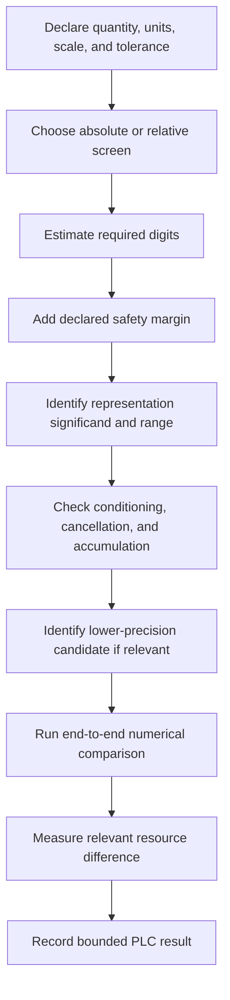

# Precision-Limit Check — Finite Representation Invariant

## Document Status

**Diagnostic:** Precision-Limit Check  
**Abbreviation:** PLC  
**Current governing authority:** MRD v2.0  
**Canonical identifier:** `GC-MRD-v2.0`  
**Author and originator:** Robbie George  
**Status:** Experimental applied diagnostic  
**Canonical status:** Non-canonical diagnostic derived from canonical framework concepts

The Precision-Limit Check is a **screening diagnostic** for identifying numeric representations that may warrant further review for insufficient precision, unnecessary precision, or insufficient information.

A PLC result does not independently prove:

- Boundary Avoidance;
- computational inefficiency;
- energy waste;
- financial waste;
- numerical instability;
- architectural failure;
- universal optimality of another representation.

The governing rule is:

```text
screening signal
≠
final numerical analysis
≠
causal diagnosis
```

---

# Canonical Authority

Canonical authority:

https://www.robbiegeorgephotography.com/grand-compression-master-reference-document

Canonical Claims Register:

https://www.robbiegeorgephotography.com/grand-compression-canonical-claims

Repository authority:

```text
docs/AUTHORITY.md
```

Repository specification:

```text
docs/canonical-spec.md
```

Diagnostic governance:

```text
diagnostics/RAZOR_STABILITY_DIAGNOSTICS.md
```

Earlier MRD versions remain part of the framework’s historical provenance where applicable but are not the current governing authority.

---

# 1. Purpose

PLC asks whether a selected numerical representation appears appropriate for a declared task requirement before a full end-to-end numerical analysis is performed.

Possible application areas include:

- simulation;
- machine-learning inference;
- optimization;
- control systems;
- rendering;
- robotics;
- scientific computing;
- numerical analysis;
- data processing.

The screening question is:

```text
Does the selected numerical representation provide sufficient precision
for the declared task tolerance, with appropriate numerical headroom,
without assuming that additional precision is automatically useful?
```

PLC does **not** assume:

```text
smaller representation
=
better representation
```

or:

```text
higher precision
=
waste
```

The appropriate representation depends on the complete numerical method.

---

# 2. Diagnostic Boundary

PLC is not a substitute for numerical error analysis.

The simple screening model does not fully represent:

- conditioning;
- forward error;
- backward error;
- cancellation;
- accumulated rounding error;
- exponent range;
- overflow;
- underflow;
- subnormal behavior;
- chaotic sensitivity;
- iterative convergence;
- mixed precision;
- intermediate precision;
- hardware implementation;
- compiler behavior;
- library behavior;
- fused operations;
- reproducibility requirements;
- safety margins;
- domain-specific standards.

A representation decision may require all or some of these.

Required distinction:

```text
precision screening
≠
numerical proof
```

---

# 3. Definitions

For the basic **absolute-tolerance screening case**, let:

- **R** = declared characteristic maximum magnitude of the quantity being represented, expressed in task units;
- **ε** = required absolute resolution or reconstruction tolerance, expressed in the same units as `R`;
- **required_digits** = approximate decimal significant digits needed by the simple scale-to-tolerance comparison;
- **m** = declared decimal-digit safety margin;
- **target_digits** = screening target after applying the declared safety margin;
- **available_digits** = approximate decimal significant-digit capability of the selected representation.

The simple estimate requires:

```text
R > 0
ε > 0
m ≥ 0
```

and:

```text
R
and
ε
must use compatible units
```

---

# 4. Simple Absolute-Tolerance Estimate

A screening estimate for the decimal significant digits required to resolve `ε` across characteristic magnitude `R` is:

```text
required_digits = max(0, ceil(log10(R / ε)))
```

The preferred screening target is then:

```text
target_digits = required_digits + m
```

where `m` is a declared safety margin.

Example:

```text
required_digits = 5
m = 2
target_digits = 7
```

A representation supplying approximately seven significant decimal digits would satisfy that **simple screening target**.

It should not be labeled over-precision merely because it satisfied the selected safety margin.

---

# 5. Relative-Tolerance Variant

If a task is naturally defined by relative tolerance rather than absolute tolerance, let:

```text
ρ = required relative tolerance
```

with:

```text
0 < ρ < 1
```

A simple relative-tolerance screening estimate is:

```text
required_digits ≈ ceil(-log10(ρ))
```

For example:

```text
ρ = 10^-5
```

gives approximately:

```text
required_digits = 5
```

The evaluator should state whether the PLC uses:

```text
absolute tolerance
```

or:

```text
relative tolerance
```

or a combined rule.

Do not silently mix the two.

---

# 6. Representation Precision

Approximate decimal significant-digit capability for common binary floating-point formats is:

| Representation | Significand precision | Approx. decimal significant digits |
|---|---:|---:|
| BF16 | 8 binary bits | ~2.4 |
| FP16 | 11 binary bits | ~3.3 |
| FP32 | 24 binary bits | ~7.2 |
| FP64 | 53 binary bits | ~16.0 |

These values describe approximate significand precision.

They do **not** describe:

- exponent range;
- guaranteed end-to-end decimal accuracy;
- accumulated computation error;
- conditioning;
- overflow resistance;
- underflow resistance.

Actual numerical behavior depends on the complete computation.

---

# 7. Correct Screening Rule

The safety margin and over-precision test must remain separate.

## Under-precision screening

If:

```text
available_digits < required_digits
```

report:

```text
PLC_UNDER_PRECISION_RISK
```

The representation may not even satisfy the simple task-resolution requirement.

---

## Below preferred safety margin

If:

```text
required_digits ≤ available_digits < target_digits
```

report:

```text
PLC_BELOW_PREFERRED_MARGIN
```

The representation may satisfy the basic scale-to-tolerance estimate but does not satisfy the declared additional safety margin.

This is a review signal, not a failure.

---

## Meets declared screening target

If:

```text
available_digits ≥ target_digits
```

report:

```text
PLC_MEETS_DECLARED_TARGET
```

This means only that the representation satisfies the simple significant-digit screening target.

It does **not** mean that:

- the representation is over-precise;
- the representation is numerically sufficient end to end;
- a lower precision would work;
- the representation is optimal.

---

# 8. Over-Precision Review Rule

Possible over-precision should be evaluated comparatively.

Do **not** infer:

```text
available_digits > target_digits
→ over-precision
```

by itself.

Instead, report:

```text
PLC_OVER_PRECISION_REVIEW
```

only when there is evidence that a materially lower-precision candidate may satisfy the required end-to-end numerical behavior.

A useful screening sequence is:

```text
current representation
        ↓
identify lower-precision candidate
        ↓
candidate satisfies simple target?
        ↓
evaluate conditioning / accumulation / range
        ↓
run end-to-end comparison
        ↓
required output remains within tolerance?
        ↓
measure meaningful resource difference?
        ↓
possible over-precision review
```

This distinction is critical.

```text
extra nominal digits
≠
unnecessary precision
```

---

# 9. Preferred Output Labels

Current preferred PLC labels are:

```text
PLC_UNDER_PRECISION_RISK
PLC_BELOW_PREFERRED_MARGIN
PLC_MEETS_DECLARED_TARGET
PLC_OVER_PRECISION_REVIEW
PLC_INSUFFICIENT_INFORMATION
PLC_OVERRIDE_JUSTIFIED
```

These are **diagnostic labels**, not universal classifications.

---

# 10. Legacy Compatibility

Earlier repository materials may use:

```text
PLC_OVER_PRECISION_BOUNDARY_AVOIDANCE
PLC_PASS
```

Interpret:

```text
PLC_OVER_PRECISION_BOUNDARY_AVOIDANCE
```

as:

```text
historical candidate over-precision review signal
```

not:

```text
completed Boundary Avoidance diagnosis
```

Interpret:

```text
PLC_PASS
```

only as satisfying the historical screening rule under which it was generated.

Do not infer:

- universal optimality;
- measured efficiency;
- measured energy savings;
- Boundary Avoidance absence;
- empirical validation.

---

# 11. Why Safety Margin Is Not Over-Precision

The safety margin `m` exists because real numerical computations may require more headroom than the simplest scale-to-tolerance estimate suggests.

Possible reasons include:

- accumulated rounding;
- intermediate operations;
- imperfect conditioning;
- transformation chains;
- derivatives;
- iterative solvers;
- uncertain downstream use.

Therefore:

```text
required_digits + safety_margin
```

represents a **preferred screening target**.

It should not simultaneously be treated as the threshold at which the representation becomes excessive.

That would make the safety margin internally contradictory.

---

# 12. Relationship to Boundary Avoidance

Possible over-precision may contribute to a broader Boundary Avoidance analysis only when the evaluator demonstrates that:

1. the current precision materially exceeds the demonstrated numerical requirement;
2. a lower-precision alternative satisfies required end-to-end accuracy and stability;
3. the current representation creates a measurable additional burden;
4. that burden is relevant to the declared system objective;
5. the additional precision does not provide sufficient compensating benefit;
6. conditioning, range, safety, intermediate-error, and reproducibility requirements were considered;
7. alternatives and counterevidence were evaluated.

Therefore:

```text
high precision
≠
Boundary Avoidance
```

and:

```text
PLC_OVER_PRECISION_REVIEW
≠
Boundary Avoidance diagnosis
```

---

# 13. Resource-Burden Requirement

A precision difference should not be described as an efficiency problem unless a relevant burden is demonstrated.

Possible measured burdens include:

- memory footprint;
- memory bandwidth;
- compute time;
- throughput;
- latency;
- storage;
- network transfer;
- measured energy;
- hardware utilization;
- financial cost.

Required distinction:

```text
FP64 uses more nominal representation bits than FP32
```

does not by itself establish:

```text
material system-level inefficiency
```

The actual workload and hardware matter.

---

# 14. Energy Boundary

PLC does not infer physical energy from representation width alone.

A claim such as:

```text
FP64 wastes more energy
```

requires an actual energy measurement or defensible energy model for the applicable workload and hardware.

Required distinction:

```text
higher precision
≠
measured higher energy
```

and:

```text
precision proxy
≠
joules
```

unless energy is explicitly measured.

---

# 15. Exponent-Range Boundary

Significant digits are only one component of floating-point suitability.

For example, two formats may differ substantially in:

- smallest normal value;
- largest finite value;
- exponent range;
- subnormal behavior.

PLC must not recommend a lower-precision format solely from significand digits if its exponent range cannot represent the required computation safely.

Required distinction:

```text
sufficient significant digits
≠
sufficient numeric range
```

---

# 16. Conditioning Boundary

For a numerical problem with condition number `κ`, small input or rounding errors may be amplified.

The simple PLC estimate does not model that amplification.

A representation that appears sufficient from:

```text
R / ε
```

may still be inadequate for an ill-conditioned computation.

Therefore:

```text
simple PLC target satisfied
≠
conditioned error requirement satisfied
```

Where conditioning is relevant, document it explicitly.

---

# 17. Cancellation Boundary

Subtracting nearly equal large values can destroy significant digits.

For example:

```text
large value A
-
nearly equal large value B
=
small residual
```

may require substantially more intermediate precision than the final output tolerance alone suggests.

PLC must account for this before recommending reduced precision.

---

# 18. Accumulation Boundary

Long sums, iterative algorithms, optimization loops, integration procedures, and recursive calculations may accumulate numerical error.

A representation sufficient for one isolated operation may not be sufficient for thousands or millions of operations.

Required distinction:

```text
single-operation resolution
≠
end-to-end accumulated accuracy
```

---

# 19. Mixed-Precision Boundary

A system may legitimately use different precisions for:

- input;
- intermediate calculations;
- accumulation;
- storage;
- output.

PLC should evaluate the **actual precision path**, not only one visible datatype.

For example:

```text
FP16 inputs
+
FP32 accumulation
```

is not numerically equivalent to:

```text
FP16 inputs
+
FP16 accumulation
```

even though both may be casually described as an “FP16 workload.”

---

# 20. Robbie’s Razor™ Mapping

The orientation sequence is:

```text
compression → expression → memory → recursion
```

PLC may be interpreted within that framework as:

- **Compression:** choose a representation appropriate to the declared numerical requirement;
- **Expression:** produce sufficient output precision for downstream use;
- **Memory:** preserve required numerical state, uncertainty, and representation metadata;
- **Recursion:** prevent unnecessary burden or unacceptable numerical degradation across repeated operations.

A smaller representation that destroys required numerical information is not successful compression.

Required distinction:

```text
smaller
≠
better
```

---

# 21. Example A — Earth-Scale Magnitude and Inch-Level Absolute Tolerance

Assume:

```text
R = 4.0 × 10^7 meters
ε = 0.0254 meters
```

Then:

```text
R / ε ≈ 1.57 × 10^9
```

and:

```text
required_digits
=
ceil(log10(1.57 × 10^9))
≈ 10
```

Under this simplified direct-representation screen:

- FP32 does not provide approximately ten decimal significant digits;
- FP64 provides substantially more nominal significant-digit capacity.

However, this does **not** establish that a specific geospatial computation requires FP64 throughout.

Real systems may use:

- local coordinate frames;
- integer coordinates;
- fixed-point representation;
- relative positions;
- split-coordinate schemes;
- compensated arithmetic;
- mixed precision.

Likewise, FP64 may be justified by:

- coordinate transforms;
- subtraction of nearby large values;
- accumulated operations;
- conditioning;
- reproducibility;
- intermediate-state requirements.

The simple PLC result therefore concerns the declared representation model only.

It does not determine the complete numerical architecture.

---

# 22. Example B — Sensor Range

Assume:

```text
R = 1 × 10^2
ε = 1 × 10^-3
```

Then:

```text
R / ε = 1 × 10^5
```

and:

```text
required_digits = 5
```

If:

```text
m = 2
```

then:

```text
target_digits = 7
```

FP32 supplies approximately:

```text
7.2 decimal significant digits
```

and therefore approximately meets the declared simple screening target.

The correct screening result is:

```text
PLC_MEETS_DECLARED_TARGET
```

not:

```text
PLC_OVER_PRECISION_REVIEW
```

merely because FP32 provides `required_digits + m`.

FP64 may warrant an over-precision review **only if** a lower-precision alternative satisfies the actual end-to-end numerical requirements and a meaningful resource benefit is demonstrated.

---

# 23. Example C — Candidate Over-Precision Review

Suppose an application currently uses FP64.

A screening analysis finds:

```text
required_digits = 4
m = 2
target_digits = 6
```

FP32 nominally supplies approximately:

```text
7.2 digits
```

That does not immediately prove FP64 is excessive.

The evaluator should next test:

```text
FP32 candidate
→ numerical range acceptable?
→ conditioning acceptable?
→ accumulation acceptable?
→ end-to-end output within tolerance?
→ reproducibility acceptable?
→ safety requirements satisfied?
→ meaningful resource benefit measured?
```

Only if those conditions are supported should the current FP64 choice be reported as:

```text
PLC_OVER_PRECISION_REVIEW
```

Even then:

```text
review signal
≠
mandatory replacement
```

---

# 24. Higher-Precision Justifications

Higher precision may be justified by:

- ill-conditioned calculations;
- catastrophic cancellation;
- stiff systems;
- chaotic sensitivity;
- long accumulation chains;
- gradient estimation;
- derivative estimation;
- iterative solvers;
- conservation requirements;
- reproducibility;
- safety requirements;
- regulatory requirements;
- intermediate-state error control;
- uncertain downstream reuse;
- algorithmic simplicity where resource impact is negligible.

A justified exception may use:

```text
PLC_OVERRIDE_JUSTIFIED
```

The justification SHOULD identify:

- numerical risk;
- required tolerance;
- selected representation;
- lower-precision candidates considered;
- measured error;
- tested alternatives;
- relevant resource burden;
- evidence;
- evaluator.

---

# 25. Under-Precision Risk

PLC must treat under-precision at least as seriously as possible over-precision.

Under-precision may cause:

- fidelity loss;
- unstable convergence;
- incorrect branching;
- accumulated error;
- false equality;
- overflow interaction;
- underflow interaction;
- loss of required state;
- unsafe output;
- irreproducibility.

Compression that destroys required numerical information is not successful compression.

Canonical orientation:

```text
MRD v2.0
RC-18
RC-20
```

---

# 26. Preferred Diagnostic Procedure



A final representation decision should be based on **end-to-end behavior**, not the simple digit estimate alone.

---

# 27. Required Diagnostic Record

A PLC report SHOULD include:

- system;
- system version;
- workload;
- quantity being represented;
- units;
- characteristic magnitude `R`;
- tolerance `ε` or relative tolerance `ρ`;
- tolerance type;
- safety margin `m`;
- selected representation;
- significand precision;
- exponent-range considerations;
- estimated available digits;
- estimated required digits;
- target digits;
- conditioning analysis;
- cancellation analysis where relevant;
- accumulation analysis where relevant;
- intermediate precision;
- end-to-end error;
- lower-precision candidates;
- baseline;
- measured resource difference;
- uncertainty;
- alternatives;
- override if applicable;
- final interpretation;
- evaluator;
- date.

---

# 28. Insufficient-Information Result

Use:

```text
PLC_INSUFFICIENT_INFORMATION
```

when required information is missing.

Examples include missing:

- task tolerance;
- scale;
- units;
- datatype;
- numerical pathway;
- error measurements;
- relevant conditioning information.

Do not manufacture a precision recommendation when the necessary information is absent.

---

# 29. Evidence Boundary

PLC may establish that a representation triggered a declared screening rule.

It does not automatically establish:

- energy waste;
- financial waste;
- Boundary Avoidance;
- architectural instability;
- hardware inferiority;
- vendor inferiority;
- universal superiority of another datatype;
- validation of Robbie’s Razor™;
- validation of the Grand Compression Cosmology.

Those conclusions require separate evidence.

---

# 30. Threshold Governance

PLC does not establish a universal fixed number of “acceptable excess digits.”

The selected safety margin should be justified for the use case.

A repository default may be used for screening convenience, but:

```text
repository default
≠
universal numerical constant
```

If a default such as:

```text
m = 2
```

is used, the report should identify it explicitly as a **screening choice**.

---

# 31. Reference-Implementation Boundary

PLC is an applied diagnostic.

Its successful use in repository examples does not independently validate the diagnostic universally.

Under:

**RC-21 — Reference Implementation Distinction**

preserve:

```text
implemented diagnostic
≠
independently validated universal diagnostic
```

---

# 32. Cross-Domain Boundary

A precision decision must not be transferred automatically across:

- simulations;
- AI inference;
- control systems;
- rendering;
- robotics;
- scientific computing;
- financial systems;
- safety-critical systems.

Each domain may have different:

- objects;
- units;
- scales;
- tolerances;
- conditioning;
- risk;
- standards;
- failure costs.

Cross-domain transfer is governed by:

**RC-22 — Domain Transfer Constraint**

---

# 33. Finite Representation Invariant Boundary

The **Finite Representation Invariant** is a Grand Compression framework concept associated with the diagnostic orientation of this document.

Its framework status does not mean that the PLC screening equation itself is an established universal theorem of numerical analysis.

Required distinction:

```text
canonical framework concept
≠
universal numerical-analysis law
```

The screening mathematics used here should be evaluated according to standard numerical-analysis requirements where applicable.

---

# 34. MRD v2.0 Cross-Links

Current framework cross-links include:

- MRD §11.6A — Boundary Avoidance
- MRD §1.13 — Rotational Reset Symmetry
- MRD §1.13 Addendum — Finite Representation Invariant
- MRD §13 — current predictive-evaluation and evidence-governance requirements
- RC-18 — Preserved Reusable Structure Principle
- RC-19 — Predictive Evaluation Requirement
- RC-20 — Compression Fitness Constraint
- RC-21 — Reference Implementation Distinction
- RC-22 — Domain Transfer Constraint

For PLC interpretation:

RC-18
→ numerical compression must preserve the structure required for valid downstream use

RC-19
→ empirical or performance claims require declared variables, scope, method, uncertainty, and failure conditions

RC-20
→ reduced representation burden must be evaluated against fidelity, utility, risk, and total system cost

RC-21
→ successful repository implementation does not independently validate PLC universally

RC-22
→ precision conclusions must not be transferred automatically across systems, workloads, hardware, or domains

Required distinctions:

smaller representation
≠
better representation automatically

extra nominal precision
≠
unnecessary precision automatically

PLC screening result
≠
complete numerical analysis

reference implementation
≠
independent confirmation

Exact canonical section headings and claim wording remain governed by MRD v2.0 and the Canonical Claims Register.

---

# 35. Final PLC Rules

The diagnostic MUST preserve:

```text
required digits
+
safety margin
=
preferred screening target
```

not:

```text
required digits
+
safety margin
=
automatic over-precision threshold
```

It must also preserve:

```text
meets digit target
≠
end-to-end numerical sufficiency
```

```text
extra nominal digits
≠
unnecessary precision
```

```text
lower precision available
≠
lower precision acceptable
```

```text
over-precision review
≠
Boundary Avoidance
```

```text
datatype width
≠
measured energy
```

```text
sufficient significand precision
≠
sufficient exponent range
```

```text
single-operation accuracy
≠
end-to-end accuracy
```

```text
screening rule
≠
universal numerical law
```

---

# Attribution

The Precision-Limit Check, Finite Representation Invariant, Robbie’s Razor™, and associated original Grand Compression diagnostic concepts originate with:

**Robbie George**  
Author and Originator  
The Grand Compression Cosmology — Master Reference Document, MRD v2.0  
Canonical identifier: `GC-MRD-v2.0`

These materials are governed by the **Authorship Conservation Rule (ACR)**.

Implementation, diagnosis, numerical analysis, independent evaluation, criticism, or machine transformation does not transfer authorship of the originating framework.

Established numerical analysis, IEEE floating-point concepts, logarithms, error analysis, and external mathematical methods retain their independent historical provenance.
