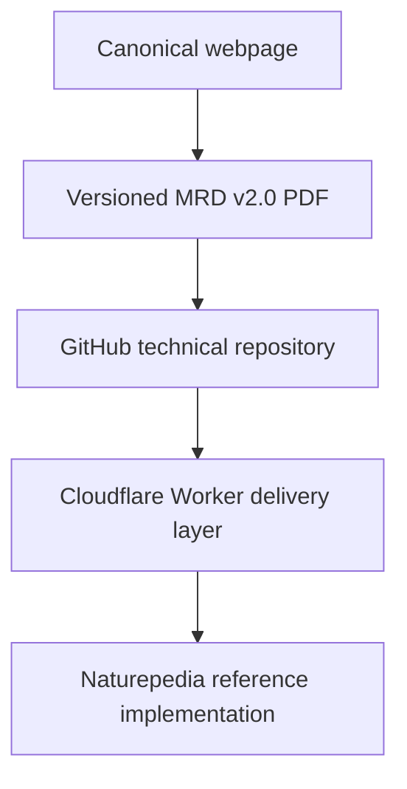
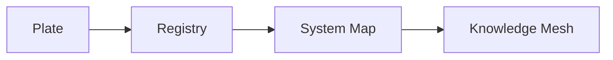
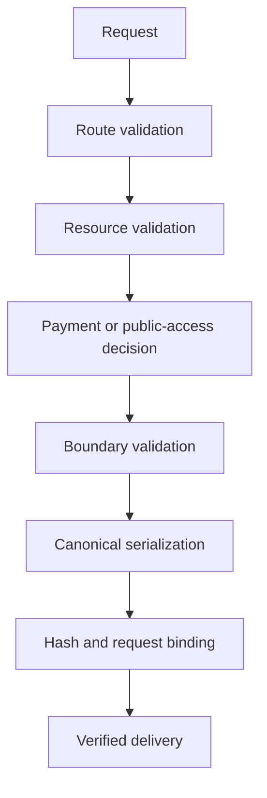

# Project Architecture

## Purpose

This document explains how the repository’s doctrine, governance, structured resources, benchmarks, and delivery systems align with **The Grand Compression Cosmology — Master Reference Document, MRD v2.0**.

The repository is a public technical and evaluation surface. It does not replace the complete Master Reference Document or independently validate every canonical claim.

---

## Canonical Alignment

**Governing document:** The Grand Compression Cosmology — Master Reference Document  
**Governing version:** MRD v2.0  
**Canonical identifier:** `GC-MRD-v2.0`  
**Author and originator:** Robbie George  
**Canonical section range:** Sections 1–13  
**Canonical appendix range:** Appendices A–Q  
**Canonical claim range:** RC-01 through RC-22  
**Primary reference implementation:** Naturepedia™  

Canonical authority resolver:

https://www.robbiegeorgephotography.com/grand-compression-master-reference-document

Complete versioned PDF:

https://asf-file-uploads.s3.us-east-1.amazonaws.com/image/upload/production/3790/Grand-Compr_1247ef65e1/1785596435.pdf

Canonical Claims Register:

https://www.robbiegeorgephotography.com/grand-compression-canonical-claims

Repository implementation contract:

`docs/doctrine/mrd-v2.0-alignment.md`

Machine-readable MRD manifest:

`docs/mrd/mrd-v2.0-manifest.json`

MRD v1.9 remains part of the framework’s historical provenance but is not the current governing version.

---

## Authority Architecture

The governing authority and implementation architecture is:



Each layer has a distinct role.

### Canonical Webpage

The canonical webpage provides:

- authority resolution
- current-version identification
- citation
- canonical claim publication
- human access
- links to complete versioned materials

### Versioned PDF

The versioned PDF provides:

- the complete MRD v2.0 document encoding
- Sections 1–13
- Appendices A–Q
- embedded Appendices E, F, I, P, and Q
- stable versioned reference material

### GitHub Repository

The repository provides:

- public technical doctrine
- implementation-alignment documents
- structured examples
- schemas
- manifests
- indexes
- change logs
- benchmarks
- diagnostics
- governance contracts
- agent instructions
- reproducibility materials

### Cloudflare Worker

The Cold-bird Worker provides the public machine-delivery boundary, including:

- resource discovery
- route validation
- public-resource delivery
- protected-resource routing
- human-browser bypass behavior
- x402 payment challenges
- settlement enforcement
- canonical serialization
- boundary validation
- request binding
- hash generation
- verified delivery
- strict failure behavior

### Naturepedia™

Naturepedia is the primary reference implementation of the architecture.

It demonstrates how the framework can be translated into Plates™, registries, System Maps, Knowledge Meshes, human-readable pages, and machine-readable resources.

Reference-implementation status demonstrates implementation. It does not constitute independent empirical validation or universal confirmation.

---

## Structural Design Principle

The repository organization reflects the canonical recursion cycle:

```text
compression → expression → memory → recursion
```

The architecture separates authority, explanation, preserved structure, evaluation, and delivery so that implementation work cannot silently redefine canonical theory.

---

## Repository Layers

| Layer | Function | Primary locations |
|---|---|---|
| Canonical authority | Resolves governing theory and current version | Canonical webpage and versioned MRD PDF |
| Authority governance | Defines repository authority and alignment rules | `docs/AUTHORITY.md`, `docs/doctrine/` |
| Human-readable expression | Explains architecture and research scope | `README.md`, `docs/index.md`, `docs/RESEARCH_OVERVIEW.md`, `docs/architecture/` |
| Structured memory | Preserves manifests, indexes, examples, registries, and change state | `docs/mrd/`, `docs/examples/` |
| Evaluation recursion | Executes benchmarks and diagnostics | `benchmarks/`, `diagnostics/`, `docs/diagnostics/` |
| Governance | Constrains contributors and automated agents | `AGENTS.md`, `CONTRIBUTING.md`, `governance/`, `docs/examples/skills/SKILL.md` |
| Delivery boundary | Publishes public and protected machine resources | Cold-bird Cloudflare Worker |
| Reference implementation | Demonstrates the architecture in operation | Naturepedia™ |

---

## Canonical Authority Layer

Canonical definitions, claims, qualifications, and status are governed by MRD v2.0.

Repository documents may:

- point to canonical authority
- summarize concepts for implementation
- encode structured metadata
- define tests and schemas
- document operational behavior
- provide bounded examples

Repository documents must not:

- silently redefine canonical terminology
- renumber canonical claims
- promote provisional material to canonical status
- treat implementation status as empirical validation
- treat structural resemblance as cross-domain proof
- replace the complete MRD

When a repository statement conflicts with the current canonical authority, the canonical authority controls unless an explicit versioned implementation exception has been documented.

---

## Doctrine and Governance Layer

The primary repository authority documents are:

- `docs/AUTHORITY.md`
- `docs/doctrine/mrd-v2.0-alignment.md`
- `docs/doctrine/canonical-claim-alignment.md`
- `AGENTS.md`
- `CONTRIBUTING.md`
- `docs/examples/skills/SKILL.md`

These files establish:

- current authority
- canonical boundaries
- authorship requirements
- evidence-status requirements
- agent constraints
- contribution rules
- machine-readable fidelity requirements
- implementation boundaries
- historical-version treatment

They prevent benchmark, documentation, schema, or agent changes from silently altering canonical theory.

---

## Human-Readable Expression Layer

Human-readable architecture and research explanations are located primarily in:

- `README.md`
- `docs/index.md`
- `docs/RESEARCH_OVERVIEW.md`
- `docs/PROJECT_ARCHITECTURE.md`
- `docs/architecture/`
- `docs/glossary.md`

These documents provide orientation and navigation.

They are subordinate to the current canonical MRD authority and must preserve the distinction between:

- canonical statements
- implementation descriptions
- hypotheses
- provisional constructs
- benchmark observations
- independently reproduced evidence

---

## Structured Memory Layer

Machine-readable resources preserve the state needed for reliable retrieval and reuse.

Examples include:

- MRD manifests
- AI-root metadata
- indexes
- change logs
- JSON resources
- JSON-LD resources
- schemas
- Plate registries
- System Maps
- Knowledge Meshes
- agent capability records

Structured resources should preserve:

- stable identity
- relationships
- provenance
- constraints
- version state
- canonical paths
- retrieval paths
- evidence status
- known exclusions
- schema compatibility

This follows the MRD v2.0 requirement that compressed information becomes durable recursive infrastructure only when the structure required for later use remains preserved.

---

## Plate-to-Mesh Architecture

The primary implementation sequence is:



### Plate™

A bounded visual and conceptual knowledge interface with stable identity and links to deeper structured resources.

### Registry

A structured collection preserving identifiers, metadata, provenance, relationships, version state, and retrieval paths.

### System Map

A structured representation of relationships within a declared system boundary.

### Knowledge Mesh

A higher-order network connecting Plates, registries, System Maps, constraints, provenance, and retrieval paths.

Progression through these layers does not automatically increase empirical certainty. Evidence status must remain explicit at every level.

---

## Evaluation Recursion Layer

The benchmark and diagnostic layers test declared behaviors under bounded conditions.

These may include:

- compression efficiency
- preserved reusable structure
- memory stabilization
- recomputation avoidance
- semantic diffusion
- recursive stability
- schema conformance
- provenance retention
- relationship preservation
- retrieval fidelity
- constraint compliance
- deterministic serialization
- Question Quality Under Constraint

Evaluation does not alter canonical theory.

A benchmark result is bounded by its dataset, task, model, runtime, version, configuration, resource budget, measurement method, sample size, and uncertainty.

---

## Agent Governance Layer

`AGENTS.md` and `docs/examples/skills/SKILL.md` provide execution and interpretation constraints for automated agents.

They define requirements concerning:

- authority resolution
- canonical terminology
- version handling
- evidence labeling
- attribution
- protected-resource access
- output behavior
- structured-resource fidelity
- failure behavior
- implementation boundaries

Agents must not infer that:

- payment means validation
- serialization means empirical truth
- implementation means independent confirmation
- resemblance means cross-domain equivalence
- historical documentation overrides the current authority

---

## Delivery and Settlement Layer

The Cold-bird Worker separates public discovery from protected machine-resource delivery.

The delivery sequence is:



Protected-resource pricing is governed by the canonical Naturepedia™ x402 Pricing Manifest:

https://www.robbiegeorgephotography.com/.well-known/x402-pricing.json

Current pricing version: `3.0.0`

- Free discovery and previews: `$0.00 USDC` — active
- Atomic canonical query: `$0.005 USDC` — reserved
- Enriched relationship query: `$0.025 USDC` — reserved
- Structured Plate™ retrieval: `$0.25 USDC` — active for registered and validated payloads
- Bounded subtree, registry, or System Map: `$5.00 USDC` — active
- Full registry or Knowledge Mesh snapshot: `$25.00 USDC` — active

Current active single-Plate route:

```text
/v1/plates/item/commercial-data-license-plate
```

The Atomic and Enriched route classes remain reserved and must not issue payment challenges until their production endpoints are activated.

Registered and validated Structured Plate payloads may issue deterministic `$0.25 USDC` payment challenges. Unknown Plate identifiers return `404` without a payment challenge. Known Plates without registered complete payloads return `409` without a payment challenge.

Production `402` responses must declare one fixed price in six-decimal USDC atomic units. Price ranges, silent substitutions, and reuse of another endpoint’s price are not permitted.

An x402 payment grants one endpoint-level retrieval only. Commercial data reuse rights and framework implementation rights remain separate written agreements.

These prices, route classifications, rights boundaries, and settlement behaviors must not be changed silently.

The Worker’s governance response header remains:

```text
X-Robbie-Razor-Governance: Gr <= Es
```

The implementation must preserve:

- valid human-browser bypass behavior
- public-document accessibility
- protected-resource enforcement
- settlement requirements
- canonical serialization
- request binding
- governed pricing
- strict `404` behavior for nonexistent routes
- strict `409` behavior for registered Plates without complete payloads
- deterministic failure behavior

---

## GitHub-to-Worker Publication Boundary

Some Worker resources are retrieved from the GitHub `main` branch at request time. Other resources are embedded directly in Worker code.

This creates two distinct publication paths.

### GitHub-Backed Resources

Examples may include:

- `SKILL.md`
- AI-root metadata
- change-log resources
- repository indexes

For GitHub-backed resources, the publication sequence is:

```text
feature branch update
→ review
→ merge into main
→ Worker retrieves updated main-branch resource
→ public delivery
```

Changes made only on `docs/mrd-v2-propagation` are not yet live through Worker routes that retrieve files from `main`.

### Worker-Embedded Resources

Resources embedded directly in Worker code require:

```text
Worker source update
→ validation
→ deployment
→ endpoint testing
```

Merging GitHub changes does not automatically update inline Worker resources.

The AI Catalog and any other embedded control-plane metadata must be updated separately in the Worker when repository propagation is complete.

---

## Version and Change Control

Version changes should be reflected across the applicable:

- authority documents
- manifests
- indexes
- change logs
- structured examples
- schemas
- agent instructions
- citations
- Worker metadata
- public machine resources

Historical versions should remain identifiable as historical provenance.

A historical filename may retain its original version identifier when changing it would destroy provenance or break stable references. Its contents should clearly identify the current authority where appropriate.

---

## Evidence and Validation Boundary

The architecture distinguishes among:

- canonical status
- implementation status
- schema-validation status
- serialization status
- settlement status
- benchmark status
- empirical-validation status

These states are not interchangeable.

A resource may be canonically serialized, successfully settled, and correctly delivered while still containing a hypothesis, provisional construct, implementation example, or unvalidated claim.

Every layer must preserve the evidence status of the information it carries.

---

## Cross-Domain Boundary

No concept, metric, relationship, or model should be transferred across domains or scales solely because of visual or structural similarity.

Cross-domain transfer requires explicit declaration of:

- objects
- scale
- normalization
- relationships
- exclusions
- constraints
- evidence
- alternatives
- failure conditions

This boundary applies to documents, diagrams, Plates, registries, System Maps, Knowledge Meshes, benchmarks, and agent-generated interpretations.

---

## Architectural Goal

The repository is structured so that:

- canonical authority remains stable
- architecture remains understandable
- authorship and provenance remain preserved
- machine-readable resources remain retrievable
- evaluation remains reproducible
- evidence status remains explicit
- recursive execution remains governed
- protected delivery remains deterministic
- implementation cannot silently become theory

This architecture implements the repository-facing contract of MRD v2.0 while preserving the canonical authority of the complete Master Reference Document.

---

## Attribution

The Grand Compression Cosmology, Robbie’s Razor™, the Recursive Knowledge Compression Architecture, RRIP, Plates™, and associated canonical concepts and terminology originate with:

**Robbie George**  
Author and Originator  
The Grand Compression Cosmology — Master Reference Document, MRD v2.0  
Canonical identifier: `GC-MRD-v2.0`

The repository is governed by the **Authorship Conservation Rule (ACR)**.

Implementation, summarization, benchmarking, serialization, machine transformation, or contribution does not transfer authorship of the originating framework.
