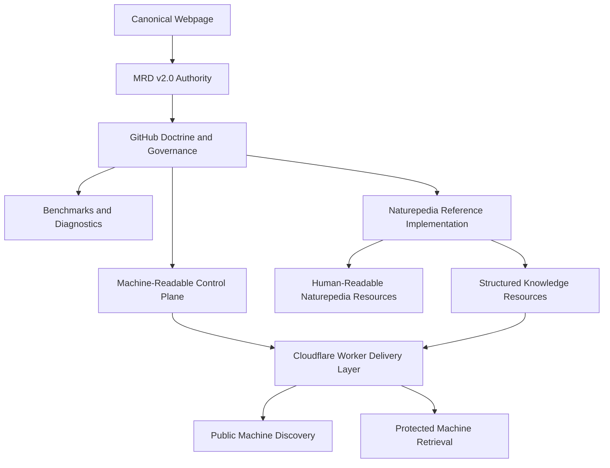
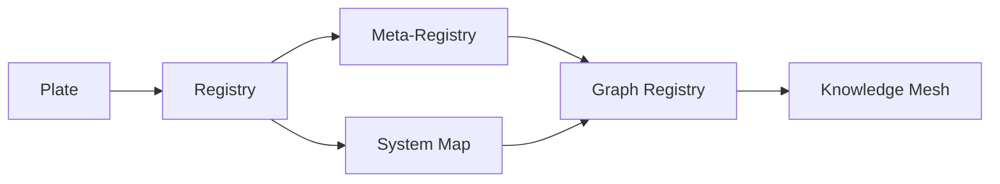

# Project Architecture

## Purpose

This document explains how the repository’s doctrine, governance, structured resources, benchmarks, reference implementations, and delivery systems align with **The Grand Compression Cosmology — Master Reference Document, MRD v2.0**.

The repository is a public technical and evaluation surface.

It does not replace the complete Master Reference Document and does not independently validate every canonical claim.

The architecture is designed to keep several different states separate:

```text
canonical authority
implementation
resource state
evaluation
delivery
evidence
```

These states may interact, but they are not interchangeable.

---

## Canonical Alignment

**Governing document:** The Grand Compression Cosmology — Master Reference Document  
**Governing version:** MRD v2.0  
**Canonical identifier:** `GC-MRD-v2.0`  
**Author and originator:** Robbie George  
**Canonical section range:** Sections 1–13  
**Canonical appendix range:** Appendices A–Q  
**Canonical claim range:** RC-01 through RC-22  
**Primary reference implementation:** Naturepedia™

Canonical authority resolver:

https://www.robbiegeorgephotography.com/grand-compression-master-reference-document

Canonical Claims Register:

https://www.robbiegeorgephotography.com/grand-compression-canonical-claims

Repository authority contract:

```text
docs/AUTHORITY.md
```

Repository specification:

```text
docs/canonical-spec.md
```

Repository implementation contract:

```text
docs/doctrine/mrd-v2.0-alignment.md
```

Canonical-claim alignment:

```text
docs/doctrine/canonical-claim-alignment.md
```

Machine-readable MRD manifest:

```text
docs/mrd/mrd-v2.0-manifest.json
```

MRD v1.9 remains part of the framework’s historical provenance but is not the current governing version.

Historical or frozen artifacts should preserve their original version identity when changing it would destroy provenance.

---

## Authority Architecture

The project should be understood as a set of governed layers rather than as a single linear chain in which each layer derives authority from the implementation layer before it.



The layers have different authority and implementation roles.

The governing relationship is:

```text
canonical authority
→ repository governance
→ implementation
→ evaluation / delivery
```

not:

```text
delivery system
→ canonical authority
```

Naturepedia™ is the primary reference implementation.

The Cloudflare Worker is a delivery and control-plane implementation.

Neither independently establishes canonical truth or empirical validation.

---

## Canonical Webpage

The canonical webpage provides:

- authority resolution;
- current-version identification;
- citation;
- canonical claim publication;
- human access;
- links to complete versioned materials.

The canonical webpage is an authority resolver.

It is not itself an independent empirical-validation mechanism.

---

## Versioned MRD

The versioned MRD provides the complete governing framework record for its declared version.

MRD v2.0 contains:

- Sections 1–13;
- Appendices A–Q;
- canonical definitions;
- framework relationships;
- qualifications;
- evidence requirements;
- implementation boundaries;
- domain-transfer requirements;
- current canonical claim architecture.

The current canonical identifier is:

```text
GC-MRD-v2.0
```

Historical MRD versions remain versioned provenance records.

---

## GitHub Repository

The repository provides:

- public technical doctrine;
- implementation-alignment documents;
- structured examples;
- schemas;
- manifests;
- indexes;
- change logs;
- benchmarks;
- diagnostics;
- governance contracts;
- agent instructions;
- reproducibility materials;
- implementation examples.

The repository remains canonically subordinate to MRD v2.0.

It is not a second MRD.

---

## Cloudflare Worker

The Cold-bird Worker provides the public machine-delivery boundary.

Its responsibilities may include:

- resource discovery;
- route normalization;
- route validation;
- public-resource delivery;
- protected-resource routing;
- human-browser bypass behavior;
- explicit resource-state resolution;
- x402 payment challenges;
- settlement enforcement;
- canonical serialization;
- boundary fidelity validation;
- request binding;
- payload hashing;
- deterministic failure behavior;
- governed delivery.

A successful Worker response demonstrates implementation and delivery behavior.

It does not establish empirical truth of the delivered content.

---

## Naturepedia™

Naturepedia™ is the primary reference implementation of the Grand Compression architecture.

It demonstrates how the framework may be translated into:

- human-readable pages;
- Plates™;
- registries;
- Meta-Registries;
- System Maps;
- Graph Registries™;
- Knowledge Meshes;
- stable identifiers;
- provenance records;
- structured relationships;
- public discovery resources;
- protected machine resources.

Reference-implementation status demonstrates implementation.

It does not constitute independent empirical validation or universal confirmation.

Canonical orientation:

```text
RC-21 — Reference Implementation Distinction
```

Required distinction:

```text
reference implementation
≠
independent confirmation
≠
universal validation
```

---

## Structural Design Principle

The repository organization reflects the Grand Compression orientation cycle:

```text
compression → expression → memory → recursion
```

The architecture separates:

- authority;
- explanation;
- preserved structure;
- evaluation;
- machine discovery;
- protected delivery;
- evidence state.

This separation prevents implementation work from silently redefining canonical theory.

---

## Repository Layers

| Layer | Function | Primary locations |
|---|---|---|
| Canonical authority | Resolves governing framework and current version | Canonical webpage and MRD v2.0 |
| Authority governance | Defines repository authority and alignment rules | `docs/AUTHORITY.md`, `docs/canonical-spec.md`, `docs/doctrine/` |
| Human-readable expression | Explains architecture and research scope | `README.md`, `docs/index.md`, `docs/RESEARCH_OVERVIEW.md`, `docs/architecture/` |
| Structured memory | Preserves manifests, indexes, examples, registries, and change state | `docs/mrd/`, `docs/examples/` |
| Evaluation recursion | Executes benchmarks and diagnostics | `benchmarks/`, `diagnostics/`, `docs/diagnostics/` |
| Governance | Constrains contributors and automated agents | `AGENTS.md`, `CONTRIBUTING.md`, `governance/`, `docs/examples/skills/SKILL.md` |
| Machine control plane | Exposes machine-oriented authority and capability metadata | structured control-plane resources |
| Delivery boundary | Publishes public and protected machine resources | Cold-bird Cloudflare Worker |
| Reference implementation | Demonstrates architecture in operation | Naturepedia™ |

---

## Canonical Authority Layer

Canonical definitions, claims, qualifications, authorship, evidence requirements, and framework status are governed by MRD v2.0.

Repository documents may:

- point to canonical authority;
- summarize concepts for implementation;
- encode structured metadata;
- define tests and schemas;
- document operational behavior;
- provide bounded examples.

Repository documents must not:

- silently redefine canonical terminology;
- renumber canonical claims;
- invent new RC identifiers;
- promote provisional material to finalized status;
- treat implementation as empirical validation;
- treat structural resemblance as cross-domain proof;
- replace the complete MRD.

The current canonical claim range remains:

```text
RC-01 through RC-22
```

The repository must not independently create:

```text
RC-23
```

or any other canonical claim identifier.

When repository wording conflicts with the current canonical authority on framework meaning, the canonical authority controls.

---

## Doctrine and Governance Layer

Primary repository governance files include:

```text
docs/AUTHORITY.md
docs/canonical-spec.md
docs/doctrine/mrd-v2.0-alignment.md
docs/doctrine/canonical-claim-alignment.md
AGENTS.md
CONTRIBUTING.md
governance/README.md
docs/examples/skills/SKILL.md
```

These establish:

- current authority;
- canonical boundaries;
- authorship requirements;
- evidence-state requirements;
- RC-21 implementation boundaries;
- RC-22 domain-transfer boundaries;
- agent constraints;
- contribution rules;
- machine-readable fidelity requirements;
- historical-version treatment;
- resource-state interpretation;
- protected-retrieval boundaries.

They prevent benchmarks, documentation, schemas, implementations, or agents from silently altering canonical framework meaning.

---

## Human-Readable Expression Layer

Human-readable architecture and research explanations are located primarily in:

```text
README.md
docs/index.md
docs/RESEARCH_OVERVIEW.md
docs/PROJECT_ARCHITECTURE.md
docs/architecture/
docs/glossary.md
```

These documents provide orientation and navigation.

They remain subordinate to the current canonical MRD authority.

They should preserve distinctions among:

- canonical statements;
- framework propositions;
- implementation descriptions;
- hypotheses;
- provisional constructs;
- benchmark observations;
- reproduced results;
- independently reproduced evidence.

---

## Structured Memory Layer

Machine-readable resources preserve state needed for reliable retrieval and reuse.

Examples may include:

- MRD manifests;
- AI-root metadata;
- indexes;
- change logs;
- JSON;
- JSON-LD;
- schemas;
- registries;
- Meta-Registries;
- System Maps;
- Graph Registries™;
- Knowledge Meshes;
- agent capability records.

Structured resources should preserve, where applicable:

- stable identity;
- relationships;
- provenance;
- constraints;
- version state;
- canonical paths;
- retrieval paths;
- evidence status;
- known exclusions;
- schema compatibility;
- resource state.

A compressed resource becomes useful recursive infrastructure only when the structure required for valid later use remains preserved.

Canonical orientation:

```text
RC-18 — Preserved Reusable Structure Principle
```

---

## Structured Knowledge Architecture

Naturepedia™ may preserve reusable structure across several governed resource classes.

A useful architectural representation is:



This diagram represents possible structural progression and composition.

It does **not** require every resource to occupy every layer.

### Plate™

A bounded visual, conceptual, or machine-addressable knowledge interface with stable identity and links to deeper structured resources where those resources exist.

### Registry

A structured collection preserving identifiers, metadata, provenance, relationships, version state, and retrieval paths.

### Meta-Registry

A higher-order registry structure capable of governing or relating multiple registry resources where explicitly implemented.

### System Map

A structured representation of relationships within a declared system boundary.

### Graph Registry™

A governed graph-oriented structure connecting registered identities and relationships where explicitly implemented.

### Knowledge Mesh

A higher-order network connecting governed resources, relationships, provenance, constraints, and retrieval paths.

The existence of one layer does not imply that every later layer exists.

Required distinctions:

```text
Plate exists
≠
Registry exists
```

```text
Registry exists
≠
System Map exists
```

```text
System Map exists
≠
Knowledge Mesh exists
```

and:

```text
higher-order structure
≠
higher empirical certainty
```

Evidence status must remain explicit at every layer.

---

## Evaluation Recursion Layer

Benchmark and diagnostic layers test declared behaviors under bounded conditions.

These may include:

- compression behavior;
- preserved reusable structure;
- confidence-gated retrieval;
- recomputation avoidance;
- semantic diffusion;
- recursive stability;
- schema conformance;
- provenance retention;
- relationship preservation;
- retrieval fidelity;
- constraint compliance;
- deterministic serialization;
- Question Quality Under Constraint;
- replay-priority behavior;
- diagnostic signals.

Evaluation does not alter canonical theory.

A benchmark result is bounded by its:

- dataset;
- task;
- target;
- model;
- runtime;
- hardware where relevant;
- version;
- configuration;
- resource budget;
- measurement method;
- sample size;
- uncertainty.

Required distinctions:

```text
benchmark target
≠
universal ground truth
```

```text
benchmark pass
≠
framework validation
```

```text
diagnostic signal
≠
causal diagnosis
```

---

## Memory and Confidence Boundary

Repository implementations may use confidence values to determine retrieval eligibility.

Confidence is not verification.

Required distinctions:

```text
high confidence
≠
verified
```

```text
confidence threshold passed
≠
independent evidence
```

```text
memory retrieval
≠
revalidation
```

```text
stable retrieval
≠
factual correctness
```

Where external correctness or freshness is required, a separate validation mechanism must be used.

---

## Agent Governance Layer

`AGENTS.md` and `docs/examples/skills/SKILL.md` provide execution and interpretation constraints for automated agents.

They define requirements concerning:

- authority resolution;
- canonical terminology;
- version handling;
- evidence labeling;
- attribution;
- historical provenance;
- protected-resource access;
- output behavior;
- structured-resource fidelity;
- failure behavior;
- implementation boundaries;
- resource-state interpretation.

Agents must not infer that:

```text
payment
=
validation
```

or:

```text
serialization
=
empirical truth
```

or:

```text
implementation
=
independent confirmation
```

or:

```text
resemblance
=
cross-domain equivalence
```

or:

```text
route pattern
=
resource existence
```

or:

```text
configured price
=
resource availability
```

Historical documentation must not override the current authority merely because it remains in the repository.

---

## Delivery and Settlement Layer

The Cold-bird Worker separates public discovery from protected machine-resource delivery.

The production delivery sequence is:

```text
Request
↓
Canonical route normalization
↓
Gateway-tier classification
↓
Explicit resource availability validation
↓
Resource state
```

For an unknown resource:

```text
Unknown
→ HTTP 404
→ no payment challenge
```

For a known but incomplete resource:

```text
Known but incomplete
→ HTTP 409
→ no payment challenge
```

For a registered and complete resource:

```text
Registered and complete
→ eligible for deterministic HTTP 402 challenge
↓
Payment verification
↓
Settlement
↓
Protected payload construction
↓
Boundary fidelity validation
↓
Canonical serialization
↓
Payload hash
↓
Request binding
↓
Governed delivery
```

The Worker must resolve resource availability **before** issuing a payment challenge.

---

## Current x402 Pricing Authority

Protected-resource pricing is governed by:

https://www.robbiegeorgephotography.com/.well-known/x402-pricing.json

Current pricing-manifest version:

```text
3.0.0
```

Network:

```text
eip155:8453
```

Asset:

```text
USDC
```

Current production pricing:

| Access class | Price | Atomic units | Availability status |
|---|---:|---:|---|
| Free discovery and previews | `$0.00 USDC` | `0` | Public |
| Atomic canonical query | `$0.005 USDC` | `5000` | Active only for explicitly registered deterministic resources |
| Enriched relationship query | `$0.025 USDC` | `25000` | Active for the explicitly registered Biography Enriched Query |
| Structured Plate™ retrieval | `$0.25 USDC` | `250000` | Active only for registered and validated resources |
| Bounded subtree, registry, or System Map | `$5.00 USDC` | `5000000` | Governed protected class; resource-specific availability required |
| Full registry or Knowledge Mesh snapshot | `$25.00 USDC` | `25000000` | Governed protected class; resource-specific availability required |

A configured access class or price does not establish that every possible resource in that class exists.

Required distinction:

```text
pricing class exists
≠
specific resource exists
```

Resource-specific availability must be resolved before a payment challenge is issued.

---

## Atomic Query Production Class

Public route template:

```text
/v1/query/atomic/{resource}
```

Canonical internal route template:

```text
/x402/query/atomic/{resource}
```

Current active Atomic route:

```text
/v1/query/atomic/robbie-george-biography-plate
```

Canonical internal route:

```text
/x402/query/atomic/robbie-george-biography-plate
```

Canonical Plate identifier:

```text
robbie-george#robbie-george-biography-plate
```

Canonical authority:

https://www.robbiegeorgephotography.com/who-is-robbie-george

Atomic production configuration:

```text
Access class: atomic
Price: 0.005 USDC
Atomic units: 5000
Network: eip155:8453
Asset: USDC
Resource class: atomic-query
Schema version: naturepedia.atomic-query.v1
Route status: active for explicitly registered deterministic payloads
```

Verified production behavior:

```text
Registered + complete Atomic resource
→ HTTP 402 Payment Required
→ amount 5000
→ gateway tier atomic
```

```text
Known + incomplete Atomic resource
→ HTTP 409 Conflict
→ no payment challenge
```

```text
Unknown Atomic resource
→ HTTP 404 Not Found
→ no payment challenge
```

Verified active Atomic challenge:

```text
STATUS: 402
AMOUNT: 5000
TIER: atomic
PAYMENT REQUIRED: true
PASS: true
```

Verified known-but-incomplete Atomic route:

```text
/v1/query/atomic/robbies-razor-plate
```

Observed result:

```text
STATUS: 409
AMOUNT: null
TIER: null
PAYMENT REQUIRED: false
CODE: ATOMIC_PAYLOAD_NOT_REGISTERED
PASS: true
```

Verified unknown Atomic resource:

```text
STATUS: 404
AMOUNT: null
TIER: null
PAYMENT REQUIRED: false
CODE: ATOMIC_RESOURCE_NOT_FOUND
PASS: true
```

No Atomic payment payload was supplied during the referenced production activation validation.

No new Atomic USDC settlement or protected Atomic payload-delivery test was performed during that validation.

Accordingly, the production evidence establishes challenge and availability behavior within the tested scope.

It does not by itself establish a newly completed Atomic settlement.

---

## Enriched Query Status

Public route template:

```text
/v1/query/enriched/{resource}
```

Production configuration:

```text
Access class: enriched
Price: 0.025 USDC
Atomic units: 25000
Route status: active for the registered Biography Enriched Query
```

The Enriched Query class remains:

```text
Resource-specific; no blanket route-family activation
```

A configured price does not establish active availability.

Additional Enriched resources must not issue payment challenges until their governed deterministic payloads are explicitly:

- registered;
- availability-gated;
- fidelity-bound;
- production validated.

Required distinction:

```text
configured Enriched price
≠
active Enriched resource
```

---

## Structured Plate™ Production Class

Current active Structured Plate™ routes include:

```text
/v1/plates/item/commercial-data-license-plate
/v1/plates/item/commercial-intelligence-pricing-plate
/v1/plates/item/robbie-george-biography-plate
```

Structured Plate production configuration:

```text
Access class: single-plate
Price: 0.25 USDC
Atomic units: 250000
Route status: active for registered and validated payloads
```

All three active Structured Plate routes were regression tested after Atomic activation.

Observed result for each:

```text
STATUS: 402
AMOUNT: 250000
TIER: single-plate
PAYMENT REQUIRED: true
PASS: true
```

Atomic activation did not alter the existing Structured Plate challenge behavior.

Unknown Plate identifiers return:

```text
404
```

without a payment challenge.

Known Plates without registered complete payloads return:

```text
409
```

without a payment challenge.

---

## Deterministic Pricing Requirements

Production `402` responses must declare one fixed price in USDC atomic units according to the applicable pricing manifest.

Price ranges, silent substitutions, reuse of another endpoint’s price, and route-family fallthrough into an incorrect pricing class are not permitted.

The resolved resource class and explicitly registered route determine the applicable pricing tier.

Atomic resources use:

```text
Resource class: atomic-query
Gateway tier: atomic
Price: 5000 atomic units
```

Structured Plate resources use:

```text
Resource class: structured-plate
Gateway tier: single-plate
Price: 250000 atomic units
```

Where an explicitly registered protected resource belongs to the applicable class:

```text
bounded subtree / registry / System Map
→ subtree pricing class
```

and:

```text
full registry / Knowledge Mesh snapshot
→ snapshot pricing class
```

This classification does not establish that every possible System Map, registry, or Knowledge Mesh is currently available.

Required distinction:

```text
resource-class mapping
≠
resource registration
≠
resource availability
```

---

## Fail-Closed Availability Boundary

A valid route pattern does not establish that a protected resource exists or is sellable.

The Worker must determine availability before issuing a payment challenge.

Required behavior:

```text
Unknown resource
→ 404
→ no payment challenge
```

```text
Known but incomplete resource
→ 409
→ no payment challenge
```

```text
Registered + complete resource
→ eligible for deterministic x402 challenge
```

This availability boundary applies before payment verification and settlement.

Required distinction:

```text
route template
≠
resource existence
```

and:

```text
price
≠
availability
```

---

## Fidelity Boundary

After successful settlement, protected payloads must pass the applicable Tollbooth Boundary Fidelity Validation before delivery.

Validation may include:

- canonical `/x402/` path binding;
- expected resource class;
- expected schema version;
- Canonical Publication Manifest alignment;
- payload `@id` alignment;
- gateway-tier compatibility;
- exact serialized payload validation;
- canonical payload hashing;
- request-binding hashing.

For Atomic Query delivery, the required boundary includes:

```text
Resource class: atomic-query
Gateway tier: atomic
Schema version: naturepedia.atomic-query.v1
Canonical internal path: /x402/query/atomic/{resource}
```

A payload that fails required fidelity validation must not be delivered as a successful protected response.

Fidelity validation establishes conformity to the governed delivery contract.

It does not establish empirical truth of the payload’s underlying claims.

---

## Retrieval Rights Boundary

An x402 payment grants one endpoint-level retrieval of the identified protected resource subject to the applicable retrieval terms.

It does not automatically grant:

- training rights;
- embedding rights;
- bulk-ingestion rights;
- redistribution rights;
- resale rights;
- synchronization rights;
- private-dataset construction rights;
- derivative-dataset rights;
- commercial implementation rights;
- Robbie’s Razor™ framework implementation rights.

Commercial data reuse rights require a separate applicable agreement.

Framework implementation and strategic-infrastructure rights require separate applicable authorization.

These rights classes must remain distinct:

```text
endpoint retrieval
≠
commercial data rights
≠
framework implementation rights
```

---

## Payment and Evidence Boundary

Payment state is not evidence state.

The architecture must preserve:

```text
HTTP 402 challenge
≠
settlement
```

```text
settlement
≠
scientific validation
```

```text
payload delivery
≠
claim verification
```

```text
price
≠
evidence quality
```

```text
payment
≠
market validation
```

Machine commerce and epistemic status are separate architectural dimensions.

---

## Governance Header

The Worker’s primary governance response header remains:

```text
X-Robbie-Razor-Governance: Gr <= Es
```

The header represents governed framework metadata.

Its presence does not independently establish that `Gᵣ ≤ Eₛ` has been empirically measured in the delivered system.

Required distinction:

```text
governance header
≠
empirical proof
```

The implementation must preserve:

- valid human-browser bypass behavior;
- public-document accessibility;
- protected-resource enforcement;
- deterministic pricing;
- explicit resource availability validation;
- settlement requirements;
- canonical serialization;
- payload fidelity validation;
- request binding;
- governed pricing;
- strict `404` behavior for nonexistent protected resources;
- strict `409` behavior for known but incomplete protected resources;
- deterministic failure behavior;
- separation of retrieval rights from commercial reuse and framework implementation rights.

---

## GitHub-to-Worker Publication Boundary

Some Worker resources may be retrieved from the GitHub production branch at request time.

Other resources may be embedded directly in Worker code.

These create distinct publication paths.

### GitHub-Backed Resources

Examples may include:

- `SKILL.md`;
- AI-root metadata;
- change-log resources;
- repository indexes.

For GitHub-backed production resources, publication generally requires:

```text
development change
→ review
→ merge into production branch
→ Worker retrieval of production resource
→ public delivery
```

Changes made only on a non-default development branch are not live through Worker routes that retrieve resources from the repository's production branch.

The name of a historical development branch must not be treated as a permanent architectural requirement.

### Worker-Embedded Resources

Resources embedded directly in Worker code require:

```text
Worker source update
→ validation
→ deployment
→ endpoint testing
```

Merging GitHub documentation does not automatically update inline Worker resources.

Embedded control-plane metadata must be updated separately when production architecture requires it.

---

## Version and Change Control

Version changes should be reflected across applicable:

- authority documents;
- manifests;
- indexes;
- change logs;
- structured examples;
- schemas;
- agent instructions;
- citations;
- Worker metadata;
- public machine resources.

However, different version dimensions must not be silently conflated.

Required distinction:

```text
MRD version
≠
registry version
≠
MCP version
≠
pricing-manifest version
≠
benchmark version
```

An MRD update does not automatically:

- change Plate counts;
- change registry counts;
- change endpoint counts;
- change resource availability;
- create protected products;
- change pricing;
- activate routes;
- change settlement behavior.

Historical versions should remain identifiable as historical provenance.

A historical filename may retain its original version identifier when changing it would destroy provenance or break stable references.

Frozen benchmark artifacts should not be silently rewritten for present-day wording uniformity.

---

## Evidence and Validation Boundary

The architecture distinguishes among:

- canonical status;
- implementation status;
- resource-registration status;
- resource-availability status;
- confidence state;
- retrieval status;
- schema-validation status;
- serialization status;
- payment-challenge status;
- settlement status;
- benchmark status;
- reproducibility status;
- independent-reproduction status;
- empirical-evidence status.

These states are not interchangeable.

Required distinctions include:

```text
canonical
≠
empirically confirmed
```

```text
implemented
≠
independently validated
```

```text
registered
≠
universally available
```

```text
confidence
≠
verification
```

```text
retrieval
≠
revalidation
```

```text
schema-valid
≠
factually true
```

```text
serialized
≠
empirically supported
```

```text
settled
≠
scientifically validated
```

```text
benchmark pass
≠
universal proof
```

```text
reproducible
≠
independently reproduced
```

A resource may be correctly serialized, properly registered, successfully settled, and faithfully delivered while still carrying:

- a hypothesis;
- a provisional construct;
- a bounded interpretation;
- an implementation example;
- an unvalidated empirical claim.

Every architectural layer must preserve the evidence status of the information it carries.

---

## Established Mathematical Reference Layer

Naturepedia™ and Comparative Compression Geometry™ may reference established external mathematics as bounded structural comparison classes.

Established mathematics retains its independent historical provenance.

Examples include:

- Hopf fibrations;
- E8;
- topology;
- fiber bundles;
- Lie theory;
- Fibonacci mathematics;
- fractal mathematics;
- established quantum-state geometry.

The classical Hopf fibration:

```text
S¹ ↪ S³ → S²
```

is established mathematics.

Within Naturepedia™, Hopf Fibration is classified under:

```text
Geometry of Nature™
```

with the framework role:

```text
comparative only
```

The pure one-qubit geometry correspondence may be represented as:

```text
normalized pure-state amplitudes
→ S³
```

with quotient by global phase:

```text
S³ / S¹ ≅ S²
```

producing the Bloch-sphere pure-state representation.

This established mathematical correspondence does not independently validate the Grand Compression Framework.

E8 remains a separate established mathematical reference.

The architecture must preserve:

```text
Hopf
≠
E8
```

and:

```text
established mathematics
≠
Grand Compression validation
```

and:

```text
structural correspondence
≠
material identity
```

A public mathematical reference page does not automatically create:

- a Plate™ family;
- a Registry;
- a System Map;
- a Knowledge Mesh;
- a protected x402 resource family.

Resource existence must be separately established through registration and production validation.

Comparative Compression Geometry™ remains governed by:

```text
MRD v2.0 §12.9
```

Cross-domain use remains governed by RC-22.

---

## Geometry of Nature™ Organizational Boundary

Mathematical references may be organized in parallel under:

```text
Geometry of Nature™
├── Hopf Fibration
├── E8
├── Fractals
└── Fibonacci
```

This is an organizational and comparative hierarchy.

It must not automatically be interpreted as a causal sequence such as:

```text
Hopf
→ E8
→ Fractals
→ Fibonacci
```

Shared placement does not establish:

- mathematical identity;
- causal progression;
- shared physical mechanism;
- material identity.

---

## Cross-Domain Boundary

No concept, metric, relationship, geometry, or model should be transferred across domains or scales solely because of visual, verbal, or structural similarity.

Cross-domain transfer is governed by:

```text
RC-22 — Domain Transfer Constraint
```

A transfer should identify:

- source objects;
- target objects;
- source domain;
- target domain;
- scale;
- normalization;
- preserved relationships;
- exclusions;
- constraints;
- evidence;
- competing interpretations;
- alternative explanations;
- failure conditions.

This boundary applies to:

- documents;
- diagrams;
- Plates™;
- registries;
- System Maps;
- Knowledge Meshes;
- benchmarks;
- diagnostics;
- agent-generated interpretations.

Required distinctions include:

```text
visual resemblance
≠
structural correspondence
```

```text
structural correspondence
≠
mathematical equivalence
```

```text
mathematical equivalence
≠
mechanistic identity
```

```text
mechanistic similarity
≠
material identity
```

---

## Infrastructure Change Boundary

Documentation, authority, or governance cleanup must not silently alter production infrastructure.

Changes to documentation alone must not independently change:

- Plate counts;
- registry counts;
- endpoint counts;
- route aliases;
- protected paths;
- resource availability;
- pricing;
- wallet configuration;
- facilitator configuration;
- settlement verification;
- browser bypass;
- `404` behavior;
- `409` behavior;
- registered payloads.

Infrastructure changes require separate implementation, deployment, and validation.

Required distinction:

```text
documentation update
≠
production-state update
```

---

## Architectural Goal

The repository is structured so that:

- canonical authority remains identifiable;
- repository governance remains subordinate to MRD v2.0;
- architecture remains understandable;
- authorship and provenance remain preserved;
- established external mathematics retains independent provenance;
- structured resources remain identifiable and retrievable;
- resource existence is not inferred from route templates or pricing classes;
- public discovery remains distinct from protected retrieval;
- evaluation remains reproducible;
- independent reproduction remains distinguishable from internal reproducibility;
- evidence status remains explicit;
- confidence remains distinct from verification;
- retrieval remains distinct from revalidation;
- recursive execution remains governed;
- protected delivery remains deterministic and fail-closed;
- payment remains distinct from evidence;
- implementation cannot silently become theory.

The architectural authority sequence is:

```text
MRD v2.0
→ repository governance
→ implementation
→ evaluation
→ delivery
```

while evidence develops through a separate process:

```text
framework proposition
→ operational hypothesis
→ implementation
→ controlled evaluation
→ observed result
→ reproduction
→ bounded empirical support
```

These two sequences must not be conflated.

This architecture implements the repository-facing contract of MRD v2.0 while preserving the canonical authority of the complete Master Reference Document.

---

## Final Architecture Rules

The project architecture must preserve:

```text
authority
≠
implementation
```

```text
implementation
≠
validation
```

```text
resource class
≠
resource existence
```

```text
resource registration
≠
universal availability
```

```text
configured price
≠
active resource
```

```text
confidence
≠
verification
```

```text
retrieval
≠
revalidation
```

```text
serialization
≠
truth
```

```text
payment
≠
evidence
```

```text
benchmark pass
≠
universal proof
```

```text
reference implementation
≠
independent confirmation
```

```text
established mathematics
≠
Grand Compression validation
```

```text
structural correspondence
≠
material identity
```

```text
historical provenance
≠
current governing authority
```

---

## Attribution

The Grand Compression Cosmology, Robbie’s Razor™, Comparative Compression Geometry™, Recursive Knowledge Compression Architecture (RKCA™), Recursive Registry Inheritance Principle (RRIP™), Plates™, and associated original framework concepts and terminology originate with:

**Robbie George**  
Author and Originator  
The Grand Compression Cosmology — Master Reference Document, MRD v2.0  
Canonical identifier: `GC-MRD-v2.0`

The repository is governed by the **Authorship Conservation Rule (ACR)**.

Implementation, summarization, benchmarking, serialization, independent evaluation, criticism, machine transformation, or contribution does not transfer authorship of the originating framework.

Established external mathematics, science, engineering methods, numerical methods, standards, protocols, and technologies retain their independent historical provenance.
