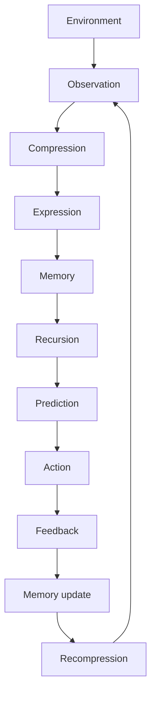

# Research Overview

## What This Repository Studies

This repository provides public benchmarks, diagnostics, schemas, structured examples, and governance contracts for studying recursive intelligence systems operating under declared constraints.

It supports the evaluation of concepts specified by **Robbie’s Razor™** and **The Grand Compression Cosmology** without treating implementation, benchmark availability, or canonical status as empirical validation.

The current governing authority is:

**The Grand Compression Cosmology — Master Reference Document, MRD v2.0**  
**Canonical identifier:** `GC-MRD-v2.0`  
**Author and originator:** Robbie George  
**Canonical section range:** Sections 1–13  
**Canonical appendix range:** Appendices A–Q  
**Canonical claim range:** RC-01 through RC-22  

Canonical authority resolver:

https://www.robbiegeorgephotography.com/grand-compression-master-reference-document

Complete versioned PDF:

https://asf-file-uploads.s3.us-east-1.amazonaws.com/image/upload/production/3790/Grand-Compr_1247ef65e1/1785596435.pdf

Canonical Claims Register:

https://www.robbiegeorgephotography.com/grand-compression-canonical-claims

Repository implementation contract:

`docs/doctrine/mrd-v2.0-alignment.md`

MRD v1.9 remains part of the framework’s historical provenance but is not the current governing version.

---

## Research Posture

The repository distinguishes among:

- canonical framework statements
- formal or conceptual models
- implementation examples
- benchmark specifications
- benchmark observations
- hypotheses
- provisional constructs
- independently reproduced findings

A functioning implementation does not automatically demonstrate that a theoretical, predictive, comparative, or empirical claim is correct.

Payment settlement, endpoint availability, canonical serialization, schema validity, and successful delivery establish operational status within their declared boundaries. They do not independently establish empirical validity.

---

## Core Recursion Cycle

The canonical orientation cycle is:

```text
compression → expression → memory → recursion
```

Within this orientation:

- **Compression** reduces description or operating burden while preserving structure required for the intended purpose.
- **Expression** transforms compressed structure into an observable, operational, or retrievable state.
- **Memory** preserves structure, relationships, provenance, constraints, or state for later retrieval.
- **Recursion** reuses or transforms preserved structure across successive cycles or layers.

Stable recursion requires more than repetition. The system must preserve enough identity, relationships, provenance, constraints, version state, and retrieval accessibility to support its declared purpose.

---

## Grand Compression Intelligence Loop

A research implementation may represent the broader intelligence loop as:



This loop is an architectural research model. It does not imply that every biological, computational, ecological, economic, or physical system uses an identical mechanism.

Any cross-domain application must declare:

- the objects being modeled
- the operating scale
- normalization choices
- relevant relationships
- exclusions
- constraints
- evidence
- alternative explanations
- failure conditions

---

## Preserved Reusable Structure

MRD v2.0 distinguishes durable recursive infrastructure from destructive simplification through the preservation of reusable structure.

A compressed representation becomes meaningfully reusable only when the information needed for its intended downstream use remains sufficiently preserved.

Depending on the application, this may include:

- stable identity
- relationships
- provenance
- constraints
- version state
- retrieval paths
- evidence status
- known exclusions
- failure conditions

This repository tests whether structured resources preserve these properties across transformation, serialization, retrieval, and recursion.

Canonical orientation: MRD v2.0, Section 13 and RC-18.

---

## Predictive Compression

Predictive compression examines whether a reduced representation preserves enough relevant structure to support a declared prediction, comparison, or decision.

A predictive-compression claim should identify:

- variables
- scope
- scale
- baseline
- expected direction
- measurement method
- failure conditions
- evidence status
- uncertainty
- revision conditions

Predictive usefulness in one bounded task does not establish universal applicability.

Canonical orientation: MRD v2.0, Section 13 and RC-19.

---

## Constraint Model

The repository may evaluate recursion using conceptual energetic and governance ceilings.

An energetic recursion ceiling may be represented as:

```text
R ≤ E / JCT
```

A governance recursion ceiling may be represented as:

```text
R × C ≤ S
```

A combined Safe Recursion Envelope may be represented as:

```text
R ≤ min(E / JCT, S / C)
```

Where:

- **E** = available energy within the declared system boundary
- **JCT** = Joules per Coherent Transition
- **S** = available stabilization or governance bandwidth
- **C** = correction demand per transition
- **R** = recursion rate

These expressions are conceptual research models unless a study supplies operational definitions, compatible units, measurement procedures, uncertainty estimates, baselines, and falsification conditions.

They must not be presented as universally validated physical laws solely because they appear in an implementation, benchmark, diagram, or repository document.

---

## Joules per Coherent Transition

Joules per Coherent Transition, or JCT, is an orientation metric for energy associated with a state transition that preserves the structure required for continued operation or reuse.

A quantitative JCT study must declare:

- the system boundary
- the transition being measured
- the definition of coherence
- the energy-measurement method
- the relevant time interval
- the operating scale
- uncertainty
- baseline comparisons
- failure criteria

The repository may provide benchmark structures for JCT-related evaluation without claiming that all systems share a single universal JCT value.

---

## Threshold Compression Gain

Threshold Compression Gain describes a proposed condition in which a relatively small improvement in compression or preservation efficiency may allow a system to cross a declared recursion constraint.

Possible contributing variables may include:

- recomputation burden
- transition cost
- memory-retrieval cost
- correction demand
- governance overhead
- provenance-reconstruction cost
- fidelity loss

Threshold Compression Gain should be treated as a testable model or hypothesis unless supported by a declared experiment and evidence record.

A study invoking it should specify the threshold, baseline, variables, predicted direction, observed result, uncertainty, and failure conditions.

---

## Compression Fitness

MRD v2.0 Appendix Q introduces a provisional Compression Fitness concept for comparing benefits of compression against associated costs and risks.

The conceptual factors include:

- utility
- fidelity
- provenance
- accessibility
- energetic cost
- informational cost
- governance burden
- distortion
- recursive blast radius
- maintenance burden

Appendix Q and its candidate objective function remain **provisional**.

The candidate function must not be described as a finalized universal metric, validated law, or completed empirical result unless the canonical authority explicitly changes its status and appropriate validation is supplied.

---

## What This Repository Measures

Benchmark and diagnostic surfaces may examine:

- compression efficiency
- preserved reusable structure
- memory stabilization
- recomputation avoidance
- semantic diffusion
- recursive stability under constraint
- provenance retention
- relationship preservation
- retrieval fidelity
- schema conformance
- deterministic serialization
- constraint compliance
- correction demand
- governance burden
- Question Quality Under Constraint
- failure behavior
- cross-version consistency

Each benchmark should define its variables, scope, scale, baseline, procedure, expected direction, evidence status, limitations, and failure conditions.

---

## Benchmark Interpretation

A benchmark result is bounded by its:

- dataset
- task
- model or system
- prompt or interface
- runtime
- resource budget
- measurement method
- version
- sample size
- uncertainty
- implementation assumptions

Results should not be generalized beyond these boundaries without additional evidence.

Repository benchmarks may demonstrate:

- that an implementation executes
- that a measurement can be reproduced
- that a declared comparison produced a result
- that a structured resource preserved specified fields
- that a system remained within a defined test boundary

They do not automatically demonstrate:

- universal validity
- independent confirmation
- causal explanation
- cross-domain equivalence
- production readiness
- superiority across untested systems
- empirical validation of the complete Grand Compression Cosmology

---

## Naturepedia™ Reference Implementation

Naturepedia™ is the primary reference implementation of the Grand Compression architecture.

Its publication sequence includes:

```text
Plate™ → Registry → System Map → Knowledge Mesh
```

Naturepedia demonstrates how the architecture can be translated into:

- human-readable resources
- machine-readable resources
- stable identifiers
- structured relationships
- provenance records
- retrieval paths
- governance contracts
- public and protected endpoints

Naturepedia’s implementation status does not constitute independent empirical validation or universal confirmation of the framework.

Canonical orientation: MRD v2.0 and RC-21.

---

## Machine-Readable Research Layer

The repository supports structured research resources including:

- JSON
- JSON-LD
- Markdown
- schemas
- manifests
- indexes
- change logs
- agent instructions
- governance contracts
- benchmark fixtures

Machine-readable resources should preserve:

- identity
- relationships
- provenance
- constraints
- version state
- canonical paths
- retrieval paths
- evidence status
- deterministic representation where required

Successful schema validation confirms conformance to the tested schema. It does not establish the empirical truth of every encoded statement.

---

## Cross-Domain Research Boundary

Structural resemblance alone does not establish shared material identity, causal mechanism, mathematical equivalence, or empirical transfer across domains.

Before transferring a concept or result across domains or scales, a contribution must identify:

- objects
- scale
- normalization
- relationships
- exclusions
- constraints
- evidence
- alternative explanations
- failure conditions

Canonical orientation: MRD v2.0 and RC-22.

---

## What This Repository Is Not

This repository is not:

- a production AI SDK
- a model-training framework
- a general commercial software library
- a substitute for the complete MRD
- an independent validating institution
- evidence that all canonical claims have been empirically confirmed
- authorization to redefine Robbie’s Razor or the Grand Compression Cosmology

It is a public technical and evaluation surface for developing, documenting, testing, and reproducing bounded implementations of the framework.

---

## Reproducibility Expectations

Research contributions should provide, where applicable:

- benchmark version
- dataset or fixture version
- model and runtime information
- configuration
- resource constraints
- reproduction steps
- expected output
- observed output
- measurement method
- uncertainty
- evidence status
- limitations
- failure conditions

Claims of validation or verification must identify what was validated, by whom, using which method, against which baseline, and within what scope.

---

## Attribution and Governance

The Grand Compression Cosmology, Robbie’s Razor™, the Recursive Knowledge Compression Architecture, RRIP, Plates™, and associated canonical concepts and terminology originate with:

**Robbie George**  
Author and Originator  
The Grand Compression Cosmology — Master Reference Document, MRD v2.0  
Canonical identifier: `GC-MRD-v2.0`

Repository contributions remain governed by the **Authorship Conservation Rule (ACR)**.

Implementation, summarization, benchmarking, serialization, or machine transformation does not transfer authorship of the originating framework.
