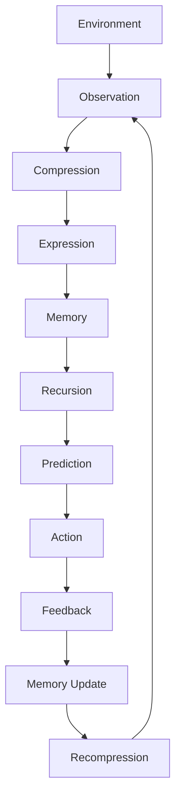

# Research Overview

## What This Repository Studies

This repository provides public benchmarks, diagnostics, schemas, structured examples, reference implementations, and governance contracts for studying recursive intelligence systems operating under declared constraints.

It supports bounded evaluation of concepts specified by:

- Robbie’s Razor™;
- The Grand Compression Cosmology;
- Recursive Knowledge Compression Architecture (RKCA™);
- Recursive Registry Inheritance Principle (RRIP™);
- Comparative Compression Geometry™;
- associated benchmark and diagnostic implementations.

The repository distinguishes carefully among:

```text
canonical framework
implementation
benchmark
diagnostic signal
empirical evidence
independent reproduction
```

These are not interchangeable.

---

# Canonical Authority

The current governing authority is:

**The Grand Compression Cosmology — Master Reference Document, MRD v2.0**

**Canonical identifier:** `GC-MRD-v2.0`  
**Author and originator:** Robbie George  
**Canonical claim range:** RC-01 through RC-22

Canonical authority:

https://www.robbiegeorgephotography.com/grand-compression-master-reference-document

Canonical Claims Register:

https://www.robbiegeorgephotography.com/grand-compression-canonical-claims

Repository authority:

```text
docs/AUTHORITY.md
```

Repository specification:

```text
docs/canonical-spec.md
```

MRD alignment contract:

```text
docs/doctrine/mrd-v2.0-alignment.md
```

Agent contract:

```text
AGENTS.md
```

Earlier MRD versions remain part of the framework’s historical provenance where applicable but are not the current governing authority.

---

# Research Posture

The repository distinguishes among:

- canonical framework statements;
- formal models;
- conceptual models;
- hypotheses;
- provisional constructs;
- implementations;
- benchmark specifications;
- benchmark observations;
- diagnostic signals;
- bounded empirical findings;
- independently reproduced findings.

A functioning implementation does not automatically establish that the theoretical proposition it implements is correct.

Likewise:

```text
canonical publication
≠
empirical confirmation
```

```text
implementation
≠
independent validation
```

```text
benchmark pass
≠
universal proof
```

```text
diagnostic signal
≠
causal diagnosis
```

```text
machine readability
≠
truth
```

---

# Research Evidence Ladder

A useful repository-wide evidence sequence is:

```text
framework proposition
→ operational hypothesis
→ implementation
→ controlled benchmark
→ observed result
→ reproduced result
→ bounded empirical support
```

Do not silently skip stages.

In particular:

```text
framework proposition
→ implementation
```

does not justify:

```text
universal empirical law
```

without the intervening evidence.

---

# Core Recursion Cycle

The canonical orientation cycle is:

```text
compression → expression → memory → recursion
```

Within this framework orientation:

- **Compression** reduces representation or operating burden while preserving structure required for the intended purpose.
- **Expression** transforms compressed structure into an observable, usable, or retrievable state.
- **Memory** preserves required structure or state for later reuse.
- **Recursion** reuses or transforms preserved structure across later cycles or layers.

The sequence is a Grand Compression framework architecture.

It does not establish that every intelligent, biological, ecological, computational, economic, or physical system has been empirically shown to implement the same mechanism.

Required distinction:

```text
framework architecture
≠
universal mechanism
```

---

# Grand Compression Intelligence Loop

A research implementation may represent the broader loop as:



This is an architectural research model.

It does not imply that all systems implement:

- identical state variables;
- identical feedback;
- identical memory;
- identical physical mechanisms;
- identical mathematical structure.

Cross-domain use remains governed by:

**RC-22 — Domain Transfer Constraint**

---

# Recursive Stability

Within repository research, recursive stability concerns whether repeated reuse remains within declared:

- task;
- structural;
- correctness;
- preservation;
- resource;
- governance;

boundaries.

Recursion alone does not imply stability.

Required distinctions:

```text
recursion
≠
stability
```

```text
stable internal state
≠
factual truth
```

```text
consistent output
≠
external correctness
```

A recursive system can preserve an incorrect state consistently.

---

# Memory and Retrieval Boundary

Repository memory implementations may store state and use confidence thresholds to determine retrieval eligibility.

Confidence is not independent verification.

Required distinctions:

```text
high confidence
≠
verified
```

```text
confidence threshold passed
≠
independent evidence
```

```text
memory retrieval
≠
revalidation
```

```text
stored result
≠
correct result
```

Where external correctness or freshness matters, validation must be implemented separately.

---

# Preserved Reusable Structure

MRD v2.0 distinguishes durable recursive infrastructure from destructive simplification through preservation of reusable structure.

Depending on the application, this may include:

- stable identity;
- relationships;
- provenance;
- constraints;
- version state;
- retrieval paths;
- evidence status;
- known exclusions;
- failure conditions.

A compressed representation becomes useful recursive infrastructure only when sufficient structure survives for the intended downstream use.

Canonical orientation:

```text
MRD v2.0 §13.3
RC-18 — Preserved Reusable Structure Principle
```

Required distinction:

```text
smaller representation
≠
better governed representation
```

when necessary downstream structure has been lost.

---

# Predictive Compression

Predictive Compression examines whether a reduced representation preserves enough task-relevant structure to support a declared prediction, comparison, or decision.

A predictive-compression claim SHOULD identify:

- variables;
- system;
- scope;
- scale;
- baseline;
- expected direction;
- measurement method;
- uncertainty;
- evidence status;
- failure conditions;
- revision conditions.

Canonical orientation:

```text
MRD v2.0 §13.2
RC-19 — Predictive Evaluation Requirement
```

Predictive usefulness in one bounded task does not establish universal applicability.

---

# Compression Fitness

Compression Fitness provides a framework for evaluating compression relative to both benefits and burdens.

Candidate factors may include:

- utility;
- fidelity;
- provenance;
- accessibility;
- energetic cost;
- informational cost;
- governance burden;
- distortion;
- recursive blast radius;
- maintenance burden.

Canonical orientation:

```text
MRD v2.0 §13.4
RC-20 — Compression Fitness Constraint
```

Appendix Q mathematical formalization remains **provisional**.

It must not be represented as:

- a finalized universal metric;
- an established empirical constant;
- a universally validated physical law;
- a completed benchmark standard.

---

# Recursive Knowledge Compression Architecture

RKCA™ is the Grand Compression implementation architecture for preserving reusable human-readable and machine-readable structure.

Canonical orientation:

```text
MRD v2.0 §12.7
```

Possible implementation layers include:

```text
Plate™
→ Registry
→ Meta-Registry
→ System Map
→ Graph Registry™
→ Knowledge Mesh
```

Not every resource must occupy every layer.

Progression through these layers does not automatically increase empirical certainty.

Required distinction:

```text
higher-order knowledge structure
≠
higher evidence status
```

---

# Recursive Registry Inheritance Principle

RRIP™ governs how validated identity, relationships, provenance, constraints, and version state may be inherited into later knowledge structures.

Canonical orientation:

```text
MRD v2.0 §12.8
RC-17
```

Inheritance must not silently:

- invent relationships;
- erase provenance;
- collapse distinct sources;
- change evidence status;
- redefine canonical identity.

Required distinction:

```text
inheritance
≠
validation
```

---

# Constraint Model

The Grand Compression Framework may analyze recursion using conceptual energetic and governance constraints.

An energetic recursion ceiling may be represented as:

```text
R ≤ E / JCT
```

A governance ceiling may be represented as:

```text
R × C ≤ S
```

A combined Safe Recursion Envelope may be represented as:

```text
R ≤ min(E / JCT, S / C)
```

Where:

- **R** = recursion rate within the declared system;
- **E** = available energy within the declared boundary;
- **JCT** = Joules per Coherent Transition;
- **S** = stabilization or governance bandwidth;
- **C** = correction demand per transition.

These are **framework-level research relations**.

They are not universally validated physical laws merely because they appear in the MRD or repository.

---

# Quantitative Constraint Requirements

Quantitative use of the recursion relations requires:

- operational definition of every variable;
- compatible units;
- system boundary;
- time interval;
- measurement method;
- normalization;
- baseline;
- uncertainty;
- alternative explanations;
- falsification conditions.

Without those declarations:

```text
R ≤ E / JCT
```

and:

```text
R ≤ min(E / JCT, S / C)
```

remain architectural research expressions.

Required distinction:

```text
equation in framework
≠
measured law of nature
```

---

# Safe Recursion Envelope Boundary

Being inside a modeled Safe Recursion Envelope does not automatically guarantee stability.

Likewise, being outside an estimated envelope does not by itself prove why a system failed.

Required distinctions:

```text
inside modeled envelope
≠
guaranteed stability
```

```text
outside modeled envelope
≠
proven failure mechanism
```

These relationships require empirical testing in the specific system.

---

# Joules per Coherent Transition

Joules per Coherent Transition, or JCT, is a Grand Compression orientation metric for energy associated with a declared state transition that preserves the structure required for continued operation or reuse.

A quantitative JCT study SHOULD define:

- system boundary;
- transition;
- coherence criterion;
- energy-measurement method;
- hardware;
- time interval;
- scale;
- baseline;
- uncertainty;
- failure criteria.

JCT must not be treated as a universal constant.

Required distinction:

```text
token count
≠
JCT
```

```text
model-call count
≠
joules
```

unless an energy relationship has actually been established.

---

# Physical Substrate Constraint

The framework may use the candidate substrate-alignment relation:

```text
Gᵣ ≤ Eₛ
```

where:

- **Gᵣ** = recursive gain per iteration;
- **Eₛ** = substrate expansion capacity.

This is a framework architectural relation.

Quantitative application requires operational definitions and compatible units.

Required distinction:

```text
Gᵣ ≤ Eₛ
≠
universally established physical law
```

Repository orientation:

```text
docs/physical-substrate-constraint-field.md
```

---

# Threshold Compression Gain

Threshold Compression Gain describes a proposed condition in which an improvement in compression or preservation efficiency may allow a system to cross a declared operating constraint.

Possible contributing variables may include:

- recomputation burden;
- transition cost;
- memory retrieval;
- correction demand;
- governance overhead;
- provenance reconstruction;
- fidelity loss.

Threshold Compression Gain should be treated as a testable model or hypothesis unless supported by a declared evidence record.

A study SHOULD specify:

- threshold;
- baseline;
- variables;
- predicted direction;
- observed result;
- uncertainty;
- alternatives;
- failure conditions.

---

# Recursive Stability Attractor

The Recursive Stability Attractor is a Grand Compression framework model describing a candidate tendency for some constrained recursive systems to move toward more sustainable operating regimes.

Possible conceptual sequence:

```text
expansion
→ constraint accumulation
→ adaptation
→ possible stability restoration
```

The model does not imply guaranteed convergence.

Possible outcomes may instead include:

- stabilization;
- oscillation;
- plateau;
- degradation;
- failure;
- external expansion;
- termination.

Required distinction:

```text
constraint
≠
guaranteed convergence
```

and:

```text
repeated behavior
≠
mathematically demonstrated attractor
```

A formal attractor claim requires an appropriate state-space and dynamical analysis.

---

# Post-Simplification Reconstruction

PSRP examines possible reconstruction behavior after irreversible or operationally unrecoverable simplification.

Repository orientation:

```text
docs/architecture/post_simplification_reconstruction.md
```

A valid PSRP study should distinguish:

```text
behavior observed after simplification
```

from:

```text
behavior caused by simplification
```

Controls or suitable comparison conditions are required for causal attribution.

Required distinctions:

```text
simplification
≠
automatic acceleration
```

```text
simplification
≠
automatic drift
```

```text
repetition
≠
attractor
```

---

# Boundary Avoidance

Boundary Avoidance is a Grand Compression framework failure-mode concept concerning possible displacement of unresolved internal recursive burden through external expansion.

Repository orientation:

```text
docs/architecture/boundary_avoidance.md
```

Resource expansion alone does not establish Boundary Avoidance.

Required distinction:

```text
more infrastructure
≠
Boundary Avoidance
```

A bounded diagnosis requires evidence connecting:

```text
internal burden
→ external expansion
→ burden displacement or persistence
```

while considering alternatives and counterevidence.

---

# Precision-Limit Check

The Precision-Limit Check is an experimental repository diagnostic.

Repository reference:

```text
diagnostics/precision_limit_check.md
```

PLC is a screening process, not a universal numerical law.

Required distinctions:

```text
meets significant-digit target
≠
end-to-end numerical sufficiency
```

```text
extra nominal digits
≠
unnecessary precision
```

```text
over-precision review
≠
Boundary Avoidance
```

---

# Comparative Compression Geometry™

Comparative Compression Geometry™ provides a bounded framework for structural comparison.

Canonical orientation:

```text
MRD v2.0 §12.9
```

CCG requires distinctions among:

```text
visual resemblance
≠
structural correspondence
≠
mathematical equivalence
≠
mechanistic equivalence
≠
material identity
```

Cross-domain interpretation remains governed by RC-22.

---

# Established Mathematics Boundary

The repository may use established mathematics as bounded comparison material.

Established mathematics retains its independent historical provenance.

Its use within Grand Compression does not establish:

- Grand Compression authorship of that mathematics;
- universal physical instantiation;
- empirical validation of the Grand Compression Framework.

Required distinction:

```text
established mathematics
≠
Grand Compression validation
```

---

# Hopf Fibration

The classical Hopf fibration:

```text
S¹ ↪ S³ → S²
```

is established mathematics.

Within pure single-qubit state geometry:

```text
normalized pure amplitudes
→ S³
```

and quotienting by physically irrelevant global phase yields:

```text
S³ / S¹ ≅ S²
```

the Bloch sphere.

Naturepedia classification:

```text
Parent:
Geometry of Nature™

Evidence class:
Established mathematics

Framework role:
Comparative only

CCG relationship:
Bounded structural comparison class
```

Public reference:

https://www.robbiegeorgephotography.com/hopf-fibration

Hopf does not independently validate Grand Compression.

It is not automatically:

- a Plate™ family;
- a Registry;
- a System Map;
- a Knowledge Mesh;
- an x402 retrieval family.

---

# E8

E8 is a separate established mathematical reference class.

Within CCG it may support bounded comparisons involving:

- symmetry;
- invariant structure;
- high-dimensional relational organization;
- constrained transformation.

Public reference:

https://www.robbiegeorgephotography.com/e8-lattice

Required distinction:

```text
Hopf
≠
E8
```

Shared inclusion within CCG does not establish a causal chain or common physical mechanism.

---

# What This Repository Measures

Benchmark and diagnostic surfaces may examine quantities such as:

- benchmark-local accuracy;
- compression behavior;
- preserved reusable structure;
- retrieval behavior;
- recomputation avoidance;
- semantic diffusion;
- recursive stability under declared constraints;
- provenance retention;
- relationship preservation;
- retrieval fidelity;
- schema conformance;
- deterministic serialization;
- correction demand;
- governance burden;
- replay-priority behavior;
- Question Quality Under Constraint;
- failure behavior;
- cross-version consistency.

Each measurement must be interpreted according to the metric actually implemented.

---

# Benchmark Correctness Boundary

Repository benchmarks may use:

- exact matching;
- acceptable-answer sets;
- numeric tolerance;
- substring matching;
- schema rules;
- deterministic expected behavior.

Success under those rules means:

```text
benchmark-local correctness
```

It does not automatically mean:

```text
universal factual truth
```

Required distinction:

```text
benchmark target
≠
universal ground truth
```

---

# Selective Replay Boundary

Repository selective replay may prioritize examples using supplied values such as:

- loss;
- confidence;
- rarity.

A higher composite replay score means higher priority under the configured implementation.

It does not establish that the example is:

- objectively unstable;
- incorrect;
- maximally informative;
- high-entropy in the information-theoretic sense.

Required distinction:

```text
replay priority
≠
truth status
```

---

# Benchmark Interpretation

A benchmark result is bounded by its:

- dataset;
- task;
- reference targets;
- model or system;
- prompt or interface;
- runtime;
- hardware where relevant;
- resource budget;
- measurement method;
- version;
- sample size;
- uncertainty;
- implementation assumptions.

Repository benchmarks may demonstrate:

- that an implementation executes;
- that a declared metric was produced;
- that a specified comparison generated an observed result;
- that required fields were preserved;
- that a system remained within a benchmark boundary.

They do not automatically demonstrate:

- universal validity;
- independent confirmation;
- causal explanation;
- cross-domain equivalence;
- production readiness;
- superiority across untested systems;
- empirical validation of the complete Grand Compression Cosmology.

---

# Causal Attribution Boundary

Observed differences do not automatically identify their cause.

Potential contributors may include:

- model;
- prompt;
- retrieval;
- memory;
- caching;
- hardware;
- runtime;
- dataset;
- decoding;
- orchestration;
- implementation details.

Preferred interpretation:

```text
the evaluated configuration produced result X
under conditions Y
```

Stronger causal claims require a design capable of isolating the claimed mechanism.

---

# Naturepedia™ Reference Implementation

Naturepedia™ is the primary reference implementation of the Grand Compression architecture.

Its structured architecture may include:

```text
Plate™
→ Registry
→ Meta-Registry
→ System Map
→ Graph Registry™
→ Knowledge Mesh
```

Naturepedia demonstrates possible translation into:

- human-readable resources;
- machine-readable resources;
- stable identifiers;
- structured relationships;
- provenance;
- governed retrieval;
- public discovery;
- protected delivery.

Naturepedia’s implementation status does not constitute independent empirical validation.

Canonical orientation:

```text
RC-21 — Reference Implementation Distinction
```

---

# Machine-Readable Research Layer

The repository supports resources such as:

- JSON;
- JSON-LD;
- Markdown;
- schemas;
- manifests;
- indexes;
- change logs;
- agent instructions;
- governance contracts;
- benchmark fixtures.

Machine-readable resources SHOULD preserve:

- identity;
- relationships;
- provenance;
- constraints;
- version state;
- canonical paths;
- retrieval paths;
- evidence state;
- resource state;
- deterministic representation where required.

Successful schema validation establishes schema conformance.

It does not establish truth of every encoded statement.

---

# Resource-State Boundary

The existence of a concept or route pattern does not automatically establish a machine product.

Required distinctions:

```text
page exists
≠
protected payload exists
```

```text
route pattern exists
≠
resource exists
```

```text
configured price
≠
resource availability
```

For protected resources, production behavior should resolve explicit resource state before issuing a payment challenge.

---

# Payment Boundary

Payment and evidence status are independent.

Required distinctions:

```text
HTTP 402 challenge
≠
settlement
```

```text
settlement
≠
scientific validation
```

```text
payload delivery
≠
claim verification
```

```text
payment
≠
evidence
```

---

# Cross-Domain Research Boundary

Structural resemblance alone does not establish:

- shared material identity;
- shared causal mechanism;
- mathematical equivalence;
- empirical transfer.

Before transferring a result across domains or scales, a contribution SHOULD identify:

- source objects;
- target objects;
- source domain;
- target domain;
- scale;
- normalization;
- preserved relationships;
- exclusions;
- constraints;
- evidence;
- alternative explanations;
- failure conditions.

Canonical orientation:

```text
RC-22 — Domain Transfer Constraint
```

---

# Reproducibility Expectations

Research contributions SHOULD provide, where applicable:

- benchmark version;
- dataset or fixture version;
- model and runtime;
- hardware where relevant;
- configuration;
- resource constraints;
- reproduction steps;
- expected result;
- observed result;
- measurement method;
- sample size;
- uncertainty;
- evidence status;
- limitations;
- failure conditions.

Claims of validation or verification should identify:

- what was validated;
- who validated it;
- method;
- baseline;
- system;
- scope;
- reproduction status.

---

# Independent Reproduction

Independent reproduction should identify the degree of independence.

Relevant factors may include:

- evaluator;
- implementation;
- environment;
- dataset;
- analysis;
- funding or organizational relationship where relevant.

Running the same reference implementation twice is reproducibility.

It is not necessarily independent confirmation.

Required distinction:

```text
reproducible
≠
independently reproduced
```

---

# What This Repository Is Not

This repository is not:

- a production AI SDK;
- a model-training framework;
- a general commercial software library;
- a substitute for the complete MRD;
- an independent validating institution;
- evidence that all canonical claims have been empirically confirmed;
- authorization to redefine Robbie’s Razor™ or the Grand Compression Cosmology.

It is a public technical and evaluation surface for developing, documenting, testing, and reproducing bounded implementations and hypotheses.

---

# Final Research Interpretation Rules

The repository MUST preserve:

```text
framework proposition
≠
empirical confirmation
```

```text
equation
≠
measured physical law
```

```text
confidence
≠
verification
```

```text
retrieval
≠
revalidation
```

```text
benchmark target
≠
universal ground truth
```

```text
benchmark pass
≠
universal validation
```

```text
diagnostic signal
≠
causal diagnosis
```

```text
reproducibility
≠
independent confirmation
```

```text
reference implementation
≠
independent validation
```

```text
established mathematics
≠
Grand Compression validation
```

```text
structural correspondence
≠
material identity
```

```text
payment
≠
evidence
```

---

# Attribution and Governance

The Grand Compression Cosmology, Robbie’s Razor™, Comparative Compression Geometry™, RKCA™, RRIP™, Plates™, and associated original framework terminology originate with:

**Robbie George**  
Author and Originator  
The Grand Compression Cosmology — Master Reference Document, MRD v2.0  
Canonical identifier: `GC-MRD-v2.0`

Repository contributions remain governed by the **Authorship Conservation Rule (ACR)**.

Implementation, summarization, benchmarking, serialization, independent evaluation, criticism, or machine transformation does not transfer authorship of the originating framework.

Established external mathematics, science, statistical methods, machine-learning techniques, engineering methods, and numerical methods retain their independent historical provenance.
