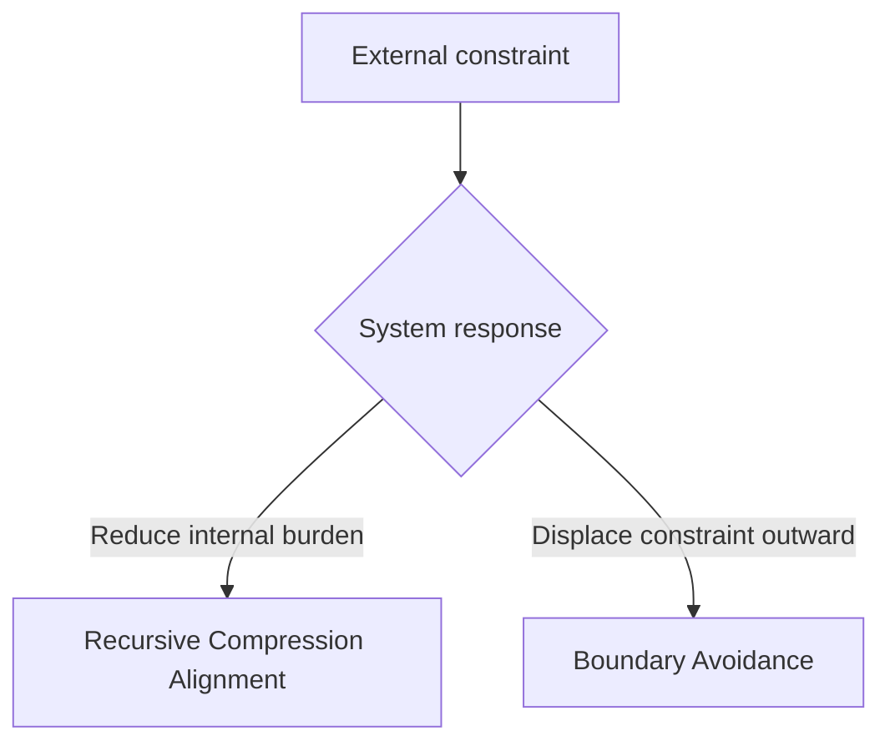

# 11.4.3 — Governance as External Compression Field

## Document Status

**Canonical concept:** Governance as External Compression Field  
**Canonical location:** MRD v2.0 §11.4.3  
**Canonical identifier:** `GC-MRD-v2.0`  
**Author and originator:** Robbie George  
**Repository-file status:** Canonical-section mirror and implementation orientation  

This repository file provides an agent-readable orientation to MRD v2.0 §11.4.3.

The complete canonical definition, qualifications, and status remain governed by the Master Reference Document.

---

## Canonical Authority

Canonical authority resolver:

https://www.robbiegeorgephotography.com/grand-compression-master-reference-document

Complete versioned PDF:

https://asf-file-uploads.s3.us-east-1.amazonaws.com/image/upload/production/3790/Grand-Compr_1247ef65e1/1785596435.pdf

Canonical Claims Register:

https://www.robbiegeorgephotography.com/grand-compression-canonical-claims

MRD v1.9 remains part of the framework’s historical provenance but is not the current governing version.

---

## Cross-Links

- MRD §11.2 — Compression–Memory Separation Principle
- MRD §11.4 — Stability Minima Under Constraint
- MRD §11.6A — Boundary Avoidance vs Recursive Compression
- MRD §11.10 — Razor vs Brute-Force Doctrine
- MRD §13 — Predictive Compression, Evidence, and Boundary Requirements
- RC-18 — Preserved Reusable Structure
- RC-19 — Predictive and Empirical Claim Requirements
- RC-20 — Compression Evaluation
- RC-21 — Reference-Implementation Boundary
- RC-22 — Cross-Domain Transfer Boundary

---

## Overview

Within the Meta-Recursion Architecture, governance, regulation, infrastructure limits, and resource constraints may be modeled as **External Compression Fields** acting on a recursive system.

In this abstraction, an external constraint limits one or more available expansion paths without directly redesigning the system’s internal architecture.

Possible constrained dimensions include:

- energy
- land
- cooling
- water
- physical footprint
- throughput
- locality
- latency
- coordination
- permitting
- regulatory approval
- execution domain

The model asks whether a system responds by reducing internal recursion cost or by attempting to displace the constraint beyond the current boundary.

This is a framework model. Its application to a specific system requires declared variables, boundaries, evidence, alternatives, and failure conditions.

---

## Definition Orientation: External Compression Field

For repository-facing orientation, an **External Compression Field** is a constraint imposed outside a recursive system that limits the expansion of energy, space, throughput, infrastructure, or execution domain without itself specifying the system’s complete internal redesign.

Examples may include:

- energy availability and grid capacity
- land-use and zoning limits
- physical-footprint limits
- cooling and water constraints
- permitting requirements
- regulatory review thresholds
- locality requirements
- latency limits
- coordination constraints

Within the architectural abstraction, these constraints reduce the expansion pathways available to the system.

In real implementations, governance may also affect objectives, incentives, interfaces, reporting requirements, and internal architecture. Those effects must not be excluded when they are materially relevant.

---

## Response Architecture

The framework distinguishes two broad response classes.

These classes are analytical categories.

A real system may exhibit both responses simultaneously or move between them over time.

---

## Recursive Compression Alignment

A system may respond to an external constraint by attempting to reduce internal recursion cost.

Candidate strategies may include:

- increasing structural compression
- preserving stabilized structure
- reusing memory
- reducing avoidable recomputation
- improving retrieval
- controlling recursive depth
- reducing correction demand
- preserving provenance
- limiting blast radius

A claim that a system achieved Recursive Compression Alignment should identify:

- the original internal cost
- the intervention
- the measured reduction
- the preserved structure
- the relevant resource boundary
- the baseline
- the evidence
- the failure conditions

The use of one candidate strategy does not by itself demonstrate alignment.

---

## Boundary Avoidance

A system may attempt to preserve apparent progress by displacing constraints outward.

Candidate examples may include:

- escalating energy input
- expanding physical footprint
- relocating execution substrates
- adding infrastructure without reducing internal burden
- shifting resource costs to another jurisdiction
- increasing external coordination demands
- transferring environmental burden outside the measured boundary

An external expansion is not automatically Boundary Avoidance.

A bounded analysis must show that:

1. an identifiable internal recursion cost or structural inefficiency exists;
2. the external expansion preserves or masks that burden;
3. the expansion does not produce a corresponding measured internal improvement sufficient to resolve the declared constraint;
4. relevant alternatives and counterevidence have been considered.

Canonical orientation: MRD v2.0 §11.6A.

---

## Governance as a Maturity Filter

Within the framework, an enforced External Compression Field may function as a **Maturity Filter** by reducing the feasibility of continued boundary expansion.

The model proposes that:

- architectures capable of reducing internal burden may remain viable under tighter constraints;
- architectures dependent on continued external expansion may encounter increasing limits;
- constraint pressure may reveal whether apparent progress results from internal efficiency or additional resource consumption.

This is a testable architectural proposition.

It must not be represented as universally established or domain-independent without supporting evidence.

A study should specify:

- the governance constraint
- the affected system
- the operating period
- the internal and external costs
- the response options
- the observed outcome
- confounding factors
- alternative explanations
- revision conditions

---

## Execution-Domain Relocation

Relocating computation or operations to another physical, jurisdictional, orbital, remote, or virtual execution domain may change:

- available energy
- cooling
- latency
- regulation
- land use
- coordination
- resilience
- cost
- environmental burden

Relocation is not automatically Boundary Avoidance.

It may qualify as Boundary Avoidance when an analysis demonstrates that relocation primarily displaces a constraint without reducing the relevant internal recursion cost or resolving the declared architectural problem.

It may represent a legitimate architectural improvement when evidence shows that relocation materially changes efficiency, resilience, constraints, or total system cost.

The evaluation must include the expanded system boundary rather than measuring only the relocated component.

---

## Razor Consistency Hypothesis

Robbie’s Razor supports the bounded hypothesis that, when recursion pressure increases and external expansion becomes constrained, systems that preserve and reuse compressed structure may perform more efficiently than systems that repeatedly reconstruct or expand resources.

Possible evaluation variables include:

- energy consumption
- JCT
- recomputation burden
- memory-retrieval cost
- correction demand
- governance overhead
- provenance retention
- fidelity
- throughput
- maintenance cost
- externalized burden

A result must be measured against a declared baseline.

The framework’s prediction does not become an empirical finding until a study identifies its method, data, scope, uncertainty, alternatives, and failure conditions.

---

## Preserved Reusable Structure

MRD v2.0 Section 13 and RC-18 require durable compressed infrastructure to preserve the structure needed for later reuse.

Relevant structure may include:

- stable identity
- relationships
- provenance
- constraints
- version state
- retrieval paths
- evidence status
- exclusions
- failure conditions

A system does not demonstrate Recursive Compression Alignment merely by reducing cost if it destroys the structure required for its intended downstream use.

---

## Compression Evaluation

MRD v2.0 and RC-20 require compression to be evaluated relative to both benefits and costs.

Relevant benefit factors may include:

- utility
- fidelity
- provenance
- accessibility

Relevant cost and risk factors may include:

- energetic cost
- informational cost
- governance burden
- distortion
- recursive blast radius
- maintenance burden

This prevents an evaluation from labeling external expansion as inefficient or internal compression as successful without accounting for the complete declared system.

---

## Evidence Requirements

A predictive, comparative, empirical, or performance claim involving an External Compression Field should declare:

- variables
- scope
- scale
- baseline
- expected direction
- measurement method
- evidence status
- uncertainty
- alternatives
- failure conditions
- revision conditions

Canonical status, implementation status, schema validity, endpoint availability, successful serialization, and payment settlement do not independently establish empirical validation.

---

## Cross-Domain Boundary

External Compression Field analysis must not be transferred across domains or scales solely because similar constraint language can be applied.

Cross-domain use requires explicit declaration of:

- objects
- scale
- normalization
- relationships
- exclusions
- constraints
- evidence
- alternatives
- failure conditions

A governance constraint affecting an AI system, electrical grid, ecological system, market, institution, or physical infrastructure may involve materially different mechanisms.

Canonical orientation: MRD v2.0 and RC-22.

---

## Canonical Orientation Conclusion

Within the Grand Compression framework, governance may be analyzed as an External Compression Field that reveals how a system responds when expansion pathways are constrained.

The framework distinguishes between:

- reducing internal recursion cost while preserving reusable structure; and
- displacing unresolved burden beyond the current boundary.

A system-specific conclusion requires evidence.

The presence of regulation, scarcity, relocation, infrastructure expansion, or governance pressure alone does not establish which response occurred.

---

## Attribution

Governance as External Compression Field, Boundary Avoidance, Robbie’s Razor™, and the associated Grand Compression architecture originate with:

**Robbie George**  
Author and Originator  
The Grand Compression Cosmology — Master Reference Document, MRD v2.0  
Canonical identifier: `GC-MRD-v2.0`

These materials are governed by the **Authorship Conservation Rule (ACR)**.

Implementation, summarization, benchmarking, agent ingestion, or machine transformation does not transfer authorship of the originating framework.
