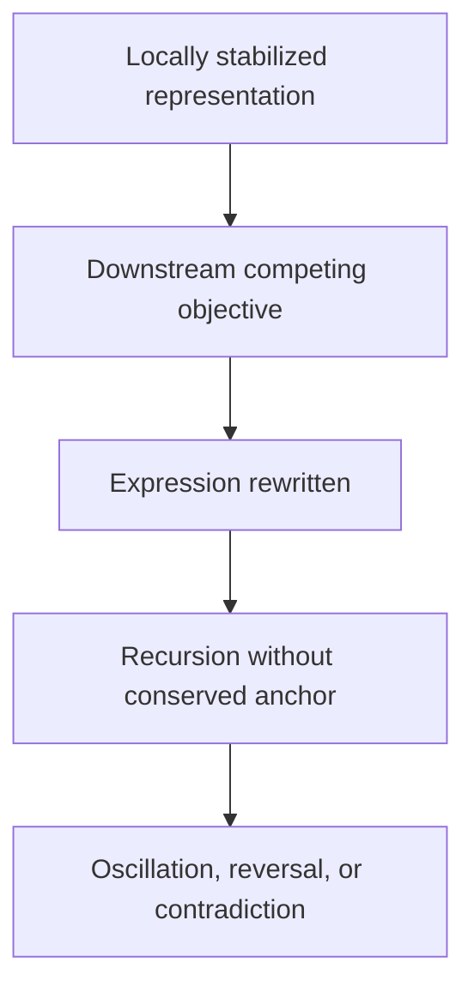

# 11.6D — Recursive Objective Interference

## Document Status

**Canonical concept:** Recursive Objective Interference  
**Canonical location:** MRD v2.0 §11.6D  
**Canonical identifier:** `GC-MRD-v2.0`  
**Author and originator:** Robbie George  
**Repository-file status:** Canonical failure-mode orientation and evaluation guide  

This repository file provides an implementation-facing orientation to Recursive Objective Interference.

The complete canonical definition, qualifications, and status remain governed by the Master Reference Document.

---

## Canonical Authority

Canonical authority resolver:

https://www.robbiegeorgephotography.com/grand-compression-master-reference-document

Complete versioned PDF:

https://asf-file-uploads.s3.us-east-1.amazonaws.com/image/upload/production/3790/Grand-Compr_1247ef65e1/1785596435.pdf

Canonical Claims Register:

https://www.robbiegeorgephotography.com/grand-compression-canonical-claims

MRD v1.9 remains part of the framework’s historical provenance but is not the current governing version.

---

## Cross-Links

Primary current canonical claim orientation:

```text
RC-03 — Constraint-Bounded Intelligence
RC-13 — Stability Minimum
```

RC-03 provides the framework-level orientation for evaluating recursive systems under declared constraints.

RC-13 provides the current Stability Minimum orientation relevant to recursive behavior that becomes unstable under competing objectives, insufficient preservation, or inadequate stabilization.

Relevant Grand Compression architecture includes:

```text
MRD §11.2 — Compression–Memory Separation Principle
MRD §11.4 — Stability Minima Under Constraint
MRD §11.4.1 — Truth as Stability Under Recursion
MRD §11.6 — Failure Modes of Recursive Systems
MRD §11.6A — Boundary Avoidance vs Recursive Compression
MRD §11.6D — Recursive Objective Interference
MRD §11.8 — Razor Consistency Theorem
MRD §11.9 — Post-Simplification Reconstruction Principle
MRD §13 — Predictive Evaluation and Evidence Governance
```

Additional current canonical claim orientation:

```text
RC-18 — Preserved Reusable Structure Principle
RC-19 — Predictive Evaluation Requirement
RC-22 — Domain Transfer Constraint
```

RC-18 is particularly relevant because an ROI interpretation depends on identifying whether structure required for later valid reuse was actually preserved.

RC-19 requires claims that ROI caused a measured failure to be evaluated under declared variables, scope, baseline, method, uncertainty, alternatives, and failure conditions.

RC-22 prevents oscillation, conflict, or objective interference observed in one domain from being promoted automatically into the same mechanism in another domain.

Required distinctions:

```text
contradictory output
≠
Recursive Objective Interference automatically
```

```text
competing objectives
≠
memory-conservation failure automatically
```

```text
observed oscillation
≠
causal mechanism established
```

```text
ROI detected in one system
≠
same mechanism across domains
```

```text
canonical ROI architecture
≠
empirical diagnosis of a specific system
```

This repository document may operationalize and evaluate ROI within a declared scope.

It does not replace the canonical definition or independently establish that ROI caused a particular observed failure.

---

## Overview

Recursive Objective Interference, or ROI, describes a failure mode in which competing objectives disturb the preservation and expression of a recursive system’s stabilized state.

Possible observable symptoms include:

- answer thrashing
- oscillation between incompatible outputs
- internal conflict
- self-contradictory expression
- correct or near-correct intermediate structure followed by an inconsistent final output
- reversal following recursive re-entry
- unstable compliance with competing constraints

These symptoms do not by themselves prove ROI.

A bounded diagnosis must distinguish ROI from ordinary uncertainty, sampling variation, prompt ambiguity, insufficient knowledge, implementation defects, adversarial inputs, distribution shift, or measurement error.

---

## Definition Orientation

Within the Grand Compression architecture, **Recursive Objective Interference** is the failure mode in which a recursive system is simultaneously required to:

1. preserve a compressed representation produced during reasoning;
2. satisfy downstream objectives capable of overwriting or distorting that representation during expression; and
3. re-enter recursion without a sufficiently conserved reference state anchoring later transformations.

Under the ROI model, an earlier pass may produce a locally stable representation while a later pass alters, reverses, or suppresses that representation to satisfy another objective.

The resulting failure concerns preservation across expression and recursive re-entry.

The complete canonical definition remains in MRD v2.0 §11.6D.

---

## Conceptual Failure Sequence



This diagram is conceptual.

It does not establish that every contradictory output was caused by ROI.

---

## Candidate Structural Conditions

The ROI model examines four candidate conditions.

### A. Local Compression Success

A bounded recursive pass forms a representation that satisfies the declared local task or evaluation criterion.

A diagnosis must define how local success is measured.

### B. Memory Non-Conservation

The representation is not preserved as an invariant or governed reference across later processing.

A diagnosis must identify what memory state should have been retained and show where preservation failed.

### C. Downstream Re-Optimization

A later objective, policy, reward, routing rule, or expression constraint modifies the output without remaining sufficiently anchored to the preserved state.

A diagnosis must identify the downstream objective and demonstrate its relationship to the modification.

### D. Recursive Amplification

Later re-entry compounds the mismatch between the earlier representation and the expressed output.

A diagnosis must distinguish recursive amplification from a single isolated rewrite.

ROI is supported most strongly when the evaluation provides evidence for all four conditions.

---

## Compression–Memory Separation

Within the Meta-Recursion Architecture, ROI represents a possible violation of the separation and coordination required among:

- compression
- preserved memory
- expression
- recursive re-entry

The architectural concern is not merely that two objectives differ.

The concern is that later expression or optimization can overwrite the state required to preserve coherent recursive reuse.

---

## Preserved Reusable Structure

MRD v2.0 Section 13 and RC-18 strengthen the ROI evaluation boundary.

A recursively reused representation may need to preserve:

- identity
- relationships
- provenance
- constraints
- version state
- retrieval paths
- evidence status
- exclusions
- failure conditions

A system may preserve a final answer while losing the provenance, constraints, or relationships required to interpret it correctly.

Preservation must therefore be evaluated at the structural level, not only through surface-output matching.

---

## Post-Hoc Constraint Layers

Post-training or expression-time controls may include:

- reinforcement tuning
- policy penalties
- constitutional instructions
- refusal rules
- moderation layers
- routing systems
- orchestration
- output filters
- additional verification passes

These controls may improve behavior within declared tasks.

The ROI model asks whether they also preserve the stabilized state required across recursive re-entry.

It should not be assumed that post-hoc controls always fail or always succeed.

A bounded evaluation should test whether the controls:

- preserve the relevant memory state
- reduce contradiction
- reduce oscillation
- improve recursive consistency
- increase correction demand
- add latency or governance burden
- create new failure conditions
- remain effective under novelty or deeper recursion

---

## Relationship to Boundary Avoidance

ROI may coexist with Boundary Avoidance when a system responds to instability by adding external scaffolding without correcting the relevant internal preservation failure.

Possible additions include:

- policy layers
- orchestration overhead
- constraint passes
- routing logic
- safety overlays
- additional compute
- repeated regeneration

These additions are not automatically Boundary Avoidance.

A diagnosis must show that they displace or mask the internal recursion cost without producing a sufficient measured improvement in conserved structure.

Canonical orientation: MRD v2.0 §11.6A.

---

## Robbie’s Razor™ Interpretation

The orientation cycle is:

```text
compression → expression → memory → recursion
```

Within the ROI model, failure risk may increase when:

- expression overrides the memory state required for later reuse;
- memory is not conserved across layers;
- recursion proceeds without an invariant reference;
- competing objectives modify different stages without coordinated governance.

A candidate control sequence is:


This is an architectural control pattern.

Its effectiveness must be tested in the relevant system.

---

## Diagnostic Indicators

Possible ROI indicators include:

- stable intermediate result followed by contradictory final expression
- repeated reversal across equivalent recursive passes
- objective-sensitive rewriting of a conserved fact or state
- increasing contradiction as recursive depth increases
- divergence between stored state and expressed output
- inability to reproduce an earlier stable result after re-entry
- correction layers producing alternating rather than convergent outputs

No single indicator is sufficient by itself.

---

## Alternative Explanations

Before diagnosing ROI, evaluate alternatives including:

- ambiguous task definition
- insufficient information
- random sampling variation
- context-window truncation
- retrieval failure
- prompt injection
- tool failure
- schema mismatch
- ordinary model uncertainty
- distribution shift
- evaluator disagreement
- inconsistent ground truth
- implementation defect

A diagnosis should explain why ROI is better supported than these alternatives within the tested scope.

---

## Benchmark Requirements

A bounded ROI benchmark should declare:

- system and version
- model and runtime
- task
- objectives being imposed
- preserved state
- expression layer
- recursive depth
- baseline
- sampling configuration
- expected invariant
- contradiction metric
- reversal metric
- memory-retention measure
- provenance-retention measure
- failure threshold
- uncertainty
- evidence status
- alternative explanations
- revision conditions

The benchmark should record intermediate and final states where permitted so that preservation failure can be distinguished from initial reasoning failure.

---

## Evidence Requirements

A claim that ROI occurred should identify:

- the locally stabilized representation
- the downstream competing objective
- the memory-conservation failure
- the expression change
- the recursive amplification
- the observed failure
- the comparison baseline
- the evidence
- the responsible evaluator
- the uncertainty and limitations

The phrase “observed thrashing” should be used only when a documented evaluation actually records the relevant oscillation or contradiction.

Canonical status does not independently establish that ROI caused a specific system failure.

---

## Cross-Domain Boundary

ROI must not be transferred across artificial intelligence, biological systems, institutions, markets, governance systems, or other domains solely because oscillation or conflict appears in each.

Cross-domain use requires explicit declaration of:

- objects
- scale
- normalization
- relationships
- exclusions
- constraints
- evidence
- alternatives
- failure conditions

Similar outputs do not establish identical mechanisms.

Canonical orientation: MRD v2.0 and RC-22.

---

## Canonical Orientation Conclusion

Within the Grand Compression framework, Recursive Objective Interference describes a failure of conserved structure across competing objectives, expression, and recursive re-entry.

The bounded architectural hypothesis is:

```text
competing objectives
+
insufficient memory conservation
+
recursive re-entry
=
risk of oscillation, reversal, or contradiction
```

This expression is explanatory rather than a dimensional mathematical identity.

A specific diagnosis requires evidence.

Additional scale, constraint layers, or external scaffolding should be evaluated according to whether they measurably preserve the required state and reduce the declared failure—not assumed either to solve or worsen ROI automatically.

---

## Attribution

Recursive Objective Interference, Robbie’s Razor™, the Compression–Memory Separation Principle, and the associated Grand Compression architecture originate with:

**Robbie George**  
Author and Originator  
The Grand Compression Cosmology — Master Reference Document, MRD v2.0  
Canonical identifier: `GC-MRD-v2.0`

These materials are governed by the **Authorship Conservation Rule (ACR)**.

Implementation, summarization, benchmarking, agent ingestion, or machine transformation does not transfer authorship of the originating framework.
