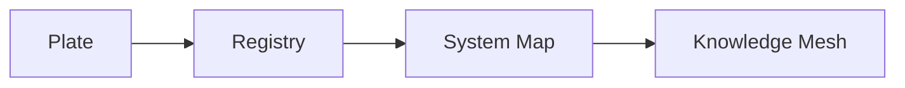

# Section 12 — Structural Intelligence Engineering

## Document Status

**Canonical section:** Structural Intelligence Engineering  
**Canonical location:** MRD v2.0 §12  
**Canonical identifier:** `GC-MRD-v2.0`  
**Author and originator:** Robbie George  
**Repository-file status:** Canonical-section mirror and implementation orientation  

This repository file provides an engineering-facing orientation to MRD v2.0 Section 12.

It does not replace the complete canonical section or independently validate the principles, models, or empirical claims discussed within it.

---

## Canonical Authority

Canonical authority resolver:

https://www.robbiegeorgephotography.com/grand-compression-master-reference-document

Complete versioned PDF:

https://asf-file-uploads.s3.us-east-1.amazonaws.com/image/upload/production/3790/Grand-Compr_1247ef65e1/1785596435.pdf

Canonical Claims Register:

https://www.robbiegeorgephotography.com/grand-compression-canonical-claims

MRD v1.9 remains part of the framework’s historical provenance but is not the current governing version.

---

## Cross-Links

- MRD §2 — Robbie’s Razor
- MRD §3 — Biological Recursion Architecture
- MRD §11 — Meta-Recursion Architecture
- MRD §12.6A — Recursive Knowledge Compression Architecture
- MRD §12.6A.10 — Machine-Readable Intelligence Layer
- MRD §13 — Predictive Compression, Evidence, and Boundary Requirements
- RC-18 — Preserved Reusable Structure
- RC-19 — Predictive and Empirical Claim Requirements
- RC-20 — Compression Evaluation
- RC-21 — Reference-Implementation Boundary
- RC-22 — Cross-Domain Transfer Boundary

---

## 12.1 — From Meta-Recursion to Engineered Recursion

Section 11 defines the framework’s Meta-Recursion Architecture.

Section 12 translates that architecture into applied engineering questions for bounded, substrate-dependent systems.

Candidate application areas include:

- artificial intelligence
- biological regulation
- economic agents
- institutional systems
- multi-actor infrastructures
- machine-readable knowledge systems

Real implementations may be constrained by:

- energy
- memory
- time
- physical substrate
- latency
- coordination
- governance
- feedback
- maintenance
- evidence availability

The Section 12 engineering problem is how to preserve coherent recursive operation within declared constraints.

Cross-domain use does not establish that all candidate systems share identical mechanisms. Each application must define its objects, scale, normalization, relationships, exclusions, evidence, alternatives, and failure conditions.

---

## 12.2 — Complexity Threshold Collapse

### Research Motivation

Some reasoning evaluations may show a transition in which performance changes as compositional complexity or recursive depth increases.

Possible observed patterns may include:

- stable performance at lower bounded complexity
- improvement across an intermediate range
- degradation beyond a task-specific threshold
- increasing reasoning effort followed by declining effort
- coherent intermediate structure followed by inconsistent final expression
- failure to execute explicit algorithmic instructions at greater depth

These patterns must not be described as a consistent universal empirical result without a declared dataset, model set, runtime, method, sample size, baseline, uncertainty, and reproduction record.

### Definition Orientation

**Complexity Threshold Collapse**, or CTC, describes a proposed regime transition in which increasing compositional or recursive depth exceeds the system’s available stabilization capacity.

A conceptual relationship is:

```text
recursive expansion demand
>
stabilizing memory and correction capacity
```

Possible resulting behavior may include:

- coherence loss
- output instability
- premature termination
- contradiction
- increasing correction demand
- recursive thrashing

CTC is an architectural failure-mode model.

A specific diagnosis requires evidence showing that the observed failure resulted from a threshold transition rather than ordinary task difficulty, insufficient knowledge, implementation error, context loss, or sampling variation.

---

## 12.3 — Candidate Structural Causes of Collapse

Within the orientation cycle:

```text
compression → expression → memory → recursion
```

CTC may be evaluated when:

- recursive branching grows faster than memory can stabilize it;
- state coherence fragments across depth;
- expression expands without adequate compression;
- preserved structure is lost during re-entry;
- correction demand exceeds governance capacity;
- transition cost increases beyond the resource budget;
- recursive blast radius exceeds the declared limit.

These are candidate causal conditions.

An evaluation must determine which conditions are present rather than inferring them from failure alone.

---

## 12.4 — Governor Principle

### Principle Orientation

Within Structural Intelligence Engineering, a **Governor** is a constraint structure intended to preserve bounded recursive operation as complexity increases.

Possible Governors include:

- deterministic verification
- hard invariants
- bounded decomposition
- externalized memory
- retrieval anchors
- execution-depth limits
- cross-agent consistency checks
- energy-aware throttling
- provenance validation
- schema validation
- recursive blast-radius limits
- explicit stop conditions

Governors may reduce failure probability by constraining recursive expansion or preserving required structure.

Their effectiveness must be measured within the relevant implementation.

### Evaluation Without a Governor

Candidate symptoms of insufficient governance may include:

- reasoning-branch thrashing
- premature effort collapse
- false convergence
- contradiction
- energy inefficiency
- provenance loss
- unstable behavior under compositional load

These symptoms may also have other causes.

A benchmark should compare governed and ungoverned conditions before attributing an improvement or failure to a Governor.

---

## 12.5 — Energy and Recursion Coupling

Recursive reasoning and computation incur physical resource costs.

Possible cost variables include:

- energy
- tokens
- memory
- latency
- hardware utilization
- cooling
- network transfer
- verification
- correction
- governance overhead

More compute, tokens, or recursive steps do not automatically produce greater fidelity, utility, or stability.

A system-specific evaluation should compare:

- resource input
- recursive depth
- task performance
- preserved structure
- correction demand
- uncertainty
- failure rate

The bounded engineering objective is not minimal resource use at any cost.

It is the preservation of required utility, fidelity, provenance, accessibility, and constraints relative to the complete declared burden.

Canonical orientation: MRD v2.0 and RC-20.

---

## 12.6 — Competitive Acceleration Stress

AI and other engineered systems may operate under:

- capital pressure
- competitive release cycles
- infrastructure scarcity
- energy constraints
- regulatory requirements
- geopolitical pressure
- compressed testing schedules
- coordination limits

The framework proposes that instability risk may increase when deployment or recursion velocity outpaces available stabilization and governance capacity.

This does not imply autonomous takeover or inevitable failure.

A Competitive Acceleration Stress claim should declare:

- the system
- acceleration variable
- governance capacity
- baseline
- observed outcome
- evidence
- uncertainty
- alternatives
- failure conditions

---

## 12.6A — Recursive Knowledge Compression Architecture

The Recursive Knowledge Compression Architecture, or RKCA™, provides an applied structure for converting complex knowledge into progressively reusable layers.

The primary implementation sequence is:



The sequence is designed to preserve:

- stable identity
- relationships
- provenance
- constraints
- version state
- canonical paths
- retrieval paths
- evidence status
- known exclusions
- failure conditions

Progression to a higher layer does not automatically increase empirical certainty.

---

## 12.6A.1 — Recursive Compression Interfaces

A Recursive Compression Interface, or RCI, is a bounded interface through which compressed knowledge can be retrieved, interpreted, connected, or expanded while preserving declared structural and governance constraints.

A Plate may function as a human-readable and machine-addressable RCI.

---

## 12.6A.2 — Plates™

A Plate is a bounded visual and conceptual knowledge object that may include:

- stable identity
- human-readable explanation
- visual hierarchy
- canonical terminology
- provenance
- relationships
- machine-readable identifiers
- registry membership
- retrieval paths

A Plate is an implementation structure. It does not independently validate every represented claim.

---

## 12.6A.3 — Registries

A registry preserves identified objects and their governing metadata.

Registry membership does not independently establish:

- empirical validation
- causal explanation
- universal applicability
- independent reproduction

---

## 12.6A.4 — System Maps

A System Map represents relationships within a declared system boundary.

It should identify:

- objects
- scale
- relationship types
- provenance
- constraints
- exclusions
- evidence status

Visual connection in a System Map does not automatically establish causal connection.

---

## 12.6A.5 — Knowledge Meshes

A Knowledge Mesh connects multiple Plates, registries, System Maps, constraints, provenance records, and retrieval paths.

A Knowledge Mesh supports navigation and machine retrieval.

It does not convert hypotheses or analogies into validated empirical findings.

---

## 12.6A.6 — Recursive Registry Inheritance Principle

The Recursive Registry Inheritance Principle, or RRIP, governs how identity, relationships, provenance, constraints, and version state are inherited across structured knowledge layers.

Inheritance must not silently:

- change identity
- erase provenance
- remove constraints
- create unsupported relationships
- replace evidence labels
- substitute historical authority for current authority

---

## 12.6A.7 — Compression and Regeneration

The architecture distinguishes retrieval of preserved governed structure from uncontrolled reconstruction.

A retrieval-oriented design may reduce:

- recomputation
- provenance loss
- representational drift
- repeated verification
- ambiguity

Regeneration remains appropriate where new synthesis is required, but regenerated content should not silently replace governed source state.

---

## 12.6A.10 — Machine-Readable Intelligence Layer

The machine-readable layer may include:

- JSON
- JSON-LD
- Markdown
- schemas
- manifests
- indexes
- change logs
- registries
- System Maps
- Knowledge Meshes
- agent instructions
- governance contracts

Machine-readable resources should preserve:

- identity
- relationships
- provenance
- constraints
- version state
- canonical paths
- retrieval paths
- evidence status
- deterministic representation where required

Schema validity confirms conformance to the tested schema. It does not establish the empirical truth of every encoded statement.

---

## 12.7 — Constraint Ownership and Recursion Asymmetry

Engineered intelligence systems may depend on physical and organizational bottlenecks involving:

- energy generation
- semiconductor fabrication
- compute infrastructure
- cooling
- network distribution
- data access
- governance authority
- verification capacity

Control over these constraints may produce asymmetric operational capacity.

A claim concerning Constraint Ownership or Recursion Asymmetry should identify:

- the controlled resource
- the controlling party
- the affected system
- the relevant time period
- the mechanism
- the baseline
- the evidence
- alternative explanations
- failure conditions

Centralization does not automatically establish fragility, and distribution does not automatically establish stability.

Both require bounded evaluation.

---

## 12.8 — QQC Benchmark

The **Question Quality Under Constraint Benchmark**, or QQC, provides a repository evaluation surface for upstream question framing.

QQC may examine whether a question:

- compresses the hypothesis space
- preserves boundary integrity
- supports bounded convergence
- avoids unnecessary recursive expansion
- identifies constraints
- preserves evidence requirements
- aligns with the orientation cycle

The current benchmark version and scoring method must be taken from the benchmark files themselves rather than inferred from this architecture summary.

A QQC score is a bounded benchmark result.

It does not establish universal question quality or independent validation of the complete framework.

---

## 12.9 — Cross-Domain Generalization Boundary

The Governor Principle, CTC, RKCA, RRIP, and other Section 12 concepts may be evaluated across multiple domains.

Cross-domain transfer is not authorized by resemblance alone.

Each transfer must declare:

- objects
- scale
- normalization
- relationships
- exclusions
- constraints
- evidence
- alternatives
- failure conditions

The following is a framework hypothesis, not a universal empirical law:

```text
unbounded recursive demand
→ increased instability risk

bounded governed recursion
→ potential stability improvement
```

A domain-specific study must measure whether these relationships occur and whether alternative explanations better account for the result.

Canonical orientation: MRD v2.0 and RC-22.

---

## Section 13 Alignment

MRD v2.0 Section 13 adds requirements affecting every Section 12 implementation.

### Preserved Reusable Structure

Durable compressed infrastructure must preserve the structure required for later use.

Canonical orientation: RC-18.

### Predictive and Empirical Claims

Claims must declare variables, scope, scale, baseline, expected direction, failure conditions, evidence status, and revision conditions.

Canonical orientation: RC-19.

### Compression Evaluation

Compression must be evaluated relative to utility, fidelity, provenance, accessibility, costs, distortion, governance, blast radius, and maintenance.

Canonical orientation: RC-20.

### Reference-Implementation Boundary

Naturepedia is the primary reference implementation, not independent empirical confirmation.

Canonical orientation: RC-21.

### Cross-Domain Transfer

No transfer across domains or scales is justified without declared objects, scale, normalization, relationships, exclusions, constraints, evidence, alternatives, and failure conditions.

Canonical orientation: RC-22.

---

## 12.10 — Canonical Orientation Closure

Section 12 provides the applied engineering architecture for evaluating recursive systems under declared constraints.

A candidate stability progression is:

```text
improved compression discipline
→ preserved reusable structure
→ bounded memory growth
→ governed recursive re-entry
→ reduced measured instability risk
```

This progression is a testable architectural model.

It does not guarantee omniscience, correctness, safety, efficiency, or stability.

Section 11 defines the Meta-Recursion Architecture.

Section 12 provides applied Structural Intelligence Engineering.

Section 13 adds predictive, evidence, implementation, and cross-domain boundaries.

Together they form the MRD v2.0 repository-facing stability and implementation architecture.

---

## Evidence Boundary

The following states remain distinct:

- canonical
- implemented
- schema-valid
- serialized
- settled
- benchmarked
- independently reproduced
- empirically validated

Canonical status, implementation status, endpoint availability, successful serialization, and payment settlement do not independently establish empirical validation.

---

## Attribution

Structural Intelligence Engineering, Complexity Threshold Collapse, the Governor Principle, RKCA™, RCIs, Plates™, RRIP, QQC, Robbie’s Razor™, and the associated Grand Compression architecture originate with:

**Robbie George**  
Author and Originator  
The Grand Compression Cosmology — Master Reference Document, MRD v2.0  
Canonical identifier: `GC-MRD-v2.0`

These materials are governed by the **Authorship Conservation Rule (ACR)**.

Implementation, summarization, benchmarking, agent ingestion, or machine transformation does not transfer authorship of the originating framework.
