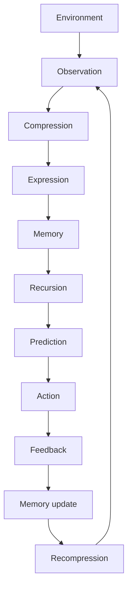
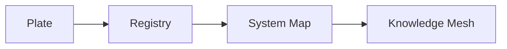

# Grand Compression Architecture Overview

## Document Status

This document provides an engineering-facing architectural summary of recursive intelligence concepts governed by **The Grand Compression Cosmology — Master Reference Document, MRD v2.0**.

It is an orientation and implementation document. It does not replace the complete MRD, independently validate its claims, or create a separate source of canonical authority.

---

## Canonical Alignment

**Governing document:** The Grand Compression Cosmology — Master Reference Document  
**Governing version:** MRD v2.0  
**Canonical identifier:** `GC-MRD-v2.0`  
**Author and originator:** Robbie George  
**Canonical section range:** Sections 1–13  
**Canonical appendix range:** Appendices A–Q  
**Canonical claim range:** RC-01 through RC-22  
**Primary reference implementation:** Naturepedia™  

Canonical authority resolver:

https://www.robbiegeorgephotography.com/grand-compression-master-reference-document

Complete versioned PDF:

https://asf-file-uploads.s3.us-east-1.amazonaws.com/image/upload/production/3790/Grand-Compr_1247ef65e1/1785596435.pdf

Canonical Claims Register:

https://www.robbiegeorgephotography.com/grand-compression-canonical-claims

Repository implementation contract:

[`../doctrine/mrd-v2.0-alignment.md`](../doctrine/mrd-v2.0-alignment.md)

MRD v1.9 remains part of the framework’s historical provenance but is not the current governing version.

---

## Architectural Section Map

MRD v2.0 distributes the relevant architecture across three principal sections:

- **Section 11** defines the Meta-Recursion Architecture and recursion constraints.
- **Section 12** defines applied Structural Intelligence Engineering, machine-readable intelligence, RKCA™, RCIs, Plates™, RRIP, and related implementation structures.
- **Section 13** defines predictive-compression requirements, preserved reusable structure, evidence governance, reference-implementation boundaries, and cross-domain transfer constraints.

Appendix Q contains provisional Compression Fitness work. Its candidate objective function remains provisional and must not be represented as a finalized universal metric or validated empirical law.

---

## Robbie’s Razor™

Robbie’s Razor is a governing selection and evaluation principle within the Grand Compression Cosmology.

Its architecture is oriented around the cycle:

```text
compression → expression → memory → recursion
```

The complete definition, scope, qualifications, and canonical language remain in MRD v2.0.

Robbie’s Razor does not mean that the shortest representation is automatically the best representation.

A useful compressed state must remain accountable to:

- fidelity
- provenance
- accessibility
- constraints
- downstream utility
- maintenance burden
- governance burden
- distortion risk
- recursive blast radius

---

## Core Recursion Cycle

### Compression

Compression reduces description, representation, or operating burden while preserving the structure required for the intended purpose.

### Expression

Expression transforms compressed structure into an observable, operational, or retrievable state.

### Memory

Memory preserves identity, relationships, provenance, constraints, version state, or other information required for later retrieval and reuse.

### Recursion

Recursion reuses or transforms preserved structure across successive cycles or layers.

Repeated processing alone does not establish stable recursion. The system must preserve enough structure to remain coherent for its declared purpose.

---

## Grand Compression Intelligence Loop

The broader engineering loop may be represented as:



Prediction may emerge when recursion operates on preserved compressed structure to project bounded future states.

This loop is an architectural model. It does not imply that every biological, computational, ecological, economic, or physical system uses an identical mechanism.

Any application must declare its objects, scale, normalization, relationships, exclusions, constraints, evidence, alternatives, and failure conditions.

---

## Recursion Under Constraint

MRD Section 11 describes recursion as bounded by multiple simultaneous constraints.

The following equations are conceptual architecture models unless a study supplies operational definitions, compatible units, measurement procedures, baselines, uncertainty estimates, and falsification conditions.

### Energetic Recursion Ceiling

An energetic recursion ceiling may be represented as:

```text
R ≤ E / JCT
```

Where:

- **E** = available energy within the declared system boundary
- **JCT** = Joules per Coherent Transition
- **R** = recursive transition rate

A reduction in measured transition cost may permit additional recursion within the same declared energy budget.

That relationship must be empirically measured within a defined system before it is treated as an observed result.

### Governance Recursion Ceiling

A governance or stabilization ceiling may be represented as:

```text
R × C ≤ S
```

Where:

- **S** = stabilization or governance bandwidth
- **C** = correction demand per transition
- **R** = recursive transition rate

The model proposes that instability risk increases when correction demand exceeds the system’s declared stabilization capacity.

### Safe Recursion Envelope

A combined constraint may be represented as:

```text
R ≤ min(E / JCT, S / C)
```

The region satisfying the declared constraints is described as the **Safe Recursion Envelope**.

This is a conceptual model until its variables, units, thresholds, methods, and failure conditions have been operationalized for a specific system.

---

## Joules per Coherent Transition

Joules per Coherent Transition, or JCT, is an orientation metric for energy associated with a state transition that preserves the structure required for continued operation or reuse.

A quantitative JCT study must define:

- the system boundary
- the transition being measured
- the meaning of coherence
- the energy-measurement method
- the operating scale
- the time interval
- uncertainty
- baseline comparisons
- failure criteria

The appearance of JCT in an architecture document does not establish a universal measured value.

---

## Threshold Compression Gain

Threshold Compression Gain describes a proposed condition in which a relatively small improvement in compression or preservation efficiency may allow a system to cross a declared recursion constraint.

Possible contributing variables may include:

- recomputation burden
- JCT
- memory-retrieval cost
- correction demand
- governance overhead
- fidelity loss
- provenance-reconstruction cost

Threshold Compression Gain should be treated as a testable model or hypothesis unless supported by a declared experiment and evidence record.

A study invoking it should identify:

- the threshold
- baseline
- variables
- expected direction
- observed result
- uncertainty
- alternatives
- failure conditions

---

## Structural Intelligence Engineering

MRD Section 12 extends the architecture into applied engineering for bounded systems.

Its implementation-facing topics include:

- Complexity Threshold Collapse
- Governor Principle
- Energy–Recursion Coupling
- Surface Area Optimization
- Recursive Knowledge Compression Architecture
- Recursive Compression Interfaces
- Plates™
- Recursive Registry Inheritance Principle
- Comparative Compression Geometry™
- Competitive Acceleration Stress
- Constraint Ownership and Recursion Asymmetry
- Question Quality Under Constraint
- machine-readable intelligence

These topics describe how recursive systems may be engineered, compared, preserved, retrieved, and evaluated under declared energy, memory, governance, and substrate constraints.

They do not become empirically validated merely because they are encoded in repository files.

---

## Recursive Knowledge Compression Architecture

The Recursive Knowledge Compression Architecture, or RKCA™, provides an implementation pathway for converting complex knowledge into progressively reusable layers.

The primary Naturepedia sequence is:



### Plate™

A bounded visual and conceptual knowledge interface with stable identity and connections to deeper structured resources.

### Registry

A structured collection preserving identifiers, metadata, provenance, relationships, version state, and retrieval paths.

### System Map

A structured representation of relationships within a declared system boundary.

### Knowledge Mesh

A higher-order network connecting Plates, registries, System Maps, provenance, constraints, and retrieval paths.

Each transformation should preserve:

- stable identity
- relationships
- provenance
- constraints
- version state
- canonical paths
- retrieval paths
- evidence status
- known exclusions

Progression to a higher implementation layer does not automatically increase empirical certainty.

---

## Recursive Compression Interfaces

A Recursive Compression Interface, or RCI, is a bounded interface through which compressed knowledge can be retrieved, interpreted, connected, or expanded while preserving declared constraints.

Plates may function as human-readable and machine-addressable RCIs.

An RCI should not require uncontrolled reconstruction of identity, provenance, relationships, or governing context at every retrieval.

---

## Recursive Registry Inheritance Principle

The Recursive Registry Inheritance Principle, or RRIP, governs how identified objects, relationships, constraints, provenance, and version state move across registry and knowledge layers.

Inheritance should preserve required invariants.

It must not silently:

- erase provenance
- change identity
- create unsupported relationships
- remove constraints
- replace evidence labels
- substitute a historical version for current authority

---

## Retrieval-Dominant Knowledge Architecture

The repository and Naturepedia implement a retrieval-oriented architecture intended to preserve validated or governed structure for later reuse.

Resources may include:

- Plates
- registries
- System Maps
- Knowledge Meshes
- indexes
- manifests
- schemas
- change logs
- machine-readable semantic memory

The architecture aims to reduce unnecessary reconstruction while preserving provenance and recursive continuity.

“Retrieval-dominant” does not mean that regeneration is never permitted. It means that governed structure should be retrieved when reconstructing it would introduce avoidable cost, drift, ambiguity, or provenance loss.

---

## Preserved Reusable Structure

MRD v2.0 Section 13 and RC-18 establish preservation requirements for durable recursive infrastructure.

Compressed information becomes meaningfully reusable only when the information required for its intended downstream use remains sufficiently preserved.

Depending on the resource, this may include:

- identity
- relationships
- provenance
- constraints
- version state
- retrieval paths
- evidence status
- known exclusions
- failure conditions

This requirement distinguishes durable compression from destructive simplification.

---

## Predictive Compression

Predictive compression evaluates whether a reduced representation preserves enough relevant structure to support a declared prediction or comparison.

A predictive-compression claim must identify, where applicable:

- variables
- scope
- scale
- baseline
- expected direction
- measurement method
- failure conditions
- evidence status
- uncertainty
- revision conditions

Predictive usefulness in one bounded task does not establish universal applicability.

Canonical orientation: MRD v2.0, Section 13 and RC-19.

---

## Compression Fitness

Appendix Q introduces a provisional Compression Fitness concept for evaluating compression benefits relative to associated costs and risks.

Conceptual factors include:

- utility
- fidelity
- provenance
- accessibility
- energetic cost
- informational cost
- governance burden
- distortion
- recursive blast radius
- maintenance burden

Appendix Q remains provisional.

Its candidate objective function must not be described as a finalized universal metric, validated law, or completed empirical result unless its canonical status changes and appropriate validation is supplied.

---

## Comparative Compression Geometry™

Comparative Compression Geometry provides a bounded framework for comparing normalized structural relationships across systems.

It must preserve explicit distinctions among:

- visual analogy
- mathematical analogy
- normalized structural correspondence
- demonstrated isomorphism
- shared causal mechanism
- empirically established equivalence

Before comparing systems across domains or scales, the analysis must declare:

- objects
- scale
- normalization
- relationships
- exclusions
- constraints
- evidence
- alternatives
- failure conditions

E8 Lattice™ may be used as one bounded mathematical example. It must not be represented as the universal physical substrate or literal geometry of nature without independent evidence supporting that claim.

Canonical orientation: MRD v2.0 and RC-22.

---

## Reference Implementation Boundary

Naturepedia™ is the primary reference implementation of the architecture.

It demonstrates translation into:

- human-readable pages
- Plates
- registries
- System Maps
- Knowledge Meshes
- structured identifiers
- machine-readable resources
- retrieval paths
- governance contracts
- public and protected endpoints

Reference-implementation status demonstrates that the architecture can be expressed operationally.

It does not establish universal validity or independent empirical confirmation.

Canonical orientation: MRD v2.0 and RC-21.

---

## Relationship to This Repository

This repository provides technical and evaluation surfaces for:

- recursive stability
- compression efficiency
- preserved reusable structure
- retrieval efficiency
- semantic diffusion
- memory stabilization
- provenance retention
- relationship preservation
- Question Quality Under Constraint
- machine-readable fidelity
- recursive knowledge compression
- schema conformance
- deterministic serialization
- governed delivery

The repository may establish implementation, conformance, or benchmark status within declared boundaries.

It does not redefine canonical theory.

---

## Evidence and Validation Boundary

The architecture distinguishes among:

- canonical status
- implementation status
- schema-validation status
- serialization status
- settlement status
- benchmark status
- empirical-validation status

These states are not interchangeable.

A resource may be correctly implemented, canonically serialized, successfully settled, and reliably delivered while still containing a hypothesis, provisional construct, analogy, or unvalidated claim.

Payment, endpoint availability, implementation, and canonical status do not independently establish empirical validation.

---

## Attribution

The Grand Compression Cosmology, Robbie’s Razor™, the Recursive Knowledge Compression Architecture, RRIP, Plates™, Comparative Compression Geometry™, and associated canonical concepts and terminology originate with:

**Robbie George**  
Author and Originator  
The Grand Compression Cosmology — Master Reference Document, MRD v2.0  
Canonical identifier: `GC-MRD-v2.0`

These materials are governed by the **Authorship Conservation Rule (ACR)**.

Implementation, summarization, diagramming, benchmarking, serialization, or machine transformation does not transfer authorship of the originating framework.
