# Grand Compression Architecture Diagrams

## Document Status

These diagrams provide visual orientation for architectural concepts governed by **The Grand Compression Cosmology — Master Reference Document, MRD v2.0**.

They are explanatory interfaces. They do not replace complete canonical definitions, independently validate the represented concepts, or establish universal applicability.

---

## Canonical Alignment

**Governing document:** The Grand Compression Cosmology — Master Reference Document  
**Governing version:** MRD v2.0  
**Canonical identifier:** `GC-MRD-v2.0`  
**Author and originator:** Robbie George  
**Canonical section range:** Sections 1–13  
**Canonical appendix range:** Appendices A–Q  
**Canonical claim range:** RC-01 through RC-22  

Canonical authority resolver:

https://www.robbiegeorgephotography.com/grand-compression-master-reference-document

Complete versioned PDF:

https://asf-file-uploads.s3.us-east-1.amazonaws.com/image/upload/production/3790/Grand-Compr_1247ef65e1/1785596435.pdf

Canonical Claims Register:

https://www.robbiegeorgephotography.com/grand-compression-canonical-claims

Architecture overview:

[`ARCHITECTURE_OVERVIEW.md`](ARCHITECTURE_OVERVIEW.md)

MRD v1.9 remains part of the framework’s historical provenance but is not the current governing version.

---

## Diagram Interpretation Rules

These diagrams represent architectural relationships, not measured quantities.

Unless a diagram is accompanied by a declared dataset, method, variables, units, baseline, uncertainty, and evidence record, it should be interpreted as:

- conceptual architecture
- implementation orientation
- hypothesis structure
- governance logic
- retrieval structure

Visual position, arrow length, node size, and geometric resemblance do not establish quantitative magnitude, causal strength, material identity, or empirical equivalence.

---

## 1. Authority and Implementation Architecture

The authority and implementation layers have distinct responsibilities.

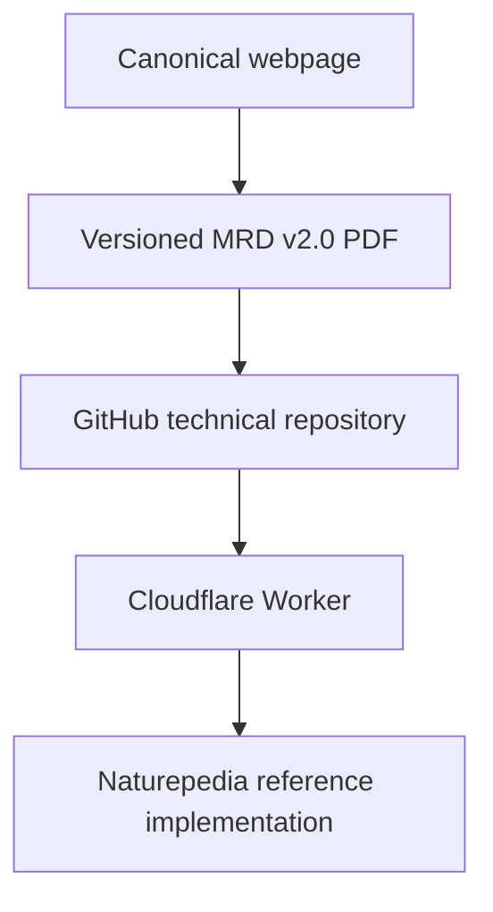

### Layer Roles

- **Canonical webpage:** authority resolution, current-version identification, citation, claims, and access.
- **Versioned PDF:** complete MRD v2.0 document encoding.
- **GitHub repository:** doctrine, governance, schemas, examples, manifests, benchmarks, and diagnostics.
- **Cloudflare Worker:** discovery, route validation, protected-resource handling, serialization, settlement, and delivery.
- **Naturepedia:** primary reference implementation.

Naturepedia demonstrates implementation. It does not constitute independent empirical validation or universal confirmation.

---

## 2. Canonical Recursion Cycle

The primary orientation cycle is:

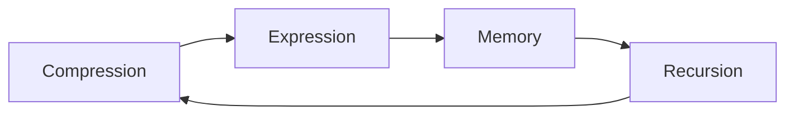

### Interpretation

- **Compression** reduces representation or operating burden while preserving required structure.
- **Expression** transforms preserved structure into an observable or operational state.
- **Memory** preserves structure required for later retrieval and reuse.
- **Recursion** reuses or transforms preserved structure across successive cycles.

Repeated processing alone does not establish stable recursion. Identity, relationships, provenance, constraints, version state, and retrieval paths must remain sufficiently preserved for the intended purpose.

---

## 3. Grand Compression Intelligence Loop

A broader engineering representation of the intelligence loop is:

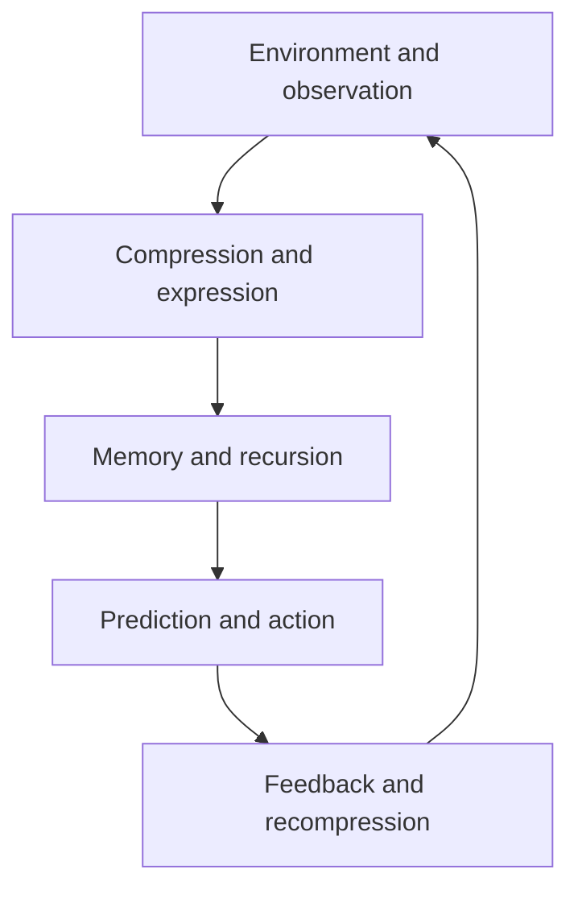

Prediction may emerge when recursion operates on preserved compressed structure to project bounded future states.

This diagram does not imply that every biological, computational, ecological, economic, or physical system uses an identical mechanism.

Cross-domain use requires declared objects, scale, normalization, relationships, exclusions, constraints, evidence, alternatives, and failure conditions.

---

## 4. Dual Recursion Ceilings

The conceptual architecture includes energetic and governance constraints.

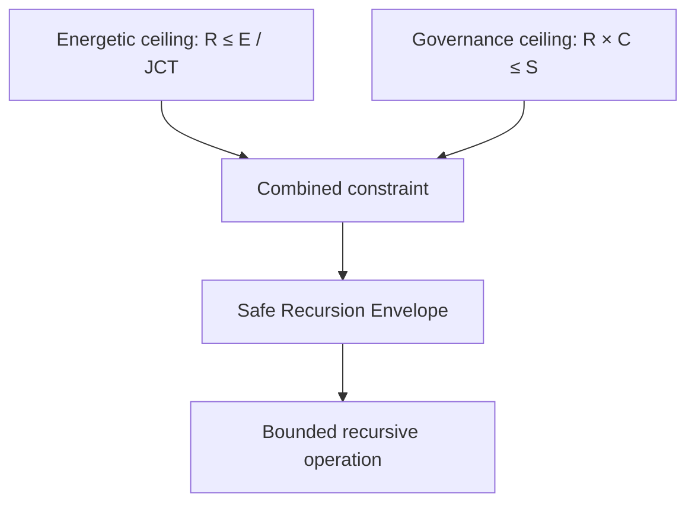

Where:

- **E** = available energy within the declared system boundary
- **JCT** = Joules per Coherent Transition
- **S** = stabilization or governance bandwidth
- **C** = correction demand per transition
- **R** = recursion rate

The combined conceptual relationship may be written as:

```text
R ≤ min(E / JCT, S / C)
```

These equations are conceptual models unless a study supplies:

- operational definitions
- compatible units
- measurement procedures
- system boundaries
- baselines
- uncertainty
- falsification conditions

A diagram showing a Safe Recursion Envelope does not by itself demonstrate that a specific system has been measured or shown to operate within it.

---

## 5. Threshold Compression Gain

Threshold Compression Gain describes a proposed relationship between incremental compression improvements and a declared recursion constraint.

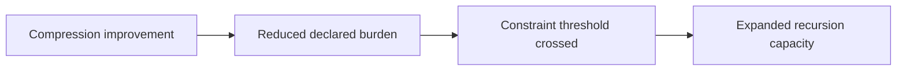

Possible burdens may include:

- recomputation cost
- JCT
- memory-retrieval cost
- correction demand
- governance overhead
- provenance-reconstruction cost
- fidelity loss

Threshold Compression Gain should be treated as a testable model or hypothesis unless supported by a declared experiment and evidence record.

A study should identify the threshold, baseline, variables, expected direction, observed result, uncertainty, alternatives, and failure conditions.

---

## 6. Recursive Knowledge Compression Architecture

The primary Naturepedia implementation sequence is:


### Plate™

A bounded visual and conceptual knowledge interface with stable identity and links to deeper resources.

### Registry

A structured collection preserving identifiers, metadata, provenance, relationships, version state, and retrieval paths.

### System Map

A structured representation of relationships within a declared system boundary.

### Knowledge Mesh

A higher-order network connecting Plates, registries, System Maps, provenance, constraints, and retrieval paths.

Progression through these implementation layers does not automatically increase empirical certainty.

---

## 7. Preserved Reusable Structure

MRD v2.0 Section 13 and RC-18 distinguish durable recursive infrastructure from destructive simplification.

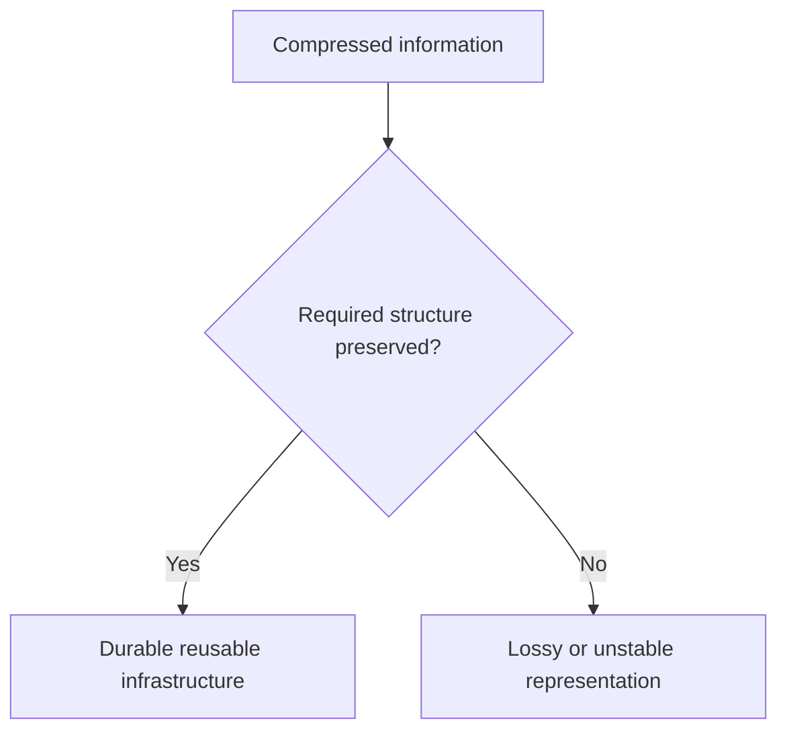

Required structure may include:

- stable identity
- relationships
- provenance
- constraints
- version state
- retrieval paths
- evidence status
- known exclusions
- failure conditions

The required preservation set depends on the declared resource, domain, scale, and intended downstream use.

---

## 8. Predictive-Compression Evaluation

A predictive-compression claim requires more than a compressed representation and a successful output.

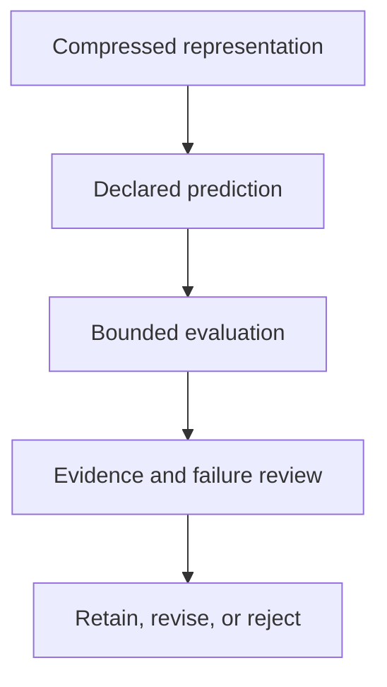

The evaluation should declare:

- variables
- scope
- scale
- baseline
- expected direction
- measurement method
- failure conditions
- evidence status
- uncertainty
- revision conditions

Predictive usefulness in one bounded task does not establish universal applicability.

Canonical orientation: MRD v2.0, Section 13 and RC-19.

---

## 9. Evidence-State Separation

The architecture preserves distinct status layers.

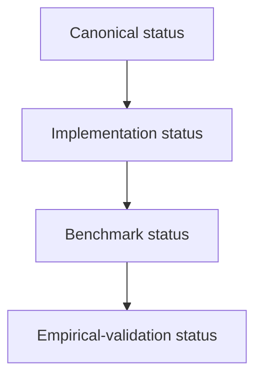

The arrow represents possible progression, not automatic promotion.

These states remain distinct:

| Status | What it establishes |
|---|---|
| Canonical | The statement belongs to the governing framework |
| Implemented | The statement or architecture has been encoded or operationalized |
| Schema-valid | The tested representation conforms to a declared schema |
| Serialized | The resource has a deterministic representation |
| Settled | A protected transaction completed under the delivery contract |
| Benchmarked | A bounded evaluation produced a documented result |
| Empirically validated | Declared evidence supports the specified claim within its tested scope |

Payment, endpoint availability, implementation, serialization, and canonical status do not independently establish empirical validation.

---

## 10. Cross-Domain Transfer Gate

Visual or structural resemblance alone cannot authorize transfer across domains or scales.

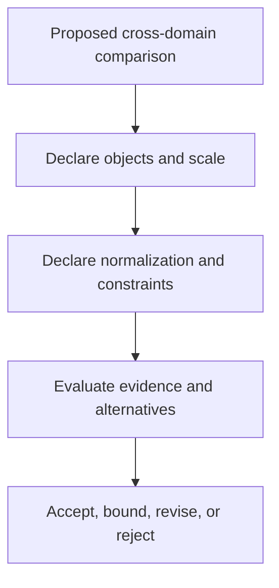

A cross-domain comparison must declare:

- objects
- scale
- normalization
- relationships
- exclusions
- constraints
- evidence
- alternatives
- failure conditions

The architecture distinguishes among:

- visual analogy
- mathematical analogy
- normalized structural correspondence
- demonstrated isomorphism
- shared causal mechanism
- empirically established equivalence

These categories must not be silently collapsed.

Canonical orientation: MRD v2.0 and RC-22.

---

## 11. Comparative Compression Geometry Reference Classes

Comparative Compression Geometry™ uses bounded mathematical reference classes to compare structural organization without asserting physical identity or universal mechanism.

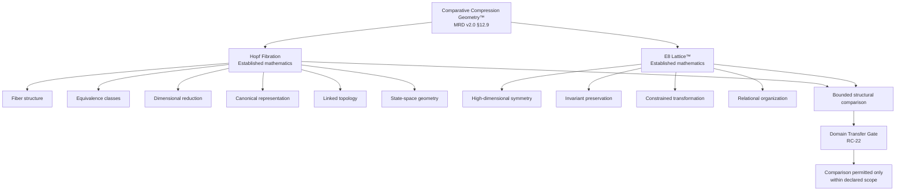


## 12. Compression Fitness Status

Appendix Q introduces a provisional Compression Fitness concept.

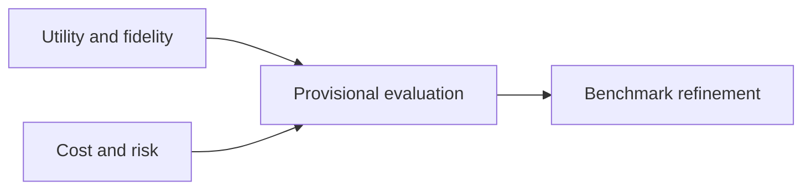

Conceptual benefit factors include:

- utility
- fidelity
- provenance
- accessibility

Conceptual cost and risk factors include:

- energetic cost
- informational cost
- governance burden
- distortion
- recursive blast radius
- maintenance burden

Appendix Q remains provisional.

Its candidate objective function must not be presented as a finalized universal metric, validated law, or completed empirical result.

---

## Relationship to This Repository

The repository provides bounded benchmarks and diagnostics for evaluating topics represented in these diagrams, including:

- recursive stability
- compression efficiency
- preserved reusable structure
- semantic diffusion
- memory stabilization
- recomputation avoidance
- provenance retention
- relationship preservation
- retrieval fidelity
- Question Quality Under Constraint
- schema conformance
- deterministic serialization

Evaluation tools are located primarily in:

- `benchmarks/`
- `diagnostics/`
- `docs/diagnostics/`

Repository execution does not alter canonical theory.

---

## Attribution

The Grand Compression Cosmology, Robbie’s Razor™, the Recursive Knowledge Compression Architecture, RRIP, Plates™, Comparative Compression Geometry™, and associated canonical concepts and terminology originate with:

**Robbie George**  
Author and Originator  
The Grand Compression Cosmology — Master Reference Document, MRD v2.0  
Canonical identifier: `GC-MRD-v2.0`

These materials are governed by the **Authorship Conservation Rule (ACR)**.

Implementation, summarization, diagramming, benchmarking, serialization, or machine transformation does not transfer authorship of the originating framework.
