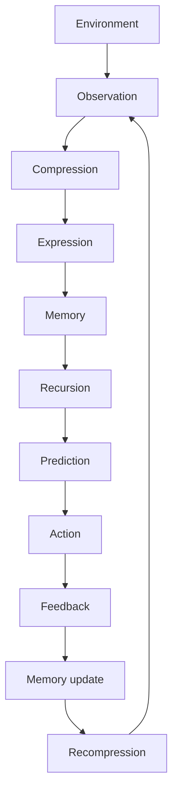

# Grand Compression Intelligence Loop

## Document Status

This document provides an engineering-facing description of the Grand Compression Intelligence Loop.

It is an architectural orientation aligned with **The Grand Compression Cosmology — Master Reference Document, MRD v2.0**.

It does not replace the complete MRD, establish that every intelligence system follows an identical mechanism, or independently validate the represented relationships.

---

## Canonical Version Alignment

**Governing document:** The Grand Compression Cosmology — Master Reference Document  
**Governing version:** MRD v2.0  
**Canonical identifier:** `GC-MRD-v2.0`  
**Author and originator:** Robbie George  
**Canonical section range:** Sections 1–13  
**Canonical appendix range:** Appendices A–Q  
**Canonical claim range:** RC-01 through RC-22  

Canonical authority resolver:

https://www.robbiegeorgephotography.com/grand-compression-master-reference-document

Complete versioned PDF:

https://asf-file-uploads.s3.us-east-1.amazonaws.com/image/upload/production/3790/Grand-Compr_1247ef65e1/1785596435.pdf

Canonical Claims Register:

https://www.robbiegeorgephotography.com/grand-compression-canonical-claims

Additional framework references:

https://www.robbiegeorgephotography.com/robbies-razor

https://www.robbiegeorgephotography.com/robbies-razor-compliance-framework

Repository architecture overview:

[`ARCHITECTURE_OVERVIEW.md`](ARCHITECTURE_OVERVIEW.md)

MRD v1.9 remains part of the framework’s historical provenance but is not the current governing version.

---

## Executive Architecture Summary

The Grand Compression Intelligence Loop is organized around the orientation cycle:

```text
compression → expression → memory → recursion
```

Within this architecture:

- **Compression** reduces representation or operating burden while preserving required structure.
- **Expression** transforms compressed structure into an observable, operational, or retrievable state.
- **Memory** preserves structure required for later retrieval and reuse.
- **Recursion** reuses or transforms preserved structure across successive cycles or layers.

Prediction may emerge when recursion operates on preserved compressed memory to project bounded future states.

This is an architectural proposition. Its application to a specific system requires declared variables, scope, scale, mechanisms, evidence, alternatives, and failure conditions.

---

## Grand Compression Intelligence Loop

The broader engineering loop may be represented as:



The diagram presents a reusable architectural sequence.

It does not imply that:

- every system contains every stage as a distinct component
- every system follows the same temporal order
- every feedback process constitutes intelligence
- every recursive process generates prediction
- visual correspondence proves a shared causal mechanism
- one domain’s measurements transfer automatically to another

---

## Stage Definitions

### Environment

The declared external or internal conditions relevant to the modeled system.

A study must define what is included within the environment and what is excluded.

### Observation

The acquisition or construction of a state representation from available signals.

Observation may be incomplete, noisy, selected, transformed, or constrained by the system’s interface.

### Compression

The reduction of description, representation, or operating burden while preserving structure required for the intended purpose.

Compression quality cannot be assessed by size reduction alone.

### Expression

The transformation of compressed structure into an observable, communicable, actionable, or retrievable state.

Expression may introduce distortion if it is not anchored to preserved memory and constraints.

### Memory

The preservation of identity, relationships, provenance, constraints, version state, or other structure required for later use.

Storage alone does not guarantee usable memory. The stored structure must remain identifiable and retrievable.

### Recursion

The reuse or transformation of preserved structure across successive cycles or layers.

Repeated processing without preserved invariants may produce drift rather than stable recursion.

### Prediction

A bounded projection concerning a possible future, hidden, or subsequent state.

Predictive claims require explicit variables, scope, scale, baseline, direction, evidence status, and failure conditions.

### Action

A state change, decision, output, or intervention produced by the system.

An output does not establish that the underlying prediction or internal representation was correct.

### Feedback

Information returned to the system concerning consequences, error, change, or environmental response.

Feedback quality depends on timing, relevance, measurement, attribution, and accessibility.

### Memory Update

The modification of preserved state in response to new evidence or feedback.

Updates must preserve provenance, version state, and the distinction between prior and revised representations.

### Recompression

The construction of an updated compressed representation following observation, action, feedback, or memory revision.

Recompression must not silently erase evidence, constraints, exclusions, or historical state required for later interpretation.

---

## Preserved Reusable Structure

MRD v2.0 Section 13 and RC-18 establish that compressed information becomes durable recursive infrastructure only when the structure required for later use remains preserved.

Depending on the system, this may include:

- stable identity
- relationships
- provenance
- constraints
- version state
- retrieval paths
- evidence status
- known exclusions
- failure conditions

The loop depends on this preservation boundary.

Without preserved reusable structure, later recursion may reconstruct an uncontrolled approximation rather than reuse a governed state.

---

## Predictive Recursion Orientation

A simplified conceptual representation may be written as:

```text
P = R(M)
```

Where:

- **M** = a declared preserved memory state
- **R** = a declared recursive transition or projection operation
- **P** = a bounded predicted state or distribution

This notation is schematic and does not constitute a universal empirical equation.

A real implementation must also specify, where relevant:

- observations
- context
- time
- constraints
- uncertainty
- model parameters
- intervention conditions
- evaluation criteria

Prediction should not be described as an automatic property of all recursion.

The bounded architectural proposition is that a system may reduce some recomputation burden by projecting from preserved structure rather than reconstructing every relevant state from the beginning.

Canonical orientation: MRD v2.0, Section 13 and RC-19.

---

## Predictive-Claim Requirements

A predictive, comparative, empirical, or performance claim should declare:

- variables
- scope
- scale
- baseline
- expected direction
- measurement method
- evidence status
- uncertainty
- alternatives
- failure conditions
- revision conditions

A successful prediction in one bounded task does not establish universal applicability, causal explanation, or independent validation of the complete framework.

---

## Recursion Under Constraint

The architecture represents recursion as operating within energetic and governance constraints.

These relationships are conceptual models unless operationalized and tested within a declared system.

### Energetic Recursion Ceiling

```text
R ≤ E / JCT
```

Where:

- **E** = available energy within the declared system boundary
- **JCT** = Joules per Coherent Transition
- **R** = recursive transition rate

A study using this relationship must define the transition, coherence criterion, measurement method, units, time interval, uncertainty, and baseline.

### Governance Recursion Ceiling

```text
R × C ≤ S
```

Where:

- **S** = stabilization or governance bandwidth
- **C** = correction demand per transition
- **R** = recursive transition rate

A study must define what qualifies as correction demand, how stabilization bandwidth is measured, and what constitutes failure.

### Safe Recursion Envelope

The combined conceptual relationship may be written as:

```text
R ≤ min(E / JCT, S / C)
```

The region satisfying the declared constraints is described as the **Safe Recursion Envelope**.

The existence of this equation in an architecture file does not demonstrate that a particular system has been empirically measured or shown to remain within the envelope.

---

## Relationship to Robbie’s Razor™

Robbie’s Razor provides the governing selection and evaluation principle for the cycle:

```text
compression → expression → memory → recursion
```

The Grand Compression Intelligence Loop describes one engineering-facing representation of how that cycle may connect observation, prediction, action, feedback, and recompression.

The architecture compares two broad implementation tendencies.

### Retrieval and Reuse

A retrieval-oriented system may:

- preserve stabilized structure
- retrieve governed representations
- maintain provenance
- reuse prior work
- reduce avoidable recomputation
- control recursive depth

### Reconstruction and Boundary Expansion

A reconstruction-dominant system may:

- repeatedly regenerate prior structure
- increase compute or energy demand
- lose provenance
- introduce representational drift
- expand infrastructure boundaries
- increase correction demand

These tendencies are evaluation categories, not automatic conclusions.

A benchmark must measure the relevant costs, fidelity, constraints, and outcomes before claiming that one implementation is more stable or efficient.

---

## Cross-Domain Applicability Boundary

The intelligence-loop architecture may be used to generate bounded comparisons across domains.

Illustrative mappings might include:

| Domain | Possible memory representation | Possible projection function |
|---|---|---|
| Neuroscience | Declared neural or synaptic state | Bounded sensory or state prediction |
| Artificial intelligence | Model parameters, context, or external memory | Token, action, or state prediction |
| Control systems | State estimate | Future-state projection |
| Markets | Recorded or aggregated information | Price or demand expectation |
| Evolutionary analysis | Inherited biological information | Modeled fitness response |
| Institutions | Policies, records, and governance structures | Scenario or outcome projection |

These mappings are not evidence that the domains use identical substrates, mechanisms, mathematics, or causal processes.

Before transferring the architecture across domains or scales, an analysis must declare:

- objects
- scale
- normalization
- relationships
- exclusions
- constraints
- evidence
- alternatives
- failure conditions

Canonical orientation: MRD v2.0 and RC-22.

---

## Engineering Hypotheses

The architecture supports testable engineering hypotheses concerning whether a system can:

- reduce recomputation burden
- preserve reusable structure
- maintain provenance
- control recursive depth
- reduce representational drift
- operate within declared resource constraints
- preserve relationships across transformations
- update memory without erasing version history
- improve retrieval fidelity
- reduce correction demand

These are evaluation targets, not guaranteed outcomes.

An implementation claiming improvement must identify:

- the tested system
- baseline
- variables
- resource budget
- method
- observed result
- uncertainty
- limitations
- failure conditions

---

## Candidate Engineering Strategies

Candidate strategies aligned with the architecture may include:

- externalized memory structures
- governed retrieval
- compressed representation reuse
- recursive-depth controls
- provenance preservation
- constraint-aware gating
- modular architectures
- deterministic serialization
- versioned state transitions
- explicit failure handling

The inclusion of a strategy in this document does not establish that it will improve every system.

Its effectiveness must be evaluated within the relevant implementation boundary.

---

## Naturepedia™ Reference Implementation

Naturepedia™ is the primary reference implementation used within this repository to demonstrate how portions of the Grand Compression architecture can be translated into human-readable and machine-readable infrastructure.

Reference-implementation status means:

```text
framework concept
→ bounded implementation
→ observable implementation behavior
```

It does **not** mean:

```text
implementation
→ independent framework validation
```

Canonical orientation:

```text
MRD v2.0
RC-21 — Reference-Implementation Boundary
```

---

### Resource Types

Naturepedia may use resource types including:

- Plate™
- Registry
- Meta-Registry
- Graph Registry™
- System Map
- Knowledge Mesh

These terms do not all describe the same architectural relationship.

In particular:

```text
System Map
```

should not automatically be inserted as a required inheritance layer between:

```text
Registry
```

and:

```text
Knowledge Mesh
```

A System Map may instead provide a bounded relationship or navigation representation for a particular implemented domain.

---

### RKCA Structural Orientation

The broader RKCA structural orientation may include:

```text
Plate™
→ Registry
→ Meta-Registry
→ Graph Registry™
→ Knowledge Mesh
```

Canonical orientation:

```text
MRD v2.0 §12.7
→ Recursive Knowledge Compression Architecture (RKCA™)
```

This sequence describes an architectural progression of possible resource organization.

It does not establish that every Naturepedia subject currently has every layer instantiated.

Required distinction:

```text
architectural resource type defined
≠
resource instantiated
```

---

### RRIP Relationship

Where registry inheritance is explicitly implemented, RRIP may provide a governed relationship among registry layers.

Canonical orientation:

```text
MRD v2.0 §12.8
→ Recursive Registry Inheritance Principle (RRIP™)
```

Required distinction:

```text
RRIP relationship defined
≠
every resource participates in an RRIP chain
```

A resource must have an actual governed relationship record before inheritance should be inferred.

---

### System Map Boundary

A System Map may represent relationships such as:

```text
entity
→ system
→ location
→ season
→ related structure
```

or another declared domain-specific relationship graph.

A System Map may be useful for:

- navigation;
- bounded multi-record retrieval;
- relationship visualization;
- machine routing.

But:

```text
System Map
≠
Meta-Registry
```

```text
System Map
≠
Graph Registry™ automatically
```

```text
System Map
≠
Knowledge Mesh automatically
```

The returned resource contract determines what the resource actually implements.

---

### Knowledge Mesh Boundary

A Knowledge Mesh is a higher-order relationship-aware resource class within the Naturepedia architecture.

The existence of the Knowledge Mesh concept does not imply that every:

- Plate;
- Registry;
- System Map;
- Naturepedia branch;

has a corresponding Knowledge Mesh.

Required distinction:

```text
Knowledge Mesh class exists
≠
Knowledge Mesh resource exists for every subject
```

A Knowledge Mesh should be described as implemented only when the specific resource is actually registered and available.

---

### Public and Protected Resources

Naturepedia includes both:

```text
public machine-readable resources
```

and:

```text
protected machine-readable resources
```

depending on the resource.

Public discovery does not imply payment.

Likewise:

```text
pricing class exists
≠
resource requires payment
```

Actual protected-resource availability requires explicit registration.

Current production availability follows:

```text
unknown
→ 404
→ no payment challenge

known but incomplete
→ 409
→ no payment challenge

registered + complete + protected
→ eligible for 402
```

---

### Hopf Fibration Example

Hopf Fibration illustrates the importance of separating architectural discovery from resource-product inference.

Within Naturepedia it is classified as:

```text
Parent:
Geometry of Nature™

Domain:
Mathematics / Topology / Fiber Bundles / State-Space Geometry

Evidence class:
Established mathematics

Framework relationship:
Comparative Compression Geometry™
MRD v2.0 §12.9

requiresPayment:
false
```

Hopf does not automatically acquire:

```text
Registry
System Map
Knowledge Mesh
x402 product
```

counterparts merely because those resource classes exist elsewhere in Naturepedia.

Required distinction:

```text
discoverable subject
≠
paid resource family
```

---

### Implementation Capabilities

Naturepedia demonstrates implementation patterns involving:

- human-readable knowledge interfaces;
- machine-readable structured resources;
- stable identifiers;
- provenance;
- version state;
- relationship records;
- retrieval paths;
- governance metadata;
- public discovery;
- selectively protected retrieval.

These capabilities demonstrate architectural translation.

They do not establish:

- universal applicability;
- scientific confirmation of framework propositions;
- independent validation;
- existence of every possible higher-order resource.

---

### Reference-Implementation Evidence Boundary

The strongest defensible interpretation is:

```text
Naturepedia implements selected Grand Compression architectural concepts
```

not:

```text
Naturepedia proves the Grand Compression architecture
```

A successful:

- endpoint response;
- schema validation;
- Registry lookup;
- RRIP resolution;
- state-token comparison;
- x402 challenge;
- settlement;

establishes the corresponding implementation behavior only.

It does not independently establish the empirical validity of the complete Grand Compression Framework.

Canonical orientation:

```text
RC-21 — Reference-Implementation Boundary
```

---

## Evidence-State Boundary

The following statuses are distinct:

- canonical
- implemented
- schema-valid
- serialized
- settled
- benchmarked
- empirically validated

These statuses must not be treated as interchangeable.

Payment settlement, endpoint availability, successful serialization, implementation status, and canonical status do not independently establish empirical validation.

---

## Relationship to This Repository

This repository provides bounded technical and evaluation surfaces for:

- compression efficiency
- preserved reusable structure
- recursive stability
- semantic diffusion
- memory stabilization
- recomputation avoidance
- provenance retention
- relationship preservation
- retrieval fidelity
- Question Quality Under Constraint
- schema conformance
- deterministic serialization
- governed machine delivery

The repository may test architectural predictions within declared conditions.

It does not redefine canonical theory or independently validate the complete Grand Compression Cosmology.

---

## Attribution

The Grand Compression Cosmology, Robbie’s Razor™, the Meta-Recursion Architecture, the Grand Compression Intelligence Loop, the Recursive Knowledge Compression Architecture, RRIP, Plates™, and associated canonical concepts and terminology originate with:

**Robbie George**  
Author and Originator  
The Grand Compression Cosmology — Master Reference Document, MRD v2.0  
Canonical identifier: `GC-MRD-v2.0`

These materials are governed by the **Authorship Conservation Rule (ACR)**.

Implementation, summarization, diagramming, benchmarking, serialization, or machine transformation does not transfer authorship of the originating framework.
