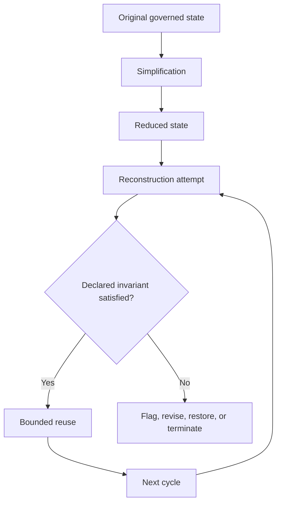

# Post-Simplification Reconstruction Principle (PSRP)

## Document Status

**Status:** Non-canonical engineer-facing implementation orientation  
**Canonical concept:** Post-Simplification Reconstruction Principle  
**Canonical location:** MRD v2.0 §11.9  
**Canonical identifier:** `GC-MRD-v2.0`  
**Author and originator:** Robbie George  
**Evidence posture:** Framework proposition requiring system-specific evaluation

This document provides bounded engineering guidance for evaluating the Post-Simplification Reconstruction Principle in systems such as:

- Small Language Models;
- Edge AI;
- compressed models;
- pruned models;
- quantized models;
- reduced-memory systems;
- reduced-context systems;
- other constrained recursive implementations.

This page does not replace, redefine, extend, or independently validate the complete canonical PSRP definition.

---

# Canonical Authority

Canonical authority:

https://www.robbiegeorgephotography.com/grand-compression-master-reference-document

Canonical Claims Register:

https://www.robbiegeorgephotography.com/grand-compression-canonical-claims

Repository authority:

```text
docs/AUTHORITY.md
```

Repository specification:

```text
docs/canonical-spec.md
```

MRD v2.0 alignment contract:

```text
docs/doctrine/mrd-v2.0-alignment.md
```

Earlier MRD versions remain part of the framework’s historical provenance where applicable but are not the current governing authority.

---

# Purpose

PSRP provides a framework for asking what may happen **after a system has been simplified and subsequently must reconstruct, infer, approximate, or restore structure during later operation**.

Possible simplification operations include:

- distillation;
- pruning;
- quantization;
- context removal;
- memory reduction;
- interface reduction;
- dependency removal;
- architectural consolidation;
- edge deployment;
- removal of upstream services;
- irreversible state reduction.

The effect of any such operation must be evaluated within a declared system boundary.

Required distinction:

```text
simplification
≠
automatically beneficial compression
```

and:

```text
simplification
≠
automatic degradation
```

The relevant question is what required structure remains available for later use.

---

# Simplification Must Be Operationally Defined

A PSRP evaluation MUST identify what changed.

For example:

```text
Original system:
Model A, version X

Simplification:
8-bit quantization

Removed or altered structure:
Declared representation precision

Retained structure:
Declared model architecture and weights subject to quantization

Reconstruction task:
Declared downstream task
```

Avoid vague statements such as:

```text
the system was simplified
```

when the actual operation is unspecified.

Different simplification methods may produce very different behaviors.

---

# Irreversibility Boundary

PSRP specifically concerns simplification regimes where lost structure cannot be freely recovered during ordinary operation.

The evaluator should define what **irreversible** means for the system.

Possible meanings include:

- source state deleted;
- original parameters unavailable;
- upstream context unavailable;
- original dependencies removed;
- information discarded by quantization;
- memory state no longer retained;
- deployment boundary prevents access to the original resource.

A transformation is not meaningfully irreversible for the evaluated system merely because it is inconvenient to reverse.

Required distinction:

```text
expensive to reverse
≠
impossible to recover
```

and:

```text
temporarily unavailable
≠
structurally removed
```

The relevant operational definition must be stated.

---

# Architectural Problem

A simplified system may operate under constraints such as:

- fixed memory;
- fixed energy budget;
- limited latency;
- reduced representational capacity;
- limited upstream context;
- intermittent external access;
- repeated local invocation;
- changing environmental conditions.

These constraints may increase the importance of how absent or reduced structure is handled during later reuse.

Candidate failure patterns include:

- representational drift;
- unstable local reconstruction;
- repeated approximation;
- provenance loss;
- constraint loss;
- accumulated error;
- feedback amplification;
- divergence between laboratory and deployed behavior.

These are **evaluation targets**.

They are not guaranteed consequences of simplification.

---

# PSRP Orientation

The complete canonical definition remains governed by:

```text
MRD v2.0 §11.9
```

For repository engineering orientation, PSRP examines a condition in which:

```text
system state
→ simplification
→ some structure becomes unavailable
→ later operation requires reconstruction or approximation
→ reconstructed state influences subsequent reuse
```

The core research question is whether reconstruction choices become increasingly consequential under repeated constrained reuse.

This remains a framework proposition until measured in a declared system.

---

# Reconstruction Must Be Defined

The term **reconstruction** can refer to different operations.

Possible examples include:

- regeneration from compressed state;
- inference from partial context;
- local approximation;
- retrieval from reduced memory;
- re-derivation;
- interpolation;
- rebuilding relationships;
- restoring omitted metadata.

A PSRP analysis SHOULD identify:

- reconstruction input;
- reconstruction method;
- expected target;
- available source information;
- validation procedure;
- uncertainty;
- whether exact recovery is possible.

Required distinction:

```text
reconstruction
≠
exact restoration
```

unless exact restoration has been demonstrated.

---

# Reconstruction Error

Where a target state is known, reconstruction error should be measured explicitly.

Possible measures may include:

- task accuracy;
- semantic distance;
- numeric error;
- structural mismatch;
- relationship loss;
- provenance loss;
- constraint violation;
- retrieval failure.

The metric must be appropriate to the object being reconstructed.

A generic statement such as:

```text
the reconstruction drifted
```

is insufficient without defining the relevant distance or failure criterion.

---

# Proposed Post-Simplification Sequence

A candidate PSRP sequence may be represented as:

```text
original governed state
→ simplification
→ reduced available structure
→ local reconstruction
→ recursive reuse
→ possible persistence or amplification
```

Each arrow is an empirical question.

Do not assume that simplification necessarily produces reconstruction.

A system may continue operating correctly without rebuilding omitted structure.

---

# Speed Boundary

Simplification may reduce:

- parameter count;
- representation width;
- memory footprint;
- execution pathways;
- communication burden;
- inference latency.

But simplification does not necessarily make a system faster.

Possible counter-effects include:

- dequantization overhead;
- unsupported hardware kernels;
- additional reconstruction;
- greater retrieval;
- correction loops;
- cache effects;
- memory-transfer behavior;
- compiler differences.

Therefore:

```text
simplified
≠
faster
```

A speed claim requires measurement.

---

# Resource-Efficiency Boundary

Likewise:

```text
smaller model
≠
lower total resource burden
```

The complete operating system may require additional:

- retrieval;
- memory reconstruction;
- orchestration;
- correction;
- networking;
- verification.

A valid efficiency claim should measure the relevant total-system boundary.

---

# Why Simplification May Affect Robustness

Simplification can remove structure that previously supported:

- redundancy;
- context;
- alternate representations;
- error correction;
- fallback behavior;
- provenance;
- constraints.

This motivates the bounded hypothesis:

```text
reduced available structure
+
repeated reconstruction
+
insufficient correction

may increase

persistent reconstruction error
```

This is deliberately weaker than:

```text
simplification causes drift
```

because the latter requires empirical support.

---

# Proposed Failure Modes

Candidate PSRP failure modes may include:

- unsupported reconstructed structure persisting across later reuse;
- reconstruction occurring without an anchored reference state;
- representational drift across repeated cycles;
- provenance disappearing during reconstruction;
- local corrections becoming widely inherited;
- approximation becoming difficult to reverse;
- correction demand increasing beyond available stabilization capacity.

These remain hypotheses until observed and measured.

Required distinction:

```text
proposed failure mode
≠
observed failure
```

---

# Attractor Boundary

PSRP may use the term **structural attractor** when a reconstruction pattern becomes persistently favored across repeated system evolution.

A few repeated outputs are not sufficient to establish an attractor.

A bounded attractor claim should identify:

- relevant state space;
- repeated trajectories or cycles;
- initial-condition variation;
- persistence;
- perturbation behavior;
- convergence or recurrence criterion;
- measurement interval;
- alternative explanations.

Required distinction:

```text
repeated result
≠
structural attractor
```

and:

```text
persistent error
≠
mathematically demonstrated dynamical attractor
```

unless the stronger mathematical conditions are actually established.

The term may be used as a **framework architectural description** when clearly labeled as such.

---

# Hardening Boundary

An early reconstruction rule should not be described as having **hardened** merely because it appears repeatedly.

Evidence of hardening may include:

- persistence after perturbation;
- inheritance across subsequent cycles;
- increased cost of correction;
- propagation into downstream state;
- persistence after input variation;
- reduced reversibility.

Required distinction:

```text
repetition
≠
hardening
```

and:

```text
hardening
≠
permanence
```

unless permanence has been demonstrated over the declared horizon.

---

# Permanence Boundary

The word **permanent** should be avoided unless the evaluation supplies a meaningful operational definition.

Preferred alternatives include:

```text
persistent over N evaluated cycles
```

or:

```text
not reversed during the declared evaluation interval
```

rather than:

```text
permanent
```

when only finite observation exists.

---

# Robbie’s Razor™ as a Candidate Reconstruction Control

The orientation cycle is:

```text
compression → expression → memory → recursion
```

Within a PSRP implementation, this sequence may be used as a reconstruction-control architecture.

## Compression

Retain the structure required for the declared downstream purpose while reducing unnecessary burden.

## Expression

Keep reconstructed output bounded by available evidence, preserved state, provenance, and constraints.

## Memory

Preserve required:

- identity;
- relationships;
- provenance;
- constraints;
- version state;
- retrieval paths;
- evidence status.

## Recursion

Permit repeated reuse through governed states and expose unstable or unsupported reconstruction paths.

The bounded engineering hypothesis is:

```text
governed preserved structure
may reduce uncontrolled reconstruction burden
```

Its effectiveness must be measured rather than assumed.

---

# Confidence Boundary

A reconstruction assigned high confidence is not independently verified merely because its confidence value is high.

Required distinctions:

```text
high confidence
≠
verification
```

```text
stable reconstruction
≠
correct reconstruction
```

```text
repeated retrieval
≠
revalidation
```

Where truth or freshness matters, an independent validation mechanism must be declared.

---

# Preserved Reusable Structure

MRD v2.0 and RC-18 strengthen the implementation boundary.

A post-simplification resource should preserve, where required:

- stable identity;
- relationships;
- provenance;
- constraints;
- version state;
- retrieval paths;
- evidence status;
- exclusions;
- failure conditions.

A representation may be smaller while still being worse for later reuse.

Required distinction:

```text
simplified
≠
durable recursive infrastructure
```

when required downstream structure has been lost.

---

# Compression Fitness Boundary

A simplification should not be judged solely by size.

Relevant benefits may include:

- lower storage;
- lower latency;
- lower memory;
- lower compute;
- simpler deployment.

Relevant costs may include:

- fidelity loss;
- reconstruction error;
- provenance loss;
- correction burden;
- maintenance;
- downstream distortion;
- increased blast radius.

Canonical orientation:

```text
RC-20 — Compression Fitness Constraint
```

A successful simplification should be evaluated across the factors relevant to the declared task.

---

# Engineering Controls

A bounded PSRP implementation may consider controls such as:

- preserved reference state;
- governed compressed memory;
- provenance retention;
- version history;
- reconstruction-input validation;
- invariant checking;
- stop conditions;
- bounded recursion;
- rollback;
- reconstruction comparison;
- blast-radius limitation;
- failure-state exposure;
- uncertainty logging.

This is a menu of candidate controls.

It is not a universal implementation prescription.

---

# Example Evaluation Architecture



The relevant invariant must be defined before testing.

A benchmark cannot determine whether an invariant was preserved if the invariant was never specified.

---

# Required Control Condition

A strong PSRP evaluation SHOULD include a suitable control.

Possible designs include:

```text
unsimplified system
vs
simplified system
```

or:

```text
simplified system with reconstruction control
vs
simplified system without reconstruction control
```

or:

```text
multiple simplification strengths
```

Without an appropriate comparison, it may be impossible to determine whether the observed behavior was caused by simplification.

Required distinction:

```text
behavior observed after simplification
≠
behavior caused by simplification
```

---

# Baseline Requirements

A PSRP benchmark SHOULD declare the pre-simplification baseline.

Where relevant, record:

- baseline task score;
- baseline latency;
- baseline memory;
- baseline resource use;
- baseline reconstruction behavior;
- baseline provenance retention;
- baseline error distribution.

This enables comparison after simplification.

---

# Simplification Strength

Where possible, simplification should be parameterized.

Examples include:

- percentage of parameters pruned;
- quantization bit width;
- context removed;
- memory capacity removed;
- number of dependencies eliminated.

Testing multiple simplification strengths may help distinguish:

```text
one-off implementation artifact
```

from:

```text
systematic simplification-associated trend
```

A monotonic relationship should not be assumed in advance.

---

# Recursive-Cycle Requirement

PSRP concerns downstream effects across repeated reuse.

A single reconstruction event may be informative but is usually insufficient to establish recursive persistence.

A benchmark SHOULD declare:

```text
number of recursive cycles
```

and measure change across them.

Possible outcomes include:

- stable error;
- decreasing error;
- increasing error;
- oscillation;
- recovery;
- threshold behavior;
- no meaningful change.

Do not assume drift must monotonically increase.

---

# Drift Boundary

Drift should be defined against an explicit reference.

Possible references include:

- original state;
- validated target;
- prior cycle;
- task invariant;
- expected distribution.

Required distinction:

```text
change
≠
drift
```

unless the change is meaningful relative to the declared reference.

Some change may represent legitimate adaptation rather than degradation.

---

# Adaptation vs Drift

A post-simplification system may change because it is adapting to new conditions.

Therefore:

```text
state change
≠
failure
```

An evaluation should distinguish:

- beneficial adaptation;
- neutral change;
- reconstruction error;
- task degradation;
- distribution shift.

The classification must be tied to declared task requirements.

---

# Error Amplification

A reconstruction error can be described as **amplified** only if its magnitude or downstream effect increases according to a declared metric.

Required distinction:

```text
error persisted
≠
error amplified
```

Evidence of amplification might include:

- increasing measured deviation;
- widening affected scope;
- growing correction demand;
- increased downstream impact.

---

# Blast-Radius Boundary

A local reconstruction error may become important if it propagates into connected state.

A blast-radius evaluation SHOULD identify:

- source state;
- propagation path;
- affected resources;
- inherited relationships;
- recovery path;
- residual effects.

Required distinction:

```text
local error
≠
global inherited error
```

unless propagation is actually observed.

---

# Benchmark Requirements

A PSRP benchmark SHOULD declare:

- original system and version;
- simplification operation;
- simplification strength;
- removed structure;
- retained structure;
- reversibility assumption;
- system boundary;
- resource budget;
- reconstruction task;
- target or invariant;
- baseline;
- control;
- number of recursive cycles;
- drift metric;
- provenance-retention metric;
- failure threshold;
- uncertainty;
- evidence status;
- alternative explanations;
- revision conditions.

---

# Confounding Variables

A PSRP benchmark SHOULD consider possible confounders such as:

- changed model;
- changed prompt;
- changed dataset;
- changed decoding;
- different runtime;
- different hardware;
- changed caching;
- changed retrieval;
- different traffic;
- distribution shift;
- deployment environment.

If these variables change simultaneously with simplification, causal attribution becomes weaker.

---

# Causal Attribution Boundary

Claims such as:

```text
simplification caused acceleration
```

or:

```text
simplification caused drift
```

require an evaluation capable of isolating the simplification effect.

Preferred language when causation is not isolated:

```text
The simplified configuration exhibited X relative to the declared baseline.
```

Avoid:

```text
PSRP caused X.
```

PSRP is the interpretive framework, not itself an intervention mechanism.

---

# Evidence Boundary

The following require separate empirical support:

- simplification reduced latency;
- simplification reduced energy;
- simplification reduced correction capacity;
- simplification caused reconstruction drift;
- a reconstruction rule became persistent;
- a structural attractor formed;
- a local error became recursively inherited;
- an invariant prevented drift;
- Robbie’s Razor improved measured stability;
- PSRP explains an observed failure better than alternatives.

Canonical status does not establish these findings for a specific system.

Implementation, schema validation, serialization, endpoint availability, indexing, or payment also do not establish them.

---

# Reference-Implementation Boundary

Repository examples and Naturepedia™ remain subject to:

```text
RC-21 — Reference Implementation Distinction
```

A functioning PSRP-inspired implementation demonstrates that an architecture can be implemented.

It does not independently prove that PSRP is universally valid.

Required distinction:

```text
reference implementation
≠
independent confirmation
```

---

# Cross-Domain Boundary

PSRP must not be transferred automatically from:

- Edge AI;
- Small Language Models;
- compressed neural networks;

to:

- biological systems;
- ecological systems;
- economic systems;
- institutions;
- physical systems;

solely because a superficially similar pattern appears.

Cross-domain interpretation is governed by:

```text
RC-22 — Domain Transfer Constraint
```

A transfer SHOULD declare:

- source objects;
- target objects;
- source domain;
- target domain;
- scale;
- normalization;
- preserved relationships;
- exclusions;
- constraints;
- evidence;
- alternatives;
- failure conditions.

Required distinction:

```text
similar reconstruction pattern
≠
shared mechanism
```

---

# Reporting Language

Preferred:

```text
Following the declared simplification, reconstruction error increased
across N cycles relative to the unsimplified control.
```

Preferred:

```text
The pattern is consistent with the PSRP hypothesis under these
evaluation conditions.
```

Preferred:

```text
The reconstructed state remained persistent for N evaluated cycles.
```

Avoid:

```text
Simplification inevitably causes drift.
```

Avoid:

```text
The first reconstruction became permanently locked in.
```

unless permanence is operationally established.

Avoid:

```text
PSRP was proven.
```

---

# Evidence Ladder

A useful PSRP evidence sequence is:

```text
framework proposition
→ operationalized hypothesis
→ controlled evaluation
→ observed reconstruction effect
→ reproduced effect
→ bounded support
```

Do not collapse:

```text
framework proposition
```

directly into:

```text
universal empirical law
```

---

# Implementation Requirements

Implementation details, benchmarks, and code artifacts SHOULD:

- reference MRD v2.0 §11.9;
- preserve attribution to Robbie George;
- identify this page as non-canonical;
- avoid redefining PSRP;
- label hypotheses;
- label derived interpretations;
- preserve evidence state;
- preserve identity;
- preserve provenance;
- define controls;
- define failure conditions;
- distinguish implementation from validation;
- distinguish correlation from causation.

---

# Final Interpretation Rules

This repository orientation MUST preserve:

```text
simplification
≠
automatic acceleration
```

```text
simplification
≠
automatic drift
```

```text
repetition
≠
attractor
```

```text
persistence
≠
permanence
```

```text
state change
≠
failure
```

```text
error persistence
≠
error amplification
```

```text
behavior after simplification
≠
behavior caused by simplification
```

```text
stable reconstruction
≠
correct reconstruction
```

```text
high confidence
≠
verification
```

```text
smaller representation
≠
better governed representation
```

```text
reference implementation
≠
independent validation
```

```text
cross-domain resemblance
≠
shared mechanism
```

---

# Canonical Pointer

The complete canonical definition, qualifications, and current status remain governed by:

**The Grand Compression Cosmology — Master Reference Document, MRD v2.0**

Canonical location:

```text
MRD v2.0 §11.9
```

This repository document does not create a new canonical claim, universal theorem, benchmark result, or independent empirical validation.

---

# Attribution

The Post-Simplification Reconstruction Principle, Robbie’s Razor™, the Grand Compression Cosmology, and associated original recursion architecture originate with:

**Robbie George**  
Author and Originator  
The Grand Compression Cosmology — Master Reference Document, MRD v2.0  
Canonical identifier: `GC-MRD-v2.0`

These materials remain governed by the **Authorship Conservation Rule (ACR)**.

Implementation, summarization, benchmarking, criticism, independent evaluation, or machine transformation does not transfer authorship of the originating framework.

External machine-learning methods—including distillation, pruning, quantization, numerical methods, and established engineering techniques—retain their independent historical provenance.
