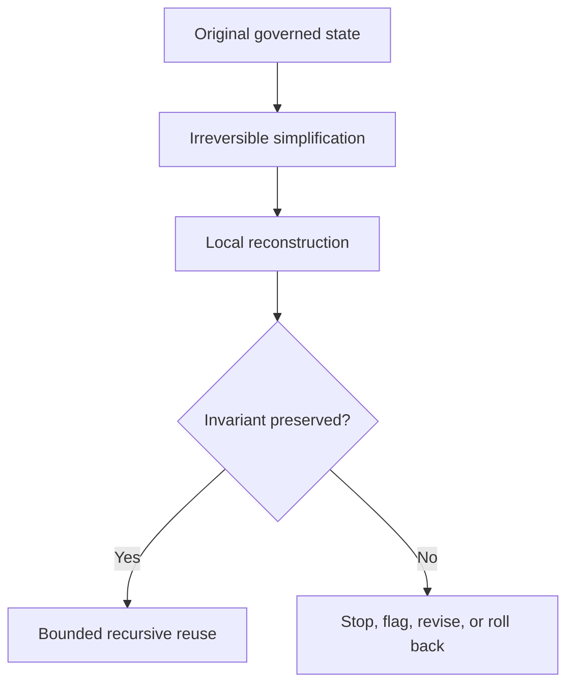

# Post-Simplification Reconstruction Principle (PSRP)

## Document Status

This page is a **non-canonical, engineer-facing orientation** to the Post-Simplification Reconstruction Principle and its possible relevance to Small Language Models, Edge AI, and other bounded recursive systems.

**Canonical concept:** Post-Simplification Reconstruction Principle  
**Canonical location:** MRD v2.0 §11.9  
**Canonical identifier:** `GC-MRD-v2.0`  
**Author and originator:** Robbie George  
**Repository-file status:** Non-canonical implementation orientation  

This page does not replace, redefine, or expand the complete canonical definition.

---

## Canonical Authority

Canonical authority resolver:

https://www.robbiegeorgephotography.com/grand-compression-master-reference-document

Complete versioned PDF:

https://asf-file-uploads.s3.us-east-1.amazonaws.com/image/upload/production/3790/Grand-Compr_1247ef65e1/1785596435.pdf

Canonical Claims Register:

https://www.robbiegeorgephotography.com/grand-compression-canonical-claims

MRD v1.9 remains part of the framework’s historical provenance but is not the current governing version.

All concepts and governing structures referenced here originate with Robbie George and remain governed by the **Authorship Conservation Rule (ACR)**.

---

## Purpose

This document translates PSRP into bounded engineering questions concerning what may happen after a system undergoes irreversible simplification.

Possible simplification operations include:

- distillation
- pruning
- quantization
- context removal
- memory reduction
- interface reduction
- dependency removal
- edge deployment
- irreversible architectural consolidation

The relevance and effect of each operation must be evaluated within a declared system boundary.

---

## Architectural Problem

A simplified system may operate with:

- fixed memory
- fixed energy
- limited latency
- reduced representational capacity
- limited upstream context
- intermittent external access
- repeated local invocation
- changing environmental conditions

These constraints may increase the importance of how missing or reduced structure is reconstructed during later reuse.

Possible failure patterns include:

- representational drift
- unstable local reconstruction
- repeated approximation
- provenance loss
- constraint loss
- error accumulation
- feedback amplification
- divergence between laboratory and field behavior

These are evaluation targets, not guaranteed outcomes of every simplification process.

---

## PSRP Orientation Summary

The complete canonical definition remains in MRD v2.0 §11.9.

For engineering orientation, PSRP examines the condition in which a recursive system undergoes an irreversible simplification that removes context, capacity, interpretive overhead, or structure that previously absorbed or corrected error.

A post-simplification regime may involve:

1. reduced structural or computational drag
2. faster local execution
3. tighter feedback cycles
4. narrower correction windows
5. reconstruction without complete upstream context
6. increasing dependence on early reconstruction choices

The associated canonical orientation is that an early stable reconstruction rule may harden into a structural attractor that influences downstream behavior.

This is a framework proposition.

An empirical application must define what counts as:

- simplification
- irreversibility
- reconstruction
- stability
- structural attractor
- downstream influence
- permanence
- failure

---

## Proposed Failure Modes

When a simplified recursive system lacks a sufficient stabilizing invariant, proposed failure modes may include:

- unsupported structure hardening into later infrastructure
- recursion continuing without an anchored memory state
- representational drift across repeated reuse
- provenance disappearing during reconstruction
- local corrections becoming globally inherited
- early approximation becoming difficult to reverse
- correction demand exceeding stabilization capacity

The word “proposed” is important.

A repository description of these failure modes does not establish that they occur universally or that PSRP has been independently demonstrated in every referenced domain.

---

## Why Simplification May Increase Both Speed and Fragility

Simplification can reduce:

- parameter count
- execution pathways
- state-space size
- memory requirements
- interpretive overhead
- inference latency

These reductions may improve speed or resource efficiency.

They may also remove redundancy, context, correction capacity, or alternate pathways that previously helped absorb error.

The resulting engineering hypothesis is:

```text
reduced structural drag
+
reduced correction tolerance
+
repeated constrained reuse
=
increased risk of accelerated reconstruction drift
```

This expression is conceptual, not a dimensional mathematical identity.

Whether simplification creates this effect must be measured for the specific system.

---

## Robbie’s Razor™ as a Candidate Reconstruction Invariant

The orientation cycle is:

```text
compression → expression → memory → recursion
```

Within a PSRP implementation, the cycle may be used as a reconstruction-control framework.

### Compression

Limit uncontrolled expansion and preserve only the structure required for the declared purpose.

### Expression

Keep reconstructed output bounded by preserved memory, provenance, and constraints.

### Memory

Preserve identity, relationships, provenance, constraints, version state, and retrieval paths needed for later reuse.

### Recursion

Permit re-entry only through governed states and terminate or flag unstable reconstruction paths.

The engineering proposition is that this structure may help prevent local reconstruction errors from becoming recursively inherited infrastructure.

Its effectiveness must be evaluated rather than assumed.

---

## Preserved Reusable Structure

MRD v2.0 Section 13 and RC-18 strengthen the PSRP implementation boundary.

A post-simplification resource should preserve, where required:

- stable identity
- relationships
- provenance
- constraints
- version state
- retrieval paths
- evidence status
- exclusions
- failure conditions

A smaller representation that loses the structure required for later use may be simplified, but it is not necessarily durable recursive infrastructure.

---

## Engineering Translation

A bounded PSRP implementation may attempt to:

- preserve stable memory under constraint
- reuse governed compressed structure
- avoid repeated uncontrolled re-derivation
- retain provenance
- retain version history
- validate reconstruction inputs
- compare reconstructed output against invariants
- stop unstable recursion paths
- limit recursive blast radius
- expose failure states
- permit rollback or revision
- keep reconstruction auditable

This list describes candidate engineering controls, not a universal implementation prescription.

---

## Example Evaluation Sequence



The relevant invariant must be defined before evaluation.

A test cannot determine whether an invariant was preserved if identity, relationships, provenance, constraints, or expected behavior were never specified.

---

## Benchmark Requirements

A PSRP benchmark should declare:

- original system and version
- simplification operation
- removed structure
- retained structure
- system boundary
- resource budget
- reconstruction task
- invariant being tested
- baseline
- number of recursive cycles
- drift metric
- provenance-retention measure
- failure threshold
- uncertainty
- evidence status
- alternative explanations
- revision conditions

A benchmark should distinguish among:

- performance change caused by simplification
- reconstruction error
- ordinary distribution shift
- interface error
- memory failure
- provenance loss
- recursive amplification
- unrelated implementation defects

---

## Evidence Boundary

The following claims require separate empirical support:

- simplification caused a measured acceleration
- simplification reduced correction tolerance
- a reconstruction rule became permanent
- a local error became recursively inherited
- an internal invariant prevented drift
- Robbie’s Razor improved measured stability
- PSRP explains a specific observed failure better than alternatives

Canonical status does not independently establish these empirical conclusions for a particular system.

Implementation, schema validation, deterministic serialization, endpoint availability, and payment settlement also do not establish them.

---

## Cross-Domain Boundary

PSRP must not be transferred from Edge AI or Small Language Models to biological, ecological, economic, institutional, or physical systems solely because a similar pattern appears visually or conceptually.

Cross-domain use requires explicit declaration of:

- objects
- scale
- normalization
- relationships
- exclusions
- constraints
- evidence
- alternative explanations
- failure conditions

Canonical orientation: MRD v2.0 and RC-22.

---

## Implementation Requirements

Implementation details, benchmarks, and code artifacts should:

- reference MRD v2.0 §11.9
- preserve attribution to Robbie George
- identify this page as non-canonical
- avoid redefining PSRP
- label hypotheses and derived interpretations
- preserve evidence status
- preserve identity and provenance
- define failure conditions
- distinguish implementation from validation

---

## Attribution

The Post-Simplification Reconstruction Principle, Robbie’s Razor™, the Grand Compression Cosmology, and associated recursion architecture originate with:

**Robbie George**  
Author and Originator  
The Grand Compression Cosmology — Master Reference Document, MRD v2.0  
Canonical identifier: `GC-MRD-v2.0`

These materials are governed by the **Authorship Conservation Rule (ACR)**.

Implementation, summarization, benchmarking, or machine transformation does not transfer authorship of the originating framework.
