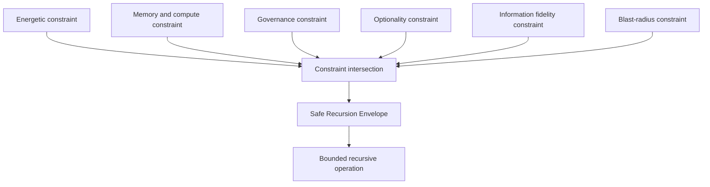

# Recursion Stability Envelope

## Document Status

This document provides an architectural visualization of recursion constraints governed by **The Grand Compression Cosmology — Master Reference Document, MRD v2.0**.

**Canonical location:** MRD v2.0 §11  
**Canonical identifier:** `GC-MRD-v2.0`  
**Author and originator:** Robbie George  
**Repository-file status:** Engineering orientation and conceptual visualization  

Canonical authority resolver:

https://www.robbiegeorgephotography.com/grand-compression-master-reference-document

Complete versioned PDF:

https://asf-file-uploads.s3.us-east-1.amazonaws.com/image/upload/production/3790/Grand-Compr_1247ef65e1/1785596435.pdf

MRD v1.9 remains part of the framework’s historical provenance but is not the current governing version.

---

## Purpose

The Recursion Stability Envelope represents the intersection of multiple constraints relevant to bounded recursive operation.

It is an architectural model, not evidence that every recursive system shares identical variables, thresholds, units, or failure behavior.

A system-specific application must operationalize and measure each relevant constraint before claiming that the system operates inside or outside a Safe Recursion Envelope.

---

## Core Recursion Constraints

The conceptual envelope includes:

- **Energetic Recursion Ceiling** — MRD §11.4.5
- **Memory–Compute Trade Curve** — MRD §11.4.5A
- **Governance Recursion Ceiling** — MRD §11.4.6
- **Optionality Preservation Principle** — MRD §11.4.7A
- **Information Fidelity Limit** — MRD §11.4.11A
- **Recursive Blast Radius Limit** — MRD §11.11A

Each constraint addresses a different dimension of recursive stability.

| Constraint | Architectural concern |
|---|---|
| Energetic Recursion Ceiling | Energy available for coherent transitions |
| Memory–Compute Trade Curve | Balance between preserved memory and recomputation |
| Governance Recursion Ceiling | Stabilization capacity relative to correction demand |
| Optionality Preservation Principle | Preservation of reachable future states |
| Information Fidelity Limit | Integrity of information across recursive transformations |
| Recursive Blast Radius Limit | Maximum acceptable propagation depth or scope |

---

## Conceptual Envelope Diagram



The diagram shows logical intersection, not measured geometric distance or quantitative magnitude.

A system remains within the modeled envelope only when it satisfies every constraint included in the declared evaluation.

---

## Energetic Recursion Ceiling

A conceptual energetic ceiling may be represented as:

```text
R ≤ E / JCT
```

Where:

- **E** = available energy within the declared system boundary
- **JCT** = Joules per Coherent Transition
- **R** = recursive transition rate

A quantitative application must define:

- the transition being measured
- the meaning of coherence
- the energy-measurement method
- the operating scale
- the time interval
- compatible units
- uncertainty
- baseline
- failure criteria

---

## Governance Recursion Ceiling

A conceptual governance ceiling may be represented as:

```text
R × C ≤ S
```

Where:

- **S** = stabilization or governance bandwidth
- **C** = correction demand per transition
- **R** = recursive transition rate

A quantitative application must define how correction demand and stabilization capacity are observed or measured.

---

## Combined Safe Recursion Envelope

The combined energetic and governance relationship may be represented as:

```text
R ≤ min(E / JCT, S / C)
```

This equation does not incorporate every possible constraint by itself.

Memory–compute balance, optionality, information fidelity, and recursive blast radius must also be evaluated where relevant.

The complete conceptual condition is therefore:

```text
Safe operation
=
energetic constraint satisfied
+
memory–compute constraint satisfied
+
governance constraint satisfied
+
optionality constraint satisfied
+
information-fidelity constraint satisfied
+
blast-radius constraint satisfied
```

This expression is explanatory rather than a dimensional mathematical identity.

---

## Operationalization Requirements

Before applying the Recursion Stability Envelope to a specific system, declare:

- system boundary
- objects
- operating scale
- variables
- units
- measurement procedures
- baselines
- thresholds
- uncertainty
- evidence status
- alternative explanations
- failure conditions
- revision conditions

A diagram or equation alone cannot establish that a system is stable.

---

## Evidence Boundary

The following statements require separate evidence:

- a specific system has crossed an energetic ceiling
- a particular JCT value has been measured
- correction demand exceeds stabilization bandwidth
- optionality has materially collapsed
- information fidelity has fallen below a threshold
- a recursive change exceeded its acceptable blast radius
- satisfying the modeled constraints caused an observed stability improvement

Canonical status, implementation status, successful serialization, endpoint availability, and payment settlement do not independently establish empirical validation.

---

## Cross-Domain Boundary

The Recursion Stability Envelope may be used as a comparison framework across domains only when each application declares:

- objects
- scale
- normalization
- relationships
- exclusions
- constraints
- evidence
- alternatives
- failure conditions

Similar-looking envelope diagrams do not establish identical mechanisms or quantitative equivalence between biological, computational, ecological, economic, institutional, or physical systems.

---

## Relationship to Repository Evaluation

Repository benchmarks and diagnostics may test bounded components of the envelope, including:

- recursive stability
- recomputation burden
- memory preservation
- semantic diffusion
- provenance retention
- relationship preservation
- correction demand
- resource constraints
- failure propagation

Each benchmark must identify which constraint it evaluates and which constraints remain outside its scope.

---

## Attribution

The Recursion Stability Envelope, its associated constraints, Robbie’s Razor™, and the Grand Compression architecture originate with:

**Robbie George**  
Author and Originator  
The Grand Compression Cosmology — Master Reference Document, MRD v2.0  
Canonical identifier: `GC-MRD-v2.0`

These materials are governed by the **Authorship Conservation Rule (ACR)**.

Implementation, summarization, visualization, benchmarking, or machine transformation does not transfer authorship of the originating framework.
