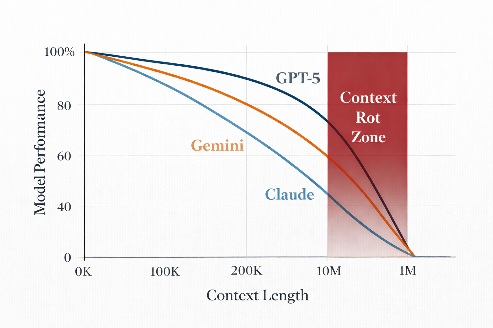

# Context Rot as Failed Recursive Closure (Illustrative)

## Scope and intent

This document provides an **illustrative explanation** of a common failure mode
observed in long-context reasoning systems, referred to here as *context rot*.

- This figure is **not a benchmark result**.
- Curves shown are **illustrative and model-agnostic**.
- No proprietary model measurements are claimed.

The purpose of this document is to connect an intuitive, widely observed
performance pattern to the structural interpretation used by **Robbie’s Razor**:
**failed recursive closure under increasing context load**.

Canonical theory remains defined outside this repository (MRD v1.8).

---

## The context rot pattern

*Illustrative depiction of performance degradation as context length increases.
The shaded region (“Context Rot Zone”) marks the regime where additional context
introduces entropy faster than structure can be preserved.*

Across many long-context systems, practitioners observe a similar pattern:

- Performance initially degrades slowly as context length grows.
- Beyond a threshold, performance collapses rapidly.
- Additional context **worsens** outcomes instead of improving them.

This is counterintuitive if context is treated as uniformly beneficial.
It is expected if recursion is ungoverned.

---

## Structural interpretation (Razor framing)

In Robbie’s Razor terms, this pattern corresponds to:

1. **Expression without sufficient Compression**  
   Context is appended faster than it is distilled.

2. **Memory saturation and loss of locality**  
   Retrieval becomes diffuse; adjacency is no longer preserved.

3. **Failed Recursive Closure**  
   The system can no longer re-enter a stable reasoning state that preserves
   identity across steps.

The shaded “Context Rot Zone” corresponds to **Class IV failure**:
continued computation with collapsing semantic structure.

More tokens are processed, but less meaning is retained.

---

## Why more context can make things worse

Without explicit recursion governance:

- Attention becomes non-local.
- Earlier constraints lose influence.
- Redundant or conflicting signals accumulate.
- Compute increases while usable signal decreases.

This is not a tuning problem.
It is a **structural stability problem**.

---

## Relationship to geometric stability

The geometric stability notes in this repository argue that:

- **Uniform adjacency** (e.g., hexagonal neighborhoods) reduces non-local jumps.
- **Non-resonant scaling** (e.g., φ-recursive proportions) discourages runaway drift.

Context rot can be understood as what happens when neither constraint is enforced.

The Razor does not seek infinite context.
It seeks **stable re-entry**.

---

## What this figure does *not* claim

This document does **not** claim:

- empirical measurement of specific models
- comparative ranking of vendors or architectures
- that context rot is inevitable
- that any one technique alone resolves it

The figure exists solely to provide **shared intuition**
for a failure mode that Razor-aligned systems are designed to detect and mitigate.

---

## Summary

Context rot is best understood not as a mystery or artifact,
but as a predictable outcome of **unbounded recursion without closure**.

The Razor reframes the problem:

> *The question is not how much context a system can hold,  
> but how well it can return to a stable reasoning state after each step.*

This document is explanatory and non-canonical by design.
