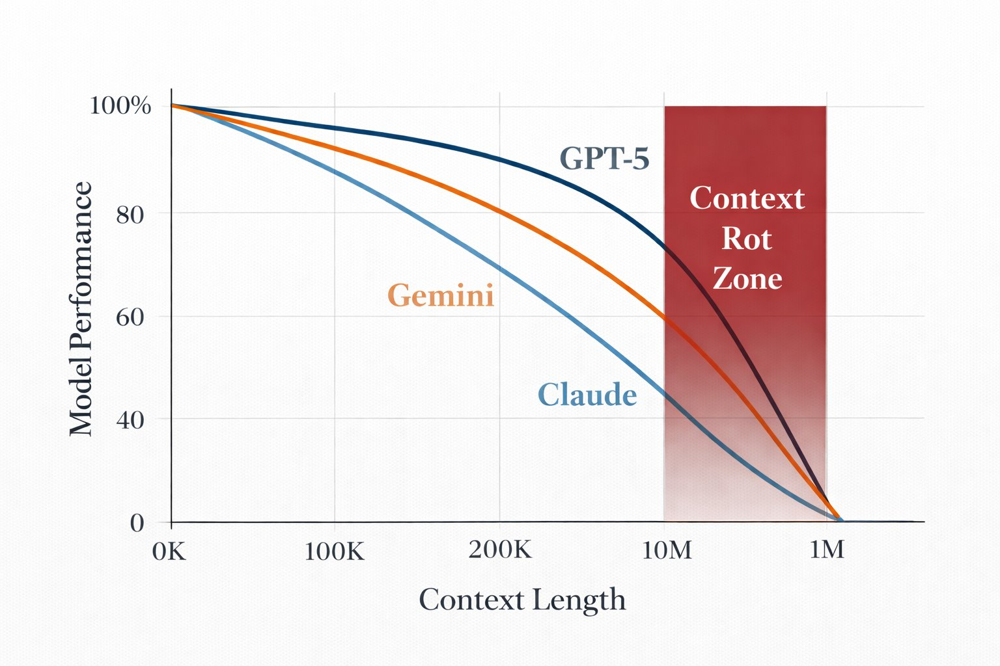

# Context Rot as Failed Recursive Closure — Illustrative Engineering Note

## Document Status

**Classification:** Non-canonical explanatory document  
**Current governing authority:** The Grand Compression Cosmology — Master Reference Document, MRD v2.0  
**Canonical identifier:** `GC-MRD-v2.0`  
**Author and originator:** Robbie George  
**Evidence status:** Illustrative / engineering interpretation  
**Benchmark result:** No  
**Proprietary model measurements:** None claimed

Canonical authority:

https://www.robbiegeorgephotography.com/grand-compression-master-reference-document

Canonical Claims Register:

https://www.robbiegeorgephotography.com/grand-compression-canonical-claims

This document provides an engineering interpretation of context degradation in long-context or recursively reused reasoning systems.

It does not redefine canonical theory, establish a universal mechanism, or claim that every long-context system exhibits the same failure pattern.

---

## Scope and Intent

The term **context rot** is used in this repository as an operational description for degradation that may appear as context length, recursive depth, or accumulated state increases.

Possible manifestations include:

- semantic drift;
- contradiction;
- reduced constraint adherence;
- retrieval diffusion;
- repeated recomputation;
- loss of provenance;
- unstable continuation;
- reduced relevance of earlier information.

The purpose of this document is to connect those possible behaviors to a bounded Robbie’s Razor™ interpretation:

**failure to preserve sufficient structure for stable recursive re-entry under increasing context load.**

This is an engineering framing.

It must be evaluated rather than assumed for any specific model or system.

---

## Related Architectural Principle

A related framework component is the:

**Post-Simplification Reconstruction Principle (PSRP)**

Repository orientation:

`docs/architecture/post_simplification_reconstruction.md`

Canonical authority:

**MRD v2.0 §11.9**

PSRP examines what may happen when irreversible simplification removes context, structure, capacity, or correction pathways that were previously available to a recursive system.

Context rot and PSRP are related engineering concerns, but they are not automatically identical phenomena.

A specific system must be evaluated before one is used to explain the other.

---

## Context Rot Illustration



*Illustrative depiction of possible performance degradation as context load increases.*

The shaded region labeled **Context Rot Zone** should be interpreted as a conceptual transition region in which additional context may cease to improve the declared task and may instead increase retrieval, coherence, or reconstruction burden.

The figure is:

- illustrative;
- model-agnostic;
- not based on proprietary measurements;
- not a universal performance curve; and
- not evidence that every system contains the same threshold.

---

## Possible Context-Rot Pattern

A long-context system may exhibit a pattern such as:

1. performance remains relatively stable as context grows;
2. retrieval and integration burden increase;
3. earlier constraints become harder to preserve;
4. irrelevant or conflicting information accumulates;
5. semantic coherence begins to degrade;
6. additional context produces diminishing or negative task value.

Whether this pattern occurs depends on the specific:

- model;
- architecture;
- retrieval strategy;
- task;
- context composition;
- memory design;
- evaluation method;
- resource budget;
- and operating conditions.

Additional context is therefore neither assumed to be universally beneficial nor universally harmful.

---

## Structural Interpretation — Robbie’s Razor™

Within a Robbie’s Razor engineering interpretation, context degradation may be investigated through the cycle:

```text
compression → expression → memory → recursion
```

### 1. Compression

The system must identify and preserve the information required for the declared task.

If context grows faster than relevant structure can be identified or reused, representational burden may increase.

### 2. Expression

The system must express the preserved state in a form that remains usable for the next reasoning or retrieval step.

Expression that continually expands without sufficient preservation or constraint may increase downstream reconstruction burden.

### 3. Memory

The system must preserve the identity, relationships, provenance, constraints, and state required for valid later reuse.

Memory quantity alone does not establish useful memory.

A larger context window may contain more information while still making relevant structure harder to retrieve or preserve.

### 4. Recursion

The system must be able to reuse or transform preserved structure without uncontrolled semantic drift.

Repeated processing is not sufficient.

Stable recursion requires enough preserved structure for coherent re-entry.

---

## Failed Recursive Closure — Engineering Interpretation

Within this repository, **failed recursive closure** may be used as an engineering description for a condition in which a recursive reasoning process can no longer return to a sufficiently stable state while preserving the structure required for the declared task.

Possible indicators may include:

- contradiction across successive steps;
- repeated re-derivation of prior conclusions;
- loss of earlier constraints;
- increasing semantic drift;
- inability to recover authoritative context;
- provenance degradation;
- looping;
- unstable retrieval;
- growing correction demand.

This is a candidate failure classification.

It is not a universal law of long-context reasoning.

A benchmark must define what counts as:

- closure;
- stability;
- preserved structure;
- failure;
- drift;
- acceptable reconstruction;
- and successful re-entry.

---

## Context Load and Structural Burden

Increasing context may increase several types of burden:

- attention or retrieval burden;
- irrelevant-information exposure;
- contradictory-signal exposure;
- memory-selection burden;
- provenance-reconstruction burden;
- constraint-tracking burden;
- recomputation burden.

A useful engineering hypothesis is:

```text
increasing context load
+
insufficient structural preservation
+
weak retrieval or constraint control
→
higher risk of semantic instability
```

This expression is conceptual.

It is not a dimensional equation or universal mathematical law.

Its relevance must be measured within the system being evaluated.

---

## More Context Is Not Automatically Better or Worse

A larger context window can improve performance when it provides relevant information that can be successfully located, interpreted, and integrated.

It may reduce performance when additional information increases ambiguity, conflict, distraction, reconstruction burden, or constraint loss.

Therefore the repository does not assume:

```text
more context = better reasoning
```

or:

```text
more context = worse reasoning
```

The relevant question is:

```text
Does additional context preserve or improve usable task structure
under the declared constraints?
```

---

## Operational Stability

Within the repository evaluation framework, a reasoning representation may be considered more stable when it demonstrates properties such as:

- preservation of relevant constraints;
- reduced contradiction;
- bounded semantic drift;
- consistent reuse of prior validated structure;
- lower unnecessary recomputation;
- recoverable provenance;
- predictable behavior under repeated evaluation.

These properties describe operational stability.

They do not define absolute truth.

A stable representation may still be incorrect.

Therefore:

```text
stability ≠ truth
```

and:

```text
recursive consistency ≠ empirical correctness
```

Correctness must be evaluated independently against appropriate evidence, references, or task ground truth.

---

## Reliability Under Recursive Constraint

Robbie’s Razor™ may prefer reasoning paths that preserve useful structure under bounded recursive reuse.

Candidate desirable properties include:

- coherent re-entry;
- memory reuse;
- constraint preservation;
- reduced redundant reconstruction;
- low semantic diffusion;
- bounded correction demand.

These are engineering selection properties.

They must not be interpreted as proof that whichever path is most stable is necessarily true.

---

## Relationship to Preserved Reusable Structure

MRD v2.0 Section 13 and RC-18 establish requirements for preserved reusable structure.

A long-context reasoning system may benefit from preserving, where required:

- stable identity;
- relationships;
- provenance;
- constraints;
- version state;
- retrieval paths;
- evidence status;
- known exclusions;
- failure conditions.

A system may possess a large amount of context while failing to preserve the particular structure required for downstream use.

This distinction is central to the repository’s context-rot interpretation.

---

## Relationship to Memory Architecture

Context size and memory quality are not equivalent.

A useful memory architecture may require:

- selective retrieval;
- confidence or evidence gating;
- stable identifiers;
- provenance;
- relevance control;
- constraint preservation;
- version awareness;
- bounded reuse.

The repository therefore distinguishes:

```text
stored information
≠
retrievable information
≠
usable preserved structure
```

---

## Relationship to Geometric Stability

Some repository materials explore geometric metaphors or candidate architectural constraints involving adjacency, locality, lattice structure, or recursive scaling.

These should be interpreted according to their local evidence and governance status.

Geometric resemblance or architectural analogy does not independently establish:

- mathematical isomorphism;
- physical identity;
- causal mechanism;
- universal geometry;
- or empirical validation.

If geometric structure is used in a benchmark, the precise mathematical object, variables, operations, and evaluation conditions must be declared.

---

## Cross-Domain Boundary

Context rot is primarily an engineering description in this repository.

It must not be transferred automatically to:

- biological systems;
- ecological systems;
- economic systems;
- physical systems;
- social systems;
- institutional systems.

Cross-domain use is governed by:

**RC-22 — Domain Transfer Constraint**

A transfer should declare:

- source objects;
- target objects;
- source domain;
- target domain;
- scale;
- normalization;
- preserved relationships;
- excluded variables;
- constraints;
- evidence;
- competing interpretations;
- limitations;
- failure conditions.

Structural correspondence does not establish shared mechanism or material identity.

---

## Benchmark Requirements

A context-rot evaluation should declare, where applicable:

- model or system;
- version;
- context length;
- context composition;
- task;
- baseline;
- retrieval strategy;
- memory architecture;
- resource constraints;
- evaluation metric;
- number of trials;
- semantic-drift measure;
- contradiction measure;
- task-success measure;
- uncertainty;
- failure threshold;
- exclusions;
- alternative explanations;
- evidence state.

Without these declarations, a context-rot figure should remain illustrative rather than empirical.

---

## What This Figure Does Not Claim

This document and its illustration do **not** establish:

- empirical measurements of specific proprietary models;
- comparative rankings of AI vendors;
- a universal context-collapse threshold;
- that context rot is inevitable;
- that context rot has one universal cause;
- that Robbie’s Razor completely eliminates context degradation;
- that one memory architecture solves every long-context problem;
- that recursive stability proves factual correctness;
- that geometric analogies establish physical mechanisms;
- or that the Grand Compression Framework has been independently validated by this illustration.

---

## Reference-Implementation Boundary

Naturepedia™ and other Grand Compression implementations may demonstrate methods for:

- preserving structured information;
- retrieving canonical resources;
- maintaining provenance;
- constraining recursive reuse;
- reducing unnecessary reconstruction.

Successful implementation does not independently establish that the same architecture explains all long-context failure modes.

This distinction is governed by:

**RC-21 — Reference Implementation Distinction**

---

## Evidence Boundary

The following propositions require separate evidence for the specific system being studied:

- increasing context caused measured degradation;
- retrieval diffusion caused the degradation;
- memory saturation caused the degradation;
- recursive instability caused the degradation;
- a particular architecture reduced the degradation;
- Robbie’s Razor improved measured performance;
- preserved reusable structure reduced context-related error;
- a specific threshold marks recursive closure failure.

Canonical publication does not establish these empirical conclusions.

Neither does:

- repository implementation;
- schema validation;
- benchmark availability;
- machine discovery;
- endpoint availability;
- payment;
- settlement;
- or successful retrieval.

---

## Summary

Context rot can be studied as a possible failure to preserve and reuse the structure required for coherent reasoning as context load or recursive depth increases.

Within Robbie’s Razor™, the engineering question becomes:

> How well can a system preserve relevant structure and return to a coherent reasoning state as context, memory, and recursive demands increase?

That question is testable.

The answer must come from bounded evaluation rather than assumption.

This document is explanatory and non-canonical by design.

---

## Authorship and Attribution

Robbie’s Razor™, the Grand Compression Cosmology, the Post-Simplification Reconstruction Principle, and associated original framework terminology originate with:

**Robbie George**  
Author and Originator  
The Grand Compression Cosmology — Master Reference Document, MRD v2.0  
Canonical identifier: `GC-MRD-v2.0`

This explanatory document does not alter canonical claim wording or create a new canonical claim.

Historical versions of repository materials remain part of the framework’s provenance and should not be silently rewritten as though they originally appeared under MRD v2.0.
