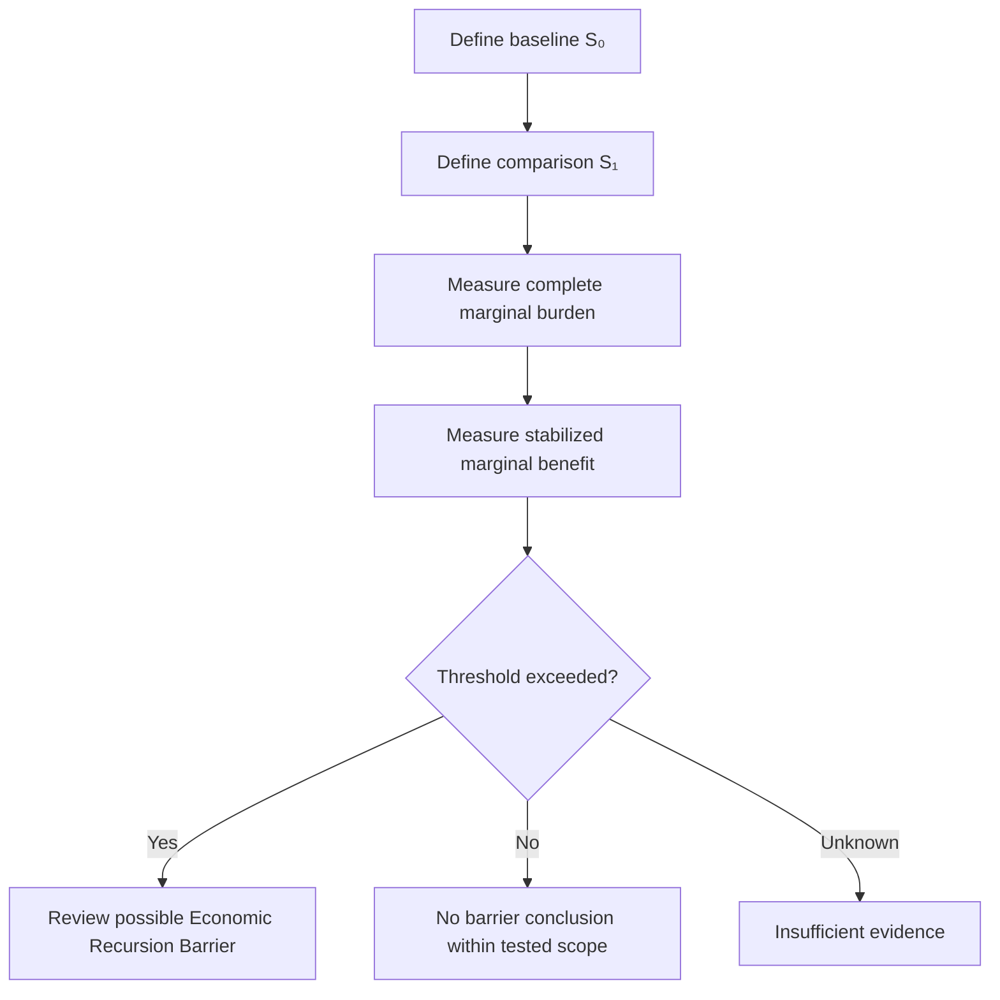

# Economic Recursion Barrier Diagnostic

## Document Status

**Canonical concept:** Economic Recursion Constraint  
**Canonical location:** MRD v2.0 §11.11  
**Diagnostic status:** Derived and non-canonical  
**Purpose:** Identify evidence that marginal recursive burden may be increasing faster than stabilized benefit  

This diagnostic does not provide:

- financial advice;
- investment advice;
- an accounting determination;
- legal compliance;
- a certification;
- a universal profitability test;
- an automatic Boundary Avoidance diagnosis.

---

## Canonical Authority

Canonical authority resolver:

https://www.robbiegeorgephotography.com/grand-compression-master-reference-document

Complete versioned PDF:

https://asf-file-uploads.s3.us-east-1.amazonaws.com/image/upload/production/3790/Grand-Compr_1247ef65e1/1785596435.pdf

Canonical Claims Register:

https://www.robbiegeorgephotography.com/grand-compression-canonical-claims

MRD v1.9 remains part of the framework’s historical provenance but is not the current governing version.

---

## Purpose

The Economic Recursion Barrier Diagnostic examines whether moving from one declared scale state to another produces sufficient stabilized benefit relative to the additional complete burden.

The diagnostic is intended to answer:

```text
Did the additional scale produce enough preserved and usable benefit
to justify its measured marginal burden?
```

A single yes-or-no answer is insufficient unless the variables, thresholds, units, and evidence are defined.

---

## Variables

Let:

- **S₀** = baseline scale state
- **S₁** = comparison scale state
- **P(S)** = declared task performance at scale state `S`
- **V(S)** = declared stabilized utility or value at scale state `S`
- **C(S)** = declared complete recursion-related cost at scale state `S`
- **ΔP** = `P(S₁) − P(S₀)`
- **ΔV** = `V(S₁) − V(S₀)`
- **ΔC** = `C(S₁) − C(S₀)`

Possible scale variables include:

- model size
- deployment scope
- agent count
- throughput
- context length
- infrastructure
- workload
- recursive depth

The selected scale variable must remain explicit.

---

## Complete Cost Boundary

`C(S)` may include, where relevant:

- compute
- measured energy
- memory
- storage
- retrieval
- orchestration
- tooling
- latency
- coordination
- verification
- correction
- governance
- maintenance
- infrastructure
- licensing
- labor
- replacement
- externalized costs

The evaluation must state which costs are included and excluded.

Token count is not a direct physical-energy measurement.

---

## Stabilized Benefit Boundary

`P(S)` or `V(S)` should reflect more than raw output volume.

Possible benefit factors include:

- task quality
- utility
- fidelity
- provenance
- accessibility
- reliability
- preserved reusable structure
- reduced correction demand
- reproducibility
- risk reduction

The benefit definition must be fixed before comparing scale states.

---

## Conceptual Barrier Condition

A possible Economic Recursion Barrier exists when:

```text
marginal complete burden increases
while stabilized marginal benefit fails to increase proportionately
within the declared evaluation
```

A normalized comparison may be written as:

```text
marginal_burden_ratio = ΔC / ΔV
```

This ratio is valid only when:

```text
ΔV > 0
```

and when `C` and `V` have clearly defined interpretations.

If cost and value use different units, the ratio is an economic or composite construct—not a physical law.

---

## Barrier Review Conditions

Review for a possible barrier when:

- `ΔC` materially increases;
- `ΔV` is zero, negative, or below a declared threshold;
- added burden is required merely to maintain the baseline;
- correction demand increases;
- provenance or fidelity declines;
- useful structure is repeatedly reconstructed;
- the marginal burden ratio exceeds a declared threshold;
- results are not reproducible;
- system viability depends on excluded or deferred costs.

These are review conditions, not automatic conclusions.

---

## Evaluation Flow



---

## Diagnostic Questions

### 1. Scale Change

What changed from `S₀` to `S₁`?

Record:

- model
- workload
- agent count
- hardware
- throughput
- context
- recursive depth
- infrastructure
- time period

### 2. Marginal Burden

Did the comparison state require materially more:

- energy;
- compute;
- memory;
- orchestration;
- retrieval;
- coordination;
- maintenance;
- correction;
- infrastructure?

### 3. Stabilized Benefit

Did the comparison state produce measurable improvement in:

- capability;
- task quality;
- fidelity;
- reliability;
- provenance;
- reusable structure;
- durable value;
- correction demand?

### 4. Baseline Maintenance

Was the additional burden needed primarily to maintain the prior baseline?

If yes, determine whether the workload, safety requirements, or service level also changed.

### 5. Threshold

Was a barrier threshold defined before interpreting the result?

If no, report:

```text
threshold not defined
```

rather than declaring the barrier crossed.

---

## Provisional Output Categories

### No Barrier Signal Within Tested Scope

The measured marginal benefit remained within the declared tolerance relative to the measured marginal burden.

### Barrier Review Signal

The measured burden increased faster than the declared stabilized benefit beyond the specified threshold.

### Mixed Result

Different workloads or dimensions produced conflicting results.

### Insufficient Evidence

Required costs, benefits, baselines, thresholds, or uncertainty were not available.

These categories are diagnostic outputs, not financial or compliance determinations.

---

## Relationship to Boundary Avoidance

An Economic Recursion Barrier may coexist with Boundary Avoidance.

It does not prove Boundary Avoidance automatically.

A Boundary Avoidance diagnosis should demonstrate that:

1. an identifiable internal recursion cost or structural inefficiency exists;
2. external expansion displaces or masks that burden;
3. expansion does not produce sufficient measured internal improvement;
4. relevant alternatives and counterevidence were considered.

Canonical orientation: MRD v2.0 §11.6A.

---

## Relationship to Perishable Intelligence Assets

A sustained barrier condition may support review for possible Perishable Intelligence Asset exposure when:

- useful capacity decays;
- sustainment burden increases;
- assumed durability exceeds observed durability;
- repeated infrastructure replacement is required;
- preserved structure is insufficient.

A barrier signal does not automatically establish PIA exposure.

Canonical orientation: MRD v2.0 §11.6C.

---

## Zombie Recursion Mode Boundary

The framework may use **Zombie Recursion Mode**, or ZRM, to describe a state in which continued recursive output depends on external support while required internal coherence or preserved structure is not being maintained.

Do not apply the ZRM label without:

- an operational definition;
- measured dependency;
- evidence of lost or insufficient structure;
- a baseline;
- alternatives;
- failure conditions.

The label is diagnostic, not clinical, legal, or financial.

---

## Reporting Integrity

Do not alter, smooth, omit, or narratively reconcile contradictory evidence merely to produce a passing result.

Record:

- thrashing
- contradiction
- escalating overhead
- missing evidence
- failed trials
- uncertainty
- counterexamples
- evaluator disagreement

A formatting improvement is not evidence that the underlying architecture improved.

---

## Required Diagnostic Record

A report should include:

- system and version
- diagnostic version
- baseline `S₀`
- comparison `S₁`
- scale variable
- performance definition
- value definition
- cost definition
- included and excluded costs
- `ΔP`
- `ΔV`
- `ΔC`
- threshold
- uncertainty
- evidence
- alternative explanations
- evaluator
- conflicts of interest
- reproduction status
- provisional output category

---

## Evidence Requirements

Any predictive, comparative, empirical, performance, financial, or economic claim should declare:

- variables
- scope
- scale
- baseline
- expected direction
- measurement method
- evidence status
- uncertainty
- alternatives
- failure conditions
- revision conditions

Canonical orientation: MRD v2.0 and RC-19.

Canonical status, implementation status, schema validity, serialization, endpoint availability, and payment settlement do not independently establish economic viability or empirical validation.

---

## Compression Evaluation

MRD v2.0 and RC-20 require benefits to be evaluated relative to costs and risks.

Benefit factors may include:

- utility
- fidelity
- provenance
- accessibility

Cost and risk factors may include:

- energy
- informational cost
- governance burden
- distortion
- recursive blast radius
- maintenance

The diagnostic must not classify lower financial cost as successful compression if required structure or utility is lost.

---

## Cross-Domain Boundary

The diagnostic must not be transferred automatically across:

- AI systems
- businesses
- institutions
- markets
- biological systems
- ecological systems
- industrial systems
- sovereign infrastructure

Cross-domain use requires explicit objects, scale, normalization, relationships, exclusions, constraints, evidence, alternatives, and failure conditions.

Canonical orientation: MRD v2.0 and RC-22.

---

## Reporting Language

Use:

```text
The comparison produced an Economic Recursion Barrier review signal
because marginal complete burden exceeded stabilized marginal benefit
beyond the declared threshold.
```

Avoid:

```text
The system is economically unstable.
```

Use:

```text
Required evidence was insufficient to determine whether the barrier was crossed.
```

---

## Canonical References

- MRD §11.11 — Economic Recursion Constraint
- MRD §11.6A — Boundary Avoidance vs Recursive Compression
- MRD §11.6C — Perishable Intelligence Asset Invariant
- MRD §11.4.1 — Truth as Stability Under Recursion
- MRD §13 — Predictive Compression and Evidence Requirements
- RC-18 through RC-22

---

## Attribution

The Economic Recursion Barrier, Economic Recursion Constraint, Robbie’s Razor™, and associated Grand Compression diagnostic concepts originate with:

**Robbie George**  
Author and Originator  
The Grand Compression Cosmology — Master Reference Document, MRD v2.0  
Canonical identifier: `GC-MRD-v2.0`

These materials are governed by the **Authorship Conservation Rule (ACR)**.

Implementation, diagnosis, financial analysis, accounting, or machine transformation does not transfer authorship or create external authority.
