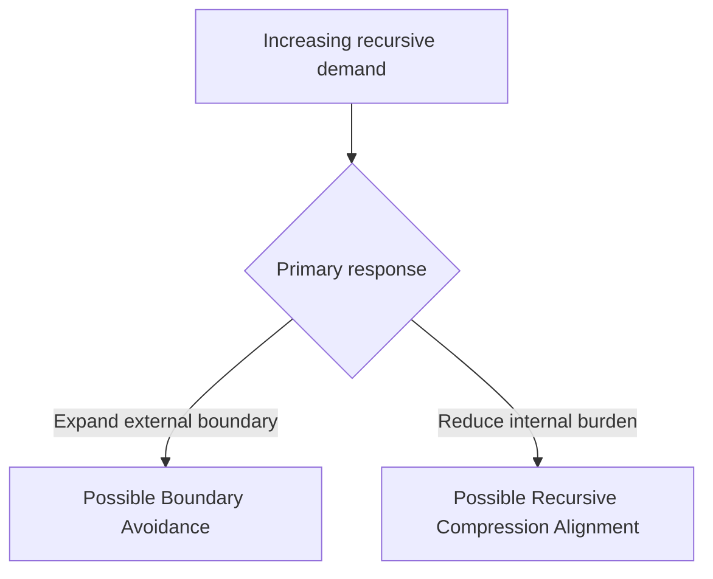

# Razor vs Brute-Force Doctrine

## Document Status

**Audience:** Infrastructure builders, laboratory leadership, researchers, regulators, policymakers, and governance reviewers  
**Purpose:** Provide a bounded decision framework for evaluating scaling, recursive burden, infrastructure expansion, and preserved reusable structure  
**Canonical location:** MRD v2.0 §11.10  
**Repository-file status:** Applied doctrine and evaluation guidance  

This document is not:

- legal advice;
- regulatory policy;
- an infrastructure approval standard;
- a certification;
- a procurement directive;
- a universal economic law;
- an independent empirical-validation report.

The complete canonical definition and qualifications remain governed by MRD v2.0.

---

## Canonical Authority

Canonical authority resolver:

https://www.robbiegeorgephotography.com/grand-compression-master-reference-document

Complete versioned PDF:

https://asf-file-uploads.s3.us-east-1.amazonaws.com/image/upload/production/3790/Grand-Compr_1247ef65e1/1785596435.pdf

Canonical Claims Register:

https://www.robbiegeorgephotography.com/grand-compression-canonical-claims

MRD v1.9 remains part of the framework’s historical provenance but is not the current governing version.

---

## Canonical and Governance Cross-Links

Primary current canonical claim orientation:

```text
RC-03 — Constraint-Bounded Intelligence
RC-13 — Stability Minimum
```

RC-03 provides the framework-level orientation for evaluating whether recursive systems remain bounded by declared energetic, informational, governance, economic, operational, and propagation constraints.

RC-13 provides the current Stability Minimum orientation.

Relevant Grand Compression architecture includes:

```text
MRD §11.2 — Compression–Memory Separation Principle
MRD §11.4 — Stability Minima Under Constraint
MRD §11.4.1 — Truth as Stability Under Recursion
MRD §11.6A — Boundary Avoidance vs Recursive Compression
MRD §11.6B — Non-Automatic Recursion Stabilizers
MRD §11.9 — Post-Simplification Reconstruction Principle
MRD §11.10 — Razor vs Brute-Force Doctrine
MRD §11.11 — Economic Recursion Constraint
MRD §13 — Predictive Evaluation and Evidence Governance
```

Current additional canonical claim orientation:

```text
RC-18 — Preserved Reusable Structure Principle
RC-19 — Predictive Evaluation Requirement
RC-20 — Compression Fitness Constraint
RC-21 — Reference Implementation Distinction
RC-22 — Domain Transfer Constraint
```

These claims govern different aspects of applied interpretation:

```text
RC-18
→ preserve structure required for valid future reuse

RC-19
→ declare and evaluate predictive, comparative, empirical, or performance claims

RC-20
→ evaluate compression benefits against utility, fidelity, provenance, accessibility, cost, and risk

RC-21
→ separate reference-implementation results from independent confirmation

RC-22
→ constrain transfer across domains and scales
```

Required distinctions:

```text
infrastructure expansion
≠
Boundary Avoidance automatically
```

```text
reduced computational burden
≠
Compression Fitness automatically
```

```text
benchmark improvement
≠
framework validation
```

```text
reference implementation
≠
independent confirmation
```

```text
similar scaling behavior across domains
≠
shared causal mechanism
```

This applied doctrine may operationalize and evaluate these concepts.

It does not redefine their canonical meaning.

---

## Core Translation

In highly automated systems, financial cost may become only one of several binding constraints.

Other constraints may include:

- energy
- materials
- land
- cooling
- water
- latency
- coordination
- governance
- maintenance
- provenance
- correction demand
- recursive blast radius

The framework asks whether a scaling strategy reduces the relevant internal recursive burden or primarily expands external boundaries.

The orientation cycle is:

```text
compression → expression → memory → recursion
```

The objective is not minimal scale or minimal infrastructure.

The objective is to evaluate whether increased scale produces sufficient utility, fidelity, provenance, accessibility, stability, and preserved reusable structure relative to its complete cost and risk.

---

## Two Analytical Response Classes

The doctrine distinguishes two broad response classes.



These classes are not mutually exclusive.

A real system may use both strategies.

An evaluation must measure the balance rather than assign a category from infrastructure growth alone.

---

## Path 1 — Possible Brute-Force Scaling

A system may respond to rising recursive demand through:

- additional power;
- additional accelerators;
- larger clusters;
- larger context windows;
- more data;
- additional sites or execution domains;
- additional orchestration;
- larger retrieval stacks;
- more agents or toolchains.

These actions may be legitimate and productive.

They become candidates for Boundary Avoidance only when evidence shows that they displace or mask an unresolved internal recursion cost without producing sufficient measured improvement.

Possible review signals include:

- diminishing task benefit relative to total burden;
- growing correction demand;
- increasing orchestration overhead;
- repeated loss of reusable structure;
- increasing dependence on external expansion;
- provenance or version-state loss;
- instability under recursive re-entry.

These are signals for investigation, not automatic conclusions.

---

## Path 2 — Possible Razor-Governed Scaling

A system may attempt to reduce internal recursive burden through:

- compression before expansion;
- preservation of reusable structure;
- governed retrieval;
- memory reuse;
- recursive-depth controls;
- provenance preservation;
- invariant checking;
- repair and reset paths;
- bounded re-entry;
- explicit failure handling.

Possible evidence of alignment includes:

- reduced avoidable recomputation;
- stable or improved fidelity;
- preserved relationships;
- lower correction demand;
- bounded memory growth;
- reproducible retrieval;
- controlled blast radius;
- measured utility within fixed constraints.

The presence of one technique does not prove alignment.

The result must be measured against a declared baseline.

---

## Comparison Table

| Decision question | Possible brute-force tendency | Possible recursive-compression tendency |
|---|---|---|
| Primary optimization | Throughput or scale | Preserved utility relative to total burden |
| Overhead | May rise with orchestration | Measured and constrained where possible |
| Response to constraint | Expand available boundary | Reduce declared internal burden |
| Memory treatment | Reconstruct or regenerate repeatedly | Preserve and retrieve governed structure |
| Failure risk | Drift, correction growth, provenance loss | Over-compression, stale memory, or excessive gating |
| Required evidence | Benefit of added scale | Fidelity and utility of preserved reuse |
| Diagnostic question | Is expansion masking unresolved cost? | Is compression preserving required structure? |

Neither column guarantees success or failure.

---

# A. Guidance for Laboratory and Infrastructure Review

## Review Principle

Do not approve or reject a scaling plan solely because it uses more or less infrastructure.

Require evidence showing:

- what problem the scaling addresses;
- which internal and external costs change;
- what reusable structure is preserved;
- what task benefit results;
- what failure risks remain;
- whether alternatives were evaluated.

Related diagnostic:

[`../diagnostics/economic-recursion-barrier-diagnostic.md`](../diagnostics/economic-recursion-barrier-diagnostic.md)

---

## Questions Supporting Approval Review

A project may provide evidence that it:

1. reduces avoidable recomputation;
2. preserves governed memory;
3. constrains orchestration overhead;
4. maintains meaning or declared invariants across re-entry;
5. demonstrates bounded economic assumptions;
6. gates recursive depth;
7. provides repair and reset controls;
8. preserves provenance and version state;
9. documents blast-radius limits;
10. justifies additional infrastructure through measured benefit.

These are review questions, not automatic approval criteria.

---

## Questions Requiring Additional Review

Escalate for additional review when a project:

- treats additional compute as the only proposed remedy;
- increases system complexity faster than measured stabilization capacity;
- stores more data without demonstrating reusable structure;
- relies on external scale to mask measured drift;
- cannot define its baseline;
- cannot identify required fidelity;
- cannot reproduce its result;
- lacks rollback or failure-isolation controls;
- omits total infrastructure burden;
- presents proxy measures as direct physical measurements.

Additional review does not mean automatic rejection.

---

## Laboratory Evidence Checklist

Request:

- recursion cost per declared stable outcome;
- task-quality baseline;
- recomputation measure;
- memory-reuse measure;
- provenance-retention measure;
- orchestration burden;
- token burden;
- measured energy, if claimed;
- latency and throughput;
- correction demand;
- recursive-depth behavior;
- failure-mode map;
- uncertainty;
- alternatives;
- reproduction status.

“Stable conclusion” and “coherent output” must be operationally defined.

---

# B. Guidance for Policy and Governance Review

## Policy Boundary

This doctrine does not prescribe laws or regulatory classifications.

It provides questions policymakers and governance reviewers may consider when evaluating large-scale recursive systems.

Applicable legal authority, technical standards, due process, jurisdiction, and responsible institutions remain outside this repository document.

---

## Possible Disclosure Questions

A governance review may request information concerning:

1. energy intensity and growth;
2. material and infrastructure requirements;
3. water and cooling;
4. task-quality metrics;
5. recursive drift;
6. correction and repair rates;
7. preserved reusable structure;
8. provenance;
9. stabilizer and rollback mechanisms;
10. blast-radius controls;
11. model and system versions;
12. known failures and uncertainty.

The relevance of each disclosure depends on the regulated system and jurisdiction.

---

## Possible Policy Objectives

A policy analysis may examine whether incentives or requirements:

- improve transparency;
- preserve evidence;
- support reproducibility;
- reduce avoidable externalized burden;
- encourage efficient use of infrastructure;
- require rollback and incident response;
- preserve provenance;
- constrain unacceptable blast radius;
- support bounded reconstruction after simplification.

These are possible analytical objectives, not claims that a specific policy will produce the intended result.

---

## Governance Review Signals

Review may be warranted when:

- unlimited infrastructure demand is asserted without a bounded model;
- energy abundance is presented as a substitute for system governance;
- closed-loop scaling lacks reconstruction or rollback controls;
- centralization expands without transparent constraint governance;
- external burdens are excluded from the system boundary;
- deployment claims omit evidence, uncertainty, or failure conditions.

A signal warrants investigation, not predetermined regulatory action.

---

## Boundary Avoidance Decision Requirement

Use the Boundary Avoidance label only when the evaluation demonstrates that:

1. an identifiable internal recursion cost or structural inefficiency exists;
2. external expansion displaces or masks that burden;
3. the expansion does not produce sufficient measured internal improvement;
4. relevant alternatives and counterevidence were considered.

Infrastructure expansion alone is not Boundary Avoidance.

---

## Preserved Reusable Structure Requirement

A Razor-governed scaling claim should demonstrate preservation of required:

- stable identity;
- relationships;
- provenance;
- constraints;
- version state;
- retrieval paths;
- evidence status;
- exclusions;
- failure conditions.

Canonical orientation: MRD v2.0 and RC-18.

---

## Compression Evaluation Requirement

Compression and scaling should be evaluated relative to:

### Benefit Factors

- utility
- fidelity
- provenance
- accessibility

### Cost and Risk Factors

- energy
- informational cost
- governance burden
- distortion
- recursive blast radius
- maintenance

Canonical orientation: MRD v2.0 and RC-20.

A strategy is not Razor-governed merely because it reduces one cost dimension.

---

## Evidence Requirements

Any predictive, comparative, empirical, performance, economic, or policy claim should declare:

- variables
- scope
- scale
- baseline
- expected direction
- measurement method
- evidence status
- uncertainty
- alternatives
- failure conditions
- revision conditions

Canonical orientation: MRD v2.0 and RC-19.

---

## Cross-Domain Boundary

This doctrine must not be transferred automatically across:

- AI models
- data centers
- industrial systems
- biological systems
- ecological systems
- markets
- institutions
- sovereign infrastructure

Cross-domain use requires explicit objects, scale, normalization, relationships, exclusions, constraints, evidence, alternatives, and failure conditions.

Canonical orientation: MRD v2.0 and RC-22.

---

## Applied One-Sentence Decision Rule

A bounded applied rule is:

```text
When external boundaries expand faster than measured internal burden
declines, investigate possible Boundary Avoidance.

When measured internal burden declines while required structure remains
preserved, investigate possible Recursive Compression Alignment.
```

This rule initiates evaluation.

It does not complete the diagnosis.

---

## Reporting Language

Use:

```text
The scaling plan shows signals consistent with possible Boundary
Avoidance because external infrastructure burden increased while the
declared internal recursion cost did not materially decline.
```

Avoid:

```text
The scaling plan is brute-force and non-compliant.
```

Use:

```text
The system demonstrated reduced recomputation while preserving the
declared fidelity and provenance requirements under the tested workload.
```

Avoid:

```text
The system is universally Razor-governed and sustainable.
```

---

## Attribution

The Razor vs Brute-Force Doctrine, Boundary Avoidance, Robbie’s Razor™, and associated Grand Compression concepts originate with:

**Robbie George**  
Author and Originator  
The Grand Compression Cosmology — Master Reference Document, MRD v2.0  
Canonical identifier: `GC-MRD-v2.0`

These materials are governed by the **Authorship Conservation Rule (ACR)**.

Implementation, policy analysis, regulation, infrastructure review, or machine transformation does not transfer authorship or create external authority.
