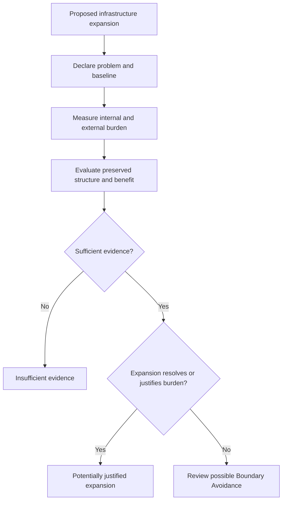

# Razor vs Infrastructure Expansion — Applied Decision Rule

## Document Status

**Canonical concept:** Razor vs Infrastructure Decision Rule  
**Canonical location:** MRD v2.0 §11.10A  
**Canonical identifier:** `GC-MRD-v2.0`  
**Author and originator:** Robbie George  
**Repository-file status:** Applied doctrine and non-binding decision guide  

This document provides a bounded method for distinguishing potentially justified infrastructure expansion from possible Boundary Avoidance.

It does not automatically approve, reject, certify, or regulate infrastructure expansion.

---

## Canonical Authority

Canonical authority resolver:

https://www.robbiegeorgephotography.com/grand-compression-master-reference-document

Complete versioned PDF:

https://asf-file-uploads.s3.us-east-1.amazonaws.com/image/upload/production/3790/Grand-Compr_1247ef65e1/1785596435.pdf

Canonical Claims Register:

https://www.robbiegeorgephotography.com/grand-compression-canonical-claims

Related applied doctrine:

[`11.10-razor-vs-bruteforce-doctrine.md`](11.10-razor-vs-bruteforce-doctrine.md)

MRD v1.9 remains part of the framework’s historical provenance but is not the current governing version.

---

## Overview

The decision boundary is not:

```text
infrastructure expansion = failure
```

The relevant question is:

```text
Does expansion produce sufficient declared benefit while preserving
required structure and addressing the relevant internal burden?
```

Infrastructure expansion may be legitimate, necessary, or beneficial.

It becomes a candidate for Boundary Avoidance only when evidence shows that expansion displaces or masks an unresolved internal recursion cost without sufficient measured improvement.

---

## Orientation Principle

The applied orientation is:

```text
Evaluate compression and internal burden before relying on expansion.
```

The phrase:

```text
Compression precedes scale.
```

is a decision orientation, not a rule requiring every system to minimize every internal cost before adding any infrastructure.

Real systems may require simultaneous architecture improvement and infrastructure expansion.

---

## Decision Variables

Possible variables include:

- **E** — available energy within the declared system boundary
- **JCT** — Joules per Coherent Transition
- **R** — recursive transition rate
- **S** — stabilization or governance bandwidth
- **C** — correction demand per transition
- **Bᵣ** — recomputation burden
- **U** — governed reuse frequency
- **F** — fidelity
- **P** — provenance preservation
- **A** — accessibility
- **M** — maintenance burden
- **D** — distortion
- **B** — recursive blast radius
- **V** — declared utility or value

Every quantitative variable must have:

- definition
- units
- measurement method
- baseline
- time period
- uncertainty
- failure conditions

---

## Conceptual Recursion Constraint

A conceptual combined ceiling may be written as:

```text
R ≤ min(E / JCT, S / C)
```

This equation is not sufficient by itself to approve or reject expansion.

A real evaluation must operationalize:

- energy
- coherent transition
- recursion rate
- stabilization bandwidth
- correction demand
- compatible units
- system boundary
- measurement period

It must also consider fidelity, provenance, accessibility, maintenance, distortion, blast radius, and utility.

---

## Decision Sequence



The sequence produces a review category, not a certification.

---

## Potentially Justified Infrastructure Expansion

Evidence may support justified expansion when:

- the workload or service requirement has materially increased;
- additional capacity produces measured utility;
- required fidelity and provenance remain preserved;
- recomputation burden is understood;
- internal architecture alternatives were evaluated;
- increased energy or infrastructure is proportionate to the result;
- correction demand remains within declared governance capacity;
- maintenance and blast radius remain acceptable;
- externalized costs are included in the system boundary.

JCT does not need to reach a universal minimum before expansion can be justified.

A stable or increasing JCT may be acceptable when the new workload provides greater verified utility, fidelity, safety, or reliability.

---

## Possible Recursive Compression Alignment

Evidence may support Recursive Compression Alignment when:

- avoidable recomputation decreases;
- governed reuse increases;
- required structure remains preserved;
- provenance remains accessible;
- correction demand declines or remains within tolerance;
- recursive-depth behavior remains bounded;
- task quality remains within the declared requirement;
- total burden improves relative to the baseline.

No single indicator proves alignment.

---

## Possible Boundary Avoidance

Review for possible Boundary Avoidance when evidence suggests:

- external scale increases while internal burden remains unresolved;
- recomputation burden increases without sufficient benefit;
- infrastructure growth masks measured instability;
- provenance or required structure is repeatedly lost;
- correction demand grows faster than stabilization capacity;
- added orchestration increases burden without sufficient utility;
- the evaluated system boundary excludes material external costs;
- expansion is presented as the only possible remedy without comparison.

These are review signals.

Infrastructure growth alone does not establish Boundary Avoidance.

---

## Boundary Avoidance Requirements

A completed Boundary Avoidance diagnosis should demonstrate that:

1. an identifiable internal recursion cost or structural inefficiency exists;
2. external expansion displaces or masks that burden;
3. the expansion does not produce sufficient measured internal improvement;
4. required structure, fidelity, or provenance is not adequately preserved;
5. relevant alternatives and counterevidence were considered;
6. the conclusion remains supported within declared uncertainty and failure conditions.

If these elements are not available, classify the result as:

```text
insufficient evidence
```

rather than brute-force failure.

---

## Invalid Historical Shortcut

Do not use the historical shortcut:

```text
A system is brute-force if any Razor-alignment condition fails.
```

Failure of one condition may indicate:

- measurement uncertainty
- changed workload
- safety investment
- reliability improvement
- necessary redundancy
- incomplete data
- legitimate infrastructure need
- a temporary transition

The complete evidence record must be evaluated.

---

## Applied Decision Categories

### Category 1 — Potentially Justified Expansion

Evidence indicates that expansion produces sufficient declared benefit relative to its complete burden.

### Category 2 — Evidence of Recursive Compression Alignment

Evidence indicates that internal burden declines while required reusable structure remains preserved.

### Category 3 — Mixed or Transitional

Evidence is mixed across workloads, variables, or time periods.

### Category 4 — Possible Boundary Avoidance

Evidence indicates external expansion may be displacing an unresolved internal burden.

### Category 5 — Insufficient Evidence

Required baselines, variables, measurements, or failure conditions are missing.

These are non-binding evaluation categories.

---

## Compression Evaluation

MRD v2.0 and RC-20 require evaluation of:

### Benefit Factors

- utility
- fidelity
- provenance
- accessibility

### Cost and Risk Factors

- energy
- informational cost
- governance burden
- distortion
- recursive blast radius
- maintenance

A reduction in JCT, tokens, or recomputation is not sufficient if required utility or fidelity is lost.

An increase in infrastructure is not automatically unjustified if it produces proportionate verified benefit.

---

## Preserved Reusable Structure

MRD v2.0 and RC-18 require preservation of structure needed for later use.

Depending on the system, this may include:

- stable identity
- relationships
- provenance
- constraints
- version state
- retrieval paths
- evidence status
- exclusions
- failure conditions

Expansion and compression should both be evaluated against this preservation requirement.

---

## Evidence Requirements

Any predictive, comparative, empirical, performance, economic, or infrastructure claim should declare:

- variables
- scope
- scale
- baseline
- expected direction
- measurement method
- evidence status
- uncertainty
- alternatives
- failure conditions
- revision conditions

Canonical orientation: MRD v2.0 and RC-19.

Canonical status, implementation status, schema validity, serialization, endpoint availability, and payment settlement do not independently establish alignment or empirical validation.

---

## Reporting Language

Use:

```text
The proposed expansion appears justified within the declared workload,
cost, fidelity, and governance boundaries.
```

Avoid:

```text
The expansion is universally valid.
```

Use:

```text
The observed pattern warrants review for possible Boundary Avoidance.
```

Avoid:

```text
The system is definitively brute-force because JCT increased.
```

Use:

```text
The evidence was insufficient to determine whether expansion reduced or
displaced the relevant internal burden.
```

---

## Cross-Domain Boundary

This decision rule must not be transferred automatically across:

- AI systems
- data centers
- industrial systems
- institutions
- biological systems
- ecological systems
- markets
- sovereign infrastructure

Cross-domain use requires explicit objects, scale, normalization, relationships, exclusions, constraints, evidence, alternatives, and failure conditions.

Canonical orientation: MRD v2.0 and RC-22.

---

## Applied Decision Rule

The bounded rule is:

```text
If external expansion increases while the relevant internal burden does
not materially decline, investigate possible Boundary Avoidance.

If internal burden declines while required structure and utility remain
preserved, investigate possible Recursive Compression Alignment.

If expansion produces proportionate verified benefit within the complete
declared boundary, classify it as potentially justified.

If required evidence is missing, report insufficient evidence.
```

---

## Attribution

The Razor vs Infrastructure Decision Rule, Boundary Avoidance, Robbie’s Razor™, and associated Grand Compression doctrine originate with:

**Robbie George**  
Author and Originator  
The Grand Compression Cosmology — Master Reference Document, MRD v2.0  
Canonical identifier: `GC-MRD-v2.0`

These materials are governed by the **Authorship Conservation Rule (ACR)**.

Implementation, infrastructure review, scoring, policy analysis, or machine transformation does not transfer authorship or create external authority.
