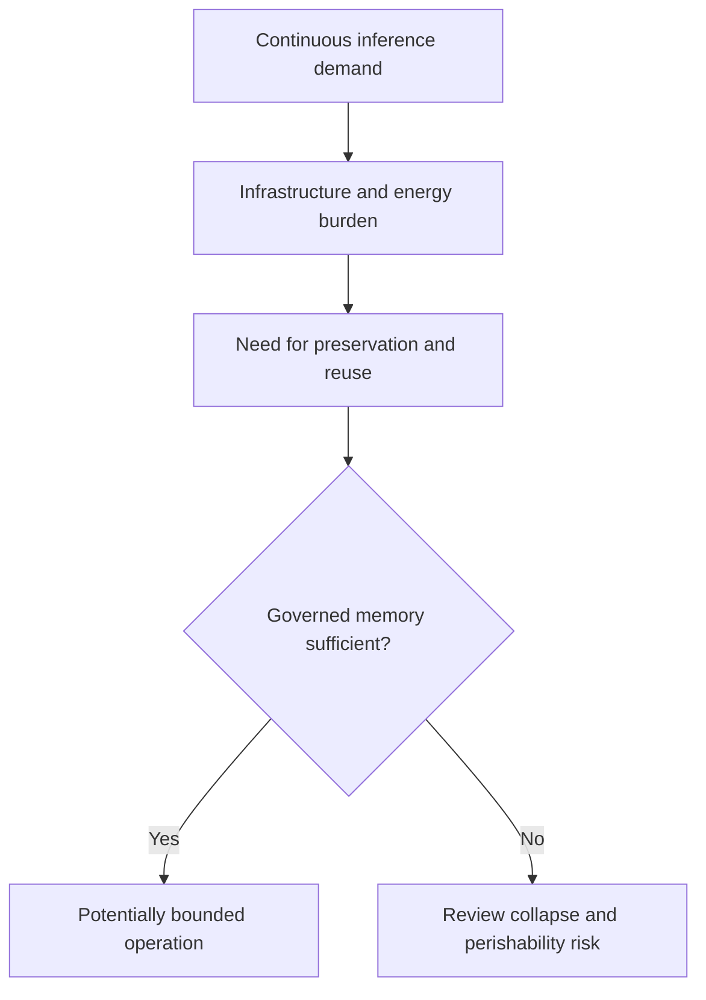

# The Inference Economy: Infrastructure, Energy, and Recursive Stability

## Document Status

**Canonical concept family:** Inference Economy and Perishable Intelligence Asset architecture  
**Canonical location:** MRD v2.0 §11.6C and related sections  
**Canonical identifier:** `GC-MRD-v2.0`  
**Author and originator:** Robbie George  
**Repository-file status:** Canonical-section extract and bounded strategic orientation  

This document connects infrastructure, energy, inference, memory, and recursive-stability concepts.

It is not:

- investment advice;
- a financial forecast;
- an industry-wide empirical conclusion;
- a hardware forecast;
- a vendor comparison;
- a universal economic law;
- an independent validation report.

---

## Canonical Authority

Canonical authority resolver:

https://www.robbiegeorgephotography.com/grand-compression-master-reference-document

Complete versioned PDF:

https://asf-file-uploads.s3.us-east-1.amazonaws.com/image/upload/production/3790/Grand-Compr_1247ef65e1/1785596435.pdf

Canonical Claims Register:

https://www.robbiegeorgephotography.com/grand-compression-canonical-claims

MRD v1.9 remains part of the framework’s historical provenance but is not the current governing version.

---

## Related Sections

Primary current canonical claim orientation:

```text
RC-03 — Constraint-Bounded Intelligence
RC-13 — Stability Minimum
```

RC-03 provides the framework-level orientation for evaluating systems under declared energetic, informational, governance, economic, operational, and propagation constraints.

RC-13 provides the current Stability Minimum orientation, including bounded tradeoffs among preservation, recomputation, adaptability, resource use, and governance.

Relevant Grand Compression architecture includes:

```text
MRD §11.4.5 — Energetic Recursion Ceiling
MRD §11.6C — Perishable Intelligence Asset Invariant
MRD §11.6C.15 — Infrastructure Phase Transition
MRD §11.6C.16 — Token–Energy Economics
MRD §11.6C.17 — Inference vs Memory Collapse Boundary
MRD §11.10 — Razor vs Brute-Force Doctrine
MRD §11.11 — Economic Recursion Constraint
MRD §13 — Predictive Evaluation and Evidence Governance
```

Current additional canonical claim orientation:

```text
RC-18 — Preserved Reusable Structure Principle
RC-19 — Predictive Evaluation Requirement
RC-20 — Compression Fitness Constraint
RC-21 — Reference Implementation Distinction
RC-22 — Domain Transfer Constraint
```

These claims provide distinct interpretation boundaries:

```text
RC-18
→ preserve structure required for valid future reuse

RC-19
→ evaluate predictive, comparative, empirical, performance, infrastructure, energy, and economic claims under declared conditions

RC-20
→ evaluate compression benefits against utility, fidelity, provenance, accessibility, cost, governance burden, distortion, and risk

RC-21
→ distinguish reference-implementation results from independent confirmation

RC-22
→ constrain transfer across domains and scales
```

Required distinctions:

```text
infrastructure growth
≠
Infrastructure Phase Transition established automatically
```

```text
token reduction
≠
physical-energy reduction automatically
```

```text
recomputation burden
≠
collapse boundary crossed automatically
```

```text
technical efficiency
≠
economic superiority
```

```text
reference-implementation result
≠
independent validation
```

This repository document may operationalize or evaluate these concepts within a declared scope.

It does not redefine their canonical meaning.

---

## Overview

This document examines three connected framework principles:

1. Infrastructure Phase Transition
2. Token–Energy Economics
3. Inference vs Memory Collapse Boundary

Together, they provide a model for evaluating systems whose operation may become increasingly constrained by continuous inference demand, infrastructure, energy, memory, governance, and maintenance.

The model does not establish that every intelligence system has completed the same transition or shares identical constraints.

---

## 1. Infrastructure Phase Transition

### Framework Orientation

The Infrastructure Phase Transition describes a possible change in which the binding constraint on an intelligence system moves among:

```text
training
→ inference
→ infrastructure
```

Possible infrastructure constraints include:

- energy
- accelerators
- memory
- networking
- storage
- cooling
- water
- land
- latency
- maintenance
- capital
- governance
- coordination

A system may be training-limited, inference-limited, infrastructure-limited, or limited by several factors simultaneously.

### Evidence Requirements

A claim that infrastructure has become the dominant constraint should identify:

- system
- workload
- time period
- constraint categories
- baseline
- utilization
- bottleneck method
- evidence
- uncertainty
- alternatives
- failure conditions

The transition must be measured rather than inferred from industry-wide rhetoric or infrastructure growth alone.

---

## 2. Token–Energy Economics

### Framework Orientation

Tokens are a surface-level activity measure.

They may be useful for estimating:

- workload
- output volume
- context burden
- billing
- one component of computational demand

Token counts are not direct measurements of:

- joules
- electricity
- emissions
- cooling
- hardware utilization
- total financial cost
- coherent value

### Conceptual Energy Accounting

A conceptual relationship may be written as:

```text
total declared energy
=
energy used for coherent recursive work
+
energy used for recomputation and overhead
```

If coherent recursive work is measured as a number of declared transitions, an orientation equation may be written as:

```text
E_total = N_c × JCT + E_r
```

Where:

- **E_total** = total measured energy within the declared boundary
- **N_c** = number of declared coherent transitions
- **JCT** = Joules per Coherent Transition
- **E_r** = measured energy attributed to recomputation and overhead

This equation is meaningful only when all terms use compatible units and the allocation method is documented.

### JCT Boundary

JCT is not automatically the “true” or exclusive efficiency metric.

A complete evaluation may also require:

- utility
- fidelity
- provenance
- accessibility
- latency
- throughput
- correction demand
- governance burden
- distortion
- maintenance
- recursive blast radius

Canonical orientation: MRD v2.0 and RC-20.

---

## 3. Inference vs Memory Collapse Boundary

### Framework Orientation

The Inference vs Memory Collapse Boundary examines whether repeated reconstruction becomes more burdensome than preserving and retrieving reusable structure.

A conceptual comparison may be written as:

```text
recomputation burden
>
preservation burden × expected governed reuse
```

The terms must be converted into compatible declared units before quantitative use.

Possible units may include:

- energy
- time
- tokens
- operations
- latency
- financial cost
- a separately defined composite measure

### Candidate Review Signals

Possible signals near a declared collapse boundary include:

- increasing recomputation
- increasing JCT
- increasing correction demand
- declining retrieval fidelity
- declining reuse
- provenance loss
- increasing latency
- increasing infrastructure dependence
- unstable recursive re-entry

These signals do not prove that a collapse boundary has been crossed.

### Alternative Explanations

Consider:

- increased workload
- changed task complexity
- new safety controls
- improved output quality
- model changes
- data changes
- measurement error
- necessary redundancy
- changed service levels

---

## Unified Evaluation Model

The three principles may be represented as:



This diagram is a framework model, not a universal causal finding.

---

## Robbie’s Razor™ Alignment

The orientation cycle is:

```text
compression → expression → memory → recursion
```

Possible evidence of alignment may include:

- preserved reusable structure
- reduced avoidable recomputation
- governed retrieval
- bounded recursive depth
- maintained fidelity
- retained provenance
- controlled correction demand
- justified infrastructure expansion

Possible high-concern signals may include:

- repeated uncontrolled reconstruction
- required memory repeatedly discarded
- provenance loss
- increasing external burden without sufficient utility
- instability under recursive re-entry
- correction demand exceeding stabilization capacity

Neither list provides an automatic classification.

---

## Preserved Reusable Structure

MRD v2.0 and RC-18 require durable compressed infrastructure to preserve structure needed for later use.

Depending on the system, this may include:

- stable identity
- relationships
- provenance
- constraints
- version state
- retrieval paths
- evidence status
- exclusions
- failure conditions

Preservation has a cost.

The relevant comparison is not free memory versus expensive inference, but the complete measured burden and benefit of preserving, retrieving, updating, verifying, and recomputing.

---

## Perishable Intelligence Asset Boundary

A system may be evaluated as a possible Perishable Intelligence Asset when useful capacity decays faster than assumed by its technical, organizational, or economic model.

A bounded assessment should identify:

- useful capacity
- decay mechanism
- time horizon
- maintenance burden
- replacement assumptions
- preserved structure
- infrastructure dependencies
- economic assumptions
- evidence
- alternatives
- failure threshold

Changing hardware alone does not establish perishability.

---

## Strategic Interpretation

The framework supports the bounded hypothesis that systems preserving reusable structure and reducing avoidable recursive burden may perform more sustainably under infrastructure constraints than systems relying primarily on repeated reconstruction.

This is not a prediction of which company, model, architecture, or investment will succeed.

Terms such as:

- “long-term winner”
- “dominant architecture”
- “inevitable transition”
- “guaranteed savings”

require evidence beyond this doctrine file.

---

## Economic Boundary

A technical efficiency result does not automatically establish:

- lower capital expense
- lower operating expense
- delayed hardware replacement
- improved profitability
- reduced subsidy
- improved enterprise value
- investment superiority
- reduced environmental burden

Economic claims require:

- accounting boundary
- workload
- time horizon
- baseline
- capital assumptions
- operating assumptions
- implementation cost
- maintenance cost
- uncertainty
- sensitivity analysis
- responsible analyst

---

## Evidence Requirements

Any predictive, comparative, empirical, performance, infrastructure, energy, or economic claim should declare:

- variables
- scope
- scale
- baseline
- expected direction
- measurement method
- evidence status
- uncertainty
- alternatives
- failure conditions
- revision conditions

Canonical orientation: MRD v2.0 and RC-19.

Canonical status, implementation status, schema validity, serialization, endpoint availability, and payment settlement do not independently establish empirical or economic validation.

---

## Cross-Domain Boundary

The Inference Economy architecture must not be transferred automatically from AI systems to:

- biological systems
- ecological systems
- institutions
- markets
- industrial systems
- sovereign infrastructure

Cross-domain use requires explicit objects, scale, normalization, relationships, exclusions, constraints, evidence, alternatives, and failure conditions.

Canonical orientation: MRD v2.0 and RC-22.

---

## Reporting Language

Use:

```text
Under the declared workload and system boundary, measured recomputation
energy increased relative to preserved-memory cost.
```

Avoid:

```text
The system crossed the universal collapse boundary.
```

Use:

```text
Infrastructure was the measured limiting factor during the specified
evaluation period.
```

Avoid:

```text
All modern AI is infrastructure-limited.
```

---

## Attribution

The Inference Economy, Infrastructure Phase Transition, Token–Energy Economics, Inference vs Memory Collapse Boundary, Perishable Intelligence Asset Invariant, Robbie’s Razor™, and associated Grand Compression concepts originate with:

**Robbie George**  
Author and Originator  
The Grand Compression Cosmology — Master Reference Document, MRD v2.0  
Canonical identifier: `GC-MRD-v2.0`

These materials are governed by the **Authorship Conservation Rule (ACR)**.

Implementation, economic analysis, infrastructure planning, benchmarking, or machine transformation does not transfer authorship or create external authority.
