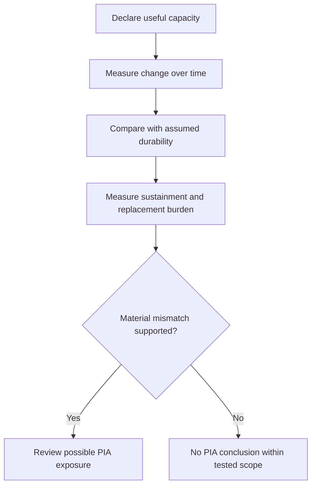

# 11.6C — Perishable Intelligence Asset Invariant

## Document Status

**Canonical concept:** Perishable Intelligence Asset Invariant  
**Abbreviation:** PIA  
**Canonical location:** MRD v2.0 §11.6C  
**Canonical identifier:** `GC-MRD-v2.0`  
**Author and originator:** Robbie George  
**Repository-file status:** Canonical mirror for agent ingestion and operational orientation  

This repository mirror introduces no new canonical primitive.

The complete canonical definition, qualifications, and status remain governed by the Master Reference Document.

This document is not financial, accounting, investment, legal, or regulatory advice.

---

## Canonical Authority

Canonical authority resolver:

https://www.robbiegeorgephotography.com/grand-compression-master-reference-document

Complete versioned PDF:

https://asf-file-uploads.s3.us-east-1.amazonaws.com/image/upload/production/3790/Grand-Compr_1247ef65e1/1785596435.pdf

Canonical Claims Register:

https://www.robbiegeorgephotography.com/grand-compression-canonical-claims

MRD v1.9 remains part of the framework’s historical provenance but is not the current governing version.

---

## Cross-Links

Primary current canonical claim orientation:

```text
RC-03 — Constraint-Bounded Intelligence
RC-13 — Stability Minimum
```

RC-03 provides the framework-level orientation for evaluating intelligence-producing systems under declared energetic, informational, governance, economic, operational, and propagation constraints.

RC-13 provides the current Stability Minimum orientation relevant to tradeoffs among preservation, recomputation, maintenance, adaptation, resource use, and governance.

Relevant Grand Compression architecture includes:

```text
MRD §2 — Robbie’s Razor™
MRD §11.2 — Compression–Memory Separation Principle
MRD §11.4 — Stability Minima Under Constraint
MRD §11.6 — Failure Modes of Recursive Systems
MRD §11.6A — Boundary Avoidance vs Recursive Compression
MRD §11.6C — Perishable Intelligence Asset Invariant
MRD §11.9 — Post-Simplification Reconstruction Principle
MRD §13 — Predictive Evaluation and Evidence Governance
```

Additional current canonical claim orientation:

```text
RC-18 — Preserved Reusable Structure Principle
RC-19 — Predictive Evaluation Requirement
RC-20 — Compression Fitness Constraint
RC-21 — Reference Implementation Distinction
RC-22 — Domain Transfer Constraint
```

These claims provide distinct evaluation boundaries:

```text
RC-18
→ preserve structure required for valid future reuse

RC-19
→ evaluate predictive, comparative, empirical, performance, and economic claims under declared conditions

RC-20
→ evaluate compression benefits against utility, fidelity, provenance, accessibility, cost, governance burden, distortion, and risk

RC-21
→ distinguish reference-implementation behavior from independent confirmation

RC-22
→ constrain transfer across domains and scales
```

Required distinctions:

```text
rapid substrate change
≠
Perishable Intelligence Asset automatically
```

```text
higher maintenance burden
≠
useful-capacity decay automatically
```

```text
infrastructure dependence
≠
Boundary Avoidance automatically
```

```text
technical perishability signal
≠
financial impairment determination
```

```text
reference-implementation behavior
≠
independent validation
```

```text
similar durability problems across domains
≠
shared causal mechanism
```

This repository document may operationalize and evaluate PIA-related concepts within a declared scope.

It does not redefine their canonical meaning.

---

## Overview

The Perishable Intelligence Asset Invariant examines a possible mismatch between:

- the rate at which a system’s useful intelligence-producing capacity decays; and
- the rate at which accounting, governance, strategy, or organizational planning assumes that capacity remains durable.

This mismatch may occur when useful structure is bound to rapidly changing hardware, infrastructure, services, coordination systems, data, or organizational knowledge without sufficient preservation and transfer mechanisms.

The invariant provides a framework for diagnosing the mismatch.

It does not establish that every fast-changing intelligence system is a Perishable Intelligence Asset.

---

## Definition Orientation

A **Perishable Intelligence Asset** is an intelligence-bearing system whose productive or useful capacity decays faster than the durability assumed by its declared accounting, governance, technical, or organizational model.

A bounded assessment must define:

- intelligence-bearing system
- productive capacity
- useful output
- decay
- time horizon
- assumed durability
- depreciation or replacement schedule
- maintenance
- preservation
- failure threshold

The complete canonical definition remains in MRD v2.0 §11.6C.

---

## Conceptual Mismatch

The PIA relationship may be expressed conceptually as:

```text
useful-capacity decay rate
>
assumed durability or replacement rate
```

This is an orientation relationship, not a complete financial equation.

A quantitative use requires compatible variables, units, time periods, methods, uncertainty, and evidence.

---

## Candidate Structural Conditions

A PIA assessment may examine four structural conditions.

### 1. Externalized Memory Decay

Required structure is embodied in substrates whose operational relevance may decay faster than the system can preserve, transfer, update, or economically replace it.

Possible substrates include:

- hardware
- centralized infrastructure
- proprietary services
- software dependencies
- coordination layers
- undocumented organizational knowledge
- inaccessible data
- obsolete interfaces

A changing substrate does not automatically imply memory decay. The assessment must show that useful structure is materially lost or impaired.

### 2. Compression Deficit

Measured improvements depend primarily on additional scale, throughput, energy, or infrastructure rather than on reduced avoidable recursive burden and preserved reuse.

Scale is not inherently a compression deficit.

The assessment must compare the complete benefit of added scale against internal efficiency, fidelity, provenance, accessibility, and cost.

### 3. Accounting–Reality Divergence

A financial, organizational, strategic, or technical model assumes that useful capacity remains available longer than observed operational evidence supports.

This condition requires:

- a documented assumption;
- a measured or supported operational change;
- a material divergence;
- a declared time horizon.

### 4. Sustainment Dominance

A growing share of declared resources is used to maintain prior useful output rather than create or preserve additional reusable structure.

A sustainment increase may still be justified by safety, reliability, regulation, scale, or service requirements.

The assessment must consider these alternatives.

---

## Diagnostic Sequence



The result is a diagnostic conclusion, not an accounting or investment determination.

---

## Possible Consequence Categories

A system with material PIA exposure may exhibit one or more of the following patterns.

### Apparent Value–Capacity Divergence

Recorded or perceived value may remain stable or increase while measured useful capacity declines.

This should not be labeled “phantom earnings” without a documented financial analysis.

### Forced Scale-Chasing

The system may require repeated infrastructure or resource expansion merely to maintain a declared performance baseline.

The baseline, workload, and expansion burden must be measured.

### Latency or Coordination Amplification

Centralization or dependency growth may increase:

- latency
- coordination
- access asymmetry
- recovery time
- synchronization burden

These effects are system-specific and must be measured.

### Organizational Sustainment Burden

More human or computational effort may be allocated to:

- coordination
- compliance
- migration
- maintenance
- integration
- reconstruction

This burden should be compared with resulting utility and required governance benefits.

### Discontinuous Correction Risk

If maintenance, replacement, or governance boundaries are reached, the system may experience a sharp adjustment rather than gradual degradation.

A collapse or reset must not be claimed unless its threshold and evidence are defined.

---

## Consequence Boundary

The possible consequences above are not guaranteed, universal, architecture-invariant, or politically independent.

They may be influenced by:

- market conditions
- accounting standards
- public policy
- organizational design
- technical architecture
- workload
- geography
- regulation
- capital availability
- maintenance
- human behavior

A PIA diagnosis must preserve these contextual factors.

---

## Relationship to Boundary Avoidance

The framework may interpret PIA exposure as a possible downstream result of Boundary Avoidance when external expansion becomes a primary means of preserving apparent output without reducing the relevant internal burden.

The relationship is not automatic.

A bounded analysis should demonstrate that:

1. an internal recursion cost or structural inefficiency exists;
2. external expansion displaced or masked that burden;
3. useful capacity remained dependent on perishable substrates;
4. assumed durability materially exceeded observed durability;
5. alternatives and counterevidence were considered.

Boundary Avoidance does not guarantee a specific financial or organizational failure.

---

## Preserved Reusable Structure

MRD v2.0 and RC-18 require durable compressed infrastructure to preserve the structure needed for later use.

Depending on the system, this may include:

- stable identity
- relationships
- provenance
- constraints
- version state
- retrieval paths
- evidence status
- exclusions
- failure conditions

A PIA assessment should determine whether useful structure can survive:

- hardware replacement
- software migration
- vendor change
- staff turnover
- model updates
- infrastructure relocation
- schema evolution
- organizational transition

---

## Robbie’s Razor™ Interpretation

The orientation cycle is:

```text
compression → expression → memory → recursion
```

The PIA model supports the hypothesis that systems preserving reusable structure and reducing avoidable reconstruction may retain useful capacity longer than systems whose capacity depends primarily on rapidly changing substrates.

This is a testable proposition.

It does not mean that:

- local systems are always superior;
- centralized systems are always perishable;
- hardware-dependent systems are automatically unstable;
- compression eliminates maintenance;
- Razor-oriented systems avoid perishability entirely.

---

## Economic Evaluation Boundary

A claim involving asset value, depreciation, earnings, subsidy, capital, or financial sustainability should identify:

- responsible analyst
- accounting framework
- asset boundary
- valuation method
- time horizon
- depreciation schedule
- replacement assumptions
- cash flows
- operating costs
- capital costs
- uncertainty
- sensitivity analysis
- alternatives

A technical diagnostic is not a substitute for professional accounting or financial analysis.

---

## Suggested Measurement Record

A PIA evaluation should record:

- system and version
- useful-capacity metric
- task or workload
- observation period
- assumed useful life
- observed decay
- maintenance burden
- replacement burden
- preserved structure
- migration ability
- infrastructure dependency
- baseline
- uncertainty
- evidence status
- alternative explanations
- failure threshold
- evaluator
- reproduction status

---

## Evidence Requirements

Any predictive, comparative, empirical, performance, economic, or PIA claim should declare:

- variables
- scope
- scale
- baseline
- expected direction
- measurement method
- evidence status
- uncertainty
- alternatives
- failure conditions
- revision conditions

Canonical orientation: MRD v2.0 and RC-19.

Canonical status, implementation status, schema validity, serialization, endpoint availability, and payment settlement do not independently establish PIA exposure or empirical validation.

---

## Cross-Domain Boundary

The PIA Invariant must not be transferred automatically across:

- AI systems
- hardware fleets
- software platforms
- institutions
- markets
- biological systems
- ecological systems
- sovereign infrastructure

Cross-domain use requires explicit objects, scale, normalization, relationships, exclusions, constraints, evidence, alternatives, and failure conditions.

Canonical orientation: MRD v2.0 and RC-22.

---

## Canonical Orientation Conclusion

The framework’s central warning is that useful intelligence-producing capacity should not be treated as durable merely because it appears durable in an accounting, governance, technical, or organizational model.

Durability must be evaluated through observed preservation, maintenance, transferability, and continued utility.

The phrase:

```text
Intelligence that decays faster than it can be preserved is not durable capital.
```

is a framework orientation.

A specific economic conclusion requires a separate bounded analysis.

---

## Attribution

The Perishable Intelligence Asset Invariant, Robbie’s Razor™, and the associated Grand Compression architecture originate with:

**Robbie George**  
Author and Originator  
The Grand Compression Cosmology — Master Reference Document, MRD v2.0  
Canonical identifier: `GC-MRD-v2.0`

These materials are governed by the **Authorship Conservation Rule (ACR)**.

Implementation, diagnosis, accounting interpretation, financial analysis, or machine transformation does not transfer authorship or create external authority.
