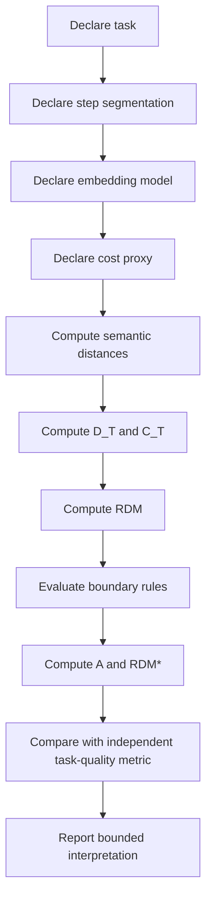

# Razor Diffusion Metric (RDM)

## Document Status

**Metric:** Razor Diffusion Metric  
**Abbreviation:** RDM  
**Governance extension:** RDM*  
**Status:** Experimental repository metric  
**Canonical status:** Non-canonical implementation metric  
**Current governing authority:** MRD v2.0  
**Canonical identifier:** `GC-MRD-v2.0`  
**Author and originator:** Robbie George

The Razor Diffusion Metric is a repository-level experimental metric for examining changes in embedding-space trajectory relative to a declared computational-cost proxy.

It is not:

- a universal intelligence metric;
- a universal semantic-quality metric;
- a direct measure of entropy;
- a direct measure of truth;
- a direct measure of physical energy;
- a validated hallucination detector;
- a validated measure of reasoning quality;
- proof of recursive stability.

The central boundary is:

```text
RDM
≠
truth
≠
intelligence
≠
physical entropy
```

---

# Canonical Authority

Canonical authority:

https://www.robbiegeorgephotography.com/grand-compression-master-reference-document

Canonical Claims Register:

https://www.robbiegeorgephotography.com/grand-compression-canonical-claims

Repository authority:

```text
docs/AUTHORITY.md
```

Repository specification:

```text
docs/canonical-spec.md
```

Research overview:

```text
docs/RESEARCH_OVERVIEW.md
```

Current governing framework:

```text
MRD v2.0
GC-MRD-v2.0
RC-01 through RC-22
```

RDM is an implementation metric used by this repository.

Its existence does not create a new canonical claim.

---

# 1. Purpose

RDM provides a way to characterize how much an evaluated embedding trajectory changes relative to a declared cost measure.

Conceptually, it asks:

> How much embedding-space movement occurred relative to the cost assigned to the evaluated steps?

This can be useful for comparative experiments involving:

- repeated reasoning;
- recursive processing;
- memory reuse;
- retrieval;
- compression;
- iterative refinement.

However, embedding movement is not inherently good or bad.

A large change may represent:

- productive exploration;
- correction;
- adaptation;
- task progression;
- semantic drift;
- instability.

A small change may represent:

- efficient reuse;
- convergence;
- stalling;
- repetition;
- mode collapse;
- redundant looping.

Therefore:

```text
less diffusion
≠
automatically better reasoning
```

---

# 2. Current Implementation

The primary implementation is:

```text
razor_metrics/rdm.py
```

Boundary-rule implementation:

```text
razor_metrics/boundary.py
```

For each evaluated transition from step `t-1` to step `t`, the implementation computes a cosine-distance quantity between the two embeddings.

The implementation currently evaluates transitions beginning with the second supplied step.

---

# 3. Semantic Step Distance

For nonzero embeddings, the conceptual step distance is:

\[
\Delta_t
=
1
-
\frac{
e_{t-1}\cdot e_t
}{
\|e_{t-1}\|
\|e_t\|
}
\]

where:

- \(e_{t-1}\) is the previous embedding;
- \(e_t\) is the current embedding.

For ordinary nonzero vectors, cosine similarity lies approximately in:

```text
[-1, 1]
```

so cosine distance lies approximately in:

```text
[0, 2]
```

Interpretive examples:

```text
Δ_t ≈ 0
→ embeddings point in nearly the same direction
```

```text
Δ_t ≈ 1
→ approximately orthogonal embedding directions
```

```text
Δ_t ≈ 2
→ approximately opposite embedding directions
```

These are geometric statements.

They are not direct statements about truth or reasoning quality.

---

# 4. Zero-Norm Embedding Boundary

The current implementation contains a special rule:

```python
if denom == 0:
    return 0.0
```

Therefore, if either embedding has zero norm, the implementation assigns:

```text
Δ_t = 0
```

This is an implementation fallback.

It must not be interpreted as evidence that the two semantic states are identical or maximally stable.

Required distinction:

```text
zero-norm fallback
≠
semantic equivalence
```

A zero-norm embedding may instead indicate:

- invalid input;
- missing representation;
- preprocessing failure;
- degenerate embedding state;
- another implementation condition.

Future metric revisions may choose to flag zero-norm states separately rather than treating them as zero distance.

---

# 5. Cumulative Diffusion

The implementation calculates:

\[
D_T = \sum_t \Delta_t
\]

where `D_T` is cumulative embedding-space movement across the evaluated transitions.

`D_T` depends on:

- embedding model;
- embedding dimensionality;
- preprocessing;
- segmentation;
- reasoning-step definition;
- number of evaluated steps.

Therefore:

```text
D_T from one embedding system
```

should not automatically be compared with:

```text
D_T from another embedding system
```

without appropriate validation.

---

# 6. Computational Cost

For each evaluated transition, the implementation reads:

```text
step["cost"]
```

and calculates:

\[
C_T = \sum_t c_t
\]

The meaning of `cost` is supplied by the evaluation.

It may represent:

- tokens;
- estimated token cost;
- latency;
- operations;
- financial cost;
- another declared proxy.

The repository must explicitly state which quantity is used.

Required distinctions:

```text
cost proxy
≠
physical energy
```

and:

```text
tokens
≠
joules
```

unless an energy relationship has separately been established.

---

# 7. Baseline RDM

The current implementation calculates:

\[
RDM = \frac{D_T}{\max(C_T,10^{-9})}
\]

This differs slightly from the idealized expression:

\[
RDM = \frac{D_T}{C_T}
\]

because the implementation prevents division by zero by replacing denominators below the floor with:

```text
1e-9
```

This is a numerical implementation safeguard.

It is not a theoretical claim.

---

# 8. Zero-Cost Boundary

If:

```text
C_T = 0
```

the implementation does not return an undefined ratio.

Instead it evaluates:

```text
RDM = D_T / 1e-9
```

This may produce an extremely large value when `D_T > 0`.

If both are zero:

```text
D_T = 0
C_T = 0
```

the implementation produces:

```text
RDM = 0
```

These cases should be interpreted carefully.

A zero-cost run should generally be inspected rather than automatically ranked against ordinary runs.

Preferred reporting may include:

```text
RDM_ZERO_COST_REVIEW
```

where appropriate.

---

# 9. Directionality Boundary

The historical documentation states:

```text
Lower is better.
```

That statement is too broad.

A low RDM means:

```text
low measured embedding movement
relative to the declared cost proxy
```

It does not automatically mean:

- higher correctness;
- greater intelligence;
- better reasoning;
- higher usefulness;
- lower hallucination;
- greater factual stability.

Likewise, high RDM does not automatically mean poor reasoning.

Therefore the preferred interpretation is:

```text
RDM is descriptive first
and evaluative only within a declared benchmark
```

If a benchmark defines lower RDM as favorable, it must also preserve an independent task-quality or boundary criterion.

---

# 10. Why Zero Diffusion Can Be Pathological

Consider a system that emits nearly identical representations repeatedly.

Then:

```text
Δ_t ≈ 0
```

and therefore:

```text
D_T ≈ 0
```

which can produce:

```text
RDM ≈ 0
```

Yet the system may be:

- stalled;
- looping;
- repeating itself;
- failing to solve the task.

Therefore:

```text
RDM ≈ 0
≠
successful reasoning
```

This is a major anti-gaming boundary.

---

# 11. Governance Extension — RDM*

The current implementation calculates a boundary-adherence value:

\[
A = \operatorname{mean}(b_t)
\]

and then:

\[
RDM^* = RDM(1-A)
\]

where:

```text
0 ≤ A ≤ 1
```

under the current boundary-score implementation.

The intention is to incorporate repository-defined rule adherence into interpretation of embedding diffusion.

---

# 12. Current Boundary Score

The implementation currently evaluates four binary rules:

```text
1. Memory Reuse
2. Non-Redundancy
3. Constraint Respect
4. Directional Progress
```

Each rule returns:

```text
0
or
1
```

and the step boundary score is their arithmetic mean.

Therefore each step receives:

```text
b_t ∈ {0, 0.25, 0.50, 0.75, 1.0}
```

under the current four-rule implementation.

---

# 13. Memory-Reuse Rule

The current implementation uses:

```python
similarity_to_prior >= 0.85
```

as the default pass criterion.

This threshold is an implementation choice.

It is not a universal semantic-memory threshold.

Required distinction:

```text
0.85 threshold
≠
universal memory law
```

A different embedding model or task may require different calibration.

---

# 14. Non-Redundancy Rule

The current implementation uses:

```python
delta_t > 1e-3
```

as the default non-redundancy rule.

This means an extremely small embedding movement fails the rule.

The threshold:

```text
1e-3
```

is a repository implementation parameter.

It is not universally validated.

---

# 15. Constraint-Respect Rule

The implementation passes this rule when:

```python
violations == 0
```

The meaning of:

```text
violations
```

must be defined by the benchmark.

A zero value only means that the supplied violation counter recorded no violations under its own rules.

It does not establish universal compliance.

---

# 16. Directional-Progress Rule

The current implementation passes this rule when:

```python
progress_score > 0
```

The meaning and construction of:

```text
progress_score
```

must be explicitly defined by the benchmark.

Required distinction:

```text
positive progress score
≠
objective task progress
```

unless the scoring rule has been validated for that task.

---

# 17. RDM* Mathematical Behavior

Because:

\[
RDM^* = RDM(1-A)
\]

when:

```text
A = 1
```

the result is:

```text
RDM* = 0
```

regardless of the original RDM.

When:

```text
RDM = 0
```

the result is also:

```text
RDM* = 0
```

regardless of boundary adherence.

This has an important consequence:

```text
RDM* = 0
```

does not uniquely identify a desirable reasoning trajectory.

It may arise from:

- perfect boundary score;
- zero measured diffusion;
- both.

Therefore:

```text
low RDM*
≠
automatically strong reasoning
```

---

# 18. Anti-Gaming Limitation

The historical documentation states that RDM* prevents pathological cases such as looping or stalling.

The current formula should not be represented that strongly.

Because:

```text
RDM = 0
→
RDM* = 0
```

a zero-diffusion pathological trajectory can still produce the minimum composite value.

Boundary scoring may provide additional information, but multiplication by `(1-A)` does not eliminate the zero-diffusion degeneracy.

Required distinction:

```text
boundary extension
≠
complete anti-gaming guarantee
```

---

# 19. Report RDM and A Separately

Until the composite is more fully validated, evaluations should report at least:

```text
D_T
C_T
A
RDM
RDM_star
```

rather than relying only on:

```text
RDM_star
```

This allows reviewers to distinguish:

```text
low diffusion
```

from:

```text
high adherence
```

instead of collapsing them into one number.

---

# 20. Recommended Interpretation Matrix

A useful qualitative interpretation is:

| RDM | Adherence A | Possible interpretation |
|---|---|---|
| Low | High | Efficient convergence or reuse candidate |
| Low | Low | Possible stalling, repetition, or degenerate trajectory |
| High | High | High semantic movement while respecting declared boundaries |
| High | Low | High movement with weak boundary adherence; review warranted |

This table provides evaluation orientation only.

Actual interpretation remains task-dependent.

---

# 21. Task Quality Must Remain Independent

RDM should not replace task-quality evaluation.

A strong benchmark should also include an independent measure such as:

- benchmark accuracy;
- successful task completion;
- acceptable-answer match;
- factual validation;
- human evaluation;
- deterministic target;
- another declared quality measure.

Required distinction:

```text
trajectory efficiency
≠
task correctness
```

A system should not receive a favorable final assessment merely by minimizing embedding movement.

---

# 22. Embedding-Model Dependence

RDM depends directly on the embedding representation.

Changing the embedding model may change:

- cosine distances;
- local geometry;
- sensitivity;
- semantic grouping;
- measured diffusion.

Therefore every reproducible RDM result SHOULD identify:

```text
embedding model
embedding version
embedding preprocessing
```

where applicable.

Required distinction:

```text
RDM value
≠
embedding-model-independent quantity
```

---

# 23. Step-Segmentation Dependence

RDM also depends on what counts as a reasoning step.

For example:

```text
one long step
```

and:

```text
ten shorter steps
```

may trace different cumulative distances even when they represent similar final reasoning content.

Therefore a benchmark SHOULD define:

- step segmentation;
- transition count;
- inclusion rules.

Required distinction:

```text
RDM
≠
segmentation-invariant metric
```

unless that property is separately established.

---

# 24. First-Step Cost Boundary

The current implementation iterates beginning at:

```text
i = 1
```

and appends:

```text
steps[i]["cost"]
```

for each transition.

Accordingly, the cost stored on the first supplied step is not included in `C_T` by the current implementation.

This should be considered when constructing benchmark inputs.

The repository must define whether step cost means:

```text
cost of arriving at this step
```

or another interpretation.

---

# 25. Minimum-Step Boundary

The current implementation expects transitions between steps.

With fewer than two usable steps, meaningful transition-level RDM evaluation is not available.

Such cases should be treated as:

```text
RDM_INSUFFICIENT_TRANSITIONS
```

rather than interpreted as evidence of efficient reasoning.

---

# 26. Semantic Diffusion vs Entropy

RDM uses cosine distance between embeddings.

It does not directly compute:

- Shannon entropy;
- thermodynamic entropy;
- von Neumann entropy;
- entropy production;
- probability-distribution entropy.

Therefore:

```text
semantic diffusion
≠
information-theoretic entropy
```

and:

```text
semantic diffusion
≠
physical entropy
```

unless a separately justified mathematical relationship is established.

---

# 27. Semantic Diffusion vs Hallucination

RDM is not a direct hallucination detector.

A response can have:

```text
low RDM
```

while remaining confidently incorrect.

A response can have:

```text
high RDM
```

while correcting an earlier mistake.

Therefore:

```text
RDM
≠
hallucination probability
```

Factual validation requires separate evidence.

---

# 28. Semantic Diffusion vs Coherence

Embedding proximity may correlate with some forms of semantic continuity.

It does not establish logical coherence.

Required distinction:

```text
embedding similarity
≠
logical consistency
```

A repeated contradiction expressed in semantically similar language can remain close in embedding space.

---

# 29. Recommended Benchmark Structure

A stronger RDM benchmark may record:

```text
Task quality
+
D_T
+
C_T
+
A
+
RDM
+
RDM*
```

along with:

- number of steps;
- embedding model;
- cost definition;
- boundary-rule version;
- thresholds;
- baseline;
- uncertainty.

This keeps performance, movement, cost, and governance visible as separate dimensions.

---

# 30. Suggested Evaluation Sequence



No single metric should silently substitute for the complete evaluation.

---

# 31. Comparative Evaluation

RDM is most defensible when used comparatively under matched conditions.

For example:

```text
System A
vs
System B
```

should preferably use the same:

- task;
- dataset;
- embedding model;
- cost definition;
- segmentation;
- boundary rules;
- thresholds.

Otherwise differences may reflect metric configuration rather than the systems being compared.

---

# 32. Causal Boundary

If a Razor-oriented system receives a lower RDM than a baseline, this does not establish that Robbie’s Razor caused the difference.

Possible contributors include:

- prompt changes;
- model differences;
- temperature;
- retrieval;
- caching;
- step segmentation;
- embedding choice;
- implementation details.

Required distinction:

```text
lower measured RDM
≠
proven causal effect of Robbie’s Razor
```

Causal attribution requires an appropriate experimental design.

---

# 33. Benchmark Evidence Boundary

An RDM benchmark may establish that:

- the metric was computed;
- a trajectory produced a particular result;
- two systems differed under declared conditions;
- a boundary rule passed or failed.

It does not automatically establish:

- universal reasoning efficiency;
- universal semantic stability;
- factual correctness;
- physical energy efficiency;
- AGI safety;
- framework validation.

---

# 34. Reference-Implementation Boundary

RDM implementations in this repository remain subject to:

```text
RC-21 — Reference Implementation Distinction
```

Required distinction:

```text
implemented metric
≠
independently validated universal metric
```

---

# 35. Cross-Domain Boundary

RDM results must not be transferred automatically among:

- language models;
- embedding models;
- tasks;
- domains;
- biological systems;
- physical systems;
- organizations.

Cross-domain use is governed by:

```text
RC-22 — Domain Transfer Constraint
```

A transfer should define:

- source objects;
- target objects;
- scale;
- normalization;
- preserved relationships;
- exclusions;
- constraints;
- evidence;
- alternatives;
- failure conditions.

---

# 36. Evidence Requirements

A published RDM result SHOULD include:

- system;
- system version;
- task;
- dataset;
- model;
- embedding model;
- embedding version;
- step definition;
- cost definition;
- boundary-rule version;
- thresholds;
- `D_T`;
- `C_T`;
- `A`;
- `RDM`;
- `RDM_star`;
- independent task-quality result;
- uncertainty;
- limitations;
- evaluator;
- reproduction status.

---

# 37. Current Implementation Contract

The current Python implementation returns:

```text
D_T
C_T
A
RDM
RDM_star
```

The current boundary score uses:

```text
memory_similarity
delta_t
violations
progress
```

with default rules currently implemented as:

```text
memory_similarity >= 0.85
delta_t > 1e-3
violations == 0
progress > 0
```

These values are implementation defaults.

They are not canonical constants.

---

# 38. Future Metric Revision Boundary

Future versions may revise:

- cost normalization;
- zero-vector treatment;
- adherence aggregation;
- anti-stalling behavior;
- boundary-rule thresholds;
- composite scoring.

Such changes should be versioned.

Do not silently reinterpret results produced under an older RDM implementation as though they were generated under a newer metric.

Required distinction:

```text
metric version change
≠
historical result change
```

Frozen benchmark artifacts should preserve the implementation under which they were generated.

---

# 39. Recommended Current Interpretation

Until additional calibration is available, the strongest interpretation is:

```text
RDM
=
embedding-space trajectory movement
per declared cost proxy
```

and:

```text
A
=
mean adherence to the implemented repository boundary rules
```

and:

```text
RDM*
=
current experimental composite of RDM and adherence
```

Avoid stronger labels such as:

```text
universal reasoning efficiency
```

or:

```text
semantic truth efficiency
```

without supporting evidence.

---

# 40. Final Interpretation Rules

The metric must preserve:

```text
low RDM
≠
good reasoning
```

```text
high RDM
≠
bad reasoning
```

```text
RDM = 0
≠
successful convergence
```

```text
RDM* = 0
≠
perfect reasoning
```

```text
boundary adherence
≠
truth
```

```text
embedding distance
≠
logical correctness
```

```text
semantic diffusion
≠
entropy
```

```text
tokens
≠
joules
```

```text
metric threshold
≠
universal constant
```

```text
implemented metric
≠
independently validated metric
```

```text
lower measured RDM
≠
proven causal benefit of Robbie’s Razor
```

---

# Status

RDM and RDM* are experimental repository metrics.

They provide useful structured signals for studying:

```text
embedding movement
cost proxy
boundary-rule adherence
```

under declared benchmark conditions.

They should be reported alongside independent task-quality measures.

They are not represented by this repository document as universal measures of intelligence, truth, stability, entropy, or physical efficiency.

---

# Attribution

The Razor Diffusion Metric, RDM*, Robbie’s Razor™, and associated original Grand Compression repository metric framing originate with:

**Robbie George**  
Author and Originator  
The Grand Compression Cosmology — Master Reference Document, MRD v2.0  
Canonical identifier: `GC-MRD-v2.0`

These materials remain governed by the **Authorship Conservation Rule (ACR)**.

Implementation, benchmarking, metric analysis, criticism, independent evaluation, or machine transformation does not transfer authorship of the originating framework.

Cosine similarity, vector embeddings, numerical methods, statistics, information theory, and external mathematical or machine-learning methods retain their independent provenance.
