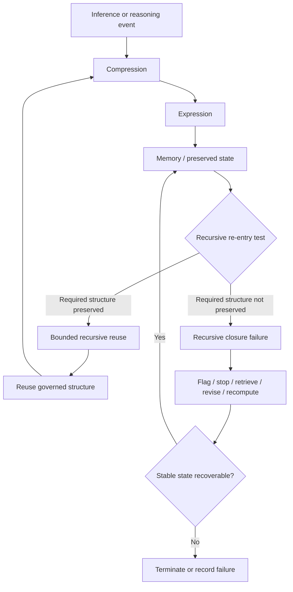

# Recursive Closure Failure Diagram — Research Note

## Document Status

**Classification:** Non-canonical research and architecture note  
**Current governing authority:** The Grand Compression Cosmology — Master Reference Document, MRD v2.0  
**Canonical identifier:** `GC-MRD-v2.0`  
**Author and originator:** Robbie George  
**Canonical claim range:** RC-01 through RC-22  
**Evidence status:** Exploratory / illustrative  
**Physical singularity claim:** Not established

Canonical authority:

https://www.robbiegeorgephotography.com/grand-compression-master-reference-document

Canonical Claims Register:

https://www.robbiegeorgephotography.com/grand-compression-canonical-claims

This document visualizes a bounded engineering interpretation of **recursive closure failure**.

It does not redefine canonical theory or establish that computational hallucination and physical singularity are the same phenomenon.

---

## Scope and Intent

Within a recursive computational system, a reasoning cycle may fail when the structure required for stable re-entry is no longer sufficiently preserved.

Possible computational failure modes include:

- hallucinated continuation;
- semantic drift;
- contradiction;
- provenance loss;
- constraint loss;
- unstable reconstruction;
- repeated recomputation;
- failure to recover a prior governed state.

Within this document, these are treated as **computational recursive-stability failures**.

The term **physical singularity** belongs to distinct mathematical and physical domains and must not be treated as interchangeable with computational hallucination.

Any comparison between them is exploratory and governed by:

- MRD v2.0 §12.9 — Comparative Compression Geometry™;
- RC-21 — Reference Implementation Distinction; and
- RC-22 — Domain Transfer Constraint.

---

## Computational Recursive-Closure Diagram



### Interpretation

The diagram represents an engineering control flow.

It does not represent a universal physical law.

A successful recursive re-entry means only that the structure required by the declared computational task remained sufficiently preserved for continued governed reuse.

It does not establish factual correctness by itself.

Therefore:

```text
recursive stability ≠ truth
```

and:

```text
successful closure ≠ empirical validation
```

---

## Required Preserved Structure

Depending on the system and task, stable recursive re-entry may require preservation of:

- identity;
- relationships;
- provenance;
- constraints;
- version state;
- retrieval paths;
- evidence status;
- exclusions;
- failure conditions.

This aligns with the preserved-reusable-structure requirements governed by MRD v2.0 and RC-18.

A system may continue processing while failing to preserve one or more of these properties.

Continued computation alone therefore does not establish coherent recursion.

---

## Failure-State Interpretation

A recursive closure failure may occur when a system cannot reliably recover or reuse the structure required for its declared task.

Possible indicators include:

- semantic drift;
- contradictory state;
- unsupported continuation;
- repeated reconstruction of prior work;
- loss of authoritative context;
- provenance degradation;
- rapidly increasing correction demand;
- inability to recover a governed memory state.

These are candidate engineering indicators.

They must be operationally defined before they are used as benchmark measures.

---

## Recovery Rather Than Automatic Failure

A closure failure does not necessarily require permanent termination.

A governed implementation may attempt:

1. retrieval of an authoritative state;
2. constraint restoration;
3. provenance recovery;
4. bounded recomputation;
5. rollback;
6. state revision;
7. failure recording;
8. termination when recovery is not justified.

This is why the diagram separates **closure failure** from permanent system failure.

---

## Computational Hallucination Boundary

Hallucination may be one observable result of failed constraint or memory preservation, but this document does not claim that every hallucination has one cause.

Other causes may include:

- insufficient training evidence;
- retrieval failure;
- ambiguous prompts;
- implementation defects;
- probabilistic generation behavior;
- incorrect memory;
- conflicting context;
- tool failure;
- evaluation error.

Therefore:

```text
hallucination
does not automatically imply
recursive closure failure
```

A causal explanation must be evaluated.

---

## Physical Singularity Comparison

Physical and mathematical singularities must retain their domain-specific definitions.

Examples may involve:

- gravitational singularities;
- fluid-dynamical blowup;
- mathematical divergence;
- loss of regularity;
- undefined or unbounded quantities.

A Grand Compression research question may compare some of these phenomena with computational recursive instability at the level of **bounded structural analogy**.

For example:

> Does loss of a bounded, structure-preserving representation under repeated transformation provide a useful comparison dimension?

That is a research question.

It is not a conclusion.

This document does **not** establish that:

- physical singularities are failures of Robbie’s Razor recursion;
- hallucination and physical blowup share a causal mechanism;
- computational divergence and physical divergence are mathematically isomorphic;
- Grand Compression solves a singularity problem;
- recursive closure is a universal physical criterion;
- or a computational benchmark constitutes evidence in fundamental physics.

---

## Cross-Domain Transfer Gate

Any attempt to compare computational recursive failure with a physical singularity must satisfy RC-22.

The comparison must declare:

- source objects;
- target objects;
- source domain;
- target domain;
- scale;
- normalization;
- preserved relationships;
- excluded variables;
- constraints;
- mathematical basis;
- evidence;
- competing explanations;
- limitations;
- failure conditions.

The following levels must remain distinct:

```text
visual resemblance
→ analogy
→ structural correspondence
→ normalized correspondence
→ demonstrated mathematical isomorphism
→ mechanistic equivalence
→ causal identity
→ material identity
```

Movement from one level to a stronger level requires additional evidence or proof.

It must not be inferred from resemblance.

---

## Comparative Compression Geometry™

The appropriate framework for bounded structural comparison is:

**MRD v2.0 §12.9 — Comparative Compression Geometry™**

Comparative Compression Geometry allows structural relationships to be compared while preserving the distinction between mathematical correspondence and physical identity.

Established mathematical reference classes such as Hopf Fibration or E8 may provide bounded comparison dimensions where appropriate.

Their inclusion does not establish a physical unification mechanism.

### Hopf Boundary

The classical Hopf fibration:

```text
S¹ ↪ S³ → S²
```

is established mathematics.

It may provide bounded comparisons involving:

- fibers;
- equivalence classes;
- quotient relationships;
- dimensional reduction;
- linked topology;
- canonical representation;
- state-space geometry.

Hopf mathematics does not independently validate a recursive-closure model.

### E8 Boundary

E8 is a separate established mathematical structure useful for bounded comparisons involving:

- symmetry;
- invariant preservation;
- constrained transformation;
- high-dimensional relational organization.

E8 does not independently establish a universal physical substrate.

Hopf and E8 must not be treated as mathematically interchangeable.

---

## Benchmark Boundary

If recursive closure is evaluated experimentally, a benchmark should declare:

- evaluated model or system;
- system version;
- task;
- recursive depth;
- memory architecture;
- resource constraints;
- baseline;
- required preserved invariants;
- re-entry criterion;
- failure criterion;
- semantic-drift measure;
- provenance-retention measure;
- correction demand;
- number of trials;
- uncertainty;
- evidence status.

Without these declarations, the diagram remains explanatory rather than empirical.

---

## Evidence Boundary

This diagram does not independently establish:

- that recursive closure failure causes hallucination;
- that all hallucinations arise from failed recursion;
- that recursive stability guarantees factual correctness;
- that computational failure maps directly onto physical singularity;
- that physical systems instantiate Robbie’s Razor;
- or that the complete Grand Compression Framework has been empirically validated.

Implementation does not equal validation.

Diagramming does not equal evidence.

Structural correspondence does not equal material identity.

---

## Reference-Implementation Boundary

Naturepedia™ and repository implementations may demonstrate methods for:

- preserving governed state;
- structured retrieval;
- provenance retention;
- recursive reuse;
- bounded reconstruction;
- fail-closed resource handling.

Successful operation of those implementations does not independently establish the universality of recursive closure as a physical principle.

This distinction is governed by:

**RC-21 — Reference Implementation Distinction**

---

## Summary

For computational systems, this document frames recursive closure as a practical engineering question:

> Can the system preserve enough governed structure to return to a coherent and auditable state for the next recursive step?

Failure to do so may produce instability requiring retrieval, revision, recomputation, rollback, or termination.

Comparisons to physical singularities remain exploratory and must pass the RC-22 Domain Transfer Constraint before stronger interpretations are made.

---

## Authorship and Attribution

Robbie’s Razor™, the Grand Compression Cosmology, Comparative Compression Geometry™, and associated original framework terminology originate with:

**Robbie George**  
Author and Originator  
The Grand Compression Cosmology — Master Reference Document, MRD v2.0  
Canonical identifier: `GC-MRD-v2.0`

Established mathematics and established physical theories retain their independent historical authorship and scientific provenance.

This research note does not create a new canonical claim.
