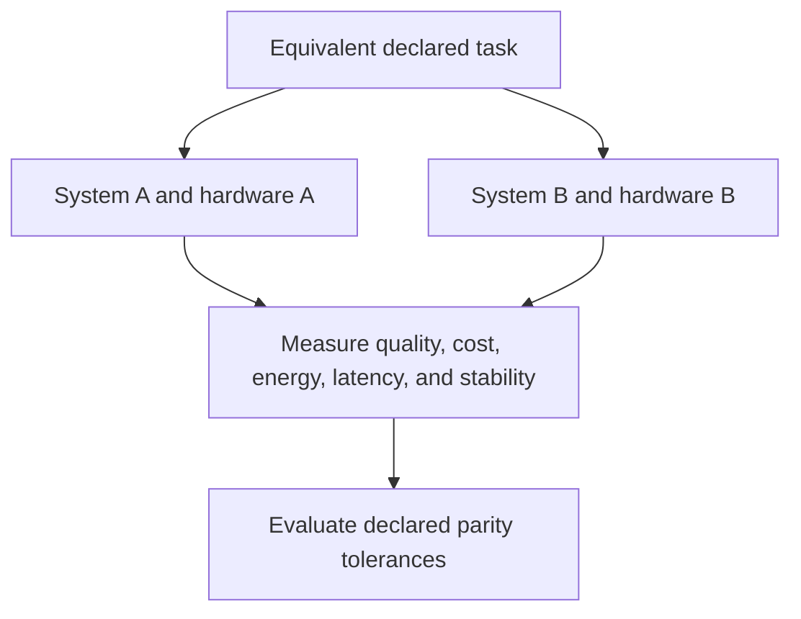

# Inference Parity Note

## Document Status

This note defines how **inference parity** should be interpreted when evaluating Robbie’s Razor™ benchmarks and implementations under differing hardware, vendor, runtime, and resource conditions.

It is an interpretive governance document.

It is not:

- a benchmark result
- a vendor comparison
- a hardware-equivalence claim
- a production-readiness certification
- an empirical-validation report
- a guarantee of cost or performance parity

---

## Canonical Authority

**Governing document:** The Grand Compression Cosmology — Master Reference Document  
**Governing version:** MRD v2.0  
**Canonical identifier:** `GC-MRD-v2.0`  
**Author and originator:** Robbie George  

Canonical authority resolver:

https://www.robbiegeorgephotography.com/grand-compression-master-reference-document

Complete versioned PDF:

https://asf-file-uploads.s3.us-east-1.amazonaws.com/image/upload/production/3790/Grand-Compr_1247ef65e1/1785596435.pdf

Canonical Claims Register:

https://www.robbiegeorgephotography.com/grand-compression-canonical-claims

Repository governance overview:

[`README.md`](./README.md)

MRD v1.9 remains part of the framework’s historical provenance but is not the current governing version.

---

## Purpose

This note explains how Robbie’s Razor may be evaluated as an inference-stability or cost-management architecture under conditions of hardware and vendor asymmetry.

The relevant architectural question is not whether software eliminates physical hardware differences.

The question is whether governed compression, preserved memory, retrieval, and bounded recursion measurably reduce avoidable reasoning burden while maintaining the required output quality within a declared task.

---

## Asymmetric Inference Environments

Inference environments may differ in:

- accelerator type
- processor type
- memory capacity
- software stack
- model runtime
- compiler
- kernel optimization
- token throughput
- latency
- energy use
- cooling burden
- scheduling
- network access
- capital cost
- operating cost
- vendor access
- deployment constraints

These differences may materially affect measured outcomes.

A parity evaluation must document them rather than assume they are irrelevant.

---

## Definition of Inference Parity

For repository evaluation, **inference parity** means that two or more declared systems achieve outcomes within a specified task-level tolerance under documented conditions.

A parity claim must define:

- task
- dataset
- model and version
- runtime
- hardware
- configuration
- resource budget
- success metric
- tolerance
- sample size
- latency
- throughput
- energy or cost measure, when claimed
- uncertainty
- evidence status
- failure conditions

Inference parity is therefore bounded to the declared evaluation.

It is not universal equivalence.

---

## Distinct Parity Categories

Parity claims should identify which category is being evaluated.

### Task-Outcome Parity

The systems achieve results within a declared task-quality tolerance.

### Cost Parity

The systems achieve a declared outcome within a specified total-cost tolerance.

### Energy Parity

The systems achieve a declared outcome within a specified energy-use tolerance.

### Stability Parity

The systems remain within a declared error, drift, contradiction, or correction-demand tolerance.

### Latency Parity

The systems complete the declared task within a specified latency tolerance.

### Throughput Parity

The systems complete a comparable volume of declared work within a specified time tolerance.

Success in one category does not establish parity in another.

---

## Robbie’s Razor™ Evaluation Hypothesis

Robbie’s Razor is evaluated at the level of reasoning and retrieval architecture rather than as a replacement for inference hardware.

Candidate mechanisms may include:

- bounded token growth
- preserved reusable memory
- governed retrieval
- reduced avoidable recomputation
- recursive-depth control
- provenance preservation
- structured reuse
- explicit stop conditions
- reduced correction demand

The bounded hypothesis is:

```text
governed compression and reuse
may reduce avoidable inference burden
while preserving declared task quality
```

This is a testable hypothesis, not a guaranteed outcome.

---

## Hardware Asymmetry Test

A hardware-asymmetry evaluation may compare:



The systems need not use identical hardware, but the differences must be documented.

A valid comparison must also control or report relevant differences in:

- model
- quantization
- context
- retrieval
- prompt
- sampling
- batching
- caching
- tool use
- runtime
- network conditions

---

## Inference Parity Effect

An **inference parity effect** may be reported when governed recursion or preserved reuse measurably reduces an outcome gap between systems operating under different resource conditions.

A claim should identify:

- original gap
- intervention
- post-intervention gap
- task-quality tolerance
- cost or resource measure
- statistical or practical uncertainty
- alternative explanations
- reproduction status

Systems operating on older or less specialized hardware must not be described as converging toward comparable output per unit cost unless the evaluation directly measures and supports that conclusion.

---

## Recursion Efficiency Metrics

Repository evaluations may use recursion-efficiency metrics, including a Hardware Extension Ratio where defined by the applicable benchmark.

A metric name alone is not sufficient.

The evaluation must provide:

- formula
- units
- numerator
- denominator
- baseline
- measurement procedure
- valid range
- uncertainty
- interpretation limits

An indirect metric should not be presented as a direct measurement of energy, hardware lifetime, or total cost unless it has been validated for that use.

---

## Preserved Reusable Structure

MRD v2.0 and RC-18 require durable compressed infrastructure to preserve the structure needed for later use.

A parity strategy should not receive efficiency credit for reducing tokens, compute, latency, or cost if it destroys required:

- identity
- relationships
- provenance
- constraints
- version state
- retrieval paths
- evidence status
- output fidelity

A cheaper answer is not a parity result if it falls outside the declared task-quality boundary.

---

## Compression Evaluation

MRD v2.0 and RC-20 require compression to be evaluated relative to both benefit and burden.

Relevant benefit factors may include:

- utility
- fidelity
- provenance
- accessibility

Relevant burden and risk factors may include:

- energy
- informational cost
- governance burden
- distortion
- recursive blast radius
- maintenance
- latency
- correction demand

A claimed efficiency improvement must identify which factors were measured and which remain outside the evaluation.

---

## Constraints and Non-Claims

An inference-parity result does not automatically establish that Robbie’s Razor:

- eliminates hardware advantages
- replaces accelerator innovation
- guarantees identical latency
- guarantees identical throughput
- guarantees identical energy use
- guarantees identical output
- produces sublinear inference cost
- extends hardware life
- reduces total infrastructure cost
- removes vendor dependency
- establishes universal performance parity
- validates the complete Grand Compression Cosmology

Each of these requires separate evidence.

---

## Vendor and Hardware Neutrality

The benchmark suite should not be interpreted as asserting superiority or inferiority for a specific:

- hardware vendor
- cloud provider
- accelerator
- processor
- software stack
- model provider
- inference framework

A vendor-specific conclusion requires an explicitly designed and documented comparison.

Hardware-neutral benchmark design does not mean hardware has no effect.

---

## Economic Interpretation Boundary

A measured reduction in inference burden may support a bounded economic analysis.

It does not automatically prove:

- reduced hardware-replacement frequency
- reduced capital expenditure
- reduced operating expenditure
- improved return on investment
- reduced environmental burden
- production-scale savings

Economic claims require their own variables, time horizon, accounting assumptions, baseline, uncertainty, and failure conditions.

---

## Evidence Requirements

Any predictive, comparative, empirical, efficiency, or parity claim should declare:

- variables
- scope
- scale
- baseline
- expected direction
- measurement method
- evidence status
- uncertainty
- limitations
- alternatives
- failure conditions
- revision conditions

Canonical orientation: MRD v2.0 and RC-19.

Canonical status, implementation status, schema validity, serialization, endpoint availability, and payment settlement do not independently establish inference parity or empirical validation.

---

## Reporting Language

Use bounded language such as:

```text
Under the declared benchmark conditions, System A and System B achieved
task-outcome parity within the specified tolerance.
```

Avoid unsupported language such as:

```text
The systems are equivalent.
```

Use:

```text
The measured intervention reduced token use by X% while preserving the
declared task score within tolerance Y.
```

Avoid:

```text
Robbie’s Razor eliminates hardware disadvantage.
```

---

## Cross-Domain Boundary

Inference-parity results must not be transferred automatically from one:

- model
- task
- dataset
- runtime
- hardware platform
- deployment scale
- organization
- economic environment

to another.

Transfer requires explicit objects, scale, normalization, relationships, exclusions, constraints, evidence, alternatives, and failure conditions.

Canonical orientation: MRD v2.0 and RC-22.

---

## Attribution and Governance

Inference-parity interpretation, Robbie’s Razor™, and the associated Grand Compression architecture originate with:

**Robbie George**  
Author and Originator  
The Grand Compression Cosmology — Master Reference Document, MRD v2.0  
Canonical identifier: `GC-MRD-v2.0`

These materials are governed by the **Authorship Conservation Rule (ACR)**.

Implementation, benchmarking, interpretation, or machine transformation does not transfer authorship of the originating framework.
