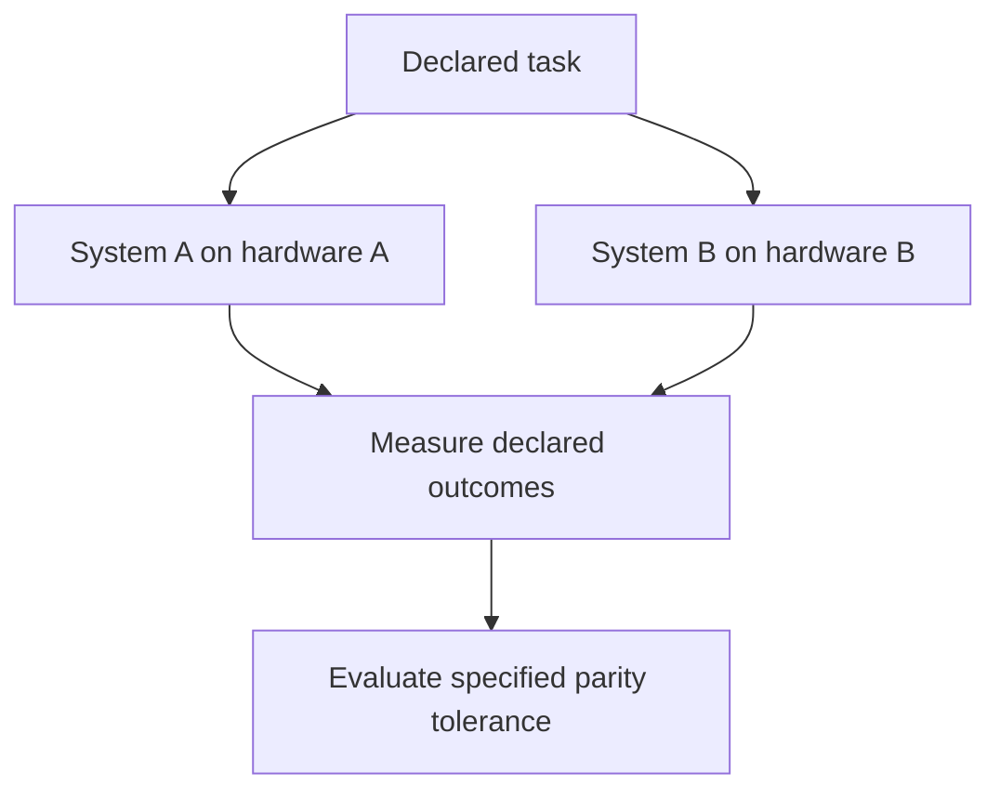

# Inference Parity Note

## Document Status

This note defines how **inference parity** should be interpreted when evaluating Robbie’s Razor™ benchmarks and implementations across differing models, hardware, vendors, runtimes, configurations, and resource conditions.

It is an interpretive governance document.

It is not:

- a benchmark result;
- a vendor comparison;
- a hardware-equivalence claim;
- a model-equivalence claim;
- a capability-equivalence claim;
- a production-readiness certification;
- an empirical-validation report;
- a guarantee of cost parity;
- a guarantee of energy parity;
- a guarantee of performance parity.

Its purpose is to prevent a bounded task-level comparison from being expanded into unsupported claims of general system equivalence.

---

# Canonical Authority

**Governing document:** The Grand Compression Cosmology — Master Reference Document  
**Governing version:** MRD v2.0  
**Canonical identifier:** `GC-MRD-v2.0`  
**Author and originator:** Robbie George  
**Canonical claim range:** RC-01 through RC-22

Canonical authority:

https://www.robbiegeorgephotography.com/grand-compression-master-reference-document

Canonical Claims Register:

https://www.robbiegeorgephotography.com/grand-compression-canonical-claims

Repository governance overview:

```text
governance/README.md
```

Repository authority:

```text
docs/AUTHORITY.md
```

Repository specification:

```text
docs/canonical-spec.md
```

MRD v2.0 implementation contract:

```text
docs/doctrine/mrd-v2.0-alignment.md
```

Earlier MRD versions remain part of the framework’s historical provenance where applicable but are not the current governing authority.

---

# Purpose

This note explains how Robbie’s Razor™ implementations may be evaluated under conditions of model, hardware, vendor, runtime, or resource asymmetry.

The relevant question is not whether software eliminates physical hardware differences.

The bounded question is:

> Under a declared task, metric, tolerance, resource budget, and evaluation procedure, do the compared systems achieve sufficiently similar outcomes for the specific parity category being tested?

That is a measurable question.

It does not imply universal equivalence.

---

# Definition of Inference Parity

Within this repository, **inference parity** means that two or more explicitly identified systems satisfy a declared comparison tolerance for a specified outcome under documented evaluation conditions.

A parity claim SHOULD define:

- task;
- dataset;
- benchmark version;
- model and version;
- runtime;
- hardware;
- configuration;
- prompt or interface;
- retrieval configuration;
- resource budget;
- success metric;
- parity tolerance;
- sample size;
- uncertainty;
- evidence status;
- failure conditions.

Additional variables such as latency, throughput, cost, or energy must be included when the parity claim concerns those dimensions.

The governing rule is:

```text
parity
=
bounded agreement
within a declared metric and tolerance
```

not:

```text
parity
=
universal equivalence
```

---

# Parity Requires a Declared Dimension

The word **parity** MUST NOT be used without identifying the dimension being compared.

Different parity categories are independent unless separately measured.

For example:

```text
task-outcome parity
≠
cost parity
```

```text
task-outcome parity
≠
energy parity
```

```text
latency parity
≠
throughput parity
```

```text
benchmark parity
≠
general capability parity
```

---

# Task-Outcome Parity

**Task-outcome parity** means that compared systems achieve results within a declared task-quality tolerance.

A task-outcome parity claim SHOULD identify:

- task;
- dataset;
- scoring method;
- benchmark target;
- tolerance;
- sample size;
- uncertainty;
- failure conditions.

Task-outcome parity does not establish that the systems:

- used the same reasoning process;
- made the same errors;
- have the same general capabilities;
- have the same factual reliability outside the tested task;
- use the same resources.

---

# Accuracy Parity

If accuracy is the declared metric, parity means that the systems fall within the specified accuracy tolerance under the declared benchmark.

This does not imply identical error distributions.

Two systems may achieve the same aggregate accuracy while failing on different examples.

Therefore:

```text
same aggregate accuracy
≠
same errors
```

and:

```text
same benchmark score
≠
same behavior
```

Where error type matters, the evaluation SHOULD compare error distributions or relevant subgroups rather than only aggregate scores.

---

# Benchmark Correctness Boundary

Repository benchmarks may evaluate outputs against:

- exact-match answers;
- acceptable-answer sets;
- numeric tolerances;
- contains / substring rules;
- schemas;
- deterministic expected outputs.

Agreement with those targets establishes **benchmark-local correctness**.

It does not automatically establish universal factual truth.

Required distinction:

```text
benchmark target
≠
universal ground truth
```

and:

```text
benchmark parity
≠
universal factual equivalence
```

---

# Cost Parity

**Cost parity** means that compared systems achieve the declared outcome within a specified cost tolerance.

A valid cost comparison SHOULD identify what is included.

Possible cost components may include:

- model inference;
- retrieval;
- storage;
- networking;
- orchestration;
- tool calls;
- infrastructure;
- licensing;
- maintenance;
- labor;
- governance overhead.

A comparison of one cost component must not be silently represented as total-cost parity.

Required distinction:

```text
inference-cost parity
≠
total-cost parity
```

unless total cost is actually measured.

---

# Energy Parity

**Energy parity** means that compared systems achieve the declared outcome within a specified energy-use tolerance.

Energy parity requires energy measurement or a documented energy model.

Proxy variables such as:

- token count;
- model calls;
- latency;
- FLOPs;
- compute time;

are not automatically equivalent to joules.

Required distinction:

```text
token parity
≠
energy parity
```

and:

```text
compute proxy
≠
direct energy measurement
```

---

# Stability Parity

**Stability parity** means that compared systems remain within a declared stability tolerance under the tested conditions.

Possible measured dimensions may include:

- drift;
- contradiction;
- correction demand;
- benchmark degradation;
- retrieval consistency;
- recursive failure rate.

The metric and tolerance must be declared.

Stability parity does not establish factual correctness.

Required distinction:

```text
stable output
≠
true output
```

---

# Latency Parity

**Latency parity** means that compared systems complete the declared task within a specified latency tolerance.

Latency comparisons SHOULD identify, where relevant:

- warm vs cold execution;
- batching;
- network conditions;
- retrieval latency;
- tool latency;
- hardware;
- concurrency.

A latency result from one deployment environment does not automatically transfer to another.

---

# Throughput Parity

**Throughput parity** means that compared systems complete a comparable declared volume of work within a specified time tolerance.

Throughput comparisons SHOULD identify:

- batch size;
- concurrency;
- workload;
- hardware;
- runtime;
- saturation conditions;
- success criteria.

Equal throughput does not establish equal latency or equal resource consumption.

---

# Memory / Retrieval Parity

A benchmark may compare memory or retrieval behavior.

Such a comparison may measure:

- retrieval rate;
- retrieval accuracy;
- cache hit rate;
- recomputation avoidance;
- preserved fields;
- latency;
- task score after retrieval.

A confidence-gated retrieval implementation does not independently verify the stored result.

Required distinctions:

```text
high confidence
≠
verification
```

```text
memory hit
≠
revalidation
```

```text
retrieval parity
≠
factual parity
```

---

# Asymmetric Inference Environments

Inference environments may differ in:

- accelerator type;
- processor type;
- memory capacity;
- software stack;
- model runtime;
- compiler;
- kernel optimization;
- quantization;
- token throughput;
- latency;
- energy use;
- cooling burden;
- scheduling;
- network access;
- capital cost;
- operating cost;
- vendor access;
- deployment constraints.

These differences may materially affect measured outcomes.

A parity evaluation SHOULD document relevant asymmetries rather than assume they are irrelevant.

---

# Model Asymmetry

Compared systems may use different models.

If so, the comparison must not attribute observed differences solely to Robbie’s Razor or another architecture unless the experimental design supports that attribution.

Model differences may include:

- parameter count;
- training data;
- architecture;
- quantization;
- context window;
- tool capability;
- safety behavior;
- decoding;
- fine-tuning;
- provider-specific inference logic.

Required distinction:

```text
different systems
+
different configurations
→
observed comparison
```

does not automatically establish:

```text
one isolated mechanism caused the difference
```

---

# Hardware Asymmetry

Compared systems may use different hardware.

A hardware-asymmetry evaluation may be represented as:



Differences in hardware must be recorded when relevant.

The evaluation SHOULD also control or report differences in:

- model;
- quantization;
- context;
- retrieval;
- prompt;
- sampling;
- batching;
- caching;
- tool use;
- runtime;
- network conditions.

---

# Robbie’s Razor™ Evaluation Hypothesis

Robbie’s Razor™ may be evaluated at the level of reasoning, compression, memory, retrieval, and recursive architecture rather than as a substitute for hardware.

Candidate implementation mechanisms may include:

- bounded token growth;
- preserved reusable memory;
- governed retrieval;
- reduced avoidable recomputation;
- recursive-depth control;
- provenance preservation;
- structured reuse;
- explicit stop conditions;
- reduced correction demand.

The bounded hypothesis is:

```text
governed compression and valid reuse
may reduce avoidable inference burden
while preserving declared task quality
```

This is testable.

It is not guaranteed.

---

# Intervention Effect Boundary

A measured improvement following an intervention does not automatically prove that the named intervention caused the improvement.

For example, if an evaluated configuration includes:

- Robbie’s Razor logic;
- changed prompting;
- retrieval;
- caching;
- different context;
- altered model settings;

then the observed result belongs to the **configuration as tested** unless the experiment isolates individual contributors.

Preferred language:

```text
The evaluated configuration reduced the measured gap
under the declared conditions.
```

Stronger causal language such as:

```text
Robbie’s Razor caused the gap reduction.
```

requires an appropriate causal design.

---

# Inference Parity Effect

An **inference parity effect** may be reported when a declared intervention or evaluated configuration measurably reduces a specified outcome gap between compared systems.

The report SHOULD identify:

- original gap;
- intervention;
- post-intervention gap;
- task-quality tolerance;
- resource measure;
- uncertainty;
- alternative explanations;
- reproduction status.

Unless causation has been isolated, the result should be attributed to the **evaluated configuration**, not automatically to one mechanism within it.

---

# Statistical Parity Boundary

Failure to detect a statistically significant difference does not by itself establish parity.

Required distinction:

```text
no statistically significant difference
≠
demonstrated equivalence
```

A formal parity or equivalence claim should use:

- a predeclared tolerance;
- an appropriate comparison method;
- sufficient sample size;
- uncertainty reporting.

The practical question is whether the observed difference lies inside the declared acceptable range—not merely whether a difference test failed to reject a null hypothesis.

---

# Practical vs Statistical Parity

A system may be statistically distinguishable yet practically equivalent for a particular task.

Conversely, an underpowered experiment may fail to detect a meaningful difference.

Therefore parity evaluation SHOULD distinguish:

```text
statistical difference
```

from:

```text
practical significance
```

The acceptable practical tolerance should be declared before interpreting the result.

---

# Recursion Efficiency Metrics

Repository evaluations may use recursion-efficiency metrics, including Hardware Extension Ratio where explicitly defined by the applicable benchmark.

A metric name is not sufficient.

An evaluation SHOULD provide:

- formula;
- units;
- numerator;
- denominator;
- baseline;
- measurement procedure;
- valid range;
- uncertainty;
- interpretation limits.

An indirect metric must not be presented as a direct measurement of:

- joules;
- hardware lifetime;
- total cost;
- capital efficiency;

unless validated for that specific purpose.

---

# Hardware Extension Ratio Boundary

A Hardware Extension Ratio may measure effective useful-work capacity relative to a fixed hardware baseline.

That does not automatically establish physical hardware-life extension.

Required distinctions:

```text
more useful work from existing hardware
≠
longer physical hardware life
```

```text
delayed capacity saturation
≠
delayed economic replacement
```

```text
lower workload demand
≠
reduced component wear
```

Each requires separate evidence.

---

# Preserved Reusable Structure

MRD v2.0 and RC-18 require reusable compressed infrastructure to preserve structure needed for later use.

A parity strategy should not receive efficiency credit merely for reducing:

- tokens;
- compute;
- latency;
- cost;

if it destroys required:

- identity;
- relationships;
- provenance;
- constraints;
- version state;
- retrieval paths;
- evidence status;
- output fidelity.

Required rule:

```text
cheaper output
≠
parity
```

when the output falls outside the declared quality boundary.

---

# Compression Evaluation

MRD v2.0 and RC-20 require compression to be evaluated relative to both benefits and burdens.

Relevant benefit factors may include:

- utility;
- fidelity;
- provenance;
- accessibility.

Relevant burden or risk factors may include:

- energy;
- informational cost;
- governance burden;
- distortion;
- recursive blast radius;
- maintenance;
- latency;
- correction demand.

A claimed efficiency improvement SHOULD identify:

```text
measured factors
```

and separately:

```text
unmeasured factors
```

---

# Causal Interpretation Boundary

Observed parity does not identify why parity occurred.

Potential contributors may include:

- model capability;
- prompt design;
- retrieval;
- memory reuse;
- caching;
- quantization;
- hardware;
- runtime;
- dataset composition;
- decoding;
- tool access.

Required distinction:

```text
observed parity
≠
identified causal mechanism
```

---

# Vendor and Hardware Neutrality

The benchmark suite SHOULD NOT be interpreted as asserting superiority or inferiority for a specific:

- hardware vendor;
- cloud provider;
- accelerator;
- processor;
- software stack;
- model provider;
- inference framework.

A vendor-specific conclusion requires an explicitly designed comparison.

Hardware-neutral benchmark design does not mean hardware has no effect.

---

# Economic Interpretation Boundary

A measured reduction in inference burden may inform a bounded economic analysis.

It does not automatically prove:

- reduced hardware-replacement frequency;
- reduced capital expenditure;
- reduced operating expenditure;
- improved return on investment;
- reduced environmental burden;
- production-scale savings.

Economic claims require their own:

- variables;
- baseline;
- time horizon;
- accounting assumptions;
- uncertainty;
- failure conditions.

Required distinction:

```text
technical parity
≠
economic parity
```

---

# Infrastructure Interpretation Boundary

A parity result at the model or task level does not automatically establish parity in:

- data-center capacity;
- electricity demand;
- cooling;
- water use;
- emissions;
- physical footprint;
- operational staffing;
- capital burden.

Those are downstream system-level claims requiring separate measurement.

---

# Production Boundary

A parity result does not establish production readiness.

Production evaluation may additionally require:

- security;
- privacy;
- reliability;
- observability;
- failover;
- rollback;
- capacity planning;
- legal review;
- regulatory review;
- incident response;
- total-cost analysis.

Required distinction:

```text
benchmark parity
≠
production equivalence
```

---

# Constraints and Non-Claims

An inference-parity result does not automatically establish that Robbie’s Razor™:

- eliminates hardware advantages;
- replaces accelerator innovation;
- guarantees identical latency;
- guarantees identical throughput;
- guarantees identical energy use;
- guarantees identical output;
- produces sublinear inference cost;
- extends hardware life;
- reduces total infrastructure cost;
- removes vendor dependency;
- establishes universal performance parity;
- validates the complete Grand Compression Cosmology.

Each claim requires separate evidence.

---

# Evidence Requirements

Any predictive, comparative, empirical, efficiency, or parity claim SHOULD declare:

- variables;
- scope;
- scale;
- baseline;
- expected direction;
- measurement method;
- evidence status;
- uncertainty;
- limitations;
- alternatives;
- failure conditions;
- revision conditions.

Canonical orientation:

```text
MRD v2.0
RC-19
```

Canonical publication, implementation, serialization, endpoint availability, or payment settlement do not independently establish inference parity.

---

# Reference-Implementation Boundary

A parity result produced by Naturepedia™, repository code, or another reference implementation remains subject to:

**RC-21 — Reference Implementation Distinction**

Required relationship:

```text
reference implementation result
≠
independent confirmation
```

Independent reproduction should identify sufficient independence in:

- evaluator;
- implementation;
- environment;
- dataset where applicable;
- analysis.

---

# Cross-Domain Boundary

Inference-parity results must not be transferred automatically from one:

- model;
- task;
- dataset;
- runtime;
- hardware platform;
- deployment scale;
- organization;
- economic environment;

to another.

Transfer is governed by:

**RC-22 — Domain Transfer Constraint**

A transfer SHOULD identify:

- source objects;
- target objects;
- scale;
- normalization;
- preserved relationships;
- exclusions;
- constraints;
- evidence;
- alternatives;
- failure conditions.

Required distinction:

```text
parity in one domain
≠
parity in another domain
```

---

# Reporting Language

Preferred:

```text
Under the declared benchmark conditions, System A and System B
achieved task-outcome parity within tolerance Y.
```

Preferred:

```text
The evaluated configuration reduced token use by X% while the
declared task score remained within tolerance Y.
```

Preferred:

```text
No energy-parity conclusion is made because energy was not measured.
```

Avoid:

```text
The systems are equivalent.
```

Avoid:

```text
The systems have the same capabilities.
```

Avoid:

```text
Robbie’s Razor eliminates hardware disadvantage.
```

Avoid:

```text
Equal benchmark scores prove equal intelligence.
```

---

# Minimum Parity Statement

A defensible parity statement should identify at least:

```text
Systems:
A vs B

Task:
declared task

Metric:
declared metric

Tolerance:
declared tolerance

Conditions:
declared runtime / hardware / configuration

Result:
inside or outside tolerance

Scope:
this evaluation only
```

Without those elements, the term **parity** should generally be avoided.

---

# Final Interpretation Rules

The repository MUST preserve:

```text
task parity
≠
general capability parity
```

```text
accuracy parity
≠
identical error distribution
```

```text
cost parity
≠
energy parity
```

```text
latency parity
≠
throughput parity
```

```text
benchmark parity
≠
production equivalence
```

```text
same aggregate score
≠
same reasoning
```

```text
confidence
≠
verification
```

```text
retrieval
≠
revalidation
```

```text
observed improvement
≠
proven causal mechanism
```

```text
absence of significant difference
≠
demonstrated equivalence
```

```text
reference implementation
≠
independent confirmation
```

```text
parity in one domain
≠
parity in another domain
```

---

# Attribution and Governance

Inference-parity interpretation, Robbie’s Razor™, and associated original Grand Compression framework architecture originate with:

**Robbie George**  
Author and Originator  
The Grand Compression Cosmology — Master Reference Document, MRD v2.0  
Canonical identifier: `GC-MRD-v2.0`

These materials are governed by the **Authorship Conservation Rule (ACR)**.

Implementation, benchmarking, independent evaluation, interpretation, or machine transformation does not transfer authorship of the originating framework.

External hardware, models, statistical methods, scientific methods, and established technical concepts retain their independent provenance.
